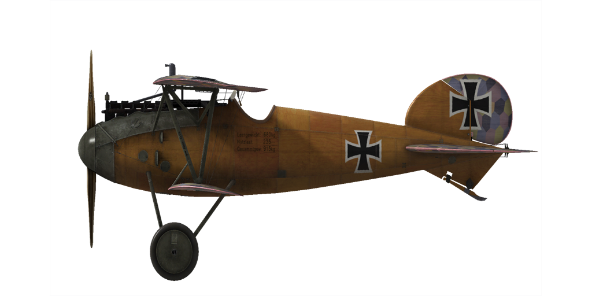
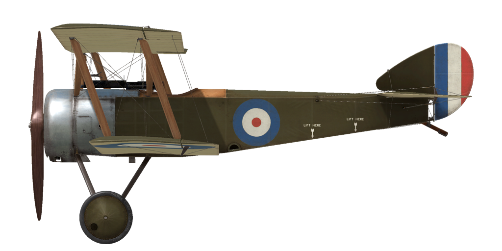

# IL-2: Sturmovik Great Battles: Vehicle Specifications

Version: 7.002 - Date: 2026-02-11 [ [Sponsor this project](https://paypal.me/ravensystem) ] [ [GitHub](https://github.com/RavenSystem/il2_specs) ]

[ [Pilots Notes v11.3 WWII by lefuneste & WWI by Charlo](https://forum.il2-series.com/topic/42-another-pilots-notes-for-cockpit-photos/) ]

### Planes

[ [A-20B](#a-20b) ] [ [Airco D.H.2](#airco-dh2) ] [ [Airco D.H.4](#airco-dh4) ] [ [Albatros D.II](#albatros-dii) ] [ [Albatros D.III](#albatros-diii) ] [ [Albatros D.Va](#albatros-dva) ] [ [Ar 234 B-2](#ar-234-b-2) ] [ [B-25D](#b-25d) ] [ [B-26B-55](#b-26b-55) ] [ [Bf 109 E-4](#bf-109-e-4) ] [ [Bf 109 E-7](#bf-109-e-7) ] [ [Bf 109 F-2](#bf-109-f-2) ] [ [Bf 109 F-4](#bf-109-f-4) ] [ [Bf 109 G-14](#bf-109-g-14) ] [ [Bf 109 G-2](#bf-109-g-2) ] [ [Bf 109 G-4](#bf-109-g-4) ] [ [Bf 109 G-6](#bf-109-g-6) ] [ [Bf 109 G-6AS](#bf-109-g-6as) ] [ [Bf 109 G-6 Late](#bf-109-g-6-late) ] [ [Bf 109 K-4](#bf-109-k-4) ] [ [Bf 110 E-2](#bf-110-e-2) ] [ [Bf 110 G-2](#bf-110-g-2) ] [ [Breguet 14.B2](#breguet-14b2) ] [ [Bristol F2B (F.II)](#bristol-f2b-fii) ] [ [Bristol F2B (F.III)](#bristol-f2b-fiii) ] [ [C-47A](#c-47a) ] [ [CG-4A](#cg-4a) ] [ [DFW C.V](#dfw-cv) ] [ [F.E.2b](#fe2b) ] [ [Fokker D.VII](#fokker-dvii) ] [ [Fokker D.VIIF](#fokker-dviif) ] [ [Fokker D.VIII](#fokker-dviii) ] [ [Fokker Dr.I](#fokker-dri) ] [ [Fokker E.III](#fokker-eiii) ] [ [Fw 190 A-3](#fw-190-a-3) ] [ [Fw 190 A-5](#fw-190-a-5) ] [ [Fw 190 A-6](#fw-190-a-6) ] [ [Fw 190 A-8](#fw-190-a-8) ] [ [Fw 190 D-9](#fw-190-d-9) ] [ [Gotha G.V](#gotha-gv) ] [ [Halberstadt CL.II](#halberstadt-clii) ] [ [Halberstadt CL.II 200hp](#halberstadt-clii-200hp) ] [ [Halberstadt D.II](#halberstadt-dii) ] [ [Handley Page O/400](#handley-page-o400) ] [ [Hanriot HD.1](#hanriot-hd1) ] [ [He 111 H-16](#he-111-h-16) ] [ [He 111 H-6](#he-111-h-6) ] [ [Hs 129 B-2](#hs-129-b-2) ] [ [Hurricane Mk.II](#hurricane-mkii) ] [ [I-153](#i-153) ] [ [I-16 type 24](#i-16-type-24) ] [ [I.A.R. 80-A](#iar-80-a) ] [ [I.A.R. 80-B](#iar-80-b) ] [ [Il-2 mod.1941](#il-2-mod1941) ] [ [Il-2 mod.1942](#il-2-mod1942) ] [ [Il-2 mod.1943](#il-2-mod1943) ] [ [Il-2 mod.1944](#il-2-mod1944) ] [ [Ju 52/3m g4e](#ju-523m-g4e) ] [ [Ju 87 D-3](#ju-87-d-3) ] [ [Ju 87 D-5](#ju-87-d-5) ] [ [Ju 88 A-4](#ju-88-a-4) ] [ [Ju 88 C-6](#ju-88-c-6) ] [ [La-5FN ser.2](#la-5fn-ser2) ] [ [La-5F ser.38](#la-5f-ser38) ] [ [La-5 ser.8](#la-5-ser8) ] [ [La-7 ser.1](#la-7-ser1) ] [ [LaGG-3 ser.29](#lagg-3-ser29) ] [ [LaGG-3 ser.4](#lagg-3-ser4) ] [ [Li-2](#li-2) ] [ [MC.202 ser.VIII](#mc202-serviii) ] [ [Me 262 A](#me-262-a) ] [ [Me 410 A-1](#me-410-a-1) ] [ [MiG-3 ser.24](#mig-3-ser24) ] [ [Mosquito F.B. Mk.VI ser.2](#mosquito-fb-mkvi-ser2) ] [ [Nieuport 11.C1](#nieuport-11c1) ] [ [Nieuport 17.C1](#nieuport-17c1) ] [ [Nieuport 17.C1 GBR](#nieuport-17c1-gbr) ] [ [Nieuport 28.C1](#nieuport-28c1) ] [ [P-38J-25](#p-38j-25) ] [ [P-39L-1](#p-39l-1) ] [ [P-40E-1](#p-40e-1) ] [ [P-47D-22](#p-47d-22) ] [ [P-47D-28](#p-47d-28) ] [ [P-51B-5](#p-51b-5) ] [ [P-51D-15](#p-51d-15) ] [ [Pe-2 ser.35](#pe-2-ser35) ] [ [Pe-2 ser.87](#pe-2-ser87) ] [ [Pfalz D.XII](#pfalz-dxii) ] [ [Pfalz D.IIIa](#pfalz-diiia) ] [ [R.E.8](#re8) ] [ [Roland C.IIa](#roland-ciia) ] [ [SSW D.IV](#ssw-div) ] [ [S.E.5a](#se5a) ] [ [Sopwith Camel](#sopwith-camel) ] [ [Sopwith Dolphin](#sopwith-dolphin) ] [ [Sopwith Pup](#sopwith-pup) ] [ [Sopwith Snipe](#sopwith-snipe) ] [ [Sopwith 1½ Strutter](#sopwith-1-strutter) ] [ [Sopwith 1½ Strutter B](#sopwith-1-strutter-b) ] [ [Sopwith Triplane](#sopwith-triplane) ] [ [SPAD 13.C1](#spad-13c1) ] [ [SPAD 7.C1 150hp](#spad-7c1-150hp) ] [ [SPAD 7.C1 180hp](#spad-7c1-180hp) ] [ [Spitfire Mk.IXc](#spitfire-mkixc) ] [ [Spitfire Mk.IXe](#spitfire-mkixe) ] [ [Spitfire Mk.VB](#spitfire-mkvb) ] [ [Spitfire Mk.XIV](#spitfire-mkxiv) ] [ [Spitfire Mk.XIVe](#spitfire-mkxive) ] [ [Ta 152 H-1](#ta-152-h-1) ] [ [Tempest Mk.V ser.2](#tempest-mkv-ser2) ] [ [Typhoon Mk.Ib](#typhoon-mkib) ] [ [U-2VS](#u-2vs) ] [ [Yak-1b ser.127](#yak-1b-ser127) ] [ [Yak-1 ser.23](#yak-1-ser23) ] [ [Yak-1 ser.69](#yak-1-ser69) ] [ [Yak-3 ser.9](#yak-3-ser9) ] [ [Yak-7B series 36](#yak-7b-series-36) ] [ [Yak-9 ser.1](#yak-9-ser1) ] [ [Yak-9T ser.1](#yak-9t-ser1) ] 

### Vehicles

[ [Churchill IV](#churchill-iv) ] [ [GAZ-MM 72-K](#gaz-mm-72-k) ] [ [KV-1s ChTZ (1943)](#kv-1s-chtz-1943) ] [ [M4A2](#m4a2) ] [ [Pz.Kpfw.III Ausf.L](#pzkpfwiii-ausfl) ] [ [Pz.Kpfw.III Ausf.M](#pzkpfwiii-ausfm) ] [ [Pz.Kpfw.IV Ausf.G](#pzkpfwiv-ausfg) ] [ [Pz.Kpfw.V Ausf.D](#pzkpfwv-ausfd) ] [ [Pz.Kpfw.VI Ausf.H1](#pzkpfwvi-ausfh1) ] [ [Sd.Kfz.10/5](#sdkfz105) ] [ [Sd.Kfz.184](#sdkfz184) ] [ [StuG III Ausf.G](#stug-iii-ausfg) ] [ [SU-122 UZTM (1943)](#su-122-uztm-1943) ] [ [SU-152 ChKZ (1943)](#su-152-chkz-1943) ] [ [T-34/76 STZ (1942)](#t-3476-stz-1942) ] [ [T-34/76 UTZ (1943)](#t-3476-utz-1943) ] 

## Planes

### A-20B  

<table><thead><tr><th style="text-align: left" colspan="2">[ <pre>[chs](planes/a20b.chs.md)</pre> ] [ <a href="planes/a20b.eng.md">eng</a> ] [ <a href="planes/a20b.fra.md">fra</a> ] [ <a href="planes/a20b.ger.md">ger</a> ] [ <a href="planes/a20b.rus.md">rus</a> ] [ <a href="planes/a20b.spa.md">spa</a> ] </th></tr></thead>
<tbody><tr><td style="text-align: center"></td><td style="text-align: center"></td></tr></tbody></table>

### Airco D.H.2  

<table><thead><tr><th style="text-align: left" colspan="2">[ <a href="planes/aircodh2.chs.md">chs</a> ] [ <a href="planes/aircodh2.eng.md">eng</a> ] [ <a href="planes/aircodh2.fra.md">fra</a> ] [ <a href="planes/aircodh2.ger.md">ger</a> ] [ <a href="planes/aircodh2.rus.md">rus</a> ] [ <a href="planes/aircodh2.spa.md">spa</a> ] </th></tr></thead>
<tbody><tr><td style="text-align: center"></td><td style="text-align: center"></td></tr></tbody></table>

### Airco D.H.4  

<table><thead><tr><th style="text-align: left" colspan="2">[ <a href="planes/aircodh4.chs.md">chs</a> ] [ <a href="planes/aircodh4.eng.md">eng</a> ] [ <a href="planes/aircodh4.fra.md">fra</a> ] [ <a href="planes/aircodh4.ger.md">ger</a> ] [ <a href="planes/aircodh4.rus.md">rus</a> ] [ <a href="planes/aircodh4.spa.md">spa</a> ] </th></tr></thead>
<tbody><tr><td style="text-align: center"></td><td style="text-align: center"></td></tr></tbody></table>

### Albatros D.II  

<table><thead><tr><th style="text-align: left" colspan="2">[ <a href="planes/albatrosd2.chs.md">chs</a> ] [ <a href="planes/albatrosd2.eng.md">eng</a> ] [ <a href="planes/albatrosd2.fra.md">fra</a> ] [ <a href="planes/albatrosd2.ger.md">ger</a> ] [ <a href="planes/albatrosd2.rus.md">rus</a> ] [ <a href="planes/albatrosd2.spa.md">spa</a> ] </th></tr></thead>
<tbody><tr><td style="text-align: center"></td><td style="text-align: center"></td></tr></tbody></table>

### Albatros D.III  

<table><thead><tr><th style="text-align: left" colspan="2">[ <a href="planes/albatrosd3.chs.md">chs</a> ] [ <a href="planes/albatrosd3.eng.md">eng</a> ] [ <a href="planes/albatrosd3.fra.md">fra</a> ] [ <a href="planes/albatrosd3.ger.md">ger</a> ] [ <a href="planes/albatrosd3.rus.md">rus</a> ] [ <a href="planes/albatrosd3.spa.md">spa</a> ] </th></tr></thead>
<tbody><tr><td style="text-align: center"></td><td style="text-align: center"></td></tr></tbody></table>

### Albatros D.Va  

<table><thead><tr><th style="text-align: left" colspan="2">[ <a href="planes/albatrosd5.chs.md">chs</a> ] [ <a href="planes/albatrosd5.eng.md">eng</a> ] [ <a href="planes/albatrosd5.fra.md">fra</a> ] [ <a href="planes/albatrosd5.ger.md">ger</a> ] [ <a href="planes/albatrosd5.rus.md">rus</a> ] [ <a href="planes/albatrosd5.spa.md">spa</a> ] </th></tr></thead>
<tbody><tr><td style="text-align: center"></td><td style="text-align: center"></td></tr></tbody></table>

### Ar 234 B-2  

<table><thead><tr><th style="text-align: left" colspan="2">[ <a href="planes/ar234b2.chs.md">chs</a> ] [ <a href="planes/ar234b2.eng.md">eng</a> ] [ <a href="planes/ar234b2.fra.md">fra</a> ] [ <a href="planes/ar234b2.ger.md">ger</a> ] [ <a href="planes/ar234b2.rus.md">rus</a> ] [ <a href="planes/ar234b2.spa.md">spa</a> ] </th></tr></thead>
<tbody><tr><td style="text-align: center"></td><td style="text-align: center"></td></tr></tbody></table>

### B-25D  

<table><thead><tr><th style="text-align: left">[ <a href="planes/b25draf.chs.md">chs</a> ] [ <a href="planes/b25draf.eng.md">eng</a> ] [ <a href="planes/b25draf.fra.md">fra</a> ] [ <a href="planes/b25draf.ger.md">ger</a> ] [ <a href="planes/b25draf.rus.md">rus</a> ] [ <a href="planes/b25draf.spa.md">spa</a> ] </th></tr></thead>
<tbody><tr><td style="text-align: center"></td></td></tr></tbody></table>

### B-26B-55  

<table><thead><tr><th style="text-align: left">[ <a href="planes/b26b55.chs.md">chs</a> ] [ <a href="planes/b26b55.eng.md">eng</a> ] [ <a href="planes/b26b55.fra.md">fra</a> ] [ <a href="planes/b26b55.ger.md">ger</a> ] [ <a href="planes/b26b55.rus.md">rus</a> ] [ <a href="planes/b26b55.spa.md">spa</a> ] </th></tr></thead>
<tbody><tr><td style="text-align: center"></td></td></tr></tbody></table>

### Bf 109 E-4  

<table><thead><tr><th style="text-align: left" colspan="2">[ <a href="planes/bf109e4.chs.md">chs</a> ] [ <a href="planes/bf109e4.eng.md">eng</a> ] [ <a href="planes/bf109e4.fra.md">fra</a> ] [ <a href="planes/bf109e4.ger.md">ger</a> ] [ <a href="planes/bf109e4.rus.md">rus</a> ] [ <a href="planes/bf109e4.spa.md">spa</a> ] </th></tr></thead>
<tbody><tr><td style="text-align: center"></td><td style="text-align: center"></td></tr></tbody></table>

### Bf 109 E-7  

<table><thead><tr><th style="text-align: left" colspan="2">[ <a href="planes/bf109e7.chs.md">chs</a> ] [ <a href="planes/bf109e7.eng.md">eng</a> ] [ <a href="planes/bf109e7.fra.md">fra</a> ] [ <a href="planes/bf109e7.ger.md">ger</a> ] [ <a href="planes/bf109e7.rus.md">rus</a> ] [ <a href="planes/bf109e7.spa.md">spa</a> ] </th></tr></thead>
<tbody><tr><td style="text-align: center"></td><td style="text-align: center"></td></tr></tbody></table>

### Bf 109 F-2  

<table><thead><tr><th style="text-align: left" colspan="2">[ <a href="planes/bf109f2.chs.md">chs</a> ] [ <a href="planes/bf109f2.eng.md">eng</a> ] [ <a href="planes/bf109f2.fra.md">fra</a> ] [ <a href="planes/bf109f2.ger.md">ger</a> ] [ <a href="planes/bf109f2.rus.md">rus</a> ] [ <a href="planes/bf109f2.spa.md">spa</a> ] </th></tr></thead>
<tbody><tr><td style="text-align: center"></td><td style="text-align: center"></td></tr></tbody></table>

### Bf 109 F-4  

<table><thead><tr><th style="text-align: left" colspan="2">[ <a href="planes/bf109f4.chs.md">chs</a> ] [ <a href="planes/bf109f4.eng.md">eng</a> ] [ <a href="planes/bf109f4.fra.md">fra</a> ] [ <a href="planes/bf109f4.ger.md">ger</a> ] [ <a href="planes/bf109f4.rus.md">rus</a> ] [ <a href="planes/bf109f4.spa.md">spa</a> ] </th></tr></thead>
<tbody><tr><td style="text-align: center"></td><td style="text-align: center"></td></tr></tbody></table>

### Bf 109 G-14  

<table><thead><tr><th style="text-align: left" colspan="2">[ <a href="planes/bf109g14.chs.md">chs</a> ] [ <a href="planes/bf109g14.eng.md">eng</a> ] [ <a href="planes/bf109g14.fra.md">fra</a> ] [ <a href="planes/bf109g14.ger.md">ger</a> ] [ <a href="planes/bf109g14.rus.md">rus</a> ] [ <a href="planes/bf109g14.spa.md">spa</a> ] </th></tr></thead>
<tbody><tr><td style="text-align: center"></td><td style="text-align: center"></td></tr></tbody></table>

### Bf 109 G-2  

<table><thead><tr><th style="text-align: left" colspan="2">[ <a href="planes/bf109g2.chs.md">chs</a> ] [ <a href="planes/bf109g2.eng.md">eng</a> ] [ <a href="planes/bf109g2.fra.md">fra</a> ] [ <a href="planes/bf109g2.ger.md">ger</a> ] [ <a href="planes/bf109g2.rus.md">rus</a> ] [ <a href="planes/bf109g2.spa.md">spa</a> ] </th></tr></thead>
<tbody><tr><td style="text-align: center"></td><td style="text-align: center"></td></tr></tbody></table>

### Bf 109 G-4  

<table><thead><tr><th style="text-align: left" colspan="2">[ <a href="planes/bf109g4.chs.md">chs</a> ] [ <a href="planes/bf109g4.eng.md">eng</a> ] [ <a href="planes/bf109g4.fra.md">fra</a> ] [ <a href="planes/bf109g4.ger.md">ger</a> ] [ <a href="planes/bf109g4.rus.md">rus</a> ] [ <a href="planes/bf109g4.spa.md">spa</a> ] </th></tr></thead>
<tbody><tr><td style="text-align: center"></td><td style="text-align: center"></td></tr></tbody></table>

### Bf 109 G-6  

<table><thead><tr><th style="text-align: left" colspan="2">[ <a href="planes/bf109g6.chs.md">chs</a> ] [ <a href="planes/bf109g6.eng.md">eng</a> ] [ <a href="planes/bf109g6.fra.md">fra</a> ] [ <a href="planes/bf109g6.ger.md">ger</a> ] [ <a href="planes/bf109g6.rus.md">rus</a> ] [ <a href="planes/bf109g6.spa.md">spa</a> ] </th></tr></thead>
<tbody><tr><td style="text-align: center"></td><td style="text-align: center"></td></tr></tbody></table>

### Bf 109 G-6AS  

<table><thead><tr><th style="text-align: left" colspan="2">[ <a href="planes/bf109g6as.chs.md">chs</a> ] [ <a href="planes/bf109g6as.eng.md">eng</a> ] [ <a href="planes/bf109g6as.fra.md">fra</a> ] [ <a href="planes/bf109g6as.ger.md">ger</a> ] [ <a href="planes/bf109g6as.rus.md">rus</a> ] [ <a href="planes/bf109g6as.spa.md">spa</a> ] </th></tr></thead>
<tbody><tr><td style="text-align: center"></td><td style="text-align: center"></td></tr></tbody></table>

### Bf 109 G-6 Late  

<table><thead><tr><th style="text-align: left" colspan="2">[ <a href="planes/bf109g6late.chs.md">chs</a> ] [ <a href="planes/bf109g6late.eng.md">eng</a> ] [ <a href="planes/bf109g6late.fra.md">fra</a> ] [ <a href="planes/bf109g6late.ger.md">ger</a> ] [ <a href="planes/bf109g6late.rus.md">rus</a> ] [ <a href="planes/bf109g6late.spa.md">spa</a> ] </th></tr></thead>
<tbody><tr><td style="text-align: center"></td><td style="text-align: center"></td></tr></tbody></table>

### Bf 109 K-4  

<table><thead><tr><th style="text-align: left" colspan="2">[ <a href="planes/bf109k4.chs.md">chs</a> ] [ <a href="planes/bf109k4.eng.md">eng</a> ] [ <a href="planes/bf109k4.fra.md">fra</a> ] [ <a href="planes/bf109k4.ger.md">ger</a> ] [ <a href="planes/bf109k4.rus.md">rus</a> ] [ <a href="planes/bf109k4.spa.md">spa</a> ] </th></tr></thead>
<tbody><tr><td style="text-align: center"></td><td style="text-align: center"></td></tr></tbody></table>

### Bf 110 E-2  

<table><thead><tr><th style="text-align: left" colspan="2">[ <a href="planes/bf110e2.chs.md">chs</a> ] [ <a href="planes/bf110e2.eng.md">eng</a> ] [ <a href="planes/bf110e2.fra.md">fra</a> ] [ <a href="planes/bf110e2.ger.md">ger</a> ] [ <a href="planes/bf110e2.rus.md">rus</a> ] [ <a href="planes/bf110e2.spa.md">spa</a> ] </th></tr></thead>
<tbody><tr><td style="text-align: center"></td><td style="text-align: center"></td></tr></tbody></table>

### Bf 110 G-2  

<table><thead><tr><th style="text-align: left" colspan="2">[ <a href="planes/bf110g2.chs.md">chs</a> ] [ <a href="planes/bf110g2.eng.md">eng</a> ] [ <a href="planes/bf110g2.fra.md">fra</a> ] [ <a href="planes/bf110g2.ger.md">ger</a> ] [ <a href="planes/bf110g2.rus.md">rus</a> ] [ <a href="planes/bf110g2.spa.md">spa</a> ] </th></tr></thead>
<tbody><tr><td style="text-align: center"></td><td style="text-align: center"></td></tr></tbody></table>

### Breguet 14.B2  

<table><thead><tr><th style="text-align: left" colspan="2">[ <a href="planes/breguet14.chs.md">chs</a> ] [ <a href="planes/breguet14.eng.md">eng</a> ] [ <a href="planes/breguet14.fra.md">fra</a> ] [ <a href="planes/breguet14.ger.md">ger</a> ] [ <a href="planes/breguet14.rus.md">rus</a> ] [ <a href="planes/breguet14.spa.md">spa</a> ] </th></tr></thead>
<tbody><tr><td style="text-align: center"></td><td style="text-align: center"></td></tr></tbody></table>

### Bristol F2B (F.II)  

<table><thead><tr><th style="text-align: left" colspan="2">[ <a href="planes/bristolf2bf2.chs.md">chs</a> ] [ <a href="planes/bristolf2bf2.eng.md">eng</a> ] [ <a href="planes/bristolf2bf2.fra.md">fra</a> ] [ <a href="planes/bristolf2bf2.ger.md">ger</a> ] [ <a href="planes/bristolf2bf2.rus.md">rus</a> ] [ <a href="planes/bristolf2bf2.spa.md">spa</a> ] </th></tr></thead>
<tbody><tr><td style="text-align: center"></td><td style="text-align: center"></td></tr></tbody></table>

### Bristol F2B (F.III)  

<table><thead><tr><th style="text-align: left" colspan="2">[ <a href="planes/bristolf2bf3.chs.md">chs</a> ] [ <a href="planes/bristolf2bf3.eng.md">eng</a> ] [ <a href="planes/bristolf2bf3.fra.md">fra</a> ] [ <a href="planes/bristolf2bf3.ger.md">ger</a> ] [ <a href="planes/bristolf2bf3.rus.md">rus</a> ] [ <a href="planes/bristolf2bf3.spa.md">spa</a> ] </th></tr></thead>
<tbody><tr><td style="text-align: center"></td><td style="text-align: center"></td></tr></tbody></table>

### C-47A  

<table><thead><tr><th style="text-align: left" colspan="2">[ <a href="planes/c47a.chs.md">chs</a> ] [ <a href="planes/c47a.eng.md">eng</a> ] [ <a href="planes/c47a.fra.md">fra</a> ] [ <a href="planes/c47a.ger.md">ger</a> ] [ <a href="planes/c47a.rus.md">rus</a> ] [ <a href="planes/c47a.spa.md">spa</a> ] </th></tr></thead>
<tbody><tr><td style="text-align: center"></td><td style="text-align: center"></td></tr></tbody></table>

### CG-4A  

<table><thead><tr><th style="text-align: left" colspan="2">[ <a href="planes/cg4a.chs.md">chs</a> ] [ <a href="planes/cg4a.eng.md">eng</a> ] [ <a href="planes/cg4a.fra.md">fra</a> ] [ <a href="planes/cg4a.ger.md">ger</a> ] [ <a href="planes/cg4a.rus.md">rus</a> ] [ <a href="planes/cg4a.spa.md">spa</a> ] </th></tr></thead>
<tbody><tr><td style="text-align: center"></td><td style="text-align: center"></td></tr></tbody></table>

### DFW C.V  

<table><thead><tr><th style="text-align: left" colspan="2">[ <a href="planes/dfwc5.chs.md">chs</a> ] [ <a href="planes/dfwc5.eng.md">eng</a> ] [ <a href="planes/dfwc5.fra.md">fra</a> ] [ <a href="planes/dfwc5.ger.md">ger</a> ] [ <a href="planes/dfwc5.rus.md">rus</a> ] [ <a href="planes/dfwc5.spa.md">spa</a> ] </th></tr></thead>
<tbody><tr><td style="text-align: center"></td><td style="text-align: center"></td></tr></tbody></table>

### F.E.2b  

<table><thead><tr><th style="text-align: left" colspan="2">[ <a href="planes/fe2b.chs.md">chs</a> ] [ <a href="planes/fe2b.eng.md">eng</a> ] [ <a href="planes/fe2b.fra.md">fra</a> ] [ <a href="planes/fe2b.ger.md">ger</a> ] [ <a href="planes/fe2b.rus.md">rus</a> ] [ <a href="planes/fe2b.spa.md">spa</a> ] </th></tr></thead>
<tbody><tr><td style="text-align: center"></td><td style="text-align: center"></td></tr></tbody></table>

### Fokker D.VII  

<table><thead><tr><th style="text-align: left" colspan="2">[ <a href="planes/fokkerd7.chs.md">chs</a> ] [ <a href="planes/fokkerd7.eng.md">eng</a> ] [ <a href="planes/fokkerd7.fra.md">fra</a> ] [ <a href="planes/fokkerd7.ger.md">ger</a> ] [ <a href="planes/fokkerd7.rus.md">rus</a> ] [ <a href="planes/fokkerd7.spa.md">spa</a> ] </th></tr></thead>
<tbody><tr><td style="text-align: center"></td><td style="text-align: center"></td></tr></tbody></table>

### Fokker D.VIIF  

<table><thead><tr><th style="text-align: left" colspan="2">[ <a href="planes/fokkerd7f.chs.md">chs</a> ] [ <a href="planes/fokkerd7f.eng.md">eng</a> ] [ <a href="planes/fokkerd7f.fra.md">fra</a> ] [ <a href="planes/fokkerd7f.ger.md">ger</a> ] [ <a href="planes/fokkerd7f.rus.md">rus</a> ] [ <a href="planes/fokkerd7f.spa.md">spa</a> ] </th></tr></thead>
<tbody><tr><td style="text-align: center"></td><td style="text-align: center"></td></tr></tbody></table>

### Fokker D.VIII  

<table><thead><tr><th style="text-align: left" colspan="2">[ <a href="planes/fokkerd8.chs.md">chs</a> ] [ <a href="planes/fokkerd8.eng.md">eng</a> ] [ <a href="planes/fokkerd8.fra.md">fra</a> ] [ <a href="planes/fokkerd8.ger.md">ger</a> ] [ <a href="planes/fokkerd8.rus.md">rus</a> ] [ <a href="planes/fokkerd8.spa.md">spa</a> ] </th></tr></thead>
<tbody><tr><td style="text-align: center"></td><td style="text-align: center"></td></tr></tbody></table>

### Fokker Dr.I  

<table><thead><tr><th style="text-align: left" colspan="2">[ <a href="planes/fokkerdr1.chs.md">chs</a> ] [ <a href="planes/fokkerdr1.eng.md">eng</a> ] [ <a href="planes/fokkerdr1.fra.md">fra</a> ] [ <a href="planes/fokkerdr1.ger.md">ger</a> ] [ <a href="planes/fokkerdr1.rus.md">rus</a> ] [ <a href="planes/fokkerdr1.spa.md">spa</a> ] </th></tr></thead>
<tbody><tr><td style="text-align: center"></td><td style="text-align: center"></td></tr></tbody></table>

### Fokker E.III  

<table><thead><tr><th style="text-align: left" colspan="2">[ <a href="planes/fokkere3.chs.md">chs</a> ] [ <a href="planes/fokkere3.eng.md">eng</a> ] [ <a href="planes/fokkere3.fra.md">fra</a> ] [ <a href="planes/fokkere3.ger.md">ger</a> ] [ <a href="planes/fokkere3.rus.md">rus</a> ] [ <a href="planes/fokkere3.spa.md">spa</a> ] </th></tr></thead>
<tbody><tr><td style="text-align: center"></td><td style="text-align: center"></td></tr></tbody></table>

### Fw 190 A-3  

<table><thead><tr><th style="text-align: left" colspan="2">[ <a href="planes/fw190a3.chs.md">chs</a> ] [ <a href="planes/fw190a3.eng.md">eng</a> ] [ <a href="planes/fw190a3.fra.md">fra</a> ] [ <a href="planes/fw190a3.ger.md">ger</a> ] [ <a href="planes/fw190a3.rus.md">rus</a> ] [ <a href="planes/fw190a3.spa.md">spa</a> ] </th></tr></thead>
<tbody><tr><td style="text-align: center"></td><td style="text-align: center"></td></tr></tbody></table>

### Fw 190 A-5  

<table><thead><tr><th style="text-align: left" colspan="2">[ <a href="planes/fw190a5.chs.md">chs</a> ] [ <a href="planes/fw190a5.eng.md">eng</a> ] [ <a href="planes/fw190a5.fra.md">fra</a> ] [ <a href="planes/fw190a5.ger.md">ger</a> ] [ <a href="planes/fw190a5.rus.md">rus</a> ] [ <a href="planes/fw190a5.spa.md">spa</a> ] </th></tr></thead>
<tbody><tr><td style="text-align: center"></td><td style="text-align: center"></td></tr></tbody></table>

### Fw 190 A-6  

<table><thead><tr><th style="text-align: left" colspan="2">[ <a href="planes/fw190a6.chs.md">chs</a> ] [ <a href="planes/fw190a6.eng.md">eng</a> ] [ <a href="planes/fw190a6.fra.md">fra</a> ] [ <a href="planes/fw190a6.ger.md">ger</a> ] [ <a href="planes/fw190a6.rus.md">rus</a> ] [ <a href="planes/fw190a6.spa.md">spa</a> ] </th></tr></thead>
<tbody><tr><td style="text-align: center"></td><td style="text-align: center"></td></tr></tbody></table>

### Fw 190 A-8  

<table><thead><tr><th style="text-align: left" colspan="2">[ <a href="planes/fw190a8.chs.md">chs</a> ] [ <a href="planes/fw190a8.eng.md">eng</a> ] [ <a href="planes/fw190a8.fra.md">fra</a> ] [ <a href="planes/fw190a8.ger.md">ger</a> ] [ <a href="planes/fw190a8.rus.md">rus</a> ] [ <a href="planes/fw190a8.spa.md">spa</a> ] </th></tr></thead>
<tbody><tr><td style="text-align: center"></td><td style="text-align: center"></td></tr></tbody></table>

### Fw 190 D-9  

<table><thead><tr><th style="text-align: left" colspan="2">[ <a href="planes/fw190d9.chs.md">chs</a> ] [ <a href="planes/fw190d9.eng.md">eng</a> ] [ <a href="planes/fw190d9.fra.md">fra</a> ] [ <a href="planes/fw190d9.ger.md">ger</a> ] [ <a href="planes/fw190d9.rus.md">rus</a> ] [ <a href="planes/fw190d9.spa.md">spa</a> ] </th></tr></thead>
<tbody><tr><td style="text-align: center"></td><td style="text-align: center"></td></tr></tbody></table>

### Gotha G.V  

<table><thead><tr><th style="text-align: left" colspan="2">[ <a href="planes/gothag5.chs.md">chs</a> ] [ <a href="planes/gothag5.eng.md">eng</a> ] [ <a href="planes/gothag5.fra.md">fra</a> ] [ <a href="planes/gothag5.ger.md">ger</a> ] [ <a href="planes/gothag5.rus.md">rus</a> ] [ <a href="planes/gothag5.spa.md">spa</a> ] </th></tr></thead>
<tbody><tr><td style="text-align: center"></td><td style="text-align: center"></td></tr></tbody></table>

### Halberstadt CL.II  

<table><thead><tr><th style="text-align: left" colspan="2">[ <a href="planes/halberstadtcl2.chs.md">chs</a> ] [ <a href="planes/halberstadtcl2.eng.md">eng</a> ] [ <a href="planes/halberstadtcl2.fra.md">fra</a> ] [ <a href="planes/halberstadtcl2.ger.md">ger</a> ] [ <a href="planes/halberstadtcl2.rus.md">rus</a> ] [ <a href="planes/halberstadtcl2.spa.md">spa</a> ] </th></tr></thead>
<tbody><tr><td style="text-align: center"></td><td style="text-align: center"></td></tr></tbody></table>

### Halberstadt CL.II 200hp  

<table><thead><tr><th style="text-align: left" colspan="2">[ <a href="planes/halberstadtcl2au.chs.md">chs</a> ] [ <a href="planes/halberstadtcl2au.eng.md">eng</a> ] [ <a href="planes/halberstadtcl2au.fra.md">fra</a> ] [ <a href="planes/halberstadtcl2au.ger.md">ger</a> ] [ <a href="planes/halberstadtcl2au.rus.md">rus</a> ] [ <a href="planes/halberstadtcl2au.spa.md">spa</a> ] </th></tr></thead>
<tbody><tr><td style="text-align: center"></td><td style="text-align: center"></td></tr></tbody></table>

### Halberstadt D.II  

<table><thead><tr><th style="text-align: left" colspan="2">[ <a href="planes/halberstadtd2.chs.md">chs</a> ] [ <a href="planes/halberstadtd2.eng.md">eng</a> ] [ <a href="planes/halberstadtd2.fra.md">fra</a> ] [ <a href="planes/halberstadtd2.ger.md">ger</a> ] [ <a href="planes/halberstadtd2.rus.md">rus</a> ] [ <a href="planes/halberstadtd2.spa.md">spa</a> ] </th></tr></thead>
<tbody><tr><td style="text-align: center"></td><td style="text-align: center"></td></tr></tbody></table>

### Handley Page O/400  

<table><thead><tr><th style="text-align: left" colspan="2">[ <a href="planes/handleypage400.chs.md">chs</a> ] [ <a href="planes/handleypage400.eng.md">eng</a> ] [ <a href="planes/handleypage400.fra.md">fra</a> ] [ <a href="planes/handleypage400.ger.md">ger</a> ] [ <a href="planes/handleypage400.rus.md">rus</a> ] [ <a href="planes/handleypage400.spa.md">spa</a> ] </th></tr></thead>
<tbody><tr><td style="text-align: center"></td><td style="text-align: center"></td></tr></tbody></table>

### Hanriot HD.1  

<table><thead><tr><th style="text-align: left" colspan="2">[ <a href="planes/hanriothd1.chs.md">chs</a> ] [ <a href="planes/hanriothd1.eng.md">eng</a> ] [ <a href="planes/hanriothd1.fra.md">fra</a> ] [ <a href="planes/hanriothd1.ger.md">ger</a> ] [ <a href="planes/hanriothd1.rus.md">rus</a> ] [ <a href="planes/hanriothd1.spa.md">spa</a> ] </th></tr></thead>
<tbody><tr><td style="text-align: center"></td><td style="text-align: center"></td></tr></tbody></table>

### He 111 H-16  

<table><thead><tr><th style="text-align: left" colspan="2">[ <a href="planes/he111h16.chs.md">chs</a> ] [ <a href="planes/he111h16.eng.md">eng</a> ] [ <a href="planes/he111h16.fra.md">fra</a> ] [ <a href="planes/he111h16.ger.md">ger</a> ] [ <a href="planes/he111h16.rus.md">rus</a> ] [ <a href="planes/he111h16.spa.md">spa</a> ] </th></tr></thead>
<tbody><tr><td style="text-align: center"></td><td style="text-align: center"></td></tr></tbody></table>

### He 111 H-6  

<table><thead><tr><th style="text-align: left" colspan="2">[ <a href="planes/he111h6.chs.md">chs</a> ] [ <a href="planes/he111h6.eng.md">eng</a> ] [ <a href="planes/he111h6.fra.md">fra</a> ] [ <a href="planes/he111h6.ger.md">ger</a> ] [ <a href="planes/he111h6.rus.md">rus</a> ] [ <a href="planes/he111h6.spa.md">spa</a> ] </th></tr></thead>
<tbody><tr><td style="text-align: center"></td><td style="text-align: center"></td></tr></tbody></table>

### Hs 129 B-2  

<table><thead><tr><th style="text-align: left" colspan="2">[ <a href="planes/hs129b2.chs.md">chs</a> ] [ <a href="planes/hs129b2.eng.md">eng</a> ] [ <a href="planes/hs129b2.fra.md">fra</a> ] [ <a href="planes/hs129b2.ger.md">ger</a> ] [ <a href="planes/hs129b2.rus.md">rus</a> ] [ <a href="planes/hs129b2.spa.md">spa</a> ] </th></tr></thead>
<tbody><tr><td style="text-align: center"></td><td style="text-align: center"></td></tr></tbody></table>

### Hurricane Mk.II  

<table><thead><tr><th style="text-align: left" colspan="2">[ <a href="planes/hurricanemkii.chs.md">chs</a> ] [ <a href="planes/hurricanemkii.eng.md">eng</a> ] [ <a href="planes/hurricanemkii.fra.md">fra</a> ] [ <a href="planes/hurricanemkii.ger.md">ger</a> ] [ <a href="planes/hurricanemkii.rus.md">rus</a> ] [ <a href="planes/hurricanemkii.spa.md">spa</a> ] </th></tr></thead>
<tbody><tr><td style="text-align: center"></td><td style="text-align: center"></td></tr></tbody></table>

### I-153  

<table><thead><tr><th style="text-align: left" colspan="2">[ <a href="planes/i153.chs.md">chs</a> ] [ <a href="planes/i153.eng.md">eng</a> ] [ <a href="planes/i153.fra.md">fra</a> ] [ <a href="planes/i153.ger.md">ger</a> ] [ <a href="planes/i153.rus.md">rus</a> ] [ <a href="planes/i153.spa.md">spa</a> ] </th></tr></thead>
<tbody><tr><td style="text-align: center"></td><td style="text-align: center"></td></tr></tbody></table>

### I-16 type 24  

<table><thead><tr><th style="text-align: left" colspan="2">[ <a href="planes/i16t24.chs.md">chs</a> ] [ <a href="planes/i16t24.eng.md">eng</a> ] [ <a href="planes/i16t24.fra.md">fra</a> ] [ <a href="planes/i16t24.ger.md">ger</a> ] [ <a href="planes/i16t24.rus.md">rus</a> ] [ <a href="planes/i16t24.spa.md">spa</a> ] </th></tr></thead>
<tbody><tr><td style="text-align: center"></td><td style="text-align: center"></td></tr></tbody></table>

### I.A.R. 80-A  

<table><thead><tr><th style="text-align: left" colspan="2">[ <a href="planes/iar80a.chs.md">chs</a> ] [ <a href="planes/iar80a.eng.md">eng</a> ] [ <a href="planes/iar80a.fra.md">fra</a> ] [ <a href="planes/iar80a.ger.md">ger</a> ] [ <a href="planes/iar80a.rus.md">rus</a> ] [ <a href="planes/iar80a.spa.md">spa</a> ] </th></tr></thead>
<tbody><tr><td style="text-align: center"></td><td style="text-align: center"></td></tr></tbody></table>

### I.A.R. 80-B  

<table><thead><tr><th style="text-align: left" colspan="2">[ <a href="planes/iar80b.chs.md">chs</a> ] [ <a href="planes/iar80b.eng.md">eng</a> ] [ <a href="planes/iar80b.fra.md">fra</a> ] [ <a href="planes/iar80b.ger.md">ger</a> ] [ <a href="planes/iar80b.rus.md">rus</a> ] [ <a href="planes/iar80b.spa.md">spa</a> ] </th></tr></thead>
<tbody><tr><td style="text-align: center"></td><td style="text-align: center"></td></tr></tbody></table>

### Il-2 mod.1941  

<table><thead><tr><th style="text-align: left" colspan="2">[ <a href="planes/il2m41.chs.md">chs</a> ] [ <a href="planes/il2m41.eng.md">eng</a> ] [ <a href="planes/il2m41.fra.md">fra</a> ] [ <a href="planes/il2m41.ger.md">ger</a> ] [ <a href="planes/il2m41.rus.md">rus</a> ] [ <a href="planes/il2m41.spa.md">spa</a> ] </th></tr></thead>
<tbody><tr><td style="text-align: center"></td><td style="text-align: center"></td></tr></tbody></table>

### Il-2 mod.1942  

<table><thead><tr><th style="text-align: left" colspan="2">[ <a href="planes/il2m42.chs.md">chs</a> ] [ <a href="planes/il2m42.eng.md">eng</a> ] [ <a href="planes/il2m42.fra.md">fra</a> ] [ <a href="planes/il2m42.ger.md">ger</a> ] [ <a href="planes/il2m42.rus.md">rus</a> ] [ <a href="planes/il2m42.spa.md">spa</a> ] </th></tr></thead>
<tbody><tr><td style="text-align: center"></td><td style="text-align: center"></td></tr></tbody></table>

### Il-2 mod.1943  

<table><thead><tr><th style="text-align: left" colspan="2">[ <a href="planes/il2m43.chs.md">chs</a> ] [ <a href="planes/il2m43.eng.md">eng</a> ] [ <a href="planes/il2m43.fra.md">fra</a> ] [ <a href="planes/il2m43.ger.md">ger</a> ] [ <a href="planes/il2m43.rus.md">rus</a> ] [ <a href="planes/il2m43.spa.md">spa</a> ] </th></tr></thead>
<tbody><tr><td style="text-align: center"></td><td style="text-align: center"></td></tr></tbody></table>

### Il-2 mod.1944  

<table><thead><tr><th style="text-align: left" colspan="2">[ <a href="planes/il2m44.chs.md">chs</a> ] [ <a href="planes/il2m44.eng.md">eng</a> ] [ <a href="planes/il2m44.fra.md">fra</a> ] [ <a href="planes/il2m44.ger.md">ger</a> ] [ <a href="planes/il2m44.rus.md">rus</a> ] [ <a href="planes/il2m44.spa.md">spa</a> ] </th></tr></thead>
<tbody><tr><td style="text-align: center"></td><td style="text-align: center"></td></tr></tbody></table>

### Ju 52/3m g4e  

<table><thead><tr><th style="text-align: left" colspan="2">[ <a href="planes/ju523mg4e.chs.md">chs</a> ] [ <a href="planes/ju523mg4e.eng.md">eng</a> ] [ <a href="planes/ju523mg4e.fra.md">fra</a> ] [ <a href="planes/ju523mg4e.ger.md">ger</a> ] [ <a href="planes/ju523mg4e.rus.md">rus</a> ] [ <a href="planes/ju523mg4e.spa.md">spa</a> ] </th></tr></thead>
<tbody><tr><td style="text-align: center"></td><td style="text-align: center"></td></tr></tbody></table>

### Ju 87 D-3  

<table><thead><tr><th style="text-align: left" colspan="2">[ <a href="planes/ju87d3.chs.md">chs</a> ] [ <a href="planes/ju87d3.eng.md">eng</a> ] [ <a href="planes/ju87d3.fra.md">fra</a> ] [ <a href="planes/ju87d3.ger.md">ger</a> ] [ <a href="planes/ju87d3.rus.md">rus</a> ] [ <a href="planes/ju87d3.spa.md">spa</a> ] </th></tr></thead>
<tbody><tr><td style="text-align: center"></td><td style="text-align: center"></td></tr></tbody></table>

### Ju 87 D-5  

<table><thead><tr><th style="text-align: left" colspan="2">[ <a href="planes/ju87d5.chs.md">chs</a> ] [ <a href="planes/ju87d5.eng.md">eng</a> ] [ <a href="planes/ju87d5.fra.md">fra</a> ] [ <a href="planes/ju87d5.ger.md">ger</a> ] [ <a href="planes/ju87d5.rus.md">rus</a> ] [ <a href="planes/ju87d5.spa.md">spa</a> ] </th></tr></thead>
<tbody><tr><td style="text-align: center"></td><td style="text-align: center"></td></tr></tbody></table>

### Ju 88 A-4  

<table><thead><tr><th style="text-align: left" colspan="2">[ <a href="planes/ju88a4.chs.md">chs</a> ] [ <a href="planes/ju88a4.eng.md">eng</a> ] [ <a href="planes/ju88a4.fra.md">fra</a> ] [ <a href="planes/ju88a4.ger.md">ger</a> ] [ <a href="planes/ju88a4.rus.md">rus</a> ] [ <a href="planes/ju88a4.spa.md">spa</a> ] </th></tr></thead>
<tbody><tr><td style="text-align: center"></td><td style="text-align: center"></td></tr></tbody></table>

### Ju 88 C-6  

<table><thead><tr><th style="text-align: left" colspan="2">[ <a href="planes/ju88c6.chs.md">chs</a> ] [ <a href="planes/ju88c6.eng.md">eng</a> ] [ <a href="planes/ju88c6.fra.md">fra</a> ] [ <a href="planes/ju88c6.ger.md">ger</a> ] [ <a href="planes/ju88c6.rus.md">rus</a> ] [ <a href="planes/ju88c6.spa.md">spa</a> ] </th></tr></thead>
<tbody><tr><td style="text-align: center"></td><td style="text-align: center"></td></tr></tbody></table>

### La-5FN ser.2  

<table><thead><tr><th style="text-align: left" colspan="2">[ <a href="planes/la5fns2.chs.md">chs</a> ] [ <a href="planes/la5fns2.eng.md">eng</a> ] [ <a href="planes/la5fns2.fra.md">fra</a> ] [ <a href="planes/la5fns2.ger.md">ger</a> ] [ <a href="planes/la5fns2.rus.md">rus</a> ] [ <a href="planes/la5fns2.spa.md">spa</a> ] </th></tr></thead>
<tbody><tr><td style="text-align: center"></td><td style="text-align: center"></td></tr></tbody></table>

### La-5F ser.38  

<table><thead><tr><th style="text-align: left" colspan="2">[ <a href="planes/la5s38.chs.md">chs</a> ] [ <a href="planes/la5s38.eng.md">eng</a> ] [ <a href="planes/la5s38.fra.md">fra</a> ] [ <a href="planes/la5s38.ger.md">ger</a> ] [ <a href="planes/la5s38.rus.md">rus</a> ] [ <a href="planes/la5s38.spa.md">spa</a> ] </th></tr></thead>
<tbody><tr><td style="text-align: center"></td><td style="text-align: center"></td></tr></tbody></table>

### La-5 ser.8  

<table><thead><tr><th style="text-align: left" colspan="2">[ <a href="planes/la5s8.chs.md">chs</a> ] [ <a href="planes/la5s8.eng.md">eng</a> ] [ <a href="planes/la5s8.fra.md">fra</a> ] [ <a href="planes/la5s8.ger.md">ger</a> ] [ <a href="planes/la5s8.rus.md">rus</a> ] [ <a href="planes/la5s8.spa.md">spa</a> ] </th></tr></thead>
<tbody><tr><td style="text-align: center"></td><td style="text-align: center"></td></tr></tbody></table>

### La-7 ser.1  

<table><thead><tr><th style="text-align: left" colspan="2">[ <a href="planes/la7s1.chs.md">chs</a> ] [ <a href="planes/la7s1.eng.md">eng</a> ] [ <a href="planes/la7s1.fra.md">fra</a> ] [ <a href="planes/la7s1.ger.md">ger</a> ] [ <a href="planes/la7s1.rus.md">rus</a> ] [ <a href="planes/la7s1.spa.md">spa</a> ] </th></tr></thead>
<tbody><tr><td style="text-align: center"></td><td style="text-align: center"></td></tr></tbody></table>

### LaGG-3 ser.29  

<table><thead><tr><th style="text-align: left" colspan="2">[ <a href="planes/lagg3s29.chs.md">chs</a> ] [ <a href="planes/lagg3s29.eng.md">eng</a> ] [ <a href="planes/lagg3s29.fra.md">fra</a> ] [ <a href="planes/lagg3s29.ger.md">ger</a> ] [ <a href="planes/lagg3s29.rus.md">rus</a> ] [ <a href="planes/lagg3s29.spa.md">spa</a> ] </th></tr></thead>
<tbody><tr><td style="text-align: center"></td><td style="text-align: center"></td></tr></tbody></table>

### LaGG-3 ser.4  

<table><thead><tr><th style="text-align: left" colspan="2">[ <a href="planes/lagg3s4.chs.md">chs</a> ] [ <a href="planes/lagg3s4.eng.md">eng</a> ] [ <a href="planes/lagg3s4.fra.md">fra</a> ] [ <a href="planes/lagg3s4.ger.md">ger</a> ] [ <a href="planes/lagg3s4.rus.md">rus</a> ] [ <a href="planes/lagg3s4.spa.md">spa</a> ] </th></tr></thead>
<tbody><tr><td style="text-align: center"></td><td style="text-align: center"></td></tr></tbody></table>

### Li-2  

<table><thead><tr><th style="text-align: left" colspan="2">[ <a href="planes/li2.chs.md">chs</a> ] [ <a href="planes/li2.eng.md">eng</a> ] [ <a href="planes/li2.fra.md">fra</a> ] [ <a href="planes/li2.ger.md">ger</a> ] [ <a href="planes/li2.rus.md">rus</a> ] [ <a href="planes/li2.spa.md">spa</a> ] </th></tr></thead>
<tbody><tr><td style="text-align: center"></td><td style="text-align: center"></td></tr></tbody></table>

### MC.202 ser.VIII  

<table><thead><tr><th style="text-align: left" colspan="2">[ <a href="planes/mc202s8.chs.md">chs</a> ] [ <a href="planes/mc202s8.eng.md">eng</a> ] [ <a href="planes/mc202s8.fra.md">fra</a> ] [ <a href="planes/mc202s8.ger.md">ger</a> ] [ <a href="planes/mc202s8.rus.md">rus</a> ] [ <a href="planes/mc202s8.spa.md">spa</a> ] </th></tr></thead>
<tbody><tr><td style="text-align: center"></td><td style="text-align: center"></td></tr></tbody></table>

### Me 262 A  

<table><thead><tr><th style="text-align: left" colspan="2">[ <a href="planes/me262a.chs.md">chs</a> ] [ <a href="planes/me262a.eng.md">eng</a> ] [ <a href="planes/me262a.fra.md">fra</a> ] [ <a href="planes/me262a.ger.md">ger</a> ] [ <a href="planes/me262a.rus.md">rus</a> ] [ <a href="planes/me262a.spa.md">spa</a> ] </th></tr></thead>
<tbody><tr><td style="text-align: center"></td><td style="text-align: center"></td></tr></tbody></table>

### Me 410 A-1  

<table><thead><tr><th style="text-align: left" colspan="2">[ <a href="planes/me410a1.chs.md">chs</a> ] [ <a href="planes/me410a1.eng.md">eng</a> ] [ <a href="planes/me410a1.fra.md">fra</a> ] [ <a href="planes/me410a1.ger.md">ger</a> ] [ <a href="planes/me410a1.rus.md">rus</a> ] [ <a href="planes/me410a1.spa.md">spa</a> ] </th></tr></thead>
<tbody><tr><td style="text-align: center"></td><td style="text-align: center"></td></tr></tbody></table>

### MiG-3 ser.24  

<table><thead><tr><th style="text-align: left" colspan="2">[ <a href="planes/mig3s24.chs.md">chs</a> ] [ <a href="planes/mig3s24.eng.md">eng</a> ] [ <a href="planes/mig3s24.fra.md">fra</a> ] [ <a href="planes/mig3s24.ger.md">ger</a> ] [ <a href="planes/mig3s24.rus.md">rus</a> ] [ <a href="planes/mig3s24.spa.md">spa</a> ] </th></tr></thead>
<tbody><tr><td style="text-align: center"></td><td style="text-align: center"></td></tr></tbody></table>

### Mosquito F.B. Mk.VI ser.2  

<table><thead><tr><th style="text-align: left" colspan="2">[ <a href="planes/mosquitofbmkvis2.chs.md">chs</a> ] [ <a href="planes/mosquitofbmkvis2.eng.md">eng</a> ] [ <a href="planes/mosquitofbmkvis2.fra.md">fra</a> ] [ <a href="planes/mosquitofbmkvis2.ger.md">ger</a> ] [ <a href="planes/mosquitofbmkvis2.rus.md">rus</a> ] [ <a href="planes/mosquitofbmkvis2.spa.md">spa</a> ] </th></tr></thead>
<tbody><tr><td style="text-align: center"></td><td style="text-align: center"></td></tr></tbody></table>

### Nieuport 11.C1  

<table><thead><tr><th style="text-align: left" colspan="2">[ <a href="planes/nieuport11.chs.md">chs</a> ] [ <a href="planes/nieuport11.eng.md">eng</a> ] [ <a href="planes/nieuport11.fra.md">fra</a> ] [ <a href="planes/nieuport11.ger.md">ger</a> ] [ <a href="planes/nieuport11.rus.md">rus</a> ] [ <a href="planes/nieuport11.spa.md">spa</a> ] </th></tr></thead>
<tbody><tr><td style="text-align: center"></td><td style="text-align: center"></td></tr></tbody></table>

### Nieuport 17.C1  

<table><thead><tr><th style="text-align: left" colspan="2">[ <a href="planes/nieuport17.chs.md">chs</a> ] [ <a href="planes/nieuport17.eng.md">eng</a> ] [ <a href="planes/nieuport17.fra.md">fra</a> ] [ <a href="planes/nieuport17.ger.md">ger</a> ] [ <a href="planes/nieuport17.rus.md">rus</a> ] [ <a href="planes/nieuport17.spa.md">spa</a> ] </th></tr></thead>
<tbody><tr><td style="text-align: center"></td><td style="text-align: center"></td></tr></tbody></table>

### Nieuport 17.C1 GBR  

<table><thead><tr><th style="text-align: left" colspan="2">[ <a href="planes/nieuport17gbr.chs.md">chs</a> ] [ <a href="planes/nieuport17gbr.eng.md">eng</a> ] [ <a href="planes/nieuport17gbr.fra.md">fra</a> ] [ <a href="planes/nieuport17gbr.ger.md">ger</a> ] [ <a href="planes/nieuport17gbr.rus.md">rus</a> ] [ <a href="planes/nieuport17gbr.spa.md">spa</a> ] </th></tr></thead>
<tbody><tr><td style="text-align: center"></td><td style="text-align: center"></td></tr></tbody></table>

### Nieuport 28.C1  

<table><thead><tr><th style="text-align: left" colspan="2">[ <a href="planes/nieuport28.chs.md">chs</a> ] [ <a href="planes/nieuport28.eng.md">eng</a> ] [ <a href="planes/nieuport28.fra.md">fra</a> ] [ <a href="planes/nieuport28.ger.md">ger</a> ] [ <a href="planes/nieuport28.rus.md">rus</a> ] [ <a href="planes/nieuport28.spa.md">spa</a> ] </th></tr></thead>
<tbody><tr><td style="text-align: center"></td><td style="text-align: center"></td></tr></tbody></table>

### P-38J-25  

<table><thead><tr><th style="text-align: left" colspan="2">[ <a href="planes/p38j25.chs.md">chs</a> ] [ <a href="planes/p38j25.eng.md">eng</a> ] [ <a href="planes/p38j25.fra.md">fra</a> ] [ <a href="planes/p38j25.ger.md">ger</a> ] [ <a href="planes/p38j25.rus.md">rus</a> ] [ <a href="planes/p38j25.spa.md">spa</a> ] </th></tr></thead>
<tbody><tr><td style="text-align: center"></td><td style="text-align: center"></td></tr></tbody></table>

### P-39L-1  

<table><thead><tr><th style="text-align: left" colspan="2">[ <a href="planes/p39l1.chs.md">chs</a> ] [ <a href="planes/p39l1.eng.md">eng</a> ] [ <a href="planes/p39l1.fra.md">fra</a> ] [ <a href="planes/p39l1.ger.md">ger</a> ] [ <a href="planes/p39l1.rus.md">rus</a> ] [ <a href="planes/p39l1.spa.md">spa</a> ] </th></tr></thead>
<tbody><tr><td style="text-align: center"></td><td style="text-align: center"></td></tr></tbody></table>

### P-40E-1  

<table><thead><tr><th style="text-align: left" colspan="2">[ <a href="planes/p40e1.chs.md">chs</a> ] [ <a href="planes/p40e1.eng.md">eng</a> ] [ <a href="planes/p40e1.fra.md">fra</a> ] [ <a href="planes/p40e1.ger.md">ger</a> ] [ <a href="planes/p40e1.rus.md">rus</a> ] [ <a href="planes/p40e1.spa.md">spa</a> ] </th></tr></thead>
<tbody><tr><td style="text-align: center"></td><td style="text-align: center"></td></tr></tbody></table>

### P-47D-22  

<table><thead><tr><th style="text-align: left" colspan="2">[ <a href="planes/p47d22.chs.md">chs</a> ] [ <a href="planes/p47d22.eng.md">eng</a> ] [ <a href="planes/p47d22.fra.md">fra</a> ] [ <a href="planes/p47d22.ger.md">ger</a> ] [ <a href="planes/p47d22.rus.md">rus</a> ] [ <a href="planes/p47d22.spa.md">spa</a> ] </th></tr></thead>
<tbody><tr><td style="text-align: center"></td><td style="text-align: center"></td></tr></tbody></table>

### P-47D-28  

<table><thead><tr><th style="text-align: left" colspan="2">[ <a href="planes/p47d28.chs.md">chs</a> ] [ <a href="planes/p47d28.eng.md">eng</a> ] [ <a href="planes/p47d28.fra.md">fra</a> ] [ <a href="planes/p47d28.ger.md">ger</a> ] [ <a href="planes/p47d28.rus.md">rus</a> ] [ <a href="planes/p47d28.spa.md">spa</a> ] </th></tr></thead>
<tbody><tr><td style="text-align: center"></td><td style="text-align: center"></td></tr></tbody></table>

### P-51B-5  

<table><thead><tr><th style="text-align: left" colspan="2">[ <a href="planes/p51b5.chs.md">chs</a> ] [ <a href="planes/p51b5.eng.md">eng</a> ] [ <a href="planes/p51b5.fra.md">fra</a> ] [ <a href="planes/p51b5.ger.md">ger</a> ] [ <a href="planes/p51b5.rus.md">rus</a> ] [ <a href="planes/p51b5.spa.md">spa</a> ] </th></tr></thead>
<tbody><tr><td style="text-align: center"></td><td style="text-align: center"></td></tr></tbody></table>

### P-51D-15  

<table><thead><tr><th style="text-align: left" colspan="2">[ <a href="planes/p51d15.chs.md">chs</a> ] [ <a href="planes/p51d15.eng.md">eng</a> ] [ <a href="planes/p51d15.fra.md">fra</a> ] [ <a href="planes/p51d15.ger.md">ger</a> ] [ <a href="planes/p51d15.rus.md">rus</a> ] [ <a href="planes/p51d15.spa.md">spa</a> ] </th></tr></thead>
<tbody><tr><td style="text-align: center"></td><td style="text-align: center"></td></tr></tbody></table>

### Pe-2 ser.35  

<table><thead><tr><th style="text-align: left" colspan="2">[ <a href="planes/pe2s35.chs.md">chs</a> ] [ <a href="planes/pe2s35.eng.md">eng</a> ] [ <a href="planes/pe2s35.fra.md">fra</a> ] [ <a href="planes/pe2s35.ger.md">ger</a> ] [ <a href="planes/pe2s35.rus.md">rus</a> ] [ <a href="planes/pe2s35.spa.md">spa</a> ] </th></tr></thead>
<tbody><tr><td style="text-align: center"></td><td style="text-align: center"></td></tr></tbody></table>

### Pe-2 ser.87  

<table><thead><tr><th style="text-align: left" colspan="2">[ <a href="planes/pe2s87.chs.md">chs</a> ] [ <a href="planes/pe2s87.eng.md">eng</a> ] [ <a href="planes/pe2s87.fra.md">fra</a> ] [ <a href="planes/pe2s87.ger.md">ger</a> ] [ <a href="planes/pe2s87.rus.md">rus</a> ] [ <a href="planes/pe2s87.spa.md">spa</a> ] </th></tr></thead>
<tbody><tr><td style="text-align: center"></td><td style="text-align: center"></td></tr></tbody></table>

### Pfalz D.XII  

<table><thead><tr><th style="text-align: left" colspan="2">[ <a href="planes/pfalzd12.chs.md">chs</a> ] [ <a href="planes/pfalzd12.eng.md">eng</a> ] [ <a href="planes/pfalzd12.fra.md">fra</a> ] [ <a href="planes/pfalzd12.ger.md">ger</a> ] [ <a href="planes/pfalzd12.rus.md">rus</a> ] [ <a href="planes/pfalzd12.spa.md">spa</a> ] </th></tr></thead>
<tbody><tr><td style="text-align: center"></td><td style="text-align: center"></td></tr></tbody></table>

### Pfalz D.IIIa  

<table><thead><tr><th style="text-align: left" colspan="2">[ <a href="planes/pfalzd3a.chs.md">chs</a> ] [ <a href="planes/pfalzd3a.eng.md">eng</a> ] [ <a href="planes/pfalzd3a.fra.md">fra</a> ] [ <a href="planes/pfalzd3a.ger.md">ger</a> ] [ <a href="planes/pfalzd3a.rus.md">rus</a> ] [ <a href="planes/pfalzd3a.spa.md">spa</a> ] </th></tr></thead>
<tbody><tr><td style="text-align: center"></td><td style="text-align: center"></td></tr></tbody></table>

### R.E.8  

<table><thead><tr><th style="text-align: left" colspan="2">[ <a href="planes/re8.chs.md">chs</a> ] [ <a href="planes/re8.eng.md">eng</a> ] [ <a href="planes/re8.fra.md">fra</a> ] [ <a href="planes/re8.ger.md">ger</a> ] [ <a href="planes/re8.rus.md">rus</a> ] [ <a href="planes/re8.spa.md">spa</a> ] </th></tr></thead>
<tbody><tr><td style="text-align: center"></td><td style="text-align: center"></td></tr></tbody></table>

### Roland C.IIa  

<table><thead><tr><th style="text-align: left" colspan="2">[ <a href="planes/rolandc2a.chs.md">chs</a> ] [ <a href="planes/rolandc2a.eng.md">eng</a> ] [ <a href="planes/rolandc2a.fra.md">fra</a> ] [ <a href="planes/rolandc2a.ger.md">ger</a> ] [ <a href="planes/rolandc2a.rus.md">rus</a> ] [ <a href="planes/rolandc2a.spa.md">spa</a> ] </th></tr></thead>
<tbody><tr><td style="text-align: center"></td><td style="text-align: center"></td></tr></tbody></table>

### SSW D.IV  

<table><thead><tr><th style="text-align: left" colspan="2">[ <a href="planes/schuckertdiv.chs.md">chs</a> ] [ <a href="planes/schuckertdiv.eng.md">eng</a> ] [ <a href="planes/schuckertdiv.fra.md">fra</a> ] [ <a href="planes/schuckertdiv.ger.md">ger</a> ] [ <a href="planes/schuckertdiv.rus.md">rus</a> ] [ <a href="planes/schuckertdiv.spa.md">spa</a> ] </th></tr></thead>
<tbody><tr><td style="text-align: center"></td><td style="text-align: center"></td></tr></tbody></table>

### S.E.5a  

<table><thead><tr><th style="text-align: left" colspan="2">[ <a href="planes/se5a.chs.md">chs</a> ] [ <a href="planes/se5a.eng.md">eng</a> ] [ <a href="planes/se5a.fra.md">fra</a> ] [ <a href="planes/se5a.ger.md">ger</a> ] [ <a href="planes/se5a.rus.md">rus</a> ] [ <a href="planes/se5a.spa.md">spa</a> ] </th></tr></thead>
<tbody><tr><td style="text-align: center"></td><td style="text-align: center"></td></tr></tbody></table>

### Sopwith Camel  

<table><thead><tr><th style="text-align: left" colspan="2">[ <a href="planes/sopcamel.chs.md">chs</a> ] [ <a href="planes/sopcamel.eng.md">eng</a> ] [ <a href="planes/sopcamel.fra.md">fra</a> ] [ <a href="planes/sopcamel.ger.md">ger</a> ] [ <a href="planes/sopcamel.rus.md">rus</a> ] [ <a href="planes/sopcamel.spa.md">spa</a> ] </th></tr></thead>
<tbody><tr><td style="text-align: center"></td><td style="text-align: center"></td></tr></tbody></table>

### Sopwith Dolphin  

<table><thead><tr><th style="text-align: left" colspan="2">[ <a href="planes/sopdolphin.chs.md">chs</a> ] [ <a href="planes/sopdolphin.eng.md">eng</a> ] [ <a href="planes/sopdolphin.fra.md">fra</a> ] [ <a href="planes/sopdolphin.ger.md">ger</a> ] [ <a href="planes/sopdolphin.rus.md">rus</a> ] [ <a href="planes/sopdolphin.spa.md">spa</a> ] </th></tr></thead>
<tbody><tr><td style="text-align: center"></td><td style="text-align: center"></td></tr></tbody></table>

### Sopwith Pup  

<table><thead><tr><th style="text-align: left" colspan="2">[ <a href="planes/soppup.chs.md">chs</a> ] [ <a href="planes/soppup.eng.md">eng</a> ] [ <a href="planes/soppup.fra.md">fra</a> ] [ <a href="planes/soppup.ger.md">ger</a> ] [ <a href="planes/soppup.rus.md">rus</a> ] [ <a href="planes/soppup.spa.md">spa</a> ] </th></tr></thead>
<tbody><tr><td style="text-align: center"></td><td style="text-align: center"></td></tr></tbody></table>

### Sopwith Snipe  

<table><thead><tr><th style="text-align: left" colspan="2">[ <a href="planes/sopsnipe.chs.md">chs</a> ] [ <a href="planes/sopsnipe.eng.md">eng</a> ] [ <a href="planes/sopsnipe.fra.md">fra</a> ] [ <a href="planes/sopsnipe.ger.md">ger</a> ] [ <a href="planes/sopsnipe.rus.md">rus</a> ] [ <a href="planes/sopsnipe.spa.md">spa</a> ] </th></tr></thead>
<tbody><tr><td style="text-align: center"></td><td style="text-align: center"></td></tr></tbody></table>

### Sopwith 1½ Strutter  

<table><thead><tr><th style="text-align: left" colspan="2">[ <a href="planes/sopstrutter.chs.md">chs</a> ] [ <a href="planes/sopstrutter.eng.md">eng</a> ] [ <a href="planes/sopstrutter.fra.md">fra</a> ] [ <a href="planes/sopstrutter.ger.md">ger</a> ] [ <a href="planes/sopstrutter.rus.md">rus</a> ] [ <a href="planes/sopstrutter.spa.md">spa</a> ] </th></tr></thead>
<tbody><tr><td style="text-align: center"></td><td style="text-align: center"></td></tr></tbody></table>

### Sopwith 1½ Strutter B  

<table><thead><tr><th style="text-align: left" colspan="2">[ <a href="planes/sopstrutterb.chs.md">chs</a> ] [ <a href="planes/sopstrutterb.eng.md">eng</a> ] [ <a href="planes/sopstrutterb.fra.md">fra</a> ] [ <a href="planes/sopstrutterb.ger.md">ger</a> ] [ <a href="planes/sopstrutterb.rus.md">rus</a> ] [ <a href="planes/sopstrutterb.spa.md">spa</a> ] </th></tr></thead>
<tbody><tr><td style="text-align: center"></td><td style="text-align: center"></td></tr></tbody></table>

### Sopwith Triplane  

<table><thead><tr><th style="text-align: left" colspan="2">[ <a href="planes/soptriplane.chs.md">chs</a> ] [ <a href="planes/soptriplane.eng.md">eng</a> ] [ <a href="planes/soptriplane.fra.md">fra</a> ] [ <a href="planes/soptriplane.ger.md">ger</a> ] [ <a href="planes/soptriplane.rus.md">rus</a> ] [ <a href="planes/soptriplane.spa.md">spa</a> ] </th></tr></thead>
<tbody><tr><td style="text-align: center"></td><td style="text-align: center"></td></tr></tbody></table>

### SPAD 13.C1  

<table><thead><tr><th style="text-align: left" colspan="2">[ <a href="planes/spad13.chs.md">chs</a> ] [ <a href="planes/spad13.eng.md">eng</a> ] [ <a href="planes/spad13.fra.md">fra</a> ] [ <a href="planes/spad13.ger.md">ger</a> ] [ <a href="planes/spad13.rus.md">rus</a> ] [ <a href="planes/spad13.spa.md">spa</a> ] </th></tr></thead>
<tbody><tr><td style="text-align: center"></td><td style="text-align: center"></td></tr></tbody></table>

### SPAD 7.C1 150hp  

<table><thead><tr><th style="text-align: left" colspan="2">[ <a href="planes/spad7early.chs.md">chs</a> ] [ <a href="planes/spad7early.eng.md">eng</a> ] [ <a href="planes/spad7early.fra.md">fra</a> ] [ <a href="planes/spad7early.ger.md">ger</a> ] [ <a href="planes/spad7early.rus.md">rus</a> ] [ <a href="planes/spad7early.spa.md">spa</a> ] </th></tr></thead>
<tbody><tr><td style="text-align: center"></td><td style="text-align: center"></td></tr></tbody></table>

### SPAD 7.C1 180hp  

<table><thead><tr><th style="text-align: left" colspan="2">[ <a href="planes/spad7late.chs.md">chs</a> ] [ <a href="planes/spad7late.eng.md">eng</a> ] [ <a href="planes/spad7late.fra.md">fra</a> ] [ <a href="planes/spad7late.ger.md">ger</a> ] [ <a href="planes/spad7late.rus.md">rus</a> ] [ <a href="planes/spad7late.spa.md">spa</a> ] </th></tr></thead>
<tbody><tr><td style="text-align: center"></td><td style="text-align: center"></td></tr></tbody></table>

### Spitfire Mk.IXc  

<table><thead><tr><th style="text-align: left" colspan="2">[ <a href="planes/spitfiremkixc.chs.md">chs</a> ] [ <a href="planes/spitfiremkixc.eng.md">eng</a> ] [ <a href="planes/spitfiremkixc.fra.md">fra</a> ] [ <a href="planes/spitfiremkixc.ger.md">ger</a> ] [ <a href="planes/spitfiremkixc.rus.md">rus</a> ] [ <a href="planes/spitfiremkixc.spa.md">spa</a> ] </th></tr></thead>
<tbody><tr><td style="text-align: center"></td><td style="text-align: center"></td></tr></tbody></table>

### Spitfire Mk.IXe  

<table><thead><tr><th style="text-align: left" colspan="2">[ <a href="planes/spitfiremkixe.chs.md">chs</a> ] [ <a href="planes/spitfiremkixe.eng.md">eng</a> ] [ <a href="planes/spitfiremkixe.fra.md">fra</a> ] [ <a href="planes/spitfiremkixe.ger.md">ger</a> ] [ <a href="planes/spitfiremkixe.rus.md">rus</a> ] [ <a href="planes/spitfiremkixe.spa.md">spa</a> ] </th></tr></thead>
<tbody><tr><td style="text-align: center"></td><td style="text-align: center"></td></tr></tbody></table>

### Spitfire Mk.VB  

<table><thead><tr><th style="text-align: left" colspan="2">[ <a href="planes/spitfiremkvb.chs.md">chs</a> ] [ <a href="planes/spitfiremkvb.eng.md">eng</a> ] [ <a href="planes/spitfiremkvb.fra.md">fra</a> ] [ <a href="planes/spitfiremkvb.ger.md">ger</a> ] [ <a href="planes/spitfiremkvb.rus.md">rus</a> ] [ <a href="planes/spitfiremkvb.spa.md">spa</a> ] </th></tr></thead>
<tbody><tr><td style="text-align: center"></td><td style="text-align: center"></td></tr></tbody></table>

### Spitfire Mk.XIV  

<table><thead><tr><th style="text-align: left" colspan="2">[ <a href="planes/spitfiremkxiv.chs.md">chs</a> ] [ <a href="planes/spitfiremkxiv.eng.md">eng</a> ] [ <a href="planes/spitfiremkxiv.fra.md">fra</a> ] [ <a href="planes/spitfiremkxiv.ger.md">ger</a> ] [ <a href="planes/spitfiremkxiv.rus.md">rus</a> ] [ <a href="planes/spitfiremkxiv.spa.md">spa</a> ] </th></tr></thead>
<tbody><tr><td style="text-align: center"></td><td style="text-align: center"></td></tr></tbody></table>

### Spitfire Mk.XIVe  

<table><thead><tr><th style="text-align: left" colspan="2">[ <a href="planes/spitfiremkxive.chs.md">chs</a> ] [ <a href="planes/spitfiremkxive.eng.md">eng</a> ] [ <a href="planes/spitfiremkxive.fra.md">fra</a> ] [ <a href="planes/spitfiremkxive.ger.md">ger</a> ] [ <a href="planes/spitfiremkxive.rus.md">rus</a> ] [ <a href="planes/spitfiremkxive.spa.md">spa</a> ] </th></tr></thead>
<tbody><tr><td style="text-align: center"></td><td style="text-align: center"></td></tr></tbody></table>

### Ta 152 H-1  

<table><thead><tr><th style="text-align: left" colspan="2">[ <a href="planes/ta152h1.chs.md">chs</a> ] [ <a href="planes/ta152h1.eng.md">eng</a> ] [ <a href="planes/ta152h1.fra.md">fra</a> ] [ <a href="planes/ta152h1.ger.md">ger</a> ] [ <a href="planes/ta152h1.rus.md">rus</a> ] [ <a href="planes/ta152h1.spa.md">spa</a> ] </th></tr></thead>
<tbody><tr><td style="text-align: center"></td><td style="text-align: center"></td></tr></tbody></table>

### Tempest Mk.V ser.2  

<table><thead><tr><th style="text-align: left" colspan="2">[ <a href="planes/tempestmkvs2.chs.md">chs</a> ] [ <a href="planes/tempestmkvs2.eng.md">eng</a> ] [ <a href="planes/tempestmkvs2.fra.md">fra</a> ] [ <a href="planes/tempestmkvs2.ger.md">ger</a> ] [ <a href="planes/tempestmkvs2.rus.md">rus</a> ] [ <a href="planes/tempestmkvs2.spa.md">spa</a> ] </th></tr></thead>
<tbody><tr><td style="text-align: center"></td><td style="text-align: center"></td></tr></tbody></table>

### Typhoon Mk.Ib  

<table><thead><tr><th style="text-align: left" colspan="2">[ <a href="planes/typhoonmkib.chs.md">chs</a> ] [ <a href="planes/typhoonmkib.eng.md">eng</a> ] [ <a href="planes/typhoonmkib.fra.md">fra</a> ] [ <a href="planes/typhoonmkib.ger.md">ger</a> ] [ <a href="planes/typhoonmkib.rus.md">rus</a> ] [ <a href="planes/typhoonmkib.spa.md">spa</a> ] </th></tr></thead>
<tbody><tr><td style="text-align: center"></td><td style="text-align: center"></td></tr></tbody></table>

### U-2VS  

<table><thead><tr><th style="text-align: left" colspan="2">[ <a href="planes/u2vs.chs.md">chs</a> ] [ <a href="planes/u2vs.eng.md">eng</a> ] [ <a href="planes/u2vs.fra.md">fra</a> ] [ <a href="planes/u2vs.ger.md">ger</a> ] [ <a href="planes/u2vs.rus.md">rus</a> ] [ <a href="planes/u2vs.spa.md">spa</a> ] </th></tr></thead>
<tbody><tr><td style="text-align: center"></td><td style="text-align: center"></td></tr></tbody></table>

### Yak-1b ser.127  

<table><thead><tr><th style="text-align: left" colspan="2">[ <a href="planes/yak1s127.chs.md">chs</a> ] [ <a href="planes/yak1s127.eng.md">eng</a> ] [ <a href="planes/yak1s127.fra.md">fra</a> ] [ <a href="planes/yak1s127.ger.md">ger</a> ] [ <a href="planes/yak1s127.rus.md">rus</a> ] [ <a href="planes/yak1s127.spa.md">spa</a> ] </th></tr></thead>
<tbody><tr><td style="text-align: center"></td><td style="text-align: center"></td></tr></tbody></table>

### Yak-1 ser.23  

<table><thead><tr><th style="text-align: left" colspan="2">[ <a href="planes/yak1s23.chs.md">chs</a> ] [ <a href="planes/yak1s23.eng.md">eng</a> ] [ <a href="planes/yak1s23.fra.md">fra</a> ] [ <a href="planes/yak1s23.ger.md">ger</a> ] [ <a href="planes/yak1s23.rus.md">rus</a> ] [ <a href="planes/yak1s23.spa.md">spa</a> ] </th></tr></thead>
<tbody><tr><td style="text-align: center"></td><td style="text-align: center"></td></tr></tbody></table>

### Yak-1 ser.69  

<table><thead><tr><th style="text-align: left" colspan="2">[ <a href="planes/yak1s69.chs.md">chs</a> ] [ <a href="planes/yak1s69.eng.md">eng</a> ] [ <a href="planes/yak1s69.fra.md">fra</a> ] [ <a href="planes/yak1s69.ger.md">ger</a> ] [ <a href="planes/yak1s69.rus.md">rus</a> ] [ <a href="planes/yak1s69.spa.md">spa</a> ] </th></tr></thead>
<tbody><tr><td style="text-align: center"></td><td style="text-align: center"></td></tr></tbody></table>

### Yak-3 ser.9  

<table><thead><tr><th style="text-align: left" colspan="2">[ <a href="planes/yak3s9.chs.md">chs</a> ] [ <a href="planes/yak3s9.eng.md">eng</a> ] [ <a href="planes/yak3s9.fra.md">fra</a> ] [ <a href="planes/yak3s9.ger.md">ger</a> ] [ <a href="planes/yak3s9.rus.md">rus</a> ] [ <a href="planes/yak3s9.spa.md">spa</a> ] </th></tr></thead>
<tbody><tr><td style="text-align: center"></td><td style="text-align: center"></td></tr></tbody></table>

### Yak-7B series 36  

<table><thead><tr><th style="text-align: left" colspan="2">[ <a href="planes/yak7bs36.chs.md">chs</a> ] [ <a href="planes/yak7bs36.eng.md">eng</a> ] [ <a href="planes/yak7bs36.fra.md">fra</a> ] [ <a href="planes/yak7bs36.ger.md">ger</a> ] [ <a href="planes/yak7bs36.rus.md">rus</a> ] [ <a href="planes/yak7bs36.spa.md">spa</a> ] </th></tr></thead>
<tbody><tr><td style="text-align: center"></td><td style="text-align: center"></td></tr></tbody></table>

### Yak-9 ser.1  

<table><thead><tr><th style="text-align: left" colspan="2">[ <a href="planes/yak9s1.chs.md">chs</a> ] [ <a href="planes/yak9s1.eng.md">eng</a> ] [ <a href="planes/yak9s1.fra.md">fra</a> ] [ <a href="planes/yak9s1.ger.md">ger</a> ] [ <a href="planes/yak9s1.rus.md">rus</a> ] [ <a href="planes/yak9s1.spa.md">spa</a> ] </th></tr></thead>
<tbody><tr><td style="text-align: center"></td><td style="text-align: center"></td></tr></tbody></table>

### Yak-9T ser.1  

<table><thead><tr><th style="text-align: left" colspan="2">[ <a href="planes/yak9ts1.chs.md">chs</a> ] [ <a href="planes/yak9ts1.eng.md">eng</a> ] [ <a href="planes/yak9ts1.fra.md">fra</a> ] [ <a href="planes/yak9ts1.ger.md">ger</a> ] [ <a href="planes/yak9ts1.rus.md">rus</a> ] [ <a href="planes/yak9ts1.spa.md">spa</a> ] </th></tr></thead>
<tbody><tr><td style="text-align: center"></td><td style="text-align: center"></td></tr></tbody></table>

## Vehicles

### Churchill IV  

<table><thead><tr><th style="text-align: left">[ <a href="vehicles/churchill-iv.chs.md">chs</a> ] [ <a href="vehicles/churchill-iv.eng.md">eng</a> ] [ <a href="vehicles/churchill-iv.fra.md">fra</a> ] [ <a href="vehicles/churchill-iv.ger.md">ger</a> ] [ <a href="vehicles/churchill-iv.rus.md">rus</a> ] [ <a href="vehicles/churchill-iv.spa.md">spa</a> ] </th></tr></thead>
<tbody><tr><td style="text-align: center"></td></td></tr></tbody></table>

### GAZ-MM 72-K  

<table><thead><tr><th style="text-align: left">[ <a href="vehicles/gaz-mm-72k.chs.md">chs</a> ] [ <a href="vehicles/gaz-mm-72k.eng.md">eng</a> ] [ <a href="vehicles/gaz-mm-72k.fra.md">fra</a> ] [ <a href="vehicles/gaz-mm-72k.ger.md">ger</a> ] [ <a href="vehicles/gaz-mm-72k.rus.md">rus</a> ] [ <a href="vehicles/gaz-mm-72k.spa.md">spa</a> ] </th></tr></thead>
<tbody><tr><td style="text-align: center"></td></td></tr></tbody></table>

### KV-1s ChTZ (1943)  

<table><thead><tr><th style="text-align: left">[ <a href="vehicles/kv1s.chs.md">chs</a> ] [ <a href="vehicles/kv1s.eng.md">eng</a> ] [ <a href="vehicles/kv1s.fra.md">fra</a> ] [ <a href="vehicles/kv1s.ger.md">ger</a> ] [ <a href="vehicles/kv1s.rus.md">rus</a> ] [ <a href="vehicles/kv1s.spa.md">spa</a> ] </th></tr></thead>
<tbody><tr><td style="text-align: center"></td></td></tr></tbody></table>

### M4A2  

<table><thead><tr><th style="text-align: left">[ <a href="vehicles/m4a2.chs.md">chs</a> ] [ <a href="vehicles/m4a2.eng.md">eng</a> ] [ <a href="vehicles/m4a2.fra.md">fra</a> ] [ <a href="vehicles/m4a2.ger.md">ger</a> ] [ <a href="vehicles/m4a2.rus.md">rus</a> ] [ <a href="vehicles/m4a2.spa.md">spa</a> ] </th></tr></thead>
<tbody><tr><td style="text-align: center"></td></td></tr></tbody></table>

### Pz.Kpfw.III Ausf.L  

<table><thead><tr><th style="text-align: left">[ <a href="vehicles/pziii-l.chs.md">chs</a> ] [ <a href="vehicles/pziii-l.eng.md">eng</a> ] [ <a href="vehicles/pziii-l.fra.md">fra</a> ] [ <a href="vehicles/pziii-l.ger.md">ger</a> ] [ <a href="vehicles/pziii-l.rus.md">rus</a> ] [ <a href="vehicles/pziii-l.spa.md">spa</a> ] </th></tr></thead>
<tbody><tr><td style="text-align: center"></td></td></tr></tbody></table>

### Pz.Kpfw.III Ausf.M  

<table><thead><tr><th style="text-align: left">[ <a href="vehicles/pziii-m.chs.md">chs</a> ] [ <a href="vehicles/pziii-m.eng.md">eng</a> ] [ <a href="vehicles/pziii-m.fra.md">fra</a> ] [ <a href="vehicles/pziii-m.ger.md">ger</a> ] [ <a href="vehicles/pziii-m.rus.md">rus</a> ] [ <a href="vehicles/pziii-m.spa.md">spa</a> ] </th></tr></thead>
<tbody><tr><td style="text-align: center"></td></td></tr></tbody></table>

### Pz.Kpfw.IV Ausf.G  

<table><thead><tr><th style="text-align: left">[ <a href="vehicles/pziv-g.chs.md">chs</a> ] [ <a href="vehicles/pziv-g.eng.md">eng</a> ] [ <a href="vehicles/pziv-g.fra.md">fra</a> ] [ <a href="vehicles/pziv-g.ger.md">ger</a> ] [ <a href="vehicles/pziv-g.rus.md">rus</a> ] [ <a href="vehicles/pziv-g.spa.md">spa</a> ] </th></tr></thead>
<tbody><tr><td style="text-align: center"></td></td></tr></tbody></table>

### Pz.Kpfw.V Ausf.D  

<table><thead><tr><th style="text-align: left">[ <a href="vehicles/pzv-d.chs.md">chs</a> ] [ <a href="vehicles/pzv-d.eng.md">eng</a> ] [ <a href="vehicles/pzv-d.fra.md">fra</a> ] [ <a href="vehicles/pzv-d.ger.md">ger</a> ] [ <a href="vehicles/pzv-d.rus.md">rus</a> ] [ <a href="vehicles/pzv-d.spa.md">spa</a> ] </th></tr></thead>
<tbody><tr><td style="text-align: center"></td></td></tr></tbody></table>

### Pz.Kpfw.VI Ausf.H1  

<table><thead><tr><th style="text-align: left">[ <a href="vehicles/pzvi-h1.chs.md">chs</a> ] [ <a href="vehicles/pzvi-h1.eng.md">eng</a> ] [ <a href="vehicles/pzvi-h1.fra.md">fra</a> ] [ <a href="vehicles/pzvi-h1.ger.md">ger</a> ] [ <a href="vehicles/pzvi-h1.rus.md">rus</a> ] [ <a href="vehicles/pzvi-h1.spa.md">spa</a> ] </th></tr></thead>
<tbody><tr><td style="text-align: center"></td></td></tr></tbody></table>

### Sd.Kfz.10/5  

<table><thead><tr><th style="text-align: left">[ <a href="vehicles/sdkfz10-5.chs.md">chs</a> ] [ <a href="vehicles/sdkfz10-5.eng.md">eng</a> ] [ <a href="vehicles/sdkfz10-5.fra.md">fra</a> ] [ <a href="vehicles/sdkfz10-5.ger.md">ger</a> ] [ <a href="vehicles/sdkfz10-5.rus.md">rus</a> ] [ <a href="vehicles/sdkfz10-5.spa.md">spa</a> ] </th></tr></thead>
<tbody><tr><td style="text-align: center"></td></td></tr></tbody></table>

### Sd.Kfz.184  

<table><thead><tr><th style="text-align: left">[ <a href="vehicles/sdkfz184.chs.md">chs</a> ] [ <a href="vehicles/sdkfz184.eng.md">eng</a> ] [ <a href="vehicles/sdkfz184.fra.md">fra</a> ] [ <a href="vehicles/sdkfz184.ger.md">ger</a> ] [ <a href="vehicles/sdkfz184.rus.md">rus</a> ] [ <a href="vehicles/sdkfz184.spa.md">spa</a> ] </th></tr></thead>
<tbody><tr><td style="text-align: center"></td></td></tr></tbody></table>

### StuG III Ausf.G  

<table><thead><tr><th style="text-align: left">[ <a href="vehicles/stugiii-g.chs.md">chs</a> ] [ <a href="vehicles/stugiii-g.eng.md">eng</a> ] [ <a href="vehicles/stugiii-g.fra.md">fra</a> ] [ <a href="vehicles/stugiii-g.ger.md">ger</a> ] [ <a href="vehicles/stugiii-g.rus.md">rus</a> ] [ <a href="vehicles/stugiii-g.spa.md">spa</a> ] </th></tr></thead>
<tbody><tr><td style="text-align: center"></td></td></tr></tbody></table>

### SU-122 UZTM (1943)  

<table><thead><tr><th style="text-align: left">[ <a href="vehicles/su122.chs.md">chs</a> ] [ <a href="vehicles/su122.eng.md">eng</a> ] [ <a href="vehicles/su122.fra.md">fra</a> ] [ <a href="vehicles/su122.ger.md">ger</a> ] [ <a href="vehicles/su122.rus.md">rus</a> ] [ <a href="vehicles/su122.spa.md">spa</a> ] </th></tr></thead>
<tbody><tr><td style="text-align: center"></td></td></tr></tbody></table>

### SU-152 ChKZ (1943)  

<table><thead><tr><th style="text-align: left">[ <a href="vehicles/su152.chs.md">chs</a> ] [ <a href="vehicles/su152.eng.md">eng</a> ] [ <a href="vehicles/su152.fra.md">fra</a> ] [ <a href="vehicles/su152.ger.md">ger</a> ] [ <a href="vehicles/su152.rus.md">rus</a> ] [ <a href="vehicles/su152.spa.md">spa</a> ] </th></tr></thead>
<tbody><tr><td style="text-align: center"></td></td></tr></tbody></table>

### T-34/76 STZ (1942)  

<table><thead><tr><th style="text-align: left">[ <a href="vehicles/t34-76stz.chs.md">chs</a> ] [ <a href="vehicles/t34-76stz.eng.md">eng</a> ] [ <a href="vehicles/t34-76stz.fra.md">fra</a> ] [ <a href="vehicles/t34-76stz.ger.md">ger</a> ] [ <a href="vehicles/t34-76stz.rus.md">rus</a> ] [ <a href="vehicles/t34-76stz.spa.md">spa</a> ] </th></tr></thead>
<tbody><tr><td style="text-align: center"></td></td></tr></tbody></table>

### T-34/76 UTZ (1943)  

<table><thead><tr><th style="text-align: left">[ <a href="vehicles/t34-76uvz-43.chs.md">chs</a> ] [ <a href="vehicles/t34-76uvz-43.eng.md">eng</a> ] [ <a href="vehicles/t34-76uvz-43.fra.md">fra</a> ] [ <a href="vehicles/t34-76uvz-43.ger.md">ger</a> ] [ <a href="vehicles/t34-76uvz-43.rus.md">rus</a> ] [ <a href="vehicles/t34-76uvz-43.spa.md">spa</a> ] </th></tr></thead>
<tbody><tr><td style="text-align: center"></td></td></tr></tbody></table>

