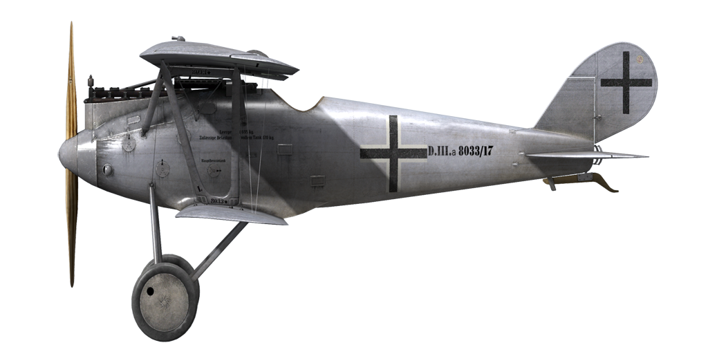

# IL-2: Sturmovik Great Battles: Vehicle Specifications

Version: 5.104 (28/06/2023)

[ GitHub ](https://github.com/RavenSystem/il2_specs)

## Planes

### A-20B

[ [chs](planes/a20b.chs.md) ] [ [eng](planes/a20b.eng.md) ] [ [fra](planes/a20b.fra.md) ] [ [ger](planes/a20b.ger.md) ] [ [pol](planes/a20b.pol.md) ] [ [rus](planes/a20b.rus.md) ] [ [spa](planes/a20b.spa.md) ] 

### Airco D.H.4

[ [chs](planes/aircodh4.chs.md) ] [ [eng](planes/aircodh4.eng.md) ] [ [fra](planes/aircodh4.fra.md) ] [ [ger](planes/aircodh4.ger.md) ] [ [pol](planes/aircodh4.pol.md) ] [ [rus](planes/aircodh4.rus.md) ] [ [spa](planes/aircodh4.spa.md) ] 

### Albatros D.Va

[ [chs](planes/albatrosd5.chs.md) ] [ [eng](planes/albatrosd5.eng.md) ] [ [fra](planes/albatrosd5.fra.md) ] [ [ger](planes/albatrosd5.ger.md) ] [ [pol](planes/albatrosd5.pol.md) ] [ [rus](planes/albatrosd5.rus.md) ] [ [spa](planes/albatrosd5.spa.md) ] 

### Ar 234 B-2

[ [chs](planes/ar234b2.chs.md) ] [ [eng](planes/ar234b2.eng.md) ] [ [fra](planes/ar234b2.fra.md) ] [ [ger](planes/ar234b2.ger.md) ] [ [pol](planes/ar234b2.pol.md) ] [ [rus](planes/ar234b2.rus.md) ] [ [spa](planes/ar234b2.spa.md) ] 

### B-25D

[ [chs](planes/b25draf.chs.md) ] [ [eng](planes/b25draf.eng.md) ] [ [fra](planes/b25draf.fra.md) ] [ [ger](planes/b25draf.ger.md) ] [ [pol](planes/b25draf.pol.md) ] [ [rus](planes/b25draf.rus.md) ] [ [spa](planes/b25draf.spa.md) ] 

### B-26B-55

[ [chs](planes/b26b55.chs.md) ] [ [eng](planes/b26b55.eng.md) ] [ [fra](planes/b26b55.fra.md) ] [ [ger](planes/b26b55.ger.md) ] [ [pol](planes/b26b55.pol.md) ] [ [rus](planes/b26b55.rus.md) ] [ [spa](planes/b26b55.spa.md) ] 

### Bf 109 E-7

[ [chs](planes/bf109e7.chs.md) ] [ [eng](planes/bf109e7.eng.md) ] [ [fra](planes/bf109e7.fra.md) ] [ [ger](planes/bf109e7.ger.md) ] [ [pol](planes/bf109e7.pol.md) ] [ [rus](planes/bf109e7.rus.md) ] [ [spa](planes/bf109e7.spa.md) ] 

### Bf 109 F-2

[ [chs](planes/bf109f2.chs.md) ] [ [eng](planes/bf109f2.eng.md) ] [ [fra](planes/bf109f2.fra.md) ] [ [ger](planes/bf109f2.ger.md) ] [ [pol](planes/bf109f2.pol.md) ] [ [rus](planes/bf109f2.rus.md) ] [ [spa](planes/bf109f2.spa.md) ] 

### Bf 109 F-4

[ [chs](planes/bf109f4.chs.md) ] [ [eng](planes/bf109f4.eng.md) ] [ [fra](planes/bf109f4.fra.md) ] [ [ger](planes/bf109f4.ger.md) ] [ [pol](planes/bf109f4.pol.md) ] [ [rus](planes/bf109f4.rus.md) ] [ [spa](planes/bf109f4.spa.md) ] 

### Bf 109 G-14

[ [chs](planes/bf109g14.chs.md) ] [ [eng](planes/bf109g14.eng.md) ] [ [fra](planes/bf109g14.fra.md) ] [ [ger](planes/bf109g14.ger.md) ] [ [pol](planes/bf109g14.pol.md) ] [ [rus](planes/bf109g14.rus.md) ] [ [spa](planes/bf109g14.spa.md) ] 

### Bf 109 G-2

[ [chs](planes/bf109g2.chs.md) ] [ [eng](planes/bf109g2.eng.md) ] [ [fra](planes/bf109g2.fra.md) ] [ [ger](planes/bf109g2.ger.md) ] [ [pol](planes/bf109g2.pol.md) ] [ [rus](planes/bf109g2.rus.md) ] [ [spa](planes/bf109g2.spa.md) ] 

### Bf 109 G-4

[ [chs](planes/bf109g4.chs.md) ] [ [eng](planes/bf109g4.eng.md) ] [ [fra](planes/bf109g4.fra.md) ] [ [ger](planes/bf109g4.ger.md) ] [ [pol](planes/bf109g4.pol.md) ] [ [rus](planes/bf109g4.rus.md) ] [ [spa](planes/bf109g4.spa.md) ] 

### Bf 109 G-6

[ [chs](planes/bf109g6.chs.md) ] [ [eng](planes/bf109g6.eng.md) ] [ [fra](planes/bf109g6.fra.md) ] [ [ger](planes/bf109g6.ger.md) ] [ [pol](planes/bf109g6.pol.md) ] [ [rus](planes/bf109g6.rus.md) ] [ [spa](planes/bf109g6.spa.md) ] 

### Bf 109 G-6AS

[ [chs](planes/bf109g6as.chs.md) ] [ [eng](planes/bf109g6as.eng.md) ] [ [fra](planes/bf109g6as.fra.md) ] [ [ger](planes/bf109g6as.ger.md) ] [ [pol](planes/bf109g6as.pol.md) ] [ [rus](planes/bf109g6as.rus.md) ] [ [spa](planes/bf109g6as.spa.md) ] 

### Bf 109 G-6 Late

[ [chs](planes/bf109g6late.chs.md) ] [ [eng](planes/bf109g6late.eng.md) ] [ [fra](planes/bf109g6late.fra.md) ] [ [ger](planes/bf109g6late.ger.md) ] [ [pol](planes/bf109g6late.pol.md) ] [ [rus](planes/bf109g6late.rus.md) ] [ [spa](planes/bf109g6late.spa.md) ] 

### Bf 109 K-4

[ [chs](planes/bf109k4.chs.md) ] [ [eng](planes/bf109k4.eng.md) ] [ [fra](planes/bf109k4.fra.md) ] [ [ger](planes/bf109k4.ger.md) ] [ [pol](planes/bf109k4.pol.md) ] [ [rus](planes/bf109k4.rus.md) ] [ [spa](planes/bf109k4.spa.md) ] 

### Bf 110 E-2

[ [chs](planes/bf110e2.chs.md) ] [ [eng](planes/bf110e2.eng.md) ] [ [fra](planes/bf110e2.fra.md) ] [ [ger](planes/bf110e2.ger.md) ] [ [pol](planes/bf110e2.pol.md) ] [ [rus](planes/bf110e2.rus.md) ] [ [spa](planes/bf110e2.spa.md) ] 

### Bf 110 G-2

[ [chs](planes/bf110g2.chs.md) ] [ [eng](planes/bf110g2.eng.md) ] [ [fra](planes/bf110g2.fra.md) ] [ [ger](planes/bf110g2.ger.md) ] [ [pol](planes/bf110g2.pol.md) ] [ [rus](planes/bf110g2.rus.md) ] [ [spa](planes/bf110g2.spa.md) ] 

### Breguet 14.B2

[ [chs](planes/breguet14.chs.md) ] [ [eng](planes/breguet14.eng.md) ] [ [fra](planes/breguet14.fra.md) ] [ [ger](planes/breguet14.ger.md) ] [ [pol](planes/breguet14.pol.md) ] [ [rus](planes/breguet14.rus.md) ] [ [spa](planes/breguet14.spa.md) ] 

### Bristol F2B (F.II)

[ [chs](planes/bristolf2bf2.chs.md) ] [ [eng](planes/bristolf2bf2.eng.md) ] [ [fra](planes/bristolf2bf2.fra.md) ] [ [ger](planes/bristolf2bf2.ger.md) ] [ [pol](planes/bristolf2bf2.pol.md) ] [ [rus](planes/bristolf2bf2.rus.md) ] [ [spa](planes/bristolf2bf2.spa.md) ] 

### Bristol F2B (F.III)

[ [chs](planes/bristolf2bf3.chs.md) ] [ [eng](planes/bristolf2bf3.eng.md) ] [ [fra](planes/bristolf2bf3.fra.md) ] [ [ger](planes/bristolf2bf3.ger.md) ] [ [pol](planes/bristolf2bf3.pol.md) ] [ [rus](planes/bristolf2bf3.rus.md) ] [ [spa](planes/bristolf2bf3.spa.md) ] 

### C-47A

[ [chs](planes/c47a.chs.md) ] [ [eng](planes/c47a.eng.md) ] [ [fra](planes/c47a.fra.md) ] [ [ger](planes/c47a.ger.md) ] [ [pol](planes/c47a.pol.md) ] [ [rus](planes/c47a.rus.md) ] [ [spa](planes/c47a.spa.md) ] 

### DFW C.V

[ [chs](planes/dfwc5.chs.md) ] [ [eng](planes/dfwc5.eng.md) ] [ [fra](planes/dfwc5.fra.md) ] [ [ger](planes/dfwc5.ger.md) ] [ [pol](planes/dfwc5.pol.md) ] [ [rus](planes/dfwc5.rus.md) ] [ [spa](planes/dfwc5.spa.md) ] 

### Fokker D.VII

[ [chs](planes/fokkerd7.chs.md) ] [ [eng](planes/fokkerd7.eng.md) ] [ [fra](planes/fokkerd7.fra.md) ] [ [ger](planes/fokkerd7.ger.md) ] [ [pol](planes/fokkerd7.pol.md) ] [ [rus](planes/fokkerd7.rus.md) ] [ [spa](planes/fokkerd7.spa.md) ] 

### Fokker D.VIIF

[ [chs](planes/fokkerd7f.chs.md) ] [ [eng](planes/fokkerd7f.eng.md) ] [ [fra](planes/fokkerd7f.fra.md) ] [ [ger](planes/fokkerd7f.ger.md) ] [ [pol](planes/fokkerd7f.pol.md) ] [ [rus](planes/fokkerd7f.rus.md) ] [ [spa](planes/fokkerd7f.spa.md) ] 

### Fokker D.VIII

[ [chs](planes/fokkerd8.chs.md) ] [ [eng](planes/fokkerd8.eng.md) ] [ [fra](planes/fokkerd8.fra.md) ] [ [ger](planes/fokkerd8.ger.md) ] [ [pol](planes/fokkerd8.pol.md) ] [ [rus](planes/fokkerd8.rus.md) ] [ [spa](planes/fokkerd8.spa.md) ] 

### Fokker Dr.I

[ [chs](planes/fokkerdr1.chs.md) ] [ [eng](planes/fokkerdr1.eng.md) ] [ [fra](planes/fokkerdr1.fra.md) ] [ [ger](planes/fokkerdr1.ger.md) ] [ [pol](planes/fokkerdr1.pol.md) ] [ [rus](planes/fokkerdr1.rus.md) ] [ [spa](planes/fokkerdr1.spa.md) ] 

### Fw 190 A-3

[ [chs](planes/fw190a3.chs.md) ] [ [eng](planes/fw190a3.eng.md) ] [ [fra](planes/fw190a3.fra.md) ] [ [ger](planes/fw190a3.ger.md) ] [ [pol](planes/fw190a3.pol.md) ] [ [rus](planes/fw190a3.rus.md) ] [ [spa](planes/fw190a3.spa.md) ] 

### Fw 190 A-5

[ [chs](planes/fw190a5.chs.md) ] [ [eng](planes/fw190a5.eng.md) ] [ [fra](planes/fw190a5.fra.md) ] [ [ger](planes/fw190a5.ger.md) ] [ [pol](planes/fw190a5.pol.md) ] [ [rus](planes/fw190a5.rus.md) ] [ [spa](planes/fw190a5.spa.md) ] 

### Fw 190 A-6

[ [chs](planes/fw190a6.chs.md) ] [ [eng](planes/fw190a6.eng.md) ] [ [fra](planes/fw190a6.fra.md) ] [ [ger](planes/fw190a6.ger.md) ] [ [pol](planes/fw190a6.pol.md) ] [ [rus](planes/fw190a6.rus.md) ] [ [spa](planes/fw190a6.spa.md) ] 

### Fw 190 A-8

[ [chs](planes/fw190a8.chs.md) ] [ [eng](planes/fw190a8.eng.md) ] [ [fra](planes/fw190a8.fra.md) ] [ [ger](planes/fw190a8.ger.md) ] [ [pol](planes/fw190a8.pol.md) ] [ [rus](planes/fw190a8.rus.md) ] [ [spa](planes/fw190a8.spa.md) ] 

### Fw 190 D-9

[ [chs](planes/fw190d9.chs.md) ] [ [eng](planes/fw190d9.eng.md) ] [ [fra](planes/fw190d9.fra.md) ] [ [ger](planes/fw190d9.ger.md) ] [ [pol](planes/fw190d9.pol.md) ] [ [rus](planes/fw190d9.rus.md) ] [ [spa](planes/fw190d9.spa.md) ] 

### Gotha G.V

[ [chs](planes/gothag5.chs.md) ] [ [eng](planes/gothag5.eng.md) ] [ [fra](planes/gothag5.fra.md) ] [ [ger](planes/gothag5.ger.md) ] [ [pol](planes/gothag5.pol.md) ] [ [rus](planes/gothag5.rus.md) ] [ [spa](planes/gothag5.spa.md) ] 

### Halberstadt CL.II

[ [chs](planes/halberstadtcl2.chs.md) ] [ [eng](planes/halberstadtcl2.eng.md) ] [ [fra](planes/halberstadtcl2.fra.md) ] [ [ger](planes/halberstadtcl2.ger.md) ] [ [pol](planes/halberstadtcl2.pol.md) ] [ [rus](planes/halberstadtcl2.rus.md) ] [ [spa](planes/halberstadtcl2.spa.md) ] 

### Halberstadt CL.II 200hp

[ [chs](planes/halberstadtcl2au.chs.md) ] [ [eng](planes/halberstadtcl2au.eng.md) ] [ [fra](planes/halberstadtcl2au.fra.md) ] [ [ger](planes/halberstadtcl2au.ger.md) ] [ [pol](planes/halberstadtcl2au.pol.md) ] [ [rus](planes/halberstadtcl2au.rus.md) ] [ [spa](planes/halberstadtcl2au.spa.md) ] 

### Halberstadt D.II

[ [chs](planes/halberstadtd2.chs.md) ] [ [eng](planes/halberstadtd2.eng.md) ] [ [fra](planes/halberstadtd2.fra.md) ] [ [ger](planes/halberstadtd2.ger.md) ] [ [pol](planes/halberstadtd2.pol.md) ] [ [rus](planes/halberstadtd2.rus.md) ] [ [spa](planes/halberstadtd2.spa.md) ] 

### Handley Page O/400

[ [chs](planes/handleypage400.chs.md) ] [ [eng](planes/handleypage400.eng.md) ] [ [fra](planes/handleypage400.fra.md) ] [ [ger](planes/handleypage400.ger.md) ] [ [pol](planes/handleypage400.pol.md) ] [ [rus](planes/handleypage400.rus.md) ] [ [spa](planes/handleypage400.spa.md) ] 

### He 111 H-16

[ [chs](planes/he111h16.chs.md) ] [ [eng](planes/he111h16.eng.md) ] [ [fra](planes/he111h16.fra.md) ] [ [ger](planes/he111h16.ger.md) ] [ [pol](planes/he111h16.pol.md) ] [ [rus](planes/he111h16.rus.md) ] [ [spa](planes/he111h16.spa.md) ] 

### He 111 H-6

[ [chs](planes/he111h6.chs.md) ] [ [eng](planes/he111h6.eng.md) ] [ [fra](planes/he111h6.fra.md) ] [ [ger](planes/he111h6.ger.md) ] [ [pol](planes/he111h6.pol.md) ] [ [rus](planes/he111h6.rus.md) ] [ [spa](planes/he111h6.spa.md) ] 

### Hs 129 B-2

[ [chs](planes/hs129b2.chs.md) ] [ [eng](planes/hs129b2.eng.md) ] [ [fra](planes/hs129b2.fra.md) ] [ [ger](planes/hs129b2.ger.md) ] [ [pol](planes/hs129b2.pol.md) ] [ [rus](planes/hs129b2.rus.md) ] [ [spa](planes/hs129b2.spa.md) ] 

### Hurricane Mk.II

[ [chs](planes/hurricanemkii.chs.md) ] [ [eng](planes/hurricanemkii.eng.md) ] [ [fra](planes/hurricanemkii.fra.md) ] [ [ger](planes/hurricanemkii.ger.md) ] [ [pol](planes/hurricanemkii.pol.md) ] [ [rus](planes/hurricanemkii.rus.md) ] [ [spa](planes/hurricanemkii.spa.md) ] 

### I-16 type 24

[ [chs](planes/i16t24.chs.md) ] [ [eng](planes/i16t24.eng.md) ] [ [fra](planes/i16t24.fra.md) ] [ [ger](planes/i16t24.ger.md) ] [ [pol](planes/i16t24.pol.md) ] [ [rus](planes/i16t24.rus.md) ] [ [spa](planes/i16t24.spa.md) ] 

### Il-2 mod.1941

[ [chs](planes/il2m41.chs.md) ] [ [eng](planes/il2m41.eng.md) ] [ [fra](planes/il2m41.fra.md) ] [ [ger](planes/il2m41.ger.md) ] [ [pol](planes/il2m41.pol.md) ] [ [rus](planes/il2m41.rus.md) ] [ [spa](planes/il2m41.spa.md) ] 

### Il-2 mod.1942

[ [chs](planes/il2m42.chs.md) ] [ [eng](planes/il2m42.eng.md) ] [ [fra](planes/il2m42.fra.md) ] [ [ger](planes/il2m42.ger.md) ] [ [pol](planes/il2m42.pol.md) ] [ [rus](planes/il2m42.rus.md) ] [ [spa](planes/il2m42.spa.md) ] 

### Il-2 mod.1943

[ [chs](planes/il2m43.chs.md) ] [ [eng](planes/il2m43.eng.md) ] [ [fra](planes/il2m43.fra.md) ] [ [ger](planes/il2m43.ger.md) ] [ [pol](planes/il2m43.pol.md) ] [ [rus](planes/il2m43.rus.md) ] [ [spa](planes/il2m43.spa.md) ] 

### Ju 52/3m g4e

[ [chs](planes/ju523mg4e.chs.md) ] [ [eng](planes/ju523mg4e.eng.md) ] [ [fra](planes/ju523mg4e.fra.md) ] [ [ger](planes/ju523mg4e.ger.md) ] [ [pol](planes/ju523mg4e.pol.md) ] [ [rus](planes/ju523mg4e.rus.md) ] [ [spa](planes/ju523mg4e.spa.md) ] 

### Ju 87 D-3

[ [chs](planes/ju87d3.chs.md) ] [ [eng](planes/ju87d3.eng.md) ] [ [fra](planes/ju87d3.fra.md) ] [ [ger](planes/ju87d3.ger.md) ] [ [pol](planes/ju87d3.pol.md) ] [ [rus](planes/ju87d3.rus.md) ] [ [spa](planes/ju87d3.spa.md) ] 

### Ju 88 A-4

[ [chs](planes/ju88a4.chs.md) ] [ [eng](planes/ju88a4.eng.md) ] [ [fra](planes/ju88a4.fra.md) ] [ [ger](planes/ju88a4.ger.md) ] [ [pol](planes/ju88a4.pol.md) ] [ [rus](planes/ju88a4.rus.md) ] [ [spa](planes/ju88a4.spa.md) ] 

### Ju 88 C-6

[ [chs](planes/ju88c6.chs.md) ] [ [eng](planes/ju88c6.eng.md) ] [ [fra](planes/ju88c6.fra.md) ] [ [ger](planes/ju88c6.ger.md) ] [ [pol](planes/ju88c6.pol.md) ] [ [rus](planes/ju88c6.rus.md) ] [ [spa](planes/ju88c6.spa.md) ] 

### La-5FN ser.2

[ [chs](planes/la5fns2.chs.md) ] [ [eng](planes/la5fns2.eng.md) ] [ [fra](planes/la5fns2.fra.md) ] [ [ger](planes/la5fns2.ger.md) ] [ [pol](planes/la5fns2.pol.md) ] [ [rus](planes/la5fns2.rus.md) ] [ [spa](planes/la5fns2.spa.md) ] 

### La-5 ser.8

[ [chs](planes/la5s8.chs.md) ] [ [eng](planes/la5s8.eng.md) ] [ [fra](planes/la5s8.fra.md) ] [ [ger](planes/la5s8.ger.md) ] [ [pol](planes/la5s8.pol.md) ] [ [rus](planes/la5s8.rus.md) ] [ [spa](planes/la5s8.spa.md) ] 

### LaGG-3 ser.29

[ [chs](planes/lagg3s29.chs.md) ] [ [eng](planes/lagg3s29.eng.md) ] [ [fra](planes/lagg3s29.fra.md) ] [ [ger](planes/lagg3s29.ger.md) ] [ [pol](planes/lagg3s29.pol.md) ] [ [rus](planes/lagg3s29.rus.md) ] [ [spa](planes/lagg3s29.spa.md) ] 

### MC.202 ser.VIII

[ [chs](planes/mc202s8.chs.md) ] [ [eng](planes/mc202s8.eng.md) ] [ [fra](planes/mc202s8.fra.md) ] [ [ger](planes/mc202s8.ger.md) ] [ [pol](planes/mc202s8.pol.md) ] [ [rus](planes/mc202s8.rus.md) ] [ [spa](planes/mc202s8.spa.md) ] 

### Me 262 A

[ [chs](planes/me262a.chs.md) ] [ [eng](planes/me262a.eng.md) ] [ [fra](planes/me262a.fra.md) ] [ [ger](planes/me262a.ger.md) ] [ [pol](planes/me262a.pol.md) ] [ [rus](planes/me262a.rus.md) ] [ [spa](planes/me262a.spa.md) ] 

### Me 410 A-1

[ [chs](planes/me410a1.chs.md) ] [ [eng](planes/me410a1.eng.md) ] [ [fra](planes/me410a1.fra.md) ] [ [ger](planes/me410a1.ger.md) ] [ [pol](planes/me410a1.pol.md) ] [ [rus](planes/me410a1.rus.md) ] [ [spa](planes/me410a1.spa.md) ] 

### MiG-3 ser.24

[ [chs](planes/mig3s24.chs.md) ] [ [eng](planes/mig3s24.eng.md) ] [ [fra](planes/mig3s24.fra.md) ] [ [ger](planes/mig3s24.ger.md) ] [ [pol](planes/mig3s24.pol.md) ] [ [rus](planes/mig3s24.rus.md) ] [ [spa](planes/mig3s24.spa.md) ] 

### Mosquito F.B. Mk.VI ser.2

[ [chs](planes/mosquitofbmkvis2.chs.md) ] [ [eng](planes/mosquitofbmkvis2.eng.md) ] [ [fra](planes/mosquitofbmkvis2.fra.md) ] [ [ger](planes/mosquitofbmkvis2.ger.md) ] [ [pol](planes/mosquitofbmkvis2.pol.md) ] [ [rus](planes/mosquitofbmkvis2.rus.md) ] [ [spa](planes/mosquitofbmkvis2.spa.md) ] 

### Nieuport 11.C1

[ [chs](planes/nieuport11.chs.md) ] [ [eng](planes/nieuport11.eng.md) ] [ [fra](planes/nieuport11.fra.md) ] [ [ger](planes/nieuport11.ger.md) ] [ [pol](planes/nieuport11.pol.md) ] [ [rus](planes/nieuport11.rus.md) ] [ [spa](planes/nieuport11.spa.md) ] 

### Nieuport 28.C1

[ [chs](planes/nieuport28.chs.md) ] [ [eng](planes/nieuport28.eng.md) ] [ [fra](planes/nieuport28.fra.md) ] [ [ger](planes/nieuport28.ger.md) ] [ [pol](planes/nieuport28.pol.md) ] [ [rus](planes/nieuport28.rus.md) ] [ [spa](planes/nieuport28.spa.md) ] 

### P-38J-25

[ [chs](planes/p38j25.chs.md) ] [ [eng](planes/p38j25.eng.md) ] [ [fra](planes/p38j25.fra.md) ] [ [ger](planes/p38j25.ger.md) ] [ [pol](planes/p38j25.pol.md) ] [ [rus](planes/p38j25.rus.md) ] [ [spa](planes/p38j25.spa.md) ] 

### P-39L-1

[ [chs](planes/p39l1.chs.md) ] [ [eng](planes/p39l1.eng.md) ] [ [fra](planes/p39l1.fra.md) ] [ [ger](planes/p39l1.ger.md) ] [ [pol](planes/p39l1.pol.md) ] [ [rus](planes/p39l1.rus.md) ] [ [spa](planes/p39l1.spa.md) ] 

### P-40E-1

[ [chs](planes/p40e1.chs.md) ] [ [eng](planes/p40e1.eng.md) ] [ [fra](planes/p40e1.fra.md) ] [ [ger](planes/p40e1.ger.md) ] [ [pol](planes/p40e1.pol.md) ] [ [rus](planes/p40e1.rus.md) ] [ [spa](planes/p40e1.spa.md) ] 

### P-47D-22

[ [chs](planes/p47d22.chs.md) ] [ [eng](planes/p47d22.eng.md) ] [ [fra](planes/p47d22.fra.md) ] [ [ger](planes/p47d22.ger.md) ] [ [pol](planes/p47d22.pol.md) ] [ [rus](planes/p47d22.rus.md) ] [ [spa](planes/p47d22.spa.md) ] 

### P-47D-28

[ [chs](planes/p47d28.chs.md) ] [ [eng](planes/p47d28.eng.md) ] [ [fra](planes/p47d28.fra.md) ] [ [ger](planes/p47d28.ger.md) ] [ [pol](planes/p47d28.pol.md) ] [ [rus](planes/p47d28.rus.md) ] [ [spa](planes/p47d28.spa.md) ] 

### P-51B-5

[ [chs](planes/p51b5.chs.md) ] [ [eng](planes/p51b5.eng.md) ] [ [fra](planes/p51b5.fra.md) ] [ [ger](planes/p51b5.ger.md) ] [ [pol](planes/p51b5.pol.md) ] [ [rus](planes/p51b5.rus.md) ] [ [spa](planes/p51b5.spa.md) ] 

### P-51D-15

[ [chs](planes/p51d15.chs.md) ] [ [eng](planes/p51d15.eng.md) ] [ [fra](planes/p51d15.fra.md) ] [ [ger](planes/p51d15.ger.md) ] [ [pol](planes/p51d15.pol.md) ] [ [rus](planes/p51d15.rus.md) ] [ [spa](planes/p51d15.spa.md) ] 

### Pe-2 ser.35

[ [chs](planes/pe2s35.chs.md) ] [ [eng](planes/pe2s35.eng.md) ] [ [fra](planes/pe2s35.fra.md) ] [ [ger](planes/pe2s35.ger.md) ] [ [pol](planes/pe2s35.pol.md) ] [ [rus](planes/pe2s35.rus.md) ] [ [spa](planes/pe2s35.spa.md) ] 

### Pe-2 ser.87

[ [chs](planes/pe2s87.chs.md) ] [ [eng](planes/pe2s87.eng.md) ] [ [fra](planes/pe2s87.fra.md) ] [ [ger](planes/pe2s87.ger.md) ] [ [pol](planes/pe2s87.pol.md) ] [ [rus](planes/pe2s87.rus.md) ] [ [spa](planes/pe2s87.spa.md) ] 

### Pfalz D.XII

[ [chs](planes/pfalzd12.chs.md) ] [ [eng](planes/pfalzd12.eng.md) ] [ [fra](planes/pfalzd12.fra.md) ] [ [ger](planes/pfalzd12.ger.md) ] [ [pol](planes/pfalzd12.pol.md) ] [ [rus](planes/pfalzd12.rus.md) ] [ [spa](planes/pfalzd12.spa.md) ] 

### Pfalz D.IIIa

[ [chs](planes/pfalzd3a.chs.md) ] [ [eng](planes/pfalzd3a.eng.md) ] [ [fra](planes/pfalzd3a.fra.md) ] [ [ger](planes/pfalzd3a.ger.md) ] [ [pol](planes/pfalzd3a.pol.md) ] [ [rus](planes/pfalzd3a.rus.md) ] [ [spa](planes/pfalzd3a.spa.md) ] 

### SSW D.IV

[ [chs](planes/schuckertdiv.chs.md) ] [ [eng](planes/schuckertdiv.eng.md) ] [ [fra](planes/schuckertdiv.fra.md) ] [ [ger](planes/schuckertdiv.ger.md) ] [ [pol](planes/schuckertdiv.pol.md) ] [ [rus](planes/schuckertdiv.rus.md) ] [ [spa](planes/schuckertdiv.spa.md) ] 

### S.E.5a

[ [chs](planes/se5a.chs.md) ] [ [eng](planes/se5a.eng.md) ] [ [fra](planes/se5a.fra.md) ] [ [ger](planes/se5a.ger.md) ] [ [pol](planes/se5a.pol.md) ] [ [rus](planes/se5a.rus.md) ] [ [spa](planes/se5a.spa.md) ] 

### Sopwith Camel

[ [chs](planes/sopcamel.chs.md) ] [ [eng](planes/sopcamel.eng.md) ] [ [fra](planes/sopcamel.fra.md) ] [ [ger](planes/sopcamel.ger.md) ] [ [pol](planes/sopcamel.pol.md) ] [ [rus](planes/sopcamel.rus.md) ] [ [spa](planes/sopcamel.spa.md) ] 

### Sopwith Dolphin

[ [chs](planes/sopdolphin.chs.md) ] [ [eng](planes/sopdolphin.eng.md) ] [ [fra](planes/sopdolphin.fra.md) ] [ [ger](planes/sopdolphin.ger.md) ] [ [pol](planes/sopdolphin.pol.md) ] [ [rus](planes/sopdolphin.rus.md) ] [ [spa](planes/sopdolphin.spa.md) ] 

### Sopwith Snipe

[ [chs](planes/sopsnipe.chs.md) ] [ [eng](planes/sopsnipe.eng.md) ] [ [fra](planes/sopsnipe.fra.md) ] [ [ger](planes/sopsnipe.ger.md) ] [ [pol](planes/sopsnipe.pol.md) ] [ [rus](planes/sopsnipe.rus.md) ] [ [spa](planes/sopsnipe.spa.md) ] 

### Sopwith Triplane

[ [chs](planes/soptriplane.chs.md) ] [ [eng](planes/soptriplane.eng.md) ] [ [fra](planes/soptriplane.fra.md) ] [ [ger](planes/soptriplane.ger.md) ] [ [pol](planes/soptriplane.pol.md) ] [ [rus](planes/soptriplane.rus.md) ] [ [spa](planes/soptriplane.spa.md) ] 

### SPAD 13.C1

[ [chs](planes/spad13.chs.md) ] [ [eng](planes/spad13.eng.md) ] [ [fra](planes/spad13.fra.md) ] [ [ger](planes/spad13.ger.md) ] [ [pol](planes/spad13.pol.md) ] [ [rus](planes/spad13.rus.md) ] [ [spa](planes/spad13.spa.md) ] 

### SPAD 7.C1 150hp

[ [chs](planes/spad7early.chs.md) ] [ [eng](planes/spad7early.eng.md) ] [ [fra](planes/spad7early.fra.md) ] [ [ger](planes/spad7early.ger.md) ] [ [pol](planes/spad7early.pol.md) ] [ [rus](planes/spad7early.rus.md) ] [ [spa](planes/spad7early.spa.md) ] 

### SPAD 7.C1 180hp

[ [chs](planes/spad7late.chs.md) ] [ [eng](planes/spad7late.eng.md) ] [ [fra](planes/spad7late.fra.md) ] [ [ger](planes/spad7late.ger.md) ] [ [pol](planes/spad7late.pol.md) ] [ [rus](planes/spad7late.rus.md) ] [ [spa](planes/spad7late.spa.md) ] 

### Spitfire Mk.IXe

[ [chs](planes/spitfiremkixe.chs.md) ] [ [eng](planes/spitfiremkixe.eng.md) ] [ [fra](planes/spitfiremkixe.fra.md) ] [ [ger](planes/spitfiremkixe.ger.md) ] [ [pol](planes/spitfiremkixe.pol.md) ] [ [rus](planes/spitfiremkixe.rus.md) ] [ [spa](planes/spitfiremkixe.spa.md) ] 

### Spitfire Mk.VB

[ [chs](planes/spitfiremkvb.chs.md) ] [ [eng](planes/spitfiremkvb.eng.md) ] [ [fra](planes/spitfiremkvb.fra.md) ] [ [ger](planes/spitfiremkvb.ger.md) ] [ [pol](planes/spitfiremkvb.pol.md) ] [ [rus](planes/spitfiremkvb.rus.md) ] [ [spa](planes/spitfiremkvb.spa.md) ] 

### Spitfire Mk.XIV

[ [chs](planes/spitfiremkxiv.chs.md) ] [ [eng](planes/spitfiremkxiv.eng.md) ] [ [fra](planes/spitfiremkxiv.fra.md) ] [ [ger](planes/spitfiremkxiv.ger.md) ] [ [pol](planes/spitfiremkxiv.pol.md) ] [ [rus](planes/spitfiremkxiv.rus.md) ] [ [spa](planes/spitfiremkxiv.spa.md) ] 

### Spitfire Mk.XIVe

[ [chs](planes/spitfiremkxive.chs.md) ] [ [eng](planes/spitfiremkxive.eng.md) ] [ [fra](planes/spitfiremkxive.fra.md) ] [ [ger](planes/spitfiremkxive.ger.md) ] [ [pol](planes/spitfiremkxive.pol.md) ] [ [rus](planes/spitfiremkxive.rus.md) ] [ [spa](planes/spitfiremkxive.spa.md) ] 

### Tempest Mk.V ser.2

[ [chs](planes/tempestmkvs2.chs.md) ] [ [eng](planes/tempestmkvs2.eng.md) ] [ [fra](planes/tempestmkvs2.fra.md) ] [ [ger](planes/tempestmkvs2.ger.md) ] [ [pol](planes/tempestmkvs2.pol.md) ] [ [rus](planes/tempestmkvs2.rus.md) ] [ [spa](planes/tempestmkvs2.spa.md) ] 

### Typhoon Mk.Ib

[ [chs](planes/typhoonmkib.chs.md) ] [ [eng](planes/typhoonmkib.eng.md) ] [ [fra](planes/typhoonmkib.fra.md) ] [ [ger](planes/typhoonmkib.ger.md) ] [ [pol](planes/typhoonmkib.pol.md) ] [ [rus](planes/typhoonmkib.rus.md) ] [ [spa](planes/typhoonmkib.spa.md) ] 

### U-2VS

[ [chs](planes/u2vs.chs.md) ] [ [eng](planes/u2vs.eng.md) ] [ [fra](planes/u2vs.fra.md) ] [ [ger](planes/u2vs.ger.md) ] [ [pol](planes/u2vs.pol.md) ] [ [rus](planes/u2vs.rus.md) ] [ [spa](planes/u2vs.spa.md) ] 

### Yak-1b ser.127

[ [chs](planes/yak1s127.chs.md) ] [ [eng](planes/yak1s127.eng.md) ] [ [fra](planes/yak1s127.fra.md) ] [ [ger](planes/yak1s127.ger.md) ] [ [pol](planes/yak1s127.pol.md) ] [ [rus](planes/yak1s127.rus.md) ] [ [spa](planes/yak1s127.spa.md) ] 

### Yak-1 ser.69

[ [chs](planes/yak1s69.chs.md) ] [ [eng](planes/yak1s69.eng.md) ] [ [fra](planes/yak1s69.fra.md) ] [ [ger](planes/yak1s69.ger.md) ] [ [pol](planes/yak1s69.pol.md) ] [ [rus](planes/yak1s69.rus.md) ] [ [spa](planes/yak1s69.spa.md) ] 

### Yak-7B series 36

[ [chs](planes/yak7bs36.chs.md) ] [ [eng](planes/yak7bs36.eng.md) ] [ [fra](planes/yak7bs36.fra.md) ] [ [ger](planes/yak7bs36.ger.md) ] [ [pol](planes/yak7bs36.pol.md) ] [ [rus](planes/yak7bs36.rus.md) ] [ [spa](planes/yak7bs36.spa.md) ] 

### Yak-9 ser.1

[ [chs](planes/yak9s1.chs.md) ] [ [eng](planes/yak9s1.eng.md) ] [ [fra](planes/yak9s1.fra.md) ] [ [ger](planes/yak9s1.ger.md) ] [ [pol](planes/yak9s1.pol.md) ] [ [rus](planes/yak9s1.rus.md) ] [ [spa](planes/yak9s1.spa.md) ] 

### Yak-9T ser.1

[ [chs](planes/yak9ts1.chs.md) ] [ [eng](planes/yak9ts1.eng.md) ] [ [fra](planes/yak9ts1.fra.md) ] [ [ger](planes/yak9ts1.ger.md) ] [ [pol](planes/yak9ts1.pol.md) ] [ [rus](planes/yak9ts1.rus.md) ] [ [spa](planes/yak9ts1.spa.md) ] 

## Vehicles

### Churchill IV

[ [chs](vehicles/_churchill-iv.chs.md) ] [ [eng](vehicles/_churchill-iv.eng.md) ] [ [fra](vehicles/_churchill-iv.fra.md) ] [ [ger](vehicles/_churchill-iv.ger.md) ] [ [pol](vehicles/_churchill-iv.pol.md) ] [ [rus](vehicles/_churchill-iv.rus.md) ] [ [spa](vehicles/_churchill-iv.spa.md) ] 

### GAZ-MM 72-K

[ [chs](vehicles/_gaz-mm-72k.chs.md) ] [ [eng](vehicles/_gaz-mm-72k.eng.md) ] [ [fra](vehicles/_gaz-mm-72k.fra.md) ] [ [ger](vehicles/_gaz-mm-72k.ger.md) ] [ [pol](vehicles/_gaz-mm-72k.pol.md) ] [ [rus](vehicles/_gaz-mm-72k.rus.md) ] [ [spa](vehicles/_gaz-mm-72k.spa.md) ] 

### KV-1s ChTZ (1943)

[ [chs](vehicles/_kv1s.chs.md) ] [ [eng](vehicles/_kv1s.eng.md) ] [ [fra](vehicles/_kv1s.fra.md) ] [ [ger](vehicles/_kv1s.ger.md) ] [ [pol](vehicles/_kv1s.pol.md) ] [ [rus](vehicles/_kv1s.rus.md) ] [ [spa](vehicles/_kv1s.spa.md) ] 

### M4A2

[ [chs](vehicles/_m4a2.chs.md) ] [ [eng](vehicles/_m4a2.eng.md) ] [ [fra](vehicles/_m4a2.fra.md) ] [ [ger](vehicles/_m4a2.ger.md) ] [ [pol](vehicles/_m4a2.pol.md) ] [ [rus](vehicles/_m4a2.rus.md) ] [ [spa](vehicles/_m4a2.spa.md) ] 

### Pz.Kpfw.III Ausf.L

[ [chs](vehicles/_pziii-l.chs.md) ] [ [eng](vehicles/_pziii-l.eng.md) ] [ [fra](vehicles/_pziii-l.fra.md) ] [ [ger](vehicles/_pziii-l.ger.md) ] [ [pol](vehicles/_pziii-l.pol.md) ] [ [rus](vehicles/_pziii-l.rus.md) ] [ [spa](vehicles/_pziii-l.spa.md) ] 

### Pz.Kpfw.III Ausf.M

[ [chs](vehicles/_pziii-m.chs.md) ] [ [eng](vehicles/_pziii-m.eng.md) ] [ [fra](vehicles/_pziii-m.fra.md) ] [ [ger](vehicles/_pziii-m.ger.md) ] [ [pol](vehicles/_pziii-m.pol.md) ] [ [rus](vehicles/_pziii-m.rus.md) ] [ [spa](vehicles/_pziii-m.spa.md) ] 

### Pz.Kpfw.IV Ausf.G

[ [chs](vehicles/_pziv-g.chs.md) ] [ [eng](vehicles/_pziv-g.eng.md) ] [ [fra](vehicles/_pziv-g.fra.md) ] [ [ger](vehicles/_pziv-g.ger.md) ] [ [pol](vehicles/_pziv-g.pol.md) ] [ [rus](vehicles/_pziv-g.rus.md) ] [ [spa](vehicles/_pziv-g.spa.md) ] 

### Pz.Kpfw.V Ausf.D

[ [chs](vehicles/_pzv-d.chs.md) ] [ [eng](vehicles/_pzv-d.eng.md) ] [ [fra](vehicles/_pzv-d.fra.md) ] [ [ger](vehicles/_pzv-d.ger.md) ] [ [pol](vehicles/_pzv-d.pol.md) ] [ [rus](vehicles/_pzv-d.rus.md) ] [ [spa](vehicles/_pzv-d.spa.md) ] 

### Pz.Kpfw.VI Ausf.H1

[ [chs](vehicles/_pzvi-h1.chs.md) ] [ [eng](vehicles/_pzvi-h1.eng.md) ] [ [fra](vehicles/_pzvi-h1.fra.md) ] [ [ger](vehicles/_pzvi-h1.ger.md) ] [ [pol](vehicles/_pzvi-h1.pol.md) ] [ [rus](vehicles/_pzvi-h1.rus.md) ] [ [spa](vehicles/_pzvi-h1.spa.md) ] 

### Sd.Kfz.10/5

[ [chs](vehicles/_sdkfz10-5.chs.md) ] [ [eng](vehicles/_sdkfz10-5.eng.md) ] [ [fra](vehicles/_sdkfz10-5.fra.md) ] [ [ger](vehicles/_sdkfz10-5.ger.md) ] [ [pol](vehicles/_sdkfz10-5.pol.md) ] [ [rus](vehicles/_sdkfz10-5.rus.md) ] [ [spa](vehicles/_sdkfz10-5.spa.md) ] 

### Sd.Kfz.184

[ [chs](vehicles/_sdkfz184.chs.md) ] [ [eng](vehicles/_sdkfz184.eng.md) ] [ [fra](vehicles/_sdkfz184.fra.md) ] [ [ger](vehicles/_sdkfz184.ger.md) ] [ [pol](vehicles/_sdkfz184.pol.md) ] [ [rus](vehicles/_sdkfz184.rus.md) ] [ [spa](vehicles/_sdkfz184.spa.md) ] 

### StuG III Ausf.G

[ [chs](vehicles/_stugiii-g.chs.md) ] [ [eng](vehicles/_stugiii-g.eng.md) ] [ [fra](vehicles/_stugiii-g.fra.md) ] [ [ger](vehicles/_stugiii-g.ger.md) ] [ [pol](vehicles/_stugiii-g.pol.md) ] [ [rus](vehicles/_stugiii-g.rus.md) ] [ [spa](vehicles/_stugiii-g.spa.md) ] 

### SU-122 UZTM (1943)

[ [chs](vehicles/_su122.chs.md) ] [ [eng](vehicles/_su122.eng.md) ] [ [fra](vehicles/_su122.fra.md) ] [ [ger](vehicles/_su122.ger.md) ] [ [pol](vehicles/_su122.pol.md) ] [ [rus](vehicles/_su122.rus.md) ] [ [spa](vehicles/_su122.spa.md) ] 

##&name=SU-152 ChKZ (1943)

[ [chs](vehicles/_su152.chs.md) ] [ [eng](vehicles/_su152.eng.md) ] [ [fra](vehicles/_su152.fra.md) ] [ [ger](vehicles/_su152.ger.md) ] [ [pol](vehicles/_su152.pol.md) ] [ [rus](vehicles/_su152.rus.md) ] [ [spa](vehicles/_su152.spa.md) ] 

### T-34/76 STZ (1942)

[ [chs](vehicles/_t34-76stz.chs.md) ] [ [eng](vehicles/_t34-76stz.eng.md) ] [ [fra](vehicles/_t34-76stz.fra.md) ] [ [ger](vehicles/_t34-76stz.ger.md) ] [ [pol](vehicles/_t34-76stz.pol.md) ] [ [rus](vehicles/_t34-76stz.rus.md) ] [ [spa](vehicles/_t34-76stz.spa.md) ] 

### T-34/76 UTZ (1943)

[ [chs](vehicles/_t34-76uvz-43.chs.md) ] [ [eng](vehicles/_t34-76uvz-43.eng.md) ] [ [fra](vehicles/_t34-76uvz-43.fra.md) ] [ [ger](vehicles/_t34-76uvz-43.ger.md) ] [ [pol](vehicles/_t34-76uvz-43.pol.md) ] [ [rus](vehicles/_t34-76uvz-43.rus.md) ] [ [spa](vehicles/_t34-76uvz-43.spa.md) ] 

