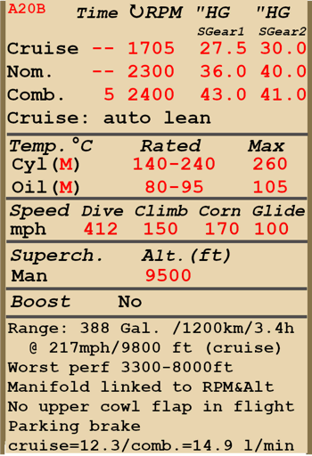

# A-20B  

<table><tbody><tr><td style="text-align: center"></td><td style="text-align: center"></tr></td></tr></tbody></table>  

Vitesse de décrochage indiquée en configuration de vol : 161..193 km/h (100..120 mph)  
Vitesse de décrochage indiquée en configuration de décollage/atterrissage : 139..166 km/h (86..103 mph)  
  
Vitesse limite de piqué : 665 km/h (412 mph)  
Facteur de charge maximum : 6,5 g  
Angle d\attaque de décrochage en configuration de vol : 19,1 °  
Angle d\attaque de décrochage indiquée en configuration d\atterrissage : 17,1 °  
  
Vitesse sol au niveau de la mer, régime moteur - Combat: 505 km/h (314 mph)  
Vitesse sol maximale à 1000 m, régime moteur - Combat: 524 km/h (326 mph)  
Vitesse sol maximale à 5000 m, régime moteur - Combat: 544 km/h (338 mph)  
  
Vitesse sol au niveau de la mer, régime moteur - Nominal : 467 km/h (290 mph)  
Vitesse sol maximale à 2000 m, régime moteur - Nominal : 500 km/h (311 mph)  
Vitesse sol maximale à 5000 m, régime moteur - Nominal : 525 km/h (326 mph)  
  
Plafond opérationnel : 8700 m (28540 ft)  
Taux de montée au niveau de la mer : 10,0 m/s (1969 ft/min)  
Taux de montée à 3000 m : 8,2 m/s (1614 ft/min)  
Taux de montée à 6000 m : 5,0 m/s (984 ft/min)  
  
Virage à 360° au niveau de la mer en : 24,5 s, à 270 km/h vitesse indiquée (IAS).  
Virage à 360° à 3000 m : 34,1 s, à 270 km/h vitesse indiquée (IAS).  
  
Endurance à 3000 m : 3,4 h, à 350 km/h vitesse indiquée (IAS). Engine mode - Cruise, 1st supercharger stage  
  
Vitesse de décollage : 170..195 km/h (105..120 mph)  
Vitesse d\approche : 185..225 km/h (115..140 mph)  
Vitesse d\atterrissage : 150..170 km/h (95..105 mph)  
Angle d\atterrissage : 3,4 °  
  
Note 1 : les données sont indiquées à l\atmosphère standard international (ISA).  
Note 2 : les performances d\endurance sont données pour plusieurs masses possibles.  
Note 3 : maximum speeds, climb rates and turn times are given for aircraft mass with 8 FAB-100 bombs.  
Note 4 : le taux de montée et le temps de virage vaut à régime continu.  
  
Moteur :  
Modèle : Wright R-2600-11  
Puissance maximale au régime Cruise à 5500 ft: 810 cv  
Puissance maximale au régime Cruise à 12000 ft: 765 cv  
Puissance maximale au régime Nominal à 5500 ft: 1350 cv  
Puissance maximale au régime Nominal à 12000 ft: 1275 cv  
Puissance maximale au régime Combat au niveau de la mer: 1600 cv  
Puissance maximale au régime Combat à 11500 ft: 1400 cv  
  
Performance du moteur :  
(наддув приведён для работы на первой и второй ступени нагнетателя соответственно)  
Cruise (unlimited time): 1705 RPM, 27,5 / 30,0 inch Hg, mixture "Auto Lean"   
Nominal (unlimited time): 2300 RPM, 36,0 / 40,0 inch Hg, mixture "Auto Rich"   
Combat (5 min limit): 2400 RPM, 43,0 / 41,0 inch Hg, mixture "Auto Rich"   
  
Température de fonctionnement d\huile en sortie du moteur : 80..95 °C  
Température maximale d\huile en sortie du moteur : 105 °C  
Température de fonctionnement des têtes de cylindre : 140..240 °C  
Température maximale des têtes de cylindre : 260 °C  
  
Altitude de changement d\étage du compresseur : 2900 m (9500 ft)  
  
Masse à vide : 6781 kg  
Masse minimale (sans munitions, 10% de carburant) : 7359 kg  
Masse standard : 8366 kg  
Masse maximale au décollage : 10466 kg  
Masse de carburant : 1057 kg / 1468 l / 388 gal  
Charge utile : 3665 kg  
  
Armement offensif :  
12,7 mm mitrailleuse M2 .50, 200 coups, 850 coups par minute, dans le nez  
  
Armement défensif :  
Dorsal : mitrailleuse M2 .50 de 12,7 mm, 390 coups, 850 coups par minute  
Ventral : mitrailleuse Browning .303 de 7,92 mm, 600 coups, 1150 coups par minute  
  
Bombes :  
Jusqu\à 20 bombes d\emploi général FAB-100M de 104 kg  
Jusqu\à 4 bombes d\emploi général FAB-250ck de 254 kg  
  
Longueur : 14,54 m  
Envergure : 18,69 m  
Surface alaire : 43,18 m²  
  
Premier engagement : printemps 1942  
  
Operation features:  
- The engine has no manifold pressure automatic governor. For this reason, manifold pressure not only depends on throttle position, but also from RPM and altitude. This requires additional checking of manifold pressure to not cause engine damage.  
- The engine is equipped with an automatic fuel mixture control which maintains optimal mixture if mixture lever is set to Auto Rich (66%) position. To use automatic mixture leaning to reduce fuel consumption during flight it is necessary to set mixture lever to Auto Lean (33%) position. In the case of mulfunction of the automatic mixture control the mixture lever should be set to Full Rich (100%) position. To stop the engine mixture lever should be set to the Cut Off (0%) position.  
- Engine RPM has an automatic governor and it is maintained at the required RPM corresponding to the governor control lever position. The governor automatically controls the propeller pitch to maintain the required RPM.  
- Oil radiators shutters are joint with engine cowl outlet shutters and manually operated.  
- The aircraft has a fuel gauge which shows remaining fuel in fuel tanks depending on switch position. In game the fuel indicator switch changes by pressing (RShift+I).  
- The aircraft has trimmers for all flight-controls: pitch, roll and yaw.  
- Landing flaps have a hydraulic actuator and they can be extended to any angle up to 50°.  
- The aircraft has independent left and right hydraulic wheel brake controls. To apply either brake push the upper part of the rudder pedal.  
- The aircraft is equipped with a parking brake system.  
- The aircraft is equipped with a siren that warns a pilot if the throttle is set to low position with landing gear retracted.  
- The aircraft is equipped with upper formation lights.  
- The engine has a two-stage mechanical supercharger which must be manually switched at 2900m (9500 ft) altitude.  
- The aircraft has a fuel gauge which shows remaining fuel in left and right fuel tanks depending on switch position. In game the fuel indicator switch changes by itself during horizontal flight by every 15 seconds.  
- The aircraft is equipped with an electromechanical safety system that blocks the hydraulic landing gear actuator while the aircraft is on the ground.  
- The nose gear orients by itself, doesnt have brakes and cant be controlled.  
- It is forbidden to open the upper cowl flaps during flight, so they should be closed before taking off.  
- The upper cowl flaps are controlled simultaneously using a shared hydraulic actuator (use inlet shutter control ingame).  
- There are white and red signal lamps in the tail: the white one is lit while bomb doors are open and the red one lights up for 5 seconds when bombs are released.  
- The upper cockpit door cant be opened during flight, but there is an emergency jettison handle.  
- The aircraft is equipped with a bomb salvo controller that has four release modes: drop single, drop two in a salvo, drop four in a salvo or drop all bombs in salvo. There is also a controller for a drop delay between each bomb in the salvo.  
  
Basic data and recommended positions of the aircraft controls:  
1. Starting the engine:  
	- recommended position of the mixture control lever: Full Rich  
	- recommended position of the cowl flaps : close  
	- recommended position of the prop pitch control handle: 0%  
	- recommended position of the throttle lever: 20%  
	- before taxiing, the parking brake must be released  
  
2. Recommended mixture control lever positions for various flight modes:  
	- idling on the ground: Auto Rich  
	- takeoff: Auto Rich  
	- cruise flight: Auto Rich (Auto Lean if necessary to save fuel)  
	- combat: Auto Rich  
  
3.1 Recommended positions of upper cowl flaps  for various flight modes:  
	- idling on the ground: open  
	- takeoff: close  
	- climb: close  
	- cruise flight: close  
	- combat: close  
  
3.2 Recommended positions of cowl flaps for various flight modes:  
	- idling on the ground: open 50%  
	- takeoff: open 50%  
	- climb: open 100%  
	- cruise flight: open 25%  
	- combat: open 50%  
  
4. Approximate fuel consumption at altitude:  
	- Cruise engine mode: 12.3 l/min  
	- Combat engine mode: 14.9 l/min  

## Modifications  

### 20 bombes FAB-100M  

20 bombes d’emploi général FAB-100M de 104 kg  
Masse supplémentaire : 2080 kg  
Masse des munitions : 2080 kg  
Perte estimée de vitesse avant le largage : 39 km/h  
Perte estimée de vitesse après le largage : 16 km/h  
  

### 4 bombes FAB-250tsk  

4 bombes d’emploi général FAB-250tsk de 254 kg  
Masse supplémentaire : 1016 kg  
Masse des munitions : 1016 kg  
Perte estimée de vitesse avant le largage : 39 km/h  
Perte estimée de vitesse après le largage : 16 km/h  
  
### Bendix MN-26  

Goniomètre pour la radionavigation  
Masse supplémentaire : 20 kg  
Perte estimée de vitesse : 0 km/h  
