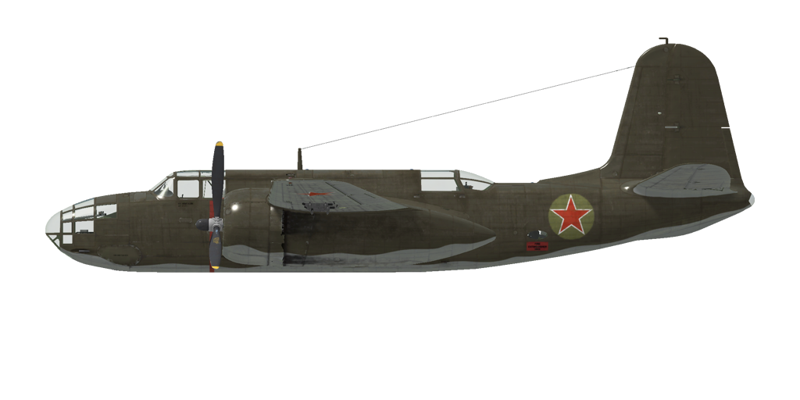

# A-20B  
  
  
  
## Описание  
  
Приборная скорость сваливания в полётной конфигурации: 161..193 км/ч (100..120 миль/ч)  
Приборная скорость сваливания в посадочной конфигурации: 139..166 км/ч (86..103 миль/ч)  
  
Предельная скорость в пикировании: 665 км/ч (412 миль/ч)  
Разрушающая перегрузка: 6,5 единиц  
Угол атаки сваливания, в полётной конфигурации: 19,1 °  
Угол атаки сваливания, в посадочной конфигурации: 17,1 °  
  
Максимальная истинная скорость у земли, режим двигателя - боевой: 505 км/ч (314 миль/ч)  
Максимальная истинная скорость на высоте 1000 м, режим двигателя - боевой: 524 км/ч (326 миль/ч)  
Максимальная истинная скорость на высоте 5000 м, режим двигателя - боевой: 544 км/ч (338 миль/ч)  
  
Максимальная истинная скорость у земли, режим двигателя - номинальный: 467 км/ч (290 миль/ч)  
Максимальная истинная скорость на высоте 2000 м, режим двигателя - номинальный: 500 км/ч (311 миль/ч)  
Максимальная истинная скорость на высоте 5000 м, режим двигателя - номинальный: 525 км/ч (326 миль/ч)  
  
Практический потолок: 8700 м (28540 футов)  
Скороподъёмность у земли: 10,0 м/с (1969 фут/мин)  
Скороподъёмность на высоте 3000 м: 8,2 м/с (1614 фут/мин)  
Скороподъёмность на высоте 6000 м: 5,0 м/с (984 фут/мин)  
  
Время виража предельного по тяге у земли: 24,5 с, на скорости 270 км/ч по прибору  
Время виража предельного по тяге на высоте 3000 м: 34,1 с, на скорости 270 км/ч по прибору  
  
Продолжительность полёта на высоте 3000 м: 3,4 ч, на скорости 350 км/ч по прибору, на крейсерском режиме работы двигателей   
  
Скорость взлётная: 170..195 км/ч (105..120 миль/ч)  
Скорость на глиссаде: 185..225 км/ч (115..140 миль/ч)  
Скорость посадочная: 150..170 км/ч (95..105 миль/ч)  
Посадочный угол: 3,4 °  
  
Примечание 1: данные указаны для условий международной стандартной атмосферы.  
Примечание 2: диапазоны характеристик даны для допустимого диапазона масс самолета.  
Примечание 3: максимальные скорости, скороподъемности и время виража даны для варианта самолёта с загрузкой 8 ФАБ-100.  
Примечание 4: скороподъемность и время виража даны на номинальном режиме работы двигателя.  
  
Двигатель:  
Модель: Wright R-2600-11  
Максимальная мощность на крейсерском режиме на высоте 5500 футов: 810 л.с.  
Максимальная мощность на крейсерском режиме на высоте 12000 футов: 765 л.с.  
Максимальная мощность на номинальном режиме на высоте 5500 футов: 1350 л.с.  
Максимальная мощность на номинальном режиме на высоте 12000 футов: 1275 л.с.  
Максимальная мощность на боевом режиме у земли: 1600 л.с.  
Максимальная мощность на боевом режиме на высоте 11500 футов: 1400 л.с.  
  
Режимы работы двигателя:  
(наддув приведён для работы на первой и второй ступени нагнетателя соответственно)  
Крейсерский (время не ограничено): 1705 об/мин, 27,5 / 30,0 дюйм рт.ст., смесь "Auto Lean"   
Номинальный (время не ограничено): 2300 об/мин, 36,0 / 40,0 дюйм рт.ст., смесь "Auto Rich"   
Боевой (до 5 минут): 2400 об/мин, 43,0 / 41,0 дюйм рт.ст., смесь "Auto Rich"   
  
Температура масла на выходе из двигателя номинальная: 80..95 °С  
Температура масла на выходе из двигателя предельная: 105 °С  
Температура головок номинальная: 140..240 °С  
Температура головок предельная: 260 °С  
  
Высота переключения нагнетателя: 2900 м (9500 футов)  
  
Масса пустого самолета: 6781 кг  
Минимальная масса (без БК, 10% топлива): 7359 кг  
Стандартная масса: 8366 кг  
Максимальная взлётная масса: 10466 кг  
Максимальный запас топлива: 1057 кг / 1468 л / 388 гал  
Максимальная полезная нагрузка: 3665 кг  
  
Вооружение курсовое:  
2 x 12,7мм пулемет "M2,50", 200 патронов, 850 выстр/мин, носовой  
  
Вооружение оборонительное:  
Верхнее: 12,7мм пулемет "M2 .50", 390 патронов, 850 выстр/мин  
Нижнее: 7,92мм Пулемет "Browning .303", 600 патронов, 1150 выстр/мин  
  
Вооружение бомбовое:  
До 20 x 104 кг осколочно-фугасных авиабомб "ФАБ-100М"  
До 4 x 254 кг осколочно-фугасных авиабомб "ФАБ-250цк"  
  
Длина: 14,54 м  
Размах крыла: 18,69 м  
Площадь крыла: 43,18 кв.м  
  
Начало участия в боевых действиях: весна 1942  
  
Особенности эксплуатации:  
- На самолёте отсутствует регулятор постоянного наддува, поэтому давление наддува зависит не только от положения РУД но также от числа оборотов мотора и высоты полёта. Поэтому следует уделять повышенное внимание контролю наддува по указателю во избежание повреждения двигателя.  
- Самолёт оборудован автоматическим высотным корректором, который поддерживает оптимальный состав топливовоздушной смеси при нахождении рычага управления смесью в положении Auto Rich (2/3 хода рычага). Для снижения расхода топлива на маршруте можно воспользоваться режимом поддержания обедненного состава смеси, для чего необходимо установить рычаг в положение Auto Lean (1/3 хода рычага). Максимальное обогащение смеси осуществляется установкой рычага в положение Full Reach (рычаг полностью вперёд) и используется только при отказе автоматического регулирования состава смеси. Для остановки двигателя рычаг высотного корректора необходимо передвинуть полностью назад, в положение Cut Off.  
- Регулятор постоянных оборотов винта поддерживает заданные рычагом винта обороты мотора за счёт автоматического изменения шага винта.  
- Регулировка температуры масла и головок цилиндров осуществляется вручную, путём открытия и закрытия выходных створок капота двигателя.  
- Самолёт оборудован указателем топлива, который может показывать остаток топлива в каждом из баков. Выбор бака для индикации по-умолчанию производится комбинацией клавишь (RShift+I).  
- Самолёт оснащён триммерами во всех трёх каналах управления.  
- Привод посадочных щитков гидравлический. Щитки можно выпустить на любой угол до 50°. На большой скорости закрылки убираются автоматически.  
- Самолёт имеет раздельное управление гидравлическими тормозами левого и правого колёс шасси. Торможение каждого колеса осуществляется нажатием на верхнюю часть соответствующей педали.  
- Самолет оборудован стояночным тормозом.  
- Самолёт оснащён сиреной, предупреждающей о убранном положении шасси при установке РУД на малый газ.   
- Самолёт оснащён верхними строевыми огнями.  
- Двигатель оборудован двухступенчатым нагнетателем. Ступени нагнетателя следует переключать при пересечении высоты 2900 м (9500 футов).  
- Самолёт оборудован указателем топлива, который может показывать остаток топлива в левых или правых группах баков.  
- Самолёт имеет электромеханическую блокировку гидравлического крана управления уборкой шасси, которая не даёт перевести кран на уборку шасси при обжатых основных стойках.  
- Самолёт имеет шасси с передней стойкой. Передняя стойка свободноориентируемая, управления и тормозов не имеет.  
- Верхние створки капотов запрещено открывать в воздухе, и перед взлётом их следует закрыть.  
- Верхние створки капотов управляются только совместно, от одного общего гидравлического крана (для управления верхними створками капота в игре используется команда управления входными створками капота).  
- В хвосте самолёта установлен белый сигнальный огонь, который загорается при открытых створках бомболюка, и красный сигнальный огонь, который горит пять секунд после нажатия на кнопку сброса бомб.  
- Верхняя створка кабины пилота в полёте не открывается, и имеет механизм аварийного сброса.  
- На самолете установлен электросбрасыватель бомб, который позволяет выполнять бомбометание по одной, по две, по четыре бомбы, или выполнить сброс всех бомб в одной серии. Так же самолет оборудован задатчиком интервала между сбросом бомб в серии.  
  
## Модификации  
  
  
### 20 x ФАБ-100М  
  
20 x 104 кг осколочно-фугасных авиабомб ФАБ-100М  
Дополнительная масса: 2080 кг  
Масса вооружения: 2080 кг  
Ориентировочная потеря скорости до сброса: 39 км/ч  
Ориентировочная потеря скорости после сброса: 16 км/ч  
  
### 4 x ФАБ-250цк  
  
4 x 254 кг осколочно-фугасные авиабомбы ФАБ-250цк  
Дополнительная масса: 1016 кг  
Масса вооружения: 1016 кг  
Ориентировочная потеря скорости до сброса: 39 км/ч  
Ориентировочная потеря скорости после сброса: 16 км/ч  
  
### Bendix MN-26  
  
Радиополукомпас для навигации по радиомаякам  
Дополнительная масса: 20 кг  
Ориентировочная потеря скорости: 0 км/ч  