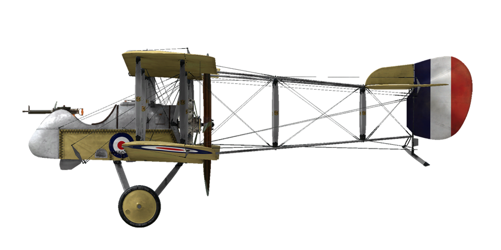
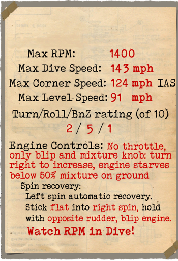

# Airco D.H.2  

| Image | Notes  
|:---|:---  
|  |   

## 描述  

The Airco D.H.2 was a single-seat fighter and the second project of designer Sir Geoffrey de Havilland. With this design, he capitalized on the development of the "pusher" propeller concept, where the propeller is situated behind the pilot. This design eliminated the need for a synchronised machine gun, which was introduced only at the end of 1916: the prototype of the D.H.2 made its first flight in July 1915. In February 1916, No. 24 Squadron of the Royal Flying Corps became the first unit to be equipped with the type, when it began active service in France.  
  
The Lewis machine gun was mounted in a nacelle and was initially difficult to aim. The movable gun mount forced the pilot to simultaneously control the aircraft and aim the machine gun by hand, which made combat even more difficult. Later on, pilots began to lock the gun down in a fixed position pointing forward. As a result, pilots could aim the weapon by manoeuvring the aircraft, which was found to be more effective than attempting to aim the machine gun manually during combat.  
  
The D.H.2 was often criticised for the complex procedures needed to master the aircraft and the quick reactions demanded by the controls. Even so, all of this made for an outstanding fighter in the hands of experienced pilots. With the introduction of the D.H.2, the RFC gained air superiority over the formerly feared - but now rapidly outdated - Fokker monoplanes, especially during the first Battle of the Somme. The Allied air forces\ resulting domination lasted until the autumn of 1916, at which time the German Albatros D.I and D.II fighters were introduced.  
  
By the end of 1916, the Airco D.H.2 was being withdrawn from combat service. Almost all remaining aircraft had been transferred to training squadrons by the middle of 1917, where they remained in service until the beginning of 1918. Several aircraft remained in service in Palestine and on the Macedonian front until the end of 1917. Not a single unit survived the end of WWI.  
  
  
Engine: Gnome Monosoupape rotary 9 cyl 100 h.p.  
  
Dimensions  
Height: 2921 mm  
Length: 7683 mm  
Wing span: 8610 mm  
Wing surface: 21,47 sq.m.  
  
Weight  
Empty weight: 454 kg  
Takeoff weight: 653 kg  
Fuel capacity: 118 l  
Oil capacity: 18,5 l  
  
Maximum airspeed (IAS)  
sea level - 146 km/h  
 1000 m - 138 km/h  
 2000 m - 130 km/h  
 3000 m - 121 km/h  
 4000 m - 112 km/h  
  
Climb rate  
1000 m -  5 min. 21 sec.  
2000 m - 12 min. 44 sec.  
3000 m - 23 min. 16 sec.  
4000 m - 41 min. 49 sec.  
  
Service ceiling: 4500 m  
  
Endurance: 2 h. 45 min.  
  
Armament:  
Forward firing: 1x 7,69 mm Lewis gun, 388 rounds.  
  
References:  
1) Squadron/Signal Publications Nr. 171. De Haviland DH 2 in action  
2) The De Haviland D.H.2. Profile publications Number 91  
3) Airco DH2. Windsock Datafile 48.  

## 修改  
### 驾驶舱照明  

用于夜间飞行的驾驶舱照明灯  
增加质量：1 kg  
  
### 油量表  

指针式油量表  
增加质量：1 kg  

### 射击瞄准具  

带有前后准心的附加瞄准具  
增加质量：1 kg  

### LePrieur rockets  

8 x strut-mounted "Le Prieur" anti-balloon rockets of incendary action, with pointed triangular blade attached to nose cone to asssit penetration of balloon envelope or with high explosive grenade.  
增加质量：36 kg  
弹药质量：16 kg  
挂架质量：20 kg  
投弹前预期速度损失：8 km/h  
投弹后预期速度损失：6 km/h  
