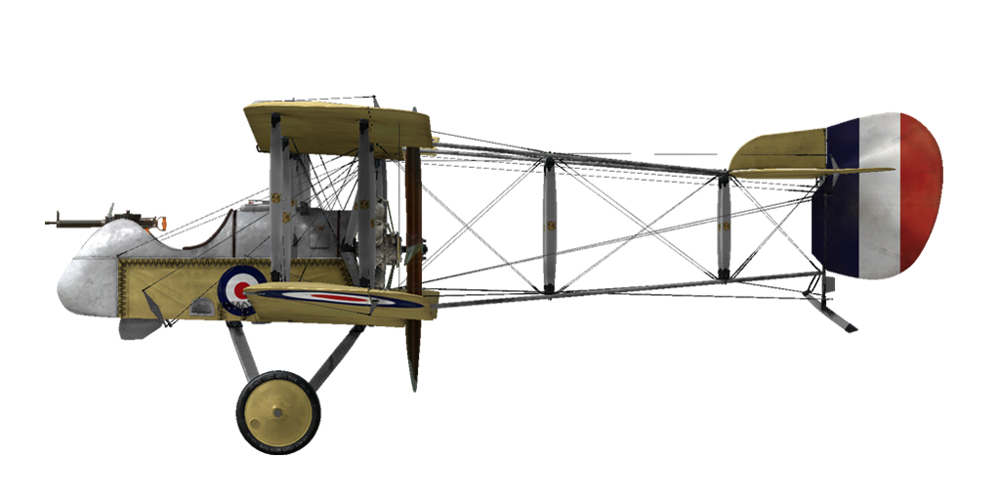

# Airco D.H.2  

<table><tbody><tr><td style="text-align: center"></td><td style="text-align: center"></td></tr><tr><td style="text-align: center" colspan="2"></td></tr></tbody></table>  

Le chasseur monoplace Airco D.H.2 fut le second projet de Sir Geoffrey de Havilland matérialisant les avancées réalisées dans le domaine des hélices propulsives, situées derrière le pilote. Ce type de configuration permettait de placer un armement sans synchronisation, technique qui ne fut implantée que vers la fin 1916. Le prototype du D.H.2 vola pour la première fois en Juillet 1915 et fut déployé dans 24 Squadrons du Royal Flying Corps où il commença sa carrière au dessus de la France dès Février 1916.  
  
La mitrailleuse Lewis était montée dans le nez de l\avion ce qui posa d\ailleurs beaucoup de problèmes au début. Le fait qu\elle fut mobile forçait le pilote durant un combat non seulement à manoeuvrer l\avion mais aussi à viser avec la mitrailleuse ce qui rendait les combats encore plus difficiles. Plus tard, les pilotes fixèrent la mitrailleuse dans l\axe de vol ce qui, en manoeuvrant l\avion leur permettait d\obtenir de biens meilleurs résultats.  
  
Le D.H.2 était critiqué pour sa difficulté de pilotage et ses réactions aux commandes très vives bien que ceci, aux mains de pilotes expérimentés, fut la principale raison du succès de cet appareil en combat. Grace au D.H.2 le RFC reprit l\avantage sur les Fokker Allemands surclassés, fait visible surtout durant la première bataille de la Somme. Cette domination continua jusque l\automne 1916 avec l\introduction des Albatros D.I/D.II.  
  
A partir de la fin 1916, l\Airco D.H.2 commença à être retiré du service et jusqu\à la mi 1917 presque tous les avions restants furent transférés dans des squadrons d\écolage où ils furent utilisés jusque début 1918. Cependant, certains unités de combat en Palestine volèrent avec le D.H.2 jusque la fin 1917. Pas un seul exemplaire de cet avion ne survécu à la première guerre mondiale.  
  
  
Moteur: Gnome Monosoupape rotary 9 cyl 100 h.p.  
  
Tailles  
Hauteur: 2921 mm  
Longueur: 7683 mm  
Envergure: 8610 mm  
Surface d\aile: 21,47 sq.m.  
  
Poids  
Poids à vide weight: 454 kg  
Poids au décollage weight: 653 kg  
Capacité des réservoirs carburant: 118 l  
Capacité du réservoir d\huile: 18,5 l  
  
Vitesse maximale (IAS)  
au Sol - 146 km/h  
1000 m - 138 km/h  
2000 m - 130 km/h  
3000 m - 121 km/h  
4000 m - 112 km/h  
  
Tauc de montée  
1000 m -  5 min. 21 sec.  
2000 m - 12 min. 44 sec.  
3000 m - 23 min. 16 sec.  
4000 m - 41 min. 49 sec.  
  
Plafond opérationnel: 4500 m  
  
Autonomie: 2 h. 45 min.  
  
Armes:  
Armes fixées: 1 x 7,69 mm Lewis gun, 388 cartouches.  
  
Référence:  
1) Squadron/Signal Publications Nr. 171. De Haviland DH 2 in action  
2) The De Haviland D.H.2. Profile publications Number 91  
3) Airco DH2. Windsock Datafile 48.  

## Modifications  
### Lumière de cockpit  

Lumière à ampoule pour les sorties de nuit  
Masse supplémentaire : 1 kg  
  
### Jauge d\essence,  

Jauge de niveau de carburant à aiguille  
Masse supplémentaire : 1 kg  
  
### Viseur  

Viseur additionnel avec guidon de mire avant-arrière  
Masse supplémentaire : 1 kg  
  
### LePrieur rockets  

8 x strut-mounted "Le Prieur" anti-balloon rockets of incendary action, with pointed triangular blade attached to nose cone to asssit penetration of balloon envelope or with high explosive grenade.  
Masse supplémentaire : 36 kg  
Masse des munitions : 16 kg  
Masse des pylones : 20 kg  
Perte estimée de vitesse avant le largage : 8 km/h  
Perte estimée de vitesse après le largage : 6 km/h  
