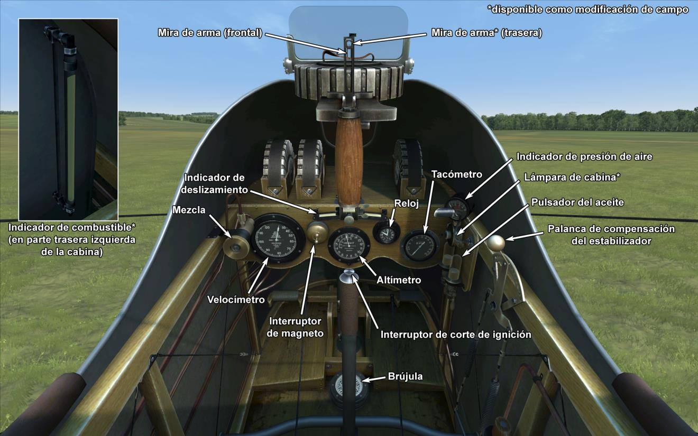

# Airco D.H.2  

<table><tbody><tr><td style="text-align: center"></td><td style="text-align: center"></td></tr><tr><td style="text-align: center" colspan="2"></td></tr></tbody></table>  

## Descripción  

El Airco D.H.2, un caza monoplaza, fue el segundo proyecto del diseñador Sir Geoffrey de Havilland, que mejoraba el concepto de la hélice propulsora, situada tras el piloto. Este diseño permitia construir el avión sin la necesidad de sincronizar la ametralladora, que no sería implementada hasta finales de 1916. El prototipo del D.H.2 realizó su primer vuelo en julio de 1915. Poco después entró en servicio y fue entregado al Escuadrón n.º 24 del <i>Royal Flying Corps</i>, con el que inició su servicio activo en territorio francés en febrero de 1916.  
  
La ametralladora Lewis se instaló en una góndola móvil con la que era dificil apuntar. Al ser móvil obligaba al piloto a tener que preocuparse de la posición del arma al mismo tiempo que pilotaba el avión, lo que dificultaba aún más el combate. Más tarde los pilotos comenzaron a fijar la ametralladora en una posición fija apuntando hacia delante. Como resultado, los pilotos podían apuntar el arma maniobrando el avión, lo que resultó ser más eficaz que intentar apuntar la ametralladora manualmente durante el combate.  
  
El D.H.2 fue a menudo criticado por la complejidad de los procedimientos necesarios para llegar a dominar el avión y las bruscas reaciones que los controles exigían a los pilotos. Sin embargo, todo esto hizo del D.H.2 un extraordinario caza para los pilotos experimentados. Con la introducción del D.H. 2, el RFC obtuvo superioridad aérea sobre los hasta entonces temidos pero ahora obsoletos monoplanos Fokker, especialmente durante la primera batalla del Somme. El dominio aéreo de la Triple Entente duró hasta el otoño de 1916, con la entrada en escena de los cazas alemanes Albatros D.I/D.II.  
  
Finalizado el año 1916, el Airco D.H.2 fue retirado del servicio de combate. A mediados de 1917, casi todos los aviones restantes habían sido transferidos a escuadrones de entrenamiento donde permanecieron en servicio hasta el comienzo de 1918. Varias unidades permanecieron en servicio hasta el final de 1917 en el frente de Macedonia y en Palestina. Ninguna unidad sobrevivió al final de la Primera Guerra Mundial.  
  
  
Motor:  
Gnome Monosoupape, 9 cil. rotativo, 100 CV  
  
Dimensiones:  
Altura: 2921 mm  
Longitud: 7683 mm  
Envergadura alar: 8610 mm  
Superficie de ala: 21,47 m²  
  
Pesos:  
Vacío: 454 kg  
Al despegue: 653 kg  
Capacidad de combustible: 118 l  
Capacidad de aceite: 18,5 l  
  
Velocidad maxima (IAS):  
Nivel del mar - 146 km/h  
1000 m - 138 km/h  
2000 m - 130 km/h  
3000 m - 121 km/h  
4000 m - 112 km/h  
  
Tasa de ascenso:  
1000 m -  5 min 21 s  
2000 m - 12 min 44 s  
3000 m - 23 min 16 s  
4000 m - 41 min 49 s  
  
Techo de servicio: 4500 m  
  
Autonomia: 2 h 45 min  
  
Armamento:  
Disparo frontal: 1 Lewis 7,7 mm, 388 balas  
  
Referencias:  
1) Squadron/Signal Publications N.º 171. De Haviland DH 2 in action  
2) The De Haviland D.H.2. Profile publications Número 91  
3) Airco DH2. Windsock Datafile 48.  

## Modificaciones  
### Luz de cabina  

Lámpara para iluminar la cabina en las salidas nocturnas  
Peso adicional: 1 kg  
  
### Indicador nivel de combustible  

Indicador analógico del nivel de combustible  
Peso adicional: 1 kg  
  
### Punto de mira  

Mira adicional con monturas de mira frontal y mira trasera  
Peso adicional: 1 kg  
  
### Cohetes Le Prieur  

8 cohetes antiglobo Le Prieur montados en los soportes verticales de las alas, con una cuchilla triangular en la punta para ayudar a la perforación de la envoltura del globo o con una granada altamente explosiva.  
Peso adicional: 36 kg  
Peso de munición: 16 kg  
Peso de los soportes: 20 kg  
Pérdida de velocidad estimada antes de soltar: 8 km/h  
Pérdida de velocidad estimada tras soltar: 6 km/h  
