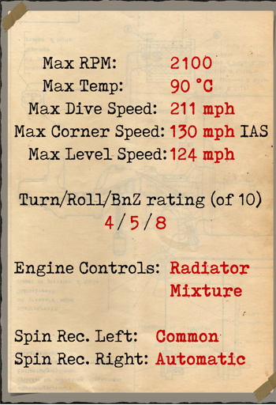
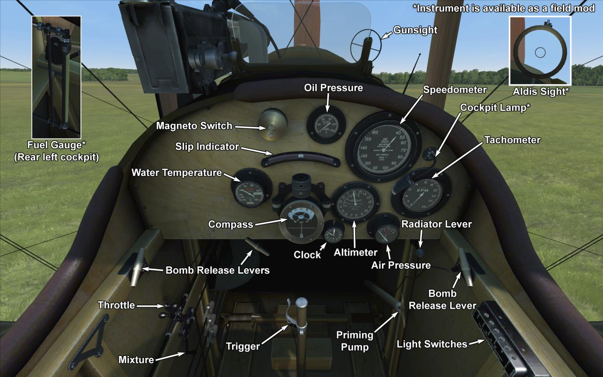

# Airco D.H.4  

<table><tbody><tr><td style="text-align: center"></td><td style="text-align: center"></tr><tr><td style="text-align: center" colspan="2"></td></tr></tbody></table>  

&这是一款由 BHP 发动机提供动力的双座轻型轰炸机，由 Geoffrey de Havilland 设计。 第一架原型机于 1916 年 8 月试飞，但由于 BHP 发动机被证明不符合战争需要，因此进行重新设计，DH.4 型被装备了劳斯莱斯 Eagle 发动机。 1916 年底，该机型获得了 50 架的订单（配备Eagle III 发动机（250 马力））。  
  
该型双翼飞机为全木制结构，飞机武器包括一挺向前发射的维克斯同步机枪和安装在领航员座位环架上的一两挺刘易斯机枪。 它可以在机翼或中央位置的外部机架上携带多达 460 磅的炸弹。  
  
由于劳斯莱斯发动机短缺，量产型飞机还配备了 BHP (230hp)、RAF3A (200hp)、Siddeley Puma (230hp) 和 （260hp Fiat），但没有一种引擎可以与装备劳斯莱斯引擎的DH.4相匹配。 1917 年 3 月，第一架前线服役的 DH.4 交付给第 55 中队； 这是第一个完全配备这种类型的 RFC 中队。 到1917年底，共有6个中队装备了DH.4。 它也被 RNAS 中队用于海军行动和侦察和及反潜用途。  
  
飞行员报告称该机型飞行舒适且易于操作。因为该机型的速度和机动性良好所以该机型深受机组人员喜爱（机组人员注意到的唯一“缺陷”是位于飞行员和领航员驾驶舱之间的油箱，这导致了他们之间的通信问题）。 由于该机型性能较为优秀，所以该机型经常在没有战斗机掩护的情况下使用，因为它的速度和良好的高空性能使其生存能力极佳。 它主要用作轻型轰炸机，也可以携带用于炮兵观察任务的无线电设备和用于照片侦察任务的相机设备。  
  
该机型由英国的 Airco、FW Berwick and Co、Glendower Aircraft Company、Palladium Autocars、Vulcan Motor and Engineering 和 Westland Aircraft Works 生产。战争结束时，英国总共为 RFC 和 RNAS 建造了 1,449 架飞机。  
  
  
发动机： V-type 12 cyl. Rolls Royce Eagle VII  
功率：275 hp (320hp at 1800 RPM)  
  
尺寸:  
高度：3100 mm  
长度：9200 mm  
翼展：12916 mm  
机翼面积：40 m²  
  
重量:  
空载重量：1088 kg  
燃油容量： 249 L  
滑油容量: 27.3 L  
不挂炸弹起飞： 1588 kg  
  
速度（IAS），不挂炸弹：   
海平面——200 km/h  
1000——189 km/h  
2000——178 km/h  
3000——166 km/h  
4000——154 km/h  
5000——140 km/h  
  
爬升率，燃油装载，无炸弹：  
1000 m—— 3min 23s  
2000 m—— 7min 7s  
3000 m——11min 47s  
4000 m——17min 52s  
5000 m——27min  
  
实用升限：6800 m  
  
1000m高度的续航时间:3 h.  
  
武器:  
前射: 1 x 维克斯（Vickers）Mk.I 7.69mm，500发每弹鼓  
尾部上方位置：1 x 刘易斯（Lewis）7.69mm，8个弹鼓每个97发  
  
炸弹装载种类：  
12 x 20lb (109 kg)  
8 x 20lb + 2 x 112lb (175 kg)  
4 x 112lb (203.4 kg)  
2 x 112lb (101.7 kg)  
2 x 230lb (208.8 kg)  
共计208.8 kg  
  
参考  
1) Air Board Data Charts, 1917.  
2) Notes on the prediction and analysis of airplane performance, reports and memoranda no.474, may 1918, tables no. 10 and 11.  
3) Windsock Datafile Special - Airco DH.4 Vol.1, by J.M. Bruce.  
4) Rolls Royce engine charts, 1917.  
5) WWI Aeroplanes data, by J.M. Bruce.  
6) Various NACA reports.  

## 修改  
### 阿尔迪斯（Alidas）瞄准具  

阿尔迪斯（Alidas）折射型直筒瞄准具  
增加质量：2 kg  

### 库珀（Cooper）/H.E.R.L. /H.E.R.F.C. 炸弹  

最多12 x 11 kg（24 lb）通用炸弹  
增加质量：167 kg  
弹药质量：131 kg  
挂架质量：36 kg  
投弹前预期速度损失：7 km/h  
投弹后预期速度损失：3 km/h  
  
最多4 x 51 kg（112 lb）H.E.R.L. 通用炸弹  
增加质量：227 kg  
弹药质量：204 kg  
挂架质量：24 kg  
投弹前预期速度损失：8 km/h  
投弹后预期速度损失：4 km/h  
  
最多2 x 104 kg（230 lb）H.E.R.F.C. 通用炸弹  
增加质量：224 kg  
弹药质量：208 kg  
挂架质量：16 kg  
投弹前预期速度损失：5 km/h  
投弹后预期速度损失：3 km/h  
  
### 驾驶舱照明  

用于夜间飞行的驾驶舱照明灯  
增加质量：1 kg  
  
### 油量表  

指针式油量表（0-30 gal）  
增加质量：1 kg  

### 相机  

可拍摄航空照片的相机  
增加质量：10 kg  

### 无线电  

无线电发射机  
增加质量：10 kg  
  
### 机翼上加装两挺刘易斯机枪  

机翼上额外加装两挺刘易斯机枪。  
弹药：194发7.69mm弹药（2个弹鼓，每个97发）  
弹丸重量：11 g  
膛口速度：745 m/s  
射速：550 rpm  
枪炮重量：15 kg（无弹鼓）  
基座重量：6 kg  
弹药重量：10 kg  
总重：31 kg  
预期速度损失：5 km/h  
  
### 双刘易斯（Lewis）机枪炮塔  

双刘易斯（Lewis）机枪的斯卡夫（Scarff）旋转炮塔  
弹药：776发7.69mm弹药（8个弹鼓，每个97发）  
弹丸重量：11 g  
膛口速度：745 m/s  
射速：550 rpm  
枪炮重量：15 kg（无弹鼓）  
基座重量：12 kg  
弹药重量：32 kg  
总重：59 kg  
预期速度损失：2 km/h  
  
### 加装两挺前射维克斯机枪  

加装两挺前射维克斯机枪。  
Ammo: 1000 of 7.69mm rounds (500 rounds for each gun)  
弹丸重量：11 g  
膛口速度：745 m/s  
射速：750 rpm  
枪炮重量：13 kg（无弹鼓）  
基座重量：4 kg  
弹药重量：21 kg  
总重：38 kg  
