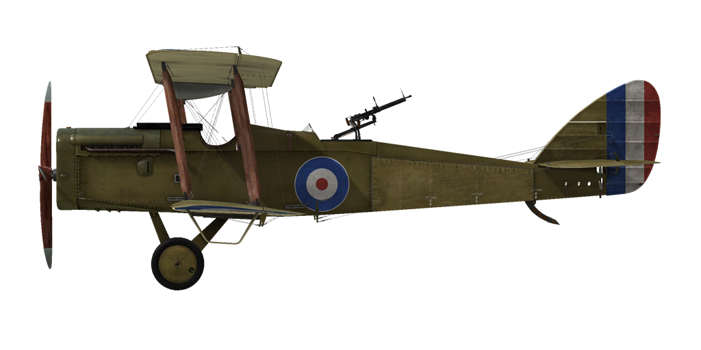

# Airco D.H.4

## Descripción

El D.H.4 fue diseñado por Geoffrey de Havilland para ser un bombardero ligero biplaza propulsado por un motor BHP. El primer prototipo voló en agosto de 1916, pero se comprobó que el motor BHP no era fiable,  requiriendo un importante rediseño para ser adaptado al motor Rolls Royce Eagle. El primer pedido de 50 aviones equipados con el motor Eagle III (250 CV) fue realizado al final de 1916.

Este biplano, construido en su práctica totalidad con madera y con un motor tractor, a diferencia de sus antecesores, de impulsión, equipa una ametralladora sincronizada Vickers de disparo frontal y una o dos ametralladoras Lewis montadas sobre un afuste articulado anular, más conocido como «anillo Scarff», en el puesto del observador. Podía cargar hasta 460 lb en bombas en dos anclajes bajo las alas y otros dos en la panza.

Debido a la escasez de motores Rolls Royce, el D.H.4 también fue equipado con motores BHP (230 CV), RAF3A (200 CV), Siddeley Puma (230 CV) y FIAT (260 CV), aunque ninguno de estos aviones podía igualar a los propulsados por motor el Rolls Royce. El primer D.H.4 destinado al servicio en el frente fue entregado al escuadrón n.º 55 en marzo de 1917; fue el primer escuadrón del RFC completamente equipado con unidades de este modelo. A finales de 1917, un total de 6 escuadrones estaban equipados con aviones D.H.4. También fue empleado por escuadrones del RNAS en operaciones navales de reconocimiento y uso anti-submarinos.

Agradable de volar y fácil de manejar, sus tripulantes lo apreciaban por su velocidad y maniobrabilidad (el único «fallo» observado por sus tripulantes era que el depósito de combustible, situado entre las cabinas del piloto y el observador, causaba problemas de comunicación entre los dos miembros de la tripulación). Debido a sus características, fue utilizado a menudo sin protección de cazas, puesto que su velocidad y buen rendimiento en altitud le permitían sobrevivir. Generalmente empleado como bombardero ligero diurno, podía llevar también equipo de radio para tareas de ayuda a la dirección de la artillería y una cámara para misiones de foto-reconocimiento.

Fue fabricado por Airco, F.W. Berwick & Co, Glendower Aircraft Company, Palladium Autocars, Vulcan Motor and Engineering, y Westland Aircraft Works en el Reino Unido. Se construyeron un total de 1449 aviones en el Reino Unido para el RFC y RNAS hasta el final de la guerra.

Motor:
Rolls Royce Eagle VII de 12 cilindros en V, 275 CV (320 CV a 1800 rpm)

Dimensiones:
Altura: 3100 mm
Longitud: 9200 mm
Envergadura alar: 12916 mm
Superficie de ala: 40 m²

Peso:
Vacío: 1088 kg
Al despegue sin bombas: 1588 kg
Capacidad de combustible: 249 l
Capacidad de aceite: 27,3 l

Velocidad (IAS), sin bombas:
Nivel del mar - 200 km/h
1000 - 189 km/h
2000 - 178 km/h
3000 - 166 km/h
4000 - 154 km/h
5000 - 140 km/h

Tasa de ascenso, depósito combustible lleno, sin bombas:
1000 m -  3 min 23 s
2000 m -  7 min 7 s
3000 m - 11 min 47 s
4000 m - 17 min 52 s
5000 m - 27 min

Techo de servicio: 6800 m

Autonomía: 3 h

Armamento:
Disparo frontal: 1 Vickers Mk.I de 7,69 mm, 500 balas por arma
Artillero de cola: 1 Lewis de 7,69 mm, 8 tambores con 97 balas cada uno

Variaciones en la carga de bombas:
12 bombas de 20 lb (109 kg)
8 bombas de 20 lb + 2 de 112 lb (175 kg)
4 bombas de 112 lb (203,4 kg)
2 bombas de 112 lb (101,7 kg)
2 bombas de 230 lb (208,8 kg)
Peso máximo en bombas: 208,8 kg

Referencias:
1) Air Board Data Charts, 1917.
2) Notes on the prediction and analysis of airplane performance, reports and memoranda no.474, mayo de 1918, tablas 10 y 11.
3) Windsock Datafile Special - Airco DH.4 Vol.1, por J.M. Bruce.
4) Rolls Royce engine charts, 1917.
5) WWI Aeroplanes data, by J.M. Bruce.
6) Various NACA reports.

## Modificaciones


### Aldis

Colimador reflectante Aldis
Peso adicional: 2 kg


### Bombas Cooper / H.E.R.L. / H.E.R.F.C.

Hasta 12 bombas de propósito general de 24 lb (11 kg) Cooper
Peso adicional: 167 kg
Peso de munición: 131 kg
Peso de los soportes: 36 kg
Pérdida de velocidad estimada antes de soltar: 7 km/h
Pérdida de velocidad estimada tras soltar: 3 km/h

Hasta 4 bombas de propósito general de 112 lb (51 kg) H.E.R.L.
Peso adicional: 227 kg
Peso de munición: 204 kg
Peso de los soportes: 24 kg
Pérdida de velocidad estimada antes de soltar: 8 km/h
Pérdida de velocidad estimada tras soltar: 4 km/h

Hasta 2 bombas de propósito general de 230 lb (104 kg) H.E.R.F.C.
Peso adicional: 224 kg
Peso de munición: 208 kg
Peso de los soportes: 16 kg
Pérdida de velocidad estimada antes de soltar: 5 km/h
Pérdida de velocidad estimada tras soltar: 3 km/h

### Luz de cabina

Lámpara para iluminar la cabina en las salidas nocturnas
Peso adicional: 1 kg


### Indicador nivel de combustible

Indicador analógico del nivel de combustible (0-30 Galones)
Peso adicional: 1 kg


### Cámara de fotos

Cámara para tomar fotografías aéreas
Peso adicional: 10 kg


### Radio

Radiotransmisor
Peso adicional: 10 kg

### Doble Lewis sobre ala superior

Dos ametralladoras Lewis sincronizadas adicionales de posición fija montadas sobre el ala superior.
Munición: 194 balas de 7,69 mm (2 tambores con 97 balas cada uno)
Peso del proyectil: 11 g
Velocidad de salida: 745 m/s
Tasa de disparo: 550 bpm
Peso de las armas: 15 kg (sin cargador)
Peso de los soportes: 6 kg
Peso de la munición: 10 kg
Peso total: 31 kg
Pérdida de velocidad estimada: 5 km/h

### Doble Lewis en artillero

Dos ametralladoras Lewis sincronizadas sobre anillo Scarff en la posición del artillero.
Munición: 776 balas de 7,69 mm (8 tambores con 97 balas cada uno)
Peso del proyectil: 11 g
Velocidad de salida: 745 m/s
Tasa de disparo: 550 bpm
Peso de las armas: 15 kg (sin cargador)
Peso de los soportes: 12 kg
Peso de la munición: 32 kg
Peso total: 59 kg
Pérdida de velocidad estimada: 2 km/h

### Doble Vickers frontal

Dos ametralladoras Vickers de posición fija apuntando hacia delante.
Munición: 1000 balas de 7,69 mm (500 balas por arma)
Peso del proyectil: 11 g
Velocidad de salida: 745 m/s
Tasa de disparo: 750 bpm
Peso de las armas: 13 kg (sin cargador)
Peso de los soportes: 4 kg
Peso de la munición: 21 kg
Peso total: 38 kg