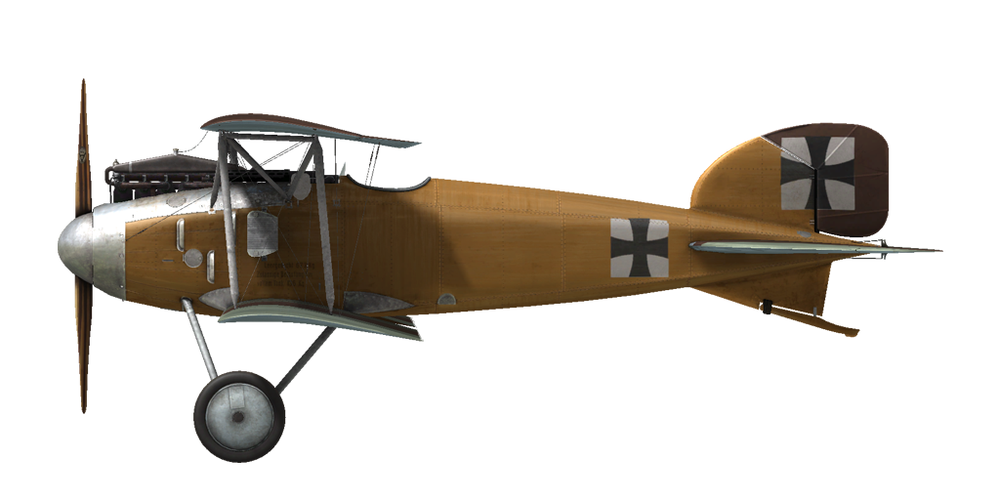

# Albatros D.II

## 描述

First in the pantheon of the legendary Albatros fighter planes, the D.II became a symbol and icon of the fighter plane in the Great War. Under the guidance of engineer Robert Thelen, the plane incorporated new features in design and development. While retaining the clean aerodynamic shape of the D.I model’s fuselage, new central N-shaped struts were added to the wings. The upper wing was moved closer to the fuselage, and early models of the aircraft were fitted with Windhoff box-type radiators on both sides of the fuselage.
The Albatros Werke, Ostdeutsche Albatros Werke, and Luft-Verkehrs-Gesellschaft mbH factories manufactured the aircraft. In all, 768 Albatros D.IIs were produced.
In August 1916, the first detachment of Albatros D.I and D. II fighters arrived at the front. Starting with these two models of aircraft, two Spandau machine guns became standard equipment for all German fighters. In the hands of experienced pilots, who were already battle hardened and experienced in aerobatics, the D.II made for huge gains in air superiority. The rapid mass production of Albatros fighter planes allowed Germany to maintain air superiority all the way through April 1917. "Bloody April" has become synonymous with the great losses of British aircraft in 1917.
The Albatros D. II was also employed against balloons and for providing cover for twin-seat bombers and scouts. Its pilots noted the good power of the twin machine guns, good forward and upward visibility, responsive handling, high speed and impressive rate of climb. The fighter participated in battles all along the Western Front.

发动机：直列六缸的梅赛德斯（Mercedes）D. III 160 HP

尺寸
高度：2640 mm
长度：7400 mm
翼展：8500 mm
机翼面积：24.9 m²

重量
空载重量：673 kg
最大起飞重量：898 kg
燃油容量： 85 L
滑油容量: 10 L

最大空速(指示空速)
海平面 — 164 km/h
1000 m — 156 km/h
2000 m — 148 km/h
3000 m — 139 km/h
4000 m — 129 km/h

爬升率
1000 m —  4 min  2 s.
2000 m —  9 min 14 s.
3000 m — 15 min 51 s.
4000 m — 25 min 22 s.

实用升限5200 m

1000 m高度的续航时间
标称动力（战斗）— 1 h 20 min
最低消耗（巡航）— 2 h 50 min

前射武器: 2 x LMG 08/15 史宾道（Spandau）7.92mm，500发每弹鼓

参考
1) Albatros D.II, Windsock Datafile 11.
2) Albatros D.I/D.II, Windsock Datafile 100.
3) Albatros Fighters, Windsock Datafile Special.
4) Albatros Aces of WWI by Norman Franks, Osprey №32.
5) Albatros fighters in action by John F Connors.
6) Albatros D.II, Flugzeugprofile №38.

## 修改
### 阿尔迪斯（Aldis）瞄准具（战利品）

阿尔迪斯（Aldis）折射型直筒瞄准具
增加质量：2 kg

### 高空高度计

德意志帝国（D.R.P.）高度表（0-8000m）

### 20mm Becker Cannon

20mm Becker Automatic Cannon
弹药：60发20mm弹药（4个弹匣，每个15发）
弹药类型：HE/AP（高爆和穿甲弹）
射速：300 rpm
弹丸重量：120/130 g
膛口速度：450/490 m/s
枪炮重量：30 kg
基座重量：10 kg
弹药重量：25 kg
总重：65 kg
预期速度损失：6 km/h

### 时钟

机械时钟
增加质量：1 kg

### 驾驶舱照明

用于夜间飞行的驾驶舱照明灯
增加质量：1 kg

### 射击瞄准具

带有前后准心的附加瞄准具
增加质量：1 kg

### 风速仪

威廉·莫雷尔(Wilhelm Morell)风速仪(45-250 km/h)
增加质量：1 kg

### 温度计

A·施莱格米尔奇(A.Schlegelmilch)发动机冷却液温度指示器(0-100℃)
增加质量：1 kg
