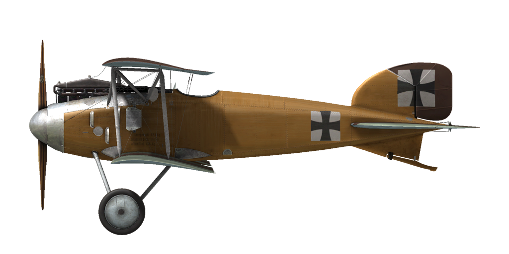

# Albatros D.II  

<table><tbody><tr><td style="text-align: center"></td><td style="text-align: center"></td></tr><tr><td style="text-align: center" colspan="2"></td></tr></tbody></table>  

## Описание  

Первенец в легендарной плеяде истребителей Albatros, чье имя станет символом и синонимом истребителя Великой Войны. Самолёт стал следующим шагом в развитии конструкции под руководством инженера Роберта Телена (Robert Thelen). К существующим на Albatros D.I чистым аэродинамическим формам фюзеляжа, новая модель получила центральные стойки N-образной формы. Верхнее крыло было перемещено ближе к фюзеляжу, на уровень глаз пилота. Ранняя модификация самолёта оснащалась коробчатыми радиаторами Windhoff, крепившиеся по бокам фюзеляжа.  
Самолёт выпускался на фабриках Albatros Werke, Ostdeutsche Albatros Werke, Luft-Verkehrs-Gesellschaft mbH. Всего было выпущено 768 экземпляров Albatros D.II.  
В августе 1916 года первые партии истребителей Albatros D.I и D.II поступают на полевые аэродромы. Два пулемёта Spandau становятся стандартным вооружением для всех последующих германских истребителей. Самолёт попадает в руки опытных пилотов, которые объединив свой опыт воздушных боев с пилотажными качествами, стали завоевывать превосходство в воздухе. Массовый выпуск истребителей Albatros способствовал превосходству германской авиации, обозначившемуся к апрелю 1917 года. «Кровавый апрель» стал синонимом больших потерь британской авиации в 1917 году.  
Albatros D. II применялся для уничтожения самолётов и аэростатов противника. Также на нем выполнялись задачи по прикрытию двухместных бомбардировщиков и разведчиков. Пилоты отмечали мощность вооружения, прекрасный обзор вперед и вверх, легкость в управлении, высокую скорость и скороподъемность. Истребитель принимал участие в боях на Западном фронте.  
  
Двигатель рядный 6-цилиндровый Mercedes D.III 160 л.с.  
  
Размеры  
Высота: 2640 мм  
Длина: 7400 мм  
Размах крыла: 8500 мм  
Площадь крыла:  24,9 кв.м.  
  
Вес  
Пустой: 673 кг  
Взлётный: 898 кг  
Объем топлива: 85 л  
Объем масла: 10 л  
  
Максимальная скорость (приборная)  
у земли — 164 км/ч  
1000 м — 156 км/ч  
2000 м — 148 км/ч  
3000 м — 139 км/ч  
4000 м — 129 км/ч  
  
Скороподъемность  
1000 м —  4 мин.  2 сек.  
2000 м —  9 мин. 14 сек.  
3000 м — 15 мин. 51 сек.  
4000 м — 25 мин. 22 сек.  
  
Практический потолок 5200 м  
  
Продолжительность полёта на 1000 м  
номинальная мощьность (боевой режим) — 1 ч. 20 мин.  
минимальный расход (крейсерский режим) — 2 ч. 50 мин.  
  
Курсовое вооружение: 2 x LMG 08/15 Spandau 7.92mm, по 500 патронов на ствол  
  
Использованные источники  
1) Albatros D.II, Windsock Datafile 11.  
2) Albatros D.I/D.II, Windsock Datafile 100.  
3) Albatros Fighters, Windsock Datafile Special.  
4) Albatros Aces of WWI by Norman Franks, Osprey №32.  
5) Albatros fighters in action by John F Connors.  
6) Albatros D.II, Flugzeugprofile №38.  

## Модификации  
### Коллиматорный прицел  

Коллиматорный прицел Aldis (трофейный) рефракторного типа  
Дополнительная масса: 2 кг  
  
### Высотомер  

Высотомер больших высот D.R.P (0-8000 м)  
  
### 20мм пушка Becker  

20мм автоматическая пушка Becker  
Боезапас: 60 снарядов 20мм (4 магазина по 15 снарядов в каждом)  
Тип боеприпасов: ОФ/БР (бронебойные и осколочно-фугасные)  
Скорострельность: 300 выстр/мин  
Масса снаряда: 120/130 г  
Дульная скорость: 450/490 м/с  
Масса оружия: 30 кг  
Масса станины: 10 кг  
Масса боезапаса: 25 кг  
Общая масса: 65 кг  
Примерная потеря скорости: 6 км/ч  
  
### Часы  

Механические часы  
Дополнительная масса: 1 кг  
  
### Освещение кабины  

Лампа ночного освещения кабины самолёта  
Дополнительная масса: 1 кг  
  
### Прицел  

Дополнительный прицел стандартной конструкции с мушкой и целиком  
Дополнительная масса: 1 кг  
  
### Анемометр  

Анемометр Wilhelm Morell (45-250 км/ч)  
Дополнительная масса: 1 кг  
  
### Термометр  

Указатель температуры охлаждающей жидкости двигателя A.Schlegelmilch (0-100 °C)  
Дополнительная масса: 1 кг  
