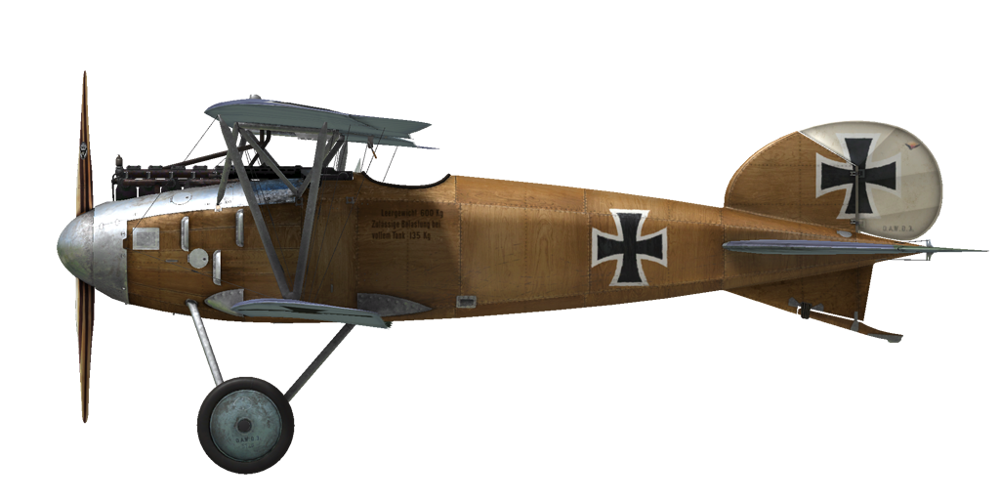

# Albatros D.III

## 描述

Having investigated the construction of captured Nieuport fighter aircraft, German engineers designed the lower wing of their new plane to be narrower and shorter than the upper one. The wing tips were swept in an effort to eliminate wing vibration. Among other remarkable design solutions, the following can be mentioned: the aileron control rods were drawn through the lower wing, the radiator was moved from the side of the fuselage to the middle of the upper wing, and the wings were now supported by V-shaped struts. Weight reduction was one of the primary tasks for this particular aircraft.

Test flights began in late August or early September 1916 and in December the plane was first delivered to fighter squadrons. Several months of combat action revealed that the plane had a tendency to lose its lower wing in a steep dive or in a sharp turn. Water from the radiator, which was fitted on the upper wing, would spill onto the machine guns, thus making firing impossible. The radiator was relocated to the right side of the pilot in order to correct this problem. From June 1917, engineers began using Daimler’s new cellular radiator, which helped to solve problems with the engine overheating.

The plane was manufactured by Albatros Werke and Ostdeutsche Albatros Werke. The high production rate of the Albatros D.III (1346 built in total) resulted in numerical superiority for German aviation in April 1917.

The Albatros D.III was employed against both enemy balloons and aircraft and used as an escort for bombers and scout planes. Pilots noted the excellent view from the cockpit, good controllability, and high speed and climb rate. The flight characteristics of the plane improved once the new Mercedes D. IIIa engine was mounted, which allowed the plane to remain in frontline service through the autumn of 1918. These machines took part in battles on the Western and the Palestinian Fronts.

发动机：直列六缸的梅赛德斯（Mercedes）D. IIIa 180 HP

尺寸
高度：2900 mm
长度：7330 mm
翼展：9000 mm
机翼面积：20.54 m²

重量
空载重量： 660 kg
最大起飞重量： 885 kg
燃油容量： 110 L
滑油容量: 8 L

最大空速(指示空速)
海平面 — 175 km/h
1000 m — 167 km/h
2000 m — 158 km/h
3000 m — 149 km/h
4000 m — 139 km/h
5000 m — 126 km/h

爬升率
1000 m —  3 min. 24 s.
2000 m —  7 min. 42 s.
3000 m — 13 min. 10 s.
4000 m — 20 min. 51 s.
5000 m — 34 min. 17 s.

实用升限 5800 m

1000 m高度的续航时间:
nominal power (combat) - 1 h. 30 min.
minimal consumption (cruise) - 3 h. 10 min.

前射武器: 2 x LMG 08/15 史宾道（Spandau）7.92mm，500发每弹鼓

参考
1) Albatros D.III,  Windsock Datafile Special.
2) Profile Publications, The Albatros D III.
3) Albatros D.III, Windsock Datafile 1.
4) Albatros Aces of World War I by Norman Franks, Osprey №32.
5) Albatros fighters in action by John F Connors.
6) Albatros fighters, Windsock Datafile Special.

## 修改
### 阿尔迪斯（Aldis）瞄准具（战利品）

阿尔迪斯（Aldis）折射型直筒瞄准具
增加质量：2 kg

### 弹药计数器

威廉·莫雷尔(Wilhelm Morell)双机枪数字子弹计数器
增加质量：1 kg

### 高空高度计

德意志帝国（D.R.P.）高度表（0-8000m）

### 时钟

机械时钟
增加质量：1 kg

### 驾驶舱照明

用于夜间飞行的驾驶舱照明灯
增加质量：1 kg

### 射击瞄准具

带有前后准心的附加瞄准具
增加质量：1 kg

### 刘易斯（Lewis）翼上机枪

安装在驾驶舱里可移动的附加刘易斯（Lewis）机枪
弹药：291发7.69mm弹药（3个弹鼓，每个97发）
前方位置：8°
上方位置：45°
弹丸重量：11 g
膛口速度：745 m/s
射速：550 rpm
枪炮重量：7 kg （无弹鼓）
基座重量：4 kg
弹药重量：12 kg
总重：23 kg
预期速度损失：2-6 km/h

### 风速仪

威廉·莫雷尔(Wilhelm Morell)风速仪(45-250 km/h)
增加质量：1 kg

### 温度计

A·施莱格米尔奇(A.Schlegelmilch)发动机冷却液温度指示器(0-100℃)
增加质量：1 kg
