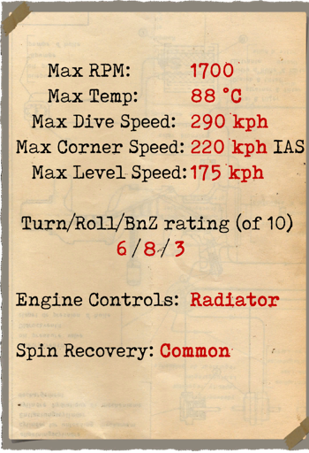
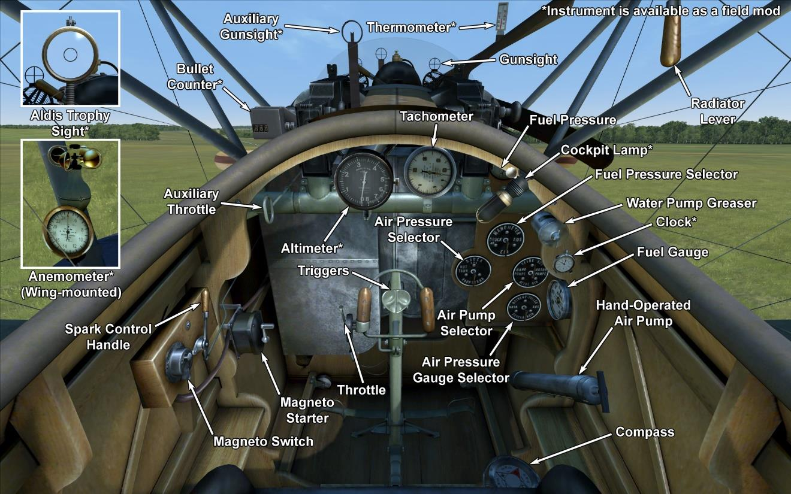

# Albatros D.III  

<table><tbody><tr><td style="text-align: center"></td><td style="text-align: center"></tr><tr><td style="text-align: center" colspan="2"></td></tr></tbody></table>  

Having investigated the construction of captured Nieuport fighter aircraft, German engineers designed the lower wing of their new plane to be narrower and shorter than the upper one. The wing tips were swept in an effort to eliminate wing vibration. Among other remarkable design solutions, the following can be mentioned: the aileron control rods were drawn through the lower wing, the radiator was moved from the side of the fuselage to the middle of the upper wing, and the wings were now supported by V-shaped struts. Weight reduction was one of the primary tasks for this particular aircraft.  
  
Test flights began in late August or early September 1916 and in December the plane was first delivered to fighter squadrons. Several months of combat action revealed that the plane had a tendency to lose its lower wing in a steep dive or in a sharp turn. Water from the radiator, which was fitted on the upper wing, would spill onto the machine guns, thus making firing impossible. The radiator was relocated to the right side of the pilot in order to correct this problem. From June 1917, engineers began using Daimler’s new cellular radiator, which helped to solve problems with the engine overheating.  
  
The plane was manufactured by Albatros Werke and Ostdeutsche Albatros Werke. The high production rate of the Albatros D.III (1346 built in total) resulted in numerical superiority for German aviation in April 1917.  
  
The Albatros D.III was employed against both enemy balloons and aircraft and used as an escort for bombers and scout planes. Pilots noted the excellent view from the cockpit, good controllability, and high speed and climb rate. The flight characteristics of the plane improved once the new Mercedes D. IIIa engine was mounted, which allowed the plane to remain in frontline service through the autumn of 1918. These machines took part in battles on the Western and the Palestinian Fronts.  
  
  
Engine 6—cyl. inline Mercedes D. IIIa 180 HP  
  
Dimensions  
Height: 2900 mm  
Length: 7330 mm  
Wing span: 9000 mm  
Wing surface:  20.54 sq.m  
  
Weight  
Empty: 660 kg  
Takeoff: 885 kg  
Fuel capacity: 110 l  
Oil capacity: 8 l  
  
Maximum airspeed (IAS)  
sea level — 175 km/h  
1000 m — 167 km/h  
2000 m — 158 km/h  
3000 m — 149 km/h  
4000 m — 139 km/h  
5000 m — 126 km/h  
  
Climb rate  
1000 m —  3 min. 24 sec.  
2000 m —  7 min. 42 sec.  
3000 m — 13 min. 10 sec.  
4000 m — 20 min. 51 sec.  
5000 m — 34 min. 17 sec.  
  
Service ceiling 5800 m  
  
Endurance at 1000 m:  
nominal power (combat) - 1 h. 30 min.  
minimal consumption (cruise) - 3 h. 10 min.  
  
Forward firing armament: 2 x LMG 08/15 Spandau 7.92mm, 500 rounds per barrel  
  
References  
1) Albatros D.III,  Windsock Datafile Special.  
2) Profile Publications, The Albatros D III.  
3) Albatros D.III, Windsock Datafile 1.  
4) Albatros Aces of World War I by Norman Franks, Osprey №32.  
5) Albatros fighters in action by John F Connors.  
6) Albatros fighters, Windsock Datafile Special.  

## Modifications  
### Aldis (Trophy)  

Aldis Refractor-type Collimator Sight  
Additional mass: 2 kg  

### Bullet counters  

Wilhelm Morell digital bullet counter for left machine gun  
Additional mass: 0.5 kg  

### High Altimeter  

D.R.P Altimeter (0-8000 m)  

### Clock  

Mechanical Clock  
Additional mass: 1 kg  

### Cockpit light  

Cockpit illumination lamp for night sorties  
Additional mass: 1 kg  

### Gunsight  

Additional sight with front sight and rear sight mountings  
Additional mass: 1 kg  
  
### Lewis Overwing  

Cockpit mounted additional Lewis machinegun with changeable position.  
Ammo: 291 of 7.69mm rounds (3 drums with 97 rounds in each)  
Forward position: 8°  
Upward position: 45°  
Projectile weight: 11 g  
Muzzle velocity: 745 m/s  
Rate of fire: 550 rpm  
Gun weight: 7 kg (w/o ammo drum)  
Mount weight: 4 kg  
Ammo weight: 12 kg  
Total weight: 23 kg  
Estimated speed loss: 2-6 km/h  

### Anemometer  

Wilhelm Morell Anemometer (45-250 km/h)  
Additional mass: 1 kg  
  
### Thermometer  

A.Schlegelmilch engine coolant temperature indicator (0-100 °C)  
Additional mass: 1 kg  
