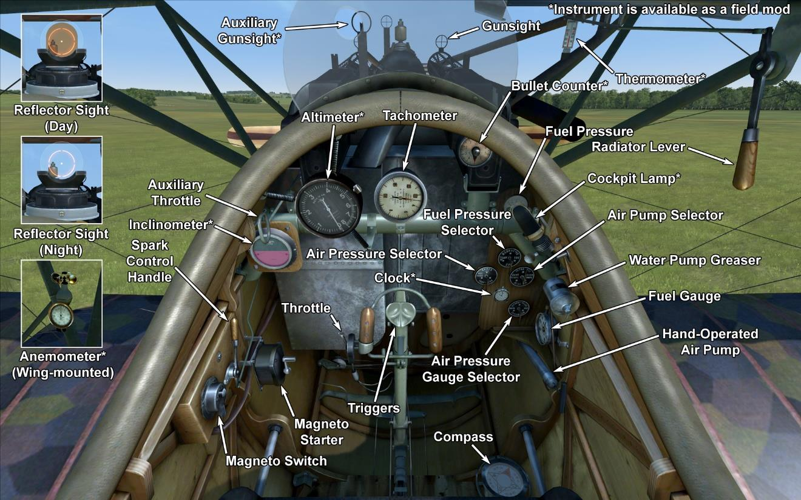

# Albatros D.Va  

<table><tbody><tr><td style="text-align: center"></td><td style="text-align: center"></tr><tr><td style="text-align: center" colspan="2"></td></tr></tbody></table>  

Les ingénieurs d\Albatros Werke avaient la tâche de construire un avion de chasse rapide et maniable. Le précédent, l\Albatros D. III avaient des défauta à l\aille basse qui conduit à l\échec de l\aile en plongée. N\étant pas en mesure de trouver la raison de ces échecs, les ingénieurs ont déplacé les fils de contrôle des ailerons de l\aile inférieur vers le haut.  
  
Au printemps 1917 des vols d\essai ont été effectués. Les différences extérieures de l\Albatros D.V étaient une queue de plus grande surface.  
Les escadrons de chasse ont reçu l\Albatros D.V en mai 1917. Plusieurs mois de tests en combat ont montré que le problème de l\aile inférieure n\est pas résolu. Ensuite les ingénieurs ont déplacé le fil de contrôle d\aileron à laile inférieure et renforcé le point de fixation en forme de V au longeron à la jambe inférieure. Un moteur Mercedes D.IIIa plus puissant a été installé. Avec ces changements, l\avion a reçu le nom d\Albatros D.Va.  
  
L\avion a été fabriqué à l\Albatros Werke et aux usines Ostdeutsche Albatros Werke.IL y\a eu un total de 1650 Albatros DV dt DVa de construits.  
  
L\Albatros a été utilisé contre les avions ennemis. Les pilotes ont notés une bonne visibilité, bonne maintenance, suffisament de vitesse, et un bon taux de montée. Le nouveau moteur a amélioré les caractéristiques de vol à haute altitude. Il n\y avait pas encore de confiance dans les attaches de l\aile inférieure, les pilotes refusaient d\effectuer des plongées abruptes en combat. En dépit de cela, ces pilotes vétérans continuèrenet d\accroître leur lutte pour le score. L\utilisation de grands groupes de sorties sont devenues plus fréquentes. L\avion a participé à des combats sur les fronts occidentaux et palestiniens.  
  
  
Moteur 6—cyl. liquid—cooled inline Mercedes D. IIIa 180 HP  
  
Tailles  
Hauteur: 2700 mm  
Longueur: 7330 mm  
Envergure: 9050 mm  
Surface d\aile:  21,2 sq.m  
  
Poids  
Poids à vide: 680 kg  
Poids au décollage: 915 kg  
Capacité des réservoirs carburant: 103 l  
Capacité du réservoir d\huile: 9 l  
  
Vitesse maximale (IAS)  
au Sol — 169 km/h  
1000 m — 161 km/h  
2000 m — 153 km/h  
3000 m — 145 km/h  
4000 m — 136 km/h  
5000 m — 125 km/h  
6000 m — 109 km/h  
  
Tauc de montée  
1000 m —  3 min. 58 sec.  
2000 m —  8 min. 33 sec.  
3000 m — 14 min. 22 sec.  
4000 m — 22 min. 29 sec.  
5000 m — 36 min. 41 sec.  
  
Plafond opérationnel 5400 m  
  
Autonomie à 1000 m  
puissance nominale (en combat) — 1 h. 40 min.  
consommation minimale (en croisière) — 4 h. 20 min.  
  
Armes fixées: 2 x LMG 08/15 Spandau 7.92mm, 500 cartouches par baril  
  
References  
1) Albatros D.V  Windsock Datafile 3  
2) Profile Publications The Albatros D V. Number 9  
3) NASM Albatros D Va  
4) Albatros Aces of World War I by Norman Franks, Osprey №32  
5) Albatros fighters in action by John F Connors.  

## Modifications  
### Compteur de balles  

Compteur à aiguille Wilhelm Morell pour 2 mitrailleuses  
Masse supplémentaire : 1 kg  
  
### Inclinometre  

Inclinometre à liquide D.R.G.M (indique inclinaison au sol et glissade sur aile en vol)  
Masse supplémentaire : 1 kg  
  
### Lumière de cockpit  

Lumière à ampoule pour les sorties de nuit  
Masse supplémentaire : 1 kg  
  
### Viseur  

Viseur additionnel avec guidon de mire avant-arrière  
Masse supplémentaire : 1 kg  
  
### Lewis Overwing  

Cockpit mounted additional Lewis machinegun with changeable position.  
Ammo: 291 of 7.69mm rounds (3 drums with 97 rounds in each)  
Forward position: 8°  
Upward position: 45°  
Projectile weight: 11 g  
Muzzle velocity: 745 m/s  
Rate of fire: 550 rpm  
Gun weight: 7 kg (w/o ammo drum)  
Mount weight: 4 kg  
Ammo weight: 12 kg  
Total weight: 23 kg  
Estimated speed loss: 2-6 km/h  
  
### Collimateur de jour  

Collimateur à réfraction Oigee (gradateur de jour installé)  
Masse supplémentaire : 2 kg  
  
### Collimateur de nuit  

Collimateur à réfraction Oigee (gradateur de jour désinstallé)  
Masse supplémentaire : 2 kg  
  
### Anémomètre, Altimètre, Les montres  

Wilhelm Morell Anémomètre (45-250 km/h)  
Masse supplémentaire : 1 kg  
  
D.R.P Altimètre (0-8000 m)  
Masse supplémentaire : 1 kg  

### Thermometre  

Indicateur de température de liquide de refroidissement A.Schlegelmilch (0-100 °C)  
Masse supplémentaire : 1 kg  
