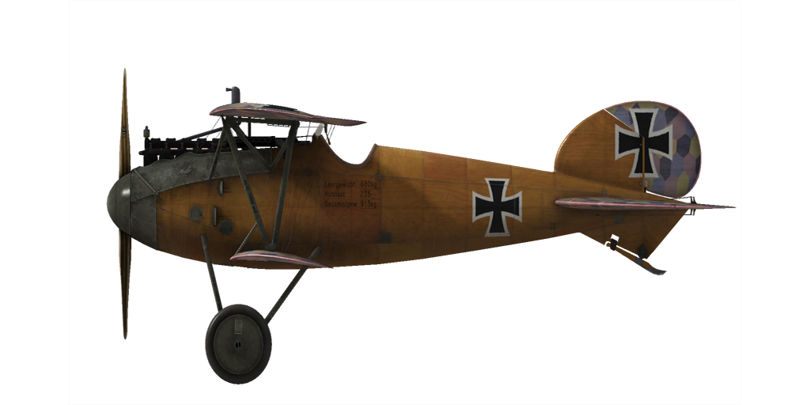

# Albatros D.Va

## Opis

The engineers of Albatros Werke faced the task of building a fast and manoeuvrable fighter plane. The older Albatros D.III had a lower wing defect that led to failure of the wing in a steep dive. Having been unable to find out the reason of these failures, the engineers moved the aileron control wires from the lower wing to the top wing.
Test flights were carried out in the spring of 1917. Externally, the Albatros D.V differed from earlier Albatros models: it had a larger tail fin surface; the top wing was lowered closer to the fuselage; the radiator was set to starboard of the centreline, and the fuselage was more rounded.

Fighter squadrons began receiving the Albatros D.V in May 1917. Several months of combat experience showed that the lower wing problem had not been solved. In response, the engineers moved the aileron control wires back to the lower wing and strengthened the attachment point of the V-shaped strut to the lower spar with an additional strut. In addition, the more powerful Mercedes D.IIIa engine was installed. The updated plane was called the Albatros D.Va.

Total of 1650 Albatros D.V and D.Va aircraft were built at Albatros Werke and Ostdeutsche Albatros Werke.

The Albatros D.Va was mainly used against enemy aircraft. Pilots noted great visibility, handling, sufficient speed and rate of climb. The new engine improved the aircraft’s high altitude flight characteristics. However, pilots had no confidence in the new low wing attachment and refused to perform steep dives in combat. Despite this, veteran pilots continued to increase their combat scores, and employing large numbers of the aircraft in sorties became more frequent. This model participated in battles on the Western Front and the Palestinian Front.

Engine 6—cyl. inline Mercedes D. IIIa 180 HP

Dimensions
Height: 2700 mm
Length: 7330 mm
Wing span: 9050 mm
Wing surface:  21.2 sq.m

Weight
Empty: 680 kg
Takeoff: 915 kg
Fuel capacity: 103 l
Oil capacity: 9 l

Maximum airspeed (IAS)
sea level — 169 km/h
1000 m — 161 km/h
2000 m — 153 km/h
3000 m — 145 km/h
4000 m — 136 km/h
5000 m — 125 km/h
6000 m — 109 km/h

Climb rate
1000 m —  3 min. 58 sec.
2000 m —  8 min. 33 sec.
3000 m — 14 min. 22 sec.
4000 m — 22 min. 29 sec.
5000 m — 36 min. 41 sec.

Service ceiling 5400 m

Endurance at 1000 m
nominal power (combat) — 1 h. 40 min.
minimal consumption (cruise) — 4 h. 20 min.

Forward firing armament: 2 x LMG 08/15 Spandau 7.92mm, 500 rounds per barrel

References
1) Albatros D.V  Windsock Datafile 3
2) Profile Publications The Albatros D V. Number 9
3) NASM Albatros D Va
4) Albatros Aces of World War I by Norman Franks, Osprey №32
5) Albatros fighters in action by John F Connors.

## Modyfikacje


### Bullet Counters

Wilhelm Morell needle scale Bullet Counters for 2 machine guns
Additional mass: 1 kg


### Inclinometer

D.R.G.M liquid Inclinometer (indicates bank while on ground and sideslip while in flight)
Additional mass: 1 kg


### Cockpit light

Cockpit illumination lamp for night sorties
Additional mass: 1 kg


### Gunsight

Additional sight with front sight and rear sight mountings
Additional mass: 1 kg


### Lewis Overwing

Cockpit mounted additional Lewis machinegun with changeable position.
Ammo: 291 of 7.69mm rounds (3 drums with 97 rounds in each)
Forward position: 8°
Upward position: 45°
Projectile weight: 11 g
Muzzle velocity: 745 m/s
Rate of fire: 550 rpm
Gun weight: 7 kg (w/o ammo drum)
Mount weight: 4 kg
Ammo weight: 12 kg
Total weight: 23 kg
Estimated speed loss: 2-6 km/h

### Collimator Day

Oigee Reflector-type Collimator sight (daytime dimmer installed)
Additional mass: 2 kg


### Collimator Night

Oigee Reflector-type Collimator sight (daytime dimmer removed)
Additional mass: 2 kg


### Anemometer, Altimeter, Clock

Wilhelm Morell Anemometer (45-250 km/h)
Additional mass: 1 kg

D.R.P Altimeter (0-8000 m)
Additional mass: 1 kg

### Thermometer

A.Schlegelmilch engine coolant temperature indicator (0-100 °C)
Additional mass: 1 kg
