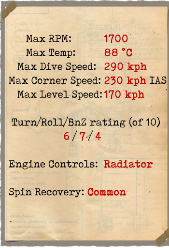
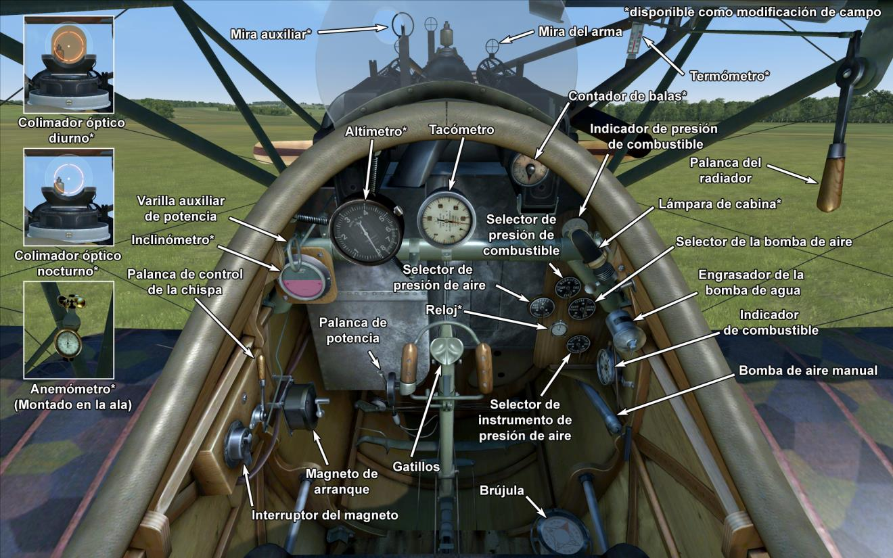

# Albatros D.Va  

<table><tbody><tr><td style="text-align: center"></td><td style="text-align: center"></tr><tr><td style="text-align: center" colspan="2"></td></tr></tbody></table>  

Los ingenieros de Albatros Werke aceptaron el desafío de construir un caza rápido y maniobrable. El viejo Albatros D.III tenía un defecto en el ala inferior que provocaba su rotura durante un picado fuerte. Incapaces de encontrar la razón de este problema , los ingenieros trasladaron los cables de control de los alerones desde el ala inferior al ala superior.  
  
Los vuelos de prueba se llevaron a cabo en el primavera de 1917. Externamente, el Albatros D.V difería de los anteriores Albatros en lo siguiente: tenía una mayor superficie de cola; el ala superior se acercó más al fuselaje; el radiador fue colocado a estribor de la línea central y el fuselaje era más redondeado.  
  
Los escuadrones de caza comenzaron a recibir el Albatros D.V en Mayo de 1917. Varios meses de experiencia en combate mostraron que el problema del ala inferior no se había resuelto. Los ingenieros desplazaron de nuevo los cables de control del alerón al ala inferior, y se reforzó el punto de anclaje de la estructura en forma de V al larguero inferior mediante un refuerzo adicional. Además, se instaló un motor Mercedes D.IIIa más potente. Con estos cambios, el avión pasó a denominarse Albatros D.Va.  
  
La aeronave fue construida en la Albatros Werke y Ostdeutsche Albatros Werke. Se construyeron un total de 1650 Albatros D.V y D.Va. Ambos modelos fueron desplegados en el frente Occidental y el frente palestino.  
  
Los pilotos destacaron su gran visibilidad, manejo, suficiente velocidad y tasa de ascenso. El nuevo motor mejoró las características de vuelo a gran altitud. Sin embargo, los pilotos no tenían confianza en el nuevo anclaje del ala inferior, y evitaban realizar picados profundos en combate. A pesar de esto, pilotos veteranos continuaron incrementando su número de victorias y el empleo de un gran número de estos aviones en misiones se fue haciendo más frecuente.  
  
  
Motor:  
Mercedes D. IIIa 6 cilindros en línea, 180 CV  
  
Dimensiones:  
Altura: 2700 mm  
Longitud: 7330 mm  
Envergadura alar: 9050 mm  
Superficie de ala: 21,2 m²  
  
Peso:  
Vacío: 680 kg  
Al despegue: 915 kg  
Capacidad de combustible: 103 l  
Capacidad de aceite: 9 l  
  
Velocidad máxima (IAS):  
Nivel del mar — 169 km/h  
1000 m — 161 km/h  
2000 m — 153 km/h  
3000 m — 145 km/h  
4000 m — 136 km/h  
5000 m — 125 km/h  
6000 m — 109 km/h  
  
Tasa de ascenso:  
1000 m —  3 min 58 s  
2000 m —  8 min 33 s  
3000 m — 14 min 22 s  
4000 m — 22 min 29 s  
5000 m — 36 min 41 s  
  
Techo de servicio: 5400 m  
  
Autonomía a 1000 m:  
Potencia nominal (combate) - 1 h 40 min  
Consumo mínimo (crucero) - 4 h 20 min  
  
Armamento:  
Disparo frontal: 2 LMG 08/15 Spandau de 7,92 mm, 500 balas por arma  
  
Referencias:  
1) Albatros D.V  Windsock Datafile 3  
2) Profile Publications The Albatros D V. Número 9  
3) NASM Albatros D Va  
4) Albatros Aces of World War I, por Norman Franks, Osprey n.º 32  
5) Albatros fighters in action, por John F Connors.  

## Modificaciones  
### Contador de Balas  

Contador de balas dial de Wilhelm Morell para 2 ametralladoras  
Peso adicional: 1 kg  
  
### Inclinómetro  

Inclinómetro Líquido D.R.G.M (indica inclinación en tierra y deslizamiento lateral en vuelo)  
Peso adicional: 1 kg  
  
### Luz de cabina  

Lámpara para iluminar la cabina en las salidas nocturnas  
Peso adicional: 1 kg  
  
### Punto de mira  

Mira adicional con monturas de mira frontal y mira trasera  
Peso adicional: 1 kg  
  
### Lewis sobre ala superior  

Ametralladora Lewis adicional de posición variable montada sobre el ala superior.  
Munición: 291 balas de 7,69 mm (3 cargadores con 97 balas cada uno)  
Posición hacia delante: 8º  
Posición hacia arriba: 45º  
Peso del proyectil: 11 g  
Velocidad de salida: 745 m/s  
Tasa de disparo: 550 bpm  
Peso del arma: 7 kg (sin cargador)  
Peso del soporte: 4 kg  
Peso de la munición: 12 kg  
Peso total: 23 kg  
Pérdida de velocidad estimada: 2-6 km/h  
  
### Colimador diurno  

Colimador reflectante Oigee (con filtro solar instalado)  
Peso adicional: 2 kg  
  
### Colimador nocturno  

Colimador reflectante Oigee (sin filtro solar instalado)  
Peso adicional: 2 kg  
  
### Anemómetro, Altímetro, Relojes  

Anemómetro Wilhelm Morell (45-250 km/h)  
Peso adicional: 1 kg  
  
Altímetro de D.R.P (0-8000 m)  
Peso adicional: 1 kg  

### Termómetro  

Indicador de temperatura del refrigerante del motor de A.Schlegelmilch (0-100 °C)  
Peso adicional: 1 kg  
