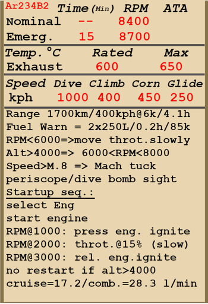

# Ar 234 B-2  

<table><tbody><tr><td style="text-align: center"></td><td style="text-align: center"></td></tr></td></tr></tbody></table>  

飞行构型的失速表速：177~248 km/h  
起降构型的失速表速：159~223 km/h  
俯冲真空速限制：850 km/h  
最大过载：6 G  
飞行构型失速迎角：13.9°  
着陆构型失速迎角：10.8°  
  
8400 RPM，标称功率时于海平面最大真空速：628 km/h  
8400 RPM，标称功率时于6000 m最大真空速：658 km/h  
8400 RPM，标称功率时于9000 m最大真空速：630 km/h  
  
8700 RPM，最大功率时于海平面最大真空速：703 km/h  
8700 RPM，最大功率时于6000 m最大真空速：728 km/h  
8700 RPM，最大功率时于9000 m最大真空速：702 km/h  
  
实用升限：10500 m  
海平面爬升率：14.3 m/s  
6000m时爬升率：6.3 m/s  
9000m时爬升率：3.0 m/s  
  
海平面时最佳盘旋时间：于400 km/h表速时27 s。  
6000 m时最佳盘旋时间：于380 km/h表速时52 s。  
  
6000 m时续航：于400 km/h表速时4h 15min。  
  
起飞速度：178~262 km/h  
进近速度：270 km/h  
着陆速度：155~210 km/h  
着陆迎角：4.0°  
  
注1：所提供的数据适用于国际标准大气（ISA）。  
注2：飞行性能范围基于可能的飞机质量范围。  
注3：极速、爬升率和盘旋时间基于特定的飞机重量。  
注4：爬升率和盘旋时间基于最大（8700 RPM）动力。  
  
发动机：2 x 涡轮喷气式  
型号：Jumo-004 B1  
最大功率（8700 RPM）海平面：810 kg(f)  
最大功率（8700 RPM）6000m：530 kg(f)  
最大功率（8700 RPM）9000m：385 kg(f)  
  
发动机模式：  
标称（无时间限制）：8400 RPM  
最大（不超过15min）：8700 RPM  
  
标称排气温度：600 °C  
最大排气温度：650 °C  
  
排气压力：0.2-0.38 kg/cm²  
  
燃油喷注压力：40-80 kg/cm²  
  
发动机额定出口油压：2 kg/cm²  
发动机最大出口油压：5 kg/cm²  
  
空重：5029 kg  
最低重量（无弹药、10%燃油）：5329 kg  
满油重量（无弹药）：8210 kg  
最大起飞重量：10470 kg  
目标重量（1 x SC 500, 45% 燃油）：6950 kg  
燃油载荷：3181 kg/3790 L  
最大有效载荷：5441 kg  
  
前射武器：  
2 x 20mm "MG 151/20"机炮，每门备弹200发，射速700发/分，安装于机腹（改装）  
  
炸弹：  
最多2 x 249kg 通用炸弹"SC 250"  
最多3 x500kg 通用炸弹"SC 500"  
1090kg 通用炸弹"SC 1000"  
  
长度：12.6 m  
翼展：14.4 m  
机翼面积：26.4 m²  
  
首次投入战斗：1944年12月24日  
  
操作特性：  
- 该机型安装两具Jumo-004 B1型涡轮喷气发动机。该发动机会自动调节以保持在油门设定的涡轮转子转速上。  
- 该发动机配备了仅在超过 6000 RPM 时才会接合的自动燃油调节器。  
因此，在低转速时的燃油调节效果不佳，并且粗暴的增加油门可能导致供油过多，这会导致过热并可能引起发动机起火。  
- 在高海拔地区粗暴减小油门有可能导致过度贫油，这会引起发动机熄火。根据不同的海拔高度，涡轮机的转速不应低于 6000-8000 RPM 以下。  
- 在高海拔地区（高于 4000 m）时无法重启发动机。  
- 该机为减少操作负载，配备有水平安定面和方向舵配平。  
- 当以 0.8 M 或更高的速度俯冲时容易受到马赫褶皱的影响。  
- 着陆襟翼和襟副翼由液压致动器驱动。可放下至起飞位（25°襟翼）和着陆位（45°襟翼）。  
- 刹车也是由液压驱动的，通过踩下对应的踏板来接合。前起落架可自由转向。  
- 该机有两个燃油箱（1800 L 和 1990 L），并配备有油位指示器和紧急燃油指示灯（剩余燃油少于 250 L 时会亮起）。  
- 该机配备有三通道自动驾驶系统（主开关 右ALT + A，每个通道可通过 右ALT + Y/P/R 单独打开）。飞行员可以调整航向（右ALT + 左（方向键）/右（方向键））和俯仰（右ALT + 上（方向键）/下（方向键））稳定角。  
- 该机默认配备有 BZA 1 B俯冲轰炸瞄准具（左Shift + V）。飞行员应在俯冲开始前设定目标的海拔高度（右Shift + 句号/分号）和风速（右Alt + 句号/分号）。该俯冲轰炸用的潜望式瞄准具也可改变其角度为飞行员提供后向视野（右Alt + F）。配备有可开关标线灯（左Alt + M）。同时也可改装水平轰炸用的Lotfe 7K投弹瞄准具。  
- 该机有着显著的起飞滑跑距离（尤其是在最大起飞重量下）。为在更短的时间内起飞可安装带降落伞的火箭助推器。火箭助推器的工作时长为 35 s（按R启动）。在起飞后应将其抛离（左Shift + D）。  
- 为提供更短的降落距离，可安装额外的漏斗形减速伞。可释放漏斗形减速伞（左ALT + D）的最大速度为 215 km/h。在成功着陆并制动后应当抛离漏斗形减速伞（左Alt + D）  
- 为了能够执行侦察任务，该机可配备摄影设备。拍摄侦察区前需打开摄影舱门（按键与炸弹舱门相同）。  
  
Basic data and recommended positions of the aircraft controls:  
1. Starting the engine:  
	- recommended position of the mixture control lever: auto mixture control  
	- recommended position of the throttle lever: 15%  
  
2. Recommended mixture control lever positions for various flight modes: auto mixture control  
  
3. Recommended positions of the radiator/cowl flap control handle for various flight modes: no radiators/cowl flaps  
  
4. Approximate fuel consumption at altitude:  
	- Cruise engine mode: 17.2 l/min  
	- Combat engine mode: 28.3 l/min  

## 修改  
### SC 1000  

1090kg 通用炸弹SC 1000  
增加重量：1090 kg  
弹药重量：1090 kg  
投弹前预计速度降低：31 km/h  
投弹后预计速度降低：0 km/h  

### 投弹瞄准具  

安装用于水平轰炸的Lotfe 7K投弹瞄准具  
增加重量：33 kg  
预计速度降低：3 km/h  

### 漏斗形减速伞  

安装减速伞以减少着陆滑行距离  
增加重量：32 kg  
预计速度降低：2 km/h  

### 2 x 20mm MG 151/20机炮吊舱  

在机腹安装MG 151/20 20mm机炮吊舱，每门备弹200发  
增加质量：245 kg  
弹药质量：98 kg  
枪炮质量：147 kg  
预期速度损失：22 km/h  

### 助推器  

安装可抛离的瓦尔特HWK 109-500助推器（辅助起飞）  
工作时长：35 s  
增加推力：1000 kgf  
增加重量：560 kg  
抛离前预计速度降低：51 km/h  
抛离后预计速度降低：0 km/h  

### 后视镜  

为提供对发动机的目视，安装于驾驶舱侧面的可伸缩后视镜  
增加质量：1 kg  
预计速度降低（后视镜展开）：5 km/h  
预计速度降低（后视镜收回）：0 km/h  

### Navigational system  

  
增加质量：0 kg  
预期速度损失：0 km/h  

### 摄影设备  

用于侦察任务的摄影设备  
增加质量：204 kg  
预计速度降低（摄影舱门打开）：9 km/h  
预计速度降低（摄影舱门关闭）：1 km/h  
