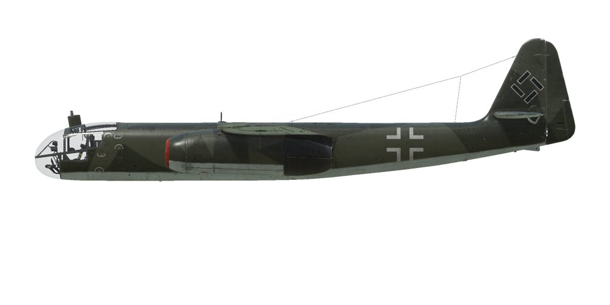

# Ar 234 B-2  
  
  
  
## Descripción  
  
Velocidad indicada de pérdida en configuración de vuelo: 177..248 km/h  
Velocidad indicada de pérdida en configuración de despegue/aterrizaje: 159..223 km/h  
Velocidad de picado límite: 850 km/h  
Carga de rotura máxima (en fuerzas <i>g</i>): 6 <i>g</i>  
Ángulo de ataque crítico en configuración de vuelo: 13,9°  
Ángulo de ataque crítico en configuración de aterrizaje: 10,8°  
  
Velocidad respecto al suelo al nivel del mar, modo motor - Continuo, 8400 rpm: 628 km/h  
Velocidad máxima respecto al suelo a 6000 m, modo motor - Continuo, 8400 rpm: 658 km/h  
Velocidad máxima respecto al suelo a 9000 m, modo motor - Continuo, 8400 rpm: 630 km/h  
  
Velocidad respecto al suelo al nivel del mar, modo motor - Máximo, 8700 rpm: 703 km/h  
Velocidad máxima respecto al suelo a 6000 m, modo motor - Máximo, 8700 rpm: 728 km/h  
Velocidad máxima respecto al suelo a 9000 m, modo motor - Máximo, 8700 rpm: 702 km/h  
  
Techo de servicio: 10500 m  
Tasa de ascenso al nivel del mar: 14,3 m/s  
Tasa de ascenso a 6000 m: 6,3 m/s  
Tasa de ascenso a 9000 m: 3,0 m/s  
  
Viraje de máximo rendimiento al nivel del mar: 27 s, a 400 km/h velocidad indicada (IAS).  
Viraje de máximo rendimiento a 6000 m: 52 s, a 380 km/h velocidad indicada (IAS).  
  
Autonomía de vuelo a 6000 m: 4 h 15 m, a 400 km/h velocidad indicada (IAS).  
  
Velocidad de despegue: 178..262 km/h  
Velocidad senda de planeo: 270 km/h  
Velocidad de aterrizaje: 155..210 km/h  
Ángulo de aterrizaje: 4,0°  
  
Nota 1: los datos están basados en la atmósfera estándar internacional (ISA).  
Nota 2: diferentes rendimientos de vuelo dados para los diferentes pesos posibles del avión.  
Note 3: maximum speeds, climb rates and turn times are given for  aircraft target mass.  
Nota 4: tasas de ascenso y tiempos de giro dados para la potencia en modo Máximo (8700 rpm).  
  
Motor: 2 turborreactores  
Modelo: Jumo-004 B1  
Potencia máxima en modo Máximo (8700 rpm) al nivel del mar: 810 kg(f)  
Potencia máxima en modo Máximo (8700 rpm) a 6000 m: 530 kg(f)  
Potencia máxima en modo Máximo (8700 rpm) a 9000 m: 385 kg(f)  
  
Modos de funcionamiento motor:  
Continuo (sin límite de tiempo): 8400 rpm  
Máximo (hasta 15 minutos): 8700 rpm  
  
Temperatura nominal en la salida del motor: 600 °C  
Temperatura máxima en la salida del motor: 650 °C  
  
Presión de salida: 0,2-0,38 kg/cm²  
  
Presión inyección de combustible: 40-80 kg/cm²  
  
Presión nominal del aceite en la salida del motor: 2 kg/cm²  
Presión máxima del aceite en la salida del motor: 5 kg/cm²  
  
Peso vacío: 5029 kg  
Peso mínimo (sin munición, 10% de combustible): 5329 kg  
Peso con los depósitos llenos (sin munición): 8210 kg  
Peso máximo al despegue: 10470 kg  
Peso estimado en objetivo (1 SC 500, 45% de combustible): 6950 kg  
Carga de combustible: 3181 kg / 3790 l  
Carga útil: 5441 kg  
  
Armamento delantero:  
2 cañones de 20 mm «MG 151/20», 200 balas cada uno, 700 balas por minuto, montados bajo el fuselaje (modificación)  
  
Bombas:  
Hasta 2 bombas de propósito general de 249 kg «SC 250»  
Hasta 3 bombas de propósito general de 500 kg «SC 500»  
1 bomba de propósito general de 1090 kg «SC 1000»  
  
Longitud: 12,6 m  
Envergadura alar: 14,4 m  
Superficie de ala: 26,4 m²  
  
Debut en combate: 24 de diciembre de 1944  
  
Características operativas:  
- El avión está equipado con dos turborreactores Jumo-004 B1. Se controlan mediante la palanca de potencia, que establece las rpm del rotor de la turbina.  
- El motor de reacción cuenta con un regulador de combustible automático que solo actúa a más de 6000 rpm. Por tanto, no existe una regulación de combustible automática a menores revoluciones, por lo que un aumento brusco de la potencia por debajo de las 6000 rpm provocará una entrada de combustible excesiva, provocando un sobrecalentamiento y un posible incendio del motor.  
- En altitudes elevadas es posible empobrecer demasiado la mezcla si se realiza una reducción brusca de la potencia, causando una mala combustión y el apagado del motor. Dependiendo de la altitud, la turbina nunca debería girar por debajo de las 6000-8000 rpm.  
- Solamente se permite volver a arrancar el motor en altitudes inferiores a 4000 m. Los intentos de arrancar el motor a mayores altitudes pueden fallar y provocar un sobrecalentamiento y un incendio en el motor.  
- El avión posee un estabilizador horizontal y ajuste del timón para reducir la carga en los controles.  
- El avión es susceptible a sufrir «Mach tuck» (actitud de morro bajo) al alcanzar la velocidad de 0,8 M o superior (alcanzable en un picado).  
- Los flaps se mueven gracias a un actuador hidraúlico y pueden extenderse hasta una posición de despegue (25°) o de aterrizaje (45°). Este actuador hidraúlico también sube o baja ligeramente los alerones acompañando a la posición de los flaps.  
- Los frenos del tren de aterrizaje también son hidraúlicos. Los frenos de las ruedas traseras se activan apretando el pedal correspondiente. La rueda delantera se orienta por sí sola.  
- Hay dos depósitos de combustible (1800 l y 1990 l) con sus correspondientes indicadores de nivel de combustible y luces de emergencia (se encienden cuando quedan menos de 250 l).  
- El avión está equipado con un sistema de piloto automático de tres canales (interruptor principal «Alt_dcha + A»; luego cada canal puede activarse individualmente con «Alt_Dcha + Y/P/R»). El piloto tiene la capacidad de ajustar el rumbo (control guiñada con «Alt_Dcha + Flecha Izquierda/Derecha») y los ángulos del estabilizador (control cabeceo con «Alt_dcha + Flecha Arriba/Abajo»).  
- El avión cuenta por defecto con una mira de bombardeo en picado BZA 1 B («Mayús_Izq + V» por defecto). El piloto debe fijar la altura del objetivo sobre el nivel del mar («Mayús_Dcha + Ñ/Punto») y la velocidad del viento («Alt_Dcha + Ñ/Punto») antes de iniciar el picado. La cabeza del periscopio de la mira de bombardeo en picado puede cambiar su orientación para proporcionar una visión trasera al piloto («Alt_dcha + F»). La iluminación de la retícula se puede apagar («Alt_dcha + M»). Además, se puede modificar el avión para equipar una mira de bombardo Lotfe 7K para realizar bombardeos a nivel.  
- El avión necesita un tiempo de carrera significativo para despegar (especialmente con su peso máximo al despegue). Para reducir el tiempo de carrera (y por tanto la distancia) para despegar, se pueden instalar unos cohetes de impulso como modificación. El tiempo medio de funcionamiento de estos propulsores adicionales es de 35 segundos («R» por defecto). Después de despegar con los cohetes de impulso, estos deben ser desechados («Mayús_Izq + D»).  
- Para permitir un carrera de aterrizaje más corta, se puede instalar un paracaídas de frenado como modificación. La velocidad máxima a la que se puede liberar el paracaídas de frenado («Alt_Izq + D») es de 215 km/h. Después de aterrizar y frenar con éxito, debe desecharse el paracaídas de frenado («Alt_Izq + D»).  
- Para poder llevar a cabo misiones de reconocimiento, el avión puede equiparse con un equipo fotográfico. Las puertas de la bahía del equipo fotográfico deben abrirse antes de tomar fotografías del área de reconocimiento (el control es el mismo que el de las puertas de la bahía de bombas).  
  
Datos básicos y configuraciones recomendadas de los controles del avión:  
1. Arranque del motor:  
	- palancas de control de la mezcla: (control de mezcla automático)  
	- palancas de potencia: 15%  
  
2. Posición de las palancas de control de mezcla según momento de vuelo: (control de mezcla automático)  
  
3. Posición de las aletas/persianas de carenado y/o radiador según momento de vuelo: (no dispone de aletas/persianas)  
  
4. Consumo aproximado de combustible en altitud:  
	- Modo motor - Crucero: 17,2 l/min  
	- Modo motor - Combate: 28,3 l/min  
  
## Modificaciones  
  
  
### SC 1000  
  
Bomba de propósito general de 1090 kg SC 1000  
Peso de munición: 1090 kg  
Pérdida de velocidad estimada antes de soltar: 31 km/h  
Pérdida de velocidad estimada tras soltar: 0 km/h  
  
### Mira de bombardeo  
  
Instalación de mira de bombardeo Lotfe 7K para realizar bombardeos a nivel  
Peso adicional: 33 kg  
Pérdida de velocidad estimada: 3 km/h  
  
### Paracaídas de frenado  
  
Instalación de un paracaídas de frenado para reducir el recorrido de la carrera en el aterrizaje  
Peso adicional: 32 kg  
Pérdida de velocidad estimada: 2 km/h  
  
### Cañones bajo fuselaje  
  
2 cañones de 20 mm MG 151/20 (200 balas cada uno) montados en carcasa exterior bajo el fuselaje  
Peso adicional: 245 kg  
Peso de munición: 98 kg  
Peso del armamento: 147 kg  
Pérdida de velocidad estimada: 22 km/h  
  
### Cohetes de impulso  
  
Cohetes de impulso desechables Starthilfe Walter HWK 109-500 para reducir la longitud (y el tiempo) de la carrera necesaria para despegar  
Tiempo de funcionamiento: 35 s  
Empuje adicional: 1000 kgf  
Peso adicional: 560 kg  
Pérdida de velocidad estimada antes de soltar: 51 km/h  
Pérdida de velocidad estimada tras soltar: 0 km/h  
  
### Espejos plegables  
  
Espejos plegables en ambos lados de la cabina para brindar control visual de los motores  
Peso adicional: 1 kg  
Pérdida de velocidad estimada (espejos desplegados): 5 km/h  
Pérdida de velocidad estimada (espejos plegados): 0 km/h  
  
### Sistema de navegación  
  
  
Peso adicional: 0 kg  
Pérdida de velocidad estimada: 0 km/h  
  
### Cámara fotográfica  
  
Cámara fotográfica para misiones de reconocimiento  
Peso adicional: 204 kg  
Pérdida de velocidad estimada (puertas de bahía de cámara de fotos abiertas): 9 km/h  
Pérdida de velocidad estimada (puertas de bahía de cámara de fotos cerradas): 1 km/h  