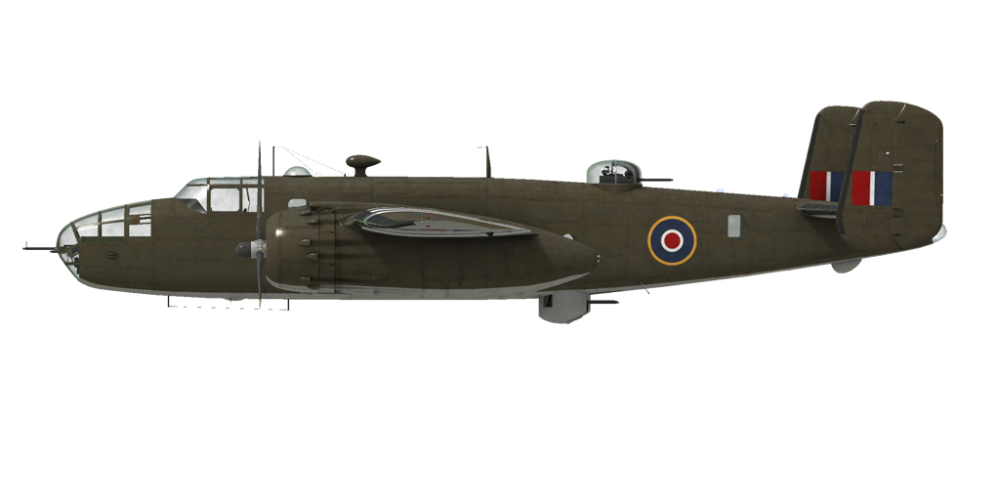

# B-25D

## 描述

飞行构型的失速指示空速：160~191 km/h (100~119 mph)
起降构型的失速指示空速：145~175 km/h (90~109 mph)

俯冲极速：544 km/h (340 mph)
最大过载：6.5 G
飞行构型失速迎角：18.3 °
着陆构型失速迎角：15.1 °

最大真空速，高度海平面，发动机模式——战斗：430 km/h (269 mph)
最大真空速，高度1400m，发动机模式——战斗：472 km/h (295 mph)
最大真空速，高度3900m，发动机模式——战斗：495 km/h (310 mph)

最大真空速，高度海平面，发动机模式——标称：419 km/h (262 mph)
最大真空速，高度2000m，发动机模式——标称：448 km/h (280 mph)
最大真空速，高度4750m，发动机模式——标称：461 km/h (288 mph)

实用升限：7450 m (24442 feet)
海平面爬升率：8.3 m/s (1575 feet/min)
3000m时最升率：6.3 m/s (1236 feet/min)
6000m时最升率：2.7 m/s (394 feet/min)

海平面最大性能盘旋时间：28.8 s，指示空速270 km/h。
3000m时最大性能盘旋时间：47.0 s，指示空速280 km/h.

3000m（9843 feet）时续航时间：4.6h，330 km/h 指示空速.发动机模式——巡航，1级增压器

起飞速度：165~180 km/h (105~115 mph)
进近速度：200~215 km/h (125~135 mph)
着陆速度：176~192 km/h (110~120 mph)
着陆迎角：4.5 °

注1：所提供的数据适用于国际标准大气（ISA）。
注2：飞行性能范围基于可能的飞机质量范围。
注3：极速、爬升率和盘旋时间基于装有8枚G.P.B. 500炸弹和58%25油量的飞机质量。
注4：爬升率和盘旋时间基于标称动力。

发动机：
型号：Wright R-2600-13
巡航模式下的最大功率，高度6700 feet：1140 HP
巡航模式下的最大功率，高度15000 feet：1027 HP
标称模式下的最大功率，高度6700 feet：1520 HP
标称模式下的最大功率，高度15000 feet：1370 HP
战斗模式下的最大功率，高度4500 feet：1725 HP
战斗模式下的最大功率，高度12000 feet：1470 HP
海平面起飞模式下的最大功率：1725 HP

发动机模式：
（1级和2级增压起的增压值已列出）
巡航（无时间限制）：2100 RPM，31.5/32.5 inch Hg，混合比“巡航贫油” 
标称（无时间限制）：2400 RPM，38.0/39.0 inch Hg，混合比“完全富油” 
战斗（5min限制）：2600 RPM，42.0/41.0 inch Hg，混合比“完全富油”  
起飞（不超过5min）：2600 RPM，44.0 inch Hg，混合比“完全富油”  

发动机滑油出油口额定油温：80~95 °C
发动机滑油出油口最高油温：105 °C
气缸头额定温度：140~235 °C
气缸头最高温度：260 °C

机械增压器换挡高度：3350 m (11000 feet)

空重：8379 kg
最小重量（无弹药、10%25燃油）：8829 kg
标准重量：11544 kg
最大起飞重量：15422 kg
燃油载荷：2618 kg/3688 L/974 gal）
有效载荷：7043 kg

前射武器：
12.7厘 m机枪 ANM2 .50，400发，850发/分，机头安装

防御武器：
头部：12.7厘 m机枪 ANM2 .50，400发，850发/分
顶部：2 x 12.7厘 m机枪 ANM2 .50，400发，850发/分
腹部：2 x 12.7厘 m机枪 ANM2 .50，400发，850发/分

炸弹：
最多8 x 500 lb 通用炸弹"500 lb."
最多4 x 1000 lb 通用炸弹"1000 lb. M.C."

长度：16.1 m
翼展：20.5 m
机翼面积：57.0 m²

首次投入战斗：1942年春

操作特性：
——发动机没有进气压力自动调节器。因此进气压力不只取决于油门位置，还有转速和高度。这需要额外检查进气压力以免导致发动机受损。
——发动机装有自动燃油混合比控制，如果混合比杆设置为完全富油（100%25）位置，其会保持最优混合比。要使用自动混合比贫油来降低飞行中油耗，需要设置混合比杆到巡航贫油（50%25）位置。要关闭发动机，混合比杆应设置为关断（0%25）位置。
——发动机转速有自动调节器，其根据调节器控制杆位置保持对应的需用转速。调节器自动控制螺旋桨桨距来保持需用转速。
——滑油散热器叶片和发动机出风口风门为手动控制。
——飞机的所有飞行操纵均有配平：俯仰、滚转和偏航。
——着陆襟翼由液压机构控制，可展开至0-45°之间的任意角度。
——飞机有独立的左右液压机轮刹车。要使用刹车，踩下方向舵脚蹬的上部。
——飞机装有上部编队灯。
——发动机为二级机械增压，需3350m（11000 feet）时高度时手动切换。
——前轮自由偏转，没有刹车，无法控制。
——在尾部安装有白色和红色的信号灯：当炸弹舱门打开时，白色灯会点亮；当炸弹被投放后，红色的灯会持续点亮五 s钟。
——飞机装有炸弹齐投控制器，允许齐投已选的炸弹或全弹齐投。控制器可设置单次齐投中炸弹投放的延迟。