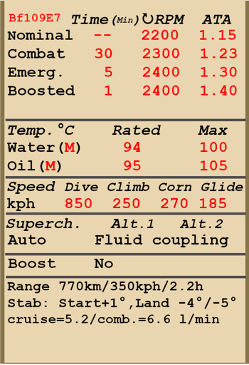

# Bf 109 E-7  

  
  

## Описание  

Приборная скорость сваливания в полётной конфигурации: 152..159 км/ч  
Приборная скорость сваливания в посадочной конфигурации: 147..146 км/ч  
Предельная скорость в пикировании: 850 км/ч  
Разрушающая перегрузка: 11 единиц  
Угол атаки сваливания, в полётной конфигурации: 20 °  
Угол атаки сваливания, в посадочной конфигурации: 16,6 °  
  
Максимальная истинная скорость у земли, режим двигателя - чрезвычайный: 477 км/ч  
Максимальная истинная скорость на высоте 2000 м, режим двигателя - чрезвычайный: 520 км/ч  
Максимальная истинная скорость на высоте 5000 м, режим двигателя - чрезвычайный: 564 км/ч  
  
Практический потолок: 10500 м  
Скороподъёмность у земли: 14 м/с  
Скороподъёмность на высоте 3000 м: 13,3 м/с  
Скороподъёмность на высоте 6000 м: 7 м/с  
  
Время виража предельного по тяге у земли: 20,5 с, на скорости 270 км/ч по прибору  
Время виража предельного по тяге на высоте 3000 м: 25,5 с, на скорости 270 км/ч по прибору  
  
Продолжительность полёта на высоте 3000 м: 2,2 ч, на скорости 350 км/ч по прибору  
  
Скорость взлётная: 140..170 км/ч  
Скорость на глиссаде: 180..190 км/ч  
Скорость посадочная: 130..140 км/ч  
Посадочный угол: 14,3 °  
  
Примечание 1: данные указаны для условий международной стандартной атмосферы.  
Примечание 2: диапазоны характеристик даны для допустимого диапазона масс самолёта.  
Примечание 3: максимальные скорости, скороподъемности и время виража даны для стандартной массы самолёта.  
Примечание 4: скороподъемность дана на боевом режиме работы двигателя, время виража - на форсированном.  
  
Двигатель:  
Модель: DB-601A  
Максимальная мощность на форсированном режиме у земли: 1100 л.с.  
Максимальная мощность на чрезвычайном режиме у земли: 990 л.с.  
Максимальная мощность на чрезвычайном режиме на высоте 4500 м: 1020 л.с.  
Максимальная мощность на боевом режиме у земли: 910 л.с.  
Максимальная мощность на боевом режиме на высоте 5000 м: 960 л.с.  
  
Режимы работы двигателя:  
Номинальный (время неограничено): 2200 об/мин, 1,15 атмосфер  
Боевой (до 30 минут): 2300 об/мин, 1,23 атмосфер  
Чрезвычайный (до 5 минут): 2400 об/мин, 1,3 атмосфер  
Форсированный (до 1 минуты): 2400 об/мин, 1,4 атмосфер  
  
Температура воды на выходе из двигателя номинальная: 94 °С  
Температура воды на выходе из двигателя предельная: 100 °С  
Температура масла на входе в двигатель номинальная: 30..75 °С  
Температура масла на входе в двигатель предельная: 80 °С  
Температура масла на выходе из двигателя номинальная: 95 °С  
Температура масла на выходе из двигателя предельная: 105 °С  
  
Высота переключения нагнетателя: гидромуфта   
  
Масса пустого самолёта: 2049 кг  
Минимальная масса (без БК, 10% топлива): 2340 кг  
Стандартная масса: 2614 кг  
Максимальная взлётная масса: 2893 кг  
Максимальный запас топлива: 304 кг / 400 л  
Максимальная полезная нагрузка: 844 кг  
  
Вооружение курсовое:  
2 x 20мм пушка "MG FF", 60 снарядов, 540 выстр/мин, крыльевая  
2 x 7,92мм пулемёт "MG 17", 1000 патронов, 1200 выстр/мин, синхронизированный  
  
Вооружение бомбовое:  
До 4 x 55 кг осколочно-фугасных авиабомб "SC 50"  
249 кг осколочно-фугасная авиабомба "SC 250"  
  
Длина: 8,8 м  
Размах крыла: 9,9 м  
Площадь крыла: 16,4 кв.м  
  
Начало участия в боевых действиях: август 1940  
  
Особенности эксплуатации:  
- Управление винтомоторной группой максимально автоматизировано: фактически для изменения тяги двигателя используется только РУД. Обороты винта, качество топливовоздушной смеси и передаточное число нагнетателя не требуют ручного управления в полёте.  
- Для уменьшения разворачивающего момента самолёта воздушным потоком от винта при рулении по земле следует переключаться в ручной режим управления шагом винта и устанавливать винт на минимальный шаг.  
- Водо- и маслорадиатор имеют ручное управление створками.  
- На самолёте нет триммеров. Регулировка планера осуществляется на земле специальными регулировочными отгибными пластинами на рулях.  
- Самолёт имеет управляемый вручную переставной стабилизатор. Его следует устанавливать на угол +1° перед взлётом и -4°...-5° перед посадкой. Также можно пользоваться им как триммером, уменьшая усилия на ручке управления в полёте. Перед глубоким пикированием на большой скорости стабилизатор следует устанавливать так, чтобы для удержания самолёта в пикировании приходилось немного отдавать ручку управления "от себя".  
- На самолёте установлены автоматические предкрылки. Они позволяют несколько увеличить критический угол атаки и сделать выход на режим сваливания более "мягким".  
- Самолёт имеет ручной механический привод уборки и выпуска закрылков, поэтому перед посадкой выпуск закрылков следует осуществлять заблаговременно. Угол выпуска закрылков можно контролировать по меткам на левом закрылке. Закрылки можно выпустить на любой угол до 42°.  
- Свободно-ориентируемое хвостовое колесо может быть застопорено в положении "по полёту" при помощи рычага в кабине лётчика. Колесо необходимо застопорить при продолжительном рулении по прямой, а также перед взлётом и посадкой.  
- Самолёт имеет раздельное управление гидравлическими тормозами левого и правого колёс шасси. Торможение каждого колеса осуществляется нажатием на верхнюю часть соответствующей педали.  
- Самолёт оснащён топливомером, который показывает общий остаток топлива. Также есть сигнальная лампа аварийного остатка топлива 80 литров.  
- Конструкция самолёта не позволяет осуществлять полёт с открытым фонарём кабины. Фонарь необходимо закрывать перед взлётом. Также есть система аварийного сброса фонаря (двумя частями) для покидания лётчиком самолёта в полёте.  
- Система управления бомбодержателем позволяет сбрасывать бомбы только по одной.  
- Прицел имеет сдвижной светофильтр.  
  
Основные данные и рекомендуемые положения органов управления самолётом:  
1. Запуск двигателя:  
	- рекомендуемое положение рукояти управления смесью: автоматическое управление смесью  
	- рекомендуемое положение рукояти управления маслорадиатором: открыт  
	- рекомендуемое положение рукояти управления водорадиатором: закрыт  
	- рекомендуемое положения рукояти управления шагом: автоматическое управление шагом  
	- рекомендуемое положение рычага управления двигателем: 10%  
	- перед рулением необходимо разблокировать колесо  
  
2. Рекомендуемые положения рукояти смеси при различных режимах полёта: автоматическое управление смесью   
  
3.1 Рекомендуемые положения рукояти управления маслорадиатором при различных режимах полёта:  
	- крейсерский полёт: открыто на 50%  
	- бой: открыто на 50%  
	- взлёт: открыто  
  
3.2 Рекомендуемые положения рукояти управления водорадиатором при различных режимах полёта:  
	- крейсерский полёт: открыто на 50%  
	- бой: открыто на 50%  
	- взлёт: открыто на 50%  
  
4. Ориентировочный расход топлива на различных режимах работы на высоте 2000 м:  
	- крейсерский режим работы двигателя: 5,2 л/мин  
	- боевой режим работы двигателя: 6,6 л/мин  

## Модификации  
### Дополнительные бронеплиты  

Дополнительная защита: бронеплиты на нижней поверхности самолёта  
Дополнительная масса: 89 кг  
Ориентировочная потеря скорости: 4 км/ч  
  
### Бронированное лобовое стекло  

Дополнительная защита пилота: накладка на лобовое стекло из прозрачного бронепакета  
Дополнительная масса: 20 кг  
Ориентировочная потеря скорости: 1 км/ч  
  
### Снятый бронезаголовник  

Снятый бронированный заголовник пилота для улучшения обзора из кабины  
Уменьшение массы: 8 кг  
Ориентировочный выигрыш в скорости: 0 км/ч  

### 1 x SC 250  

249 кг осколочно-фугасная авиабомба SC 250  
Дополнительная масса: 279 кг  
Масса вооружения: 249 кг  
Масса держателей: 30 кг  
Ориентировочная потеря скорости до сброса: 34 км/ч  
Ориентировочная потеря скорости после сброса: 11 км/ч  

### 4 x SC 50  

4 x 55 кг осколочно-фугасные авиабомбы SC 50  
Дополнительная масса: 260 кг  
Масса вооружения: 220 кг  
Масса держателей: 40 кг  
Ориентировочная потеря скорости до сброса: 53 км/ч  
Ориентировочная потеря скорости после сброса: 13 км/ч  
