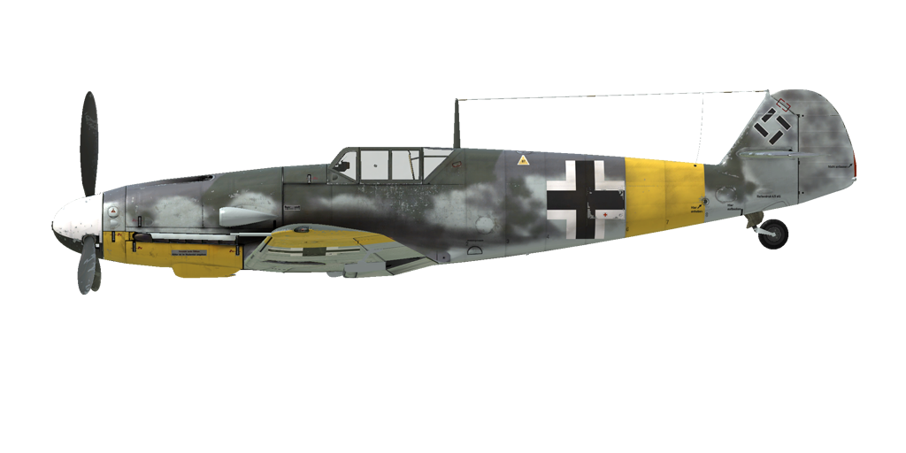

# Bf 109 G-4
  

  

  

  
## Beschreibung
  

  
Überziehgeschwindigkeit in Flugkonfiguration: 165..175 km/h
  
Überziehgeschwindigkeit in Landekonfiguration: 154..167 km/h
  
Höchstzulässige Geschwindigkeit im Sturzflug: 850 km/h
  
Bruchlastvielfache: 10.5 G
  
Kritischer Anstellwinkel in Flugkonfiguration: 19.8 °
  
Kritischer Anstellwinkel in Landekonfiguration: 17 °
  

  
Höchstgeschwindigkeit in Bodennähe, Notleistung: 540 km/h
  
Höchstgeschwindigkeit in Bodennähe, Kampfleistung: 517 km/h
  
Höchstgeschwindigkeit in 2000 m Höhe, Kampfleistung: 564 km/h
  
Höchstgeschwindigkeit in 7000 m Höhe, Kampfleistung: 640 km/h
  

  
Dienstgipfelhöhe: 11800 m
  
Steigleistung in Bodennähe: 20.1 m/s
  
Steigleistung in 3000 m Höhe: 18.9 m/s
  
Steigleistung in 6000 m Höhe: 15.4 m/s
  

  
Maximale Wendegeschwindigkeit in Bodennähe: 21.2 s (270 km/h IAS).
  
Maximale Wendegeschwindigkeit in 3000 m Höhe: 27.2 s (270 km/h IAS).
  

  
Reichweite in 5000 m: 2.4 h, bei 350 km/h IAS.
  

  
Startgeschwindigkeit: 155..180 km/h
  
Anfluggeschwindigkeit: 195..205 km/h
  
Landegeschwindigkeit: 150..155 km/h
  
Sinkflugpfad: 13.7 °
  

  
Anmerkung 1: Die Werte gelten für Normatmosphäre (ISA).
  
Anmerkung 2: Flugleistungen varrieren je nach Abfluggewicht.
  
Anmerkung 3: Höchstgeschwindigkeiten, Steigleistungen und Wendegeschwindigkeiten gelten für Standard-Fluggewicht.
  
Anmerkung 4: Steigraten und Wendegeschwindigkeiten gelten für Kampfleistung.
  

  
Triebwerk:
  
Baumuster: DB-605A
  
Notleistung in Bodennähe: 1480 PS
  
Notleistung in 5600 m Höhe: 1360 PS
  
Kampfleistung in Bodennähe: 1310 PS
  
Kampfleistung in 5800 m Höhe: 1250 PS
  

  
Leistungsstufen:
  
Nennleistung (unbegrenzt): 2300 U/min, 1.15 ata
  
Kampfleistung (bis zu 30 Minuten): 2600 U/min, 1.3 ata
  
Notleistung (bis zu 1 Minute): 2800 U/min, 1.42 ata
  

  
Kühlstoffaustrittstemperatur (normal): 100..102 °C
  
Kühlstoffaustrittstemperatur (höchstens): 115 °C
  
Schmierstoffeintrittstemperatur (normal): 70..80 °C
  
Schmierstoffeintrittstemperatur (höchstens): 85 °C
  

  
Laderumschalthöhe: Stufenlose hydraulische Kupplung 
  

  
Leergewicht: 2506 kg
  
Minimalgewicht (keine Munition, 10%25 Treibstoff): 2669 kg
  
Normalgewicht: 3014 kg
  
Höchstabfluggewicht: 3303 kg
  
Kraftstoffmenge: 304 kg / 400 l
  
Nutzlast: 797 kg
  

  
Starre Schusswaffenanlage:
  
20 mm MG 151/20, 200 Schuss, 700 Schuss pro Minute, montiert in Flugzeugnase
  
2 x 7.92 mm MG 17, 500 Schuss, 1200 Schuss pro Minute, gesteuert schießend
  
2 x 20 mm MG 151/20, 135 Schuss, 700 Schuss pro Minute, flügelmontiert (Rüstsatz)
  

  
Abwurfwaffen:
  
Bis zu 4 50 kg Mehrzweck-Sprengbomben SC 50
  
250 kg Mehrzweck-Sprengbombe SC 250
  

  
Länge: 8.94 m
  
Spannweite: 9.97 m
  
Flügelfläche: 16.1 m²
  

  
Erster Fronteinsatz: November 1942
  

  
Eigenschaften:
  
- Das Flugzeug besitzt eine größtenteils automatische Motorsteuerung, grundsätzlich muss nur der Schubhebel für die Regelung der Geschwindigkeit bedient werden. Es ist normalerweise nicht erforderlich, die Drehzahl, das Gemisch oder den Schaltladergang manuell zu bedienen.
  
- Zusätzlich zu der automatischen Regelung der Kühlklappen, gibt es manuelle Regelung, welche in bestimmten Situationen genutzt werden kann.
  
- Um ein durch den Propellerstrahl erzeugtes Schwingen während des Rollvorgangs zu reduzieren, sollte der Propeller-Anstellwinkel manuell auf die niedrigste Stellung reduziert werden.
  
- Das Flugzeug hat keine Vorrichtungen zur Trimmung während des Fluges. Das Flugzeug besitzt Trimmkannten, welche vor dem Flug von dem Bodenpersonal angepasst werden können.
  
- Das Flugzeug hat ein manuell verstellbares Höhenleitwerk. Es sollte vor dem Start auf +1° und vor der Landung auf -4°...-5° eingestellt werden. Es kann auch während des Fluges zur Trimmung des Flugzeugs verstellt werden. Vor einem längeren Sturzflug sollte das Leitwerk so eingestellt werden, dass der Pilot den Steuerknüppel nach vorne drücken muss, um das Flugzeug im Sturzflug zu halten.
  
- Das Flugzeug hat automatische Vorflügel. Diese fahren bei einem hohen Anstellwinkel selbständig aus und sorgen für ein weicheres Flugverhalten kurz vor dem Strömungsabriss.
  
- Das Flugzeug besitzt eine mechanische Bedienung der Landeklappen, deshalb ist es erforderlich, die Landeklappen lange vor der Landung auszufahren. Markierungen auf der linken Landeklappe zeigen an, wie weit die Landeklappen ausgefahren sind. Die Landeklappen können bis zu einem Winkel von 40° ausgefahren werden.
  
- Das Flugzeug hat eine manuelle Spornradverriegelung. Das Spornrad sollte bei längerem Geradeausrollen, sowie beim Abflug und bei der Landung verriegelt werden.
  
- Das Flugzeug hat links und rechts unabhängig gesteuerte hydraulische Bremsen. Um die Bremsen zu betätigen, muss der obere Teil der Ruderpedale nach vorne gedrückt werden.
  
- Das Flugzeug hat eine Tankanzeige, welche den gesamten Treibstoffstand anzeigt. Außerdem gibt es eine Reststandwarnlampe (80 Liter).
  
- Aufgrund der Bauart der Cockpithaube ist es nicht möglich, diese während des Fluges zu öffnen. Um eine Beschädigung zu vermeiden, sollte die Haube vor dem Start geschlossen werden.Die Cockpithaube kann für den Notausstieg abgeworfen werden.
  
- Die Abwurfmechanik der Bomben erlaubt nur das einzelne Abwerfen der Bomben
  
- Das Visier ist mit einen Sonnenfilter ausgestattet.
  

  
## Änderungen
  

  

  
  
### Panzerglas-Kopfstütze
  

  
Alternativer Pilotenschutz: durchsichtige, gepanzerte Triplexkopfstütze für bessere Übersichtlichkeit
  
Zusatzliches Gewicht: 10 kg
  
Geschwindigkeitsverlust: 0 km/h
  

  
  
### 2 x 20 mm MG 151/20 in Geschützbehältern
  

  
MG 151/20 Flügelmontierte Geschützbehälter mit 20-mm-Maschinenkanonen mit je 135 Schuss
  
Zusatzliches Gewicht: 212 kg
  
Gewicht der Munition: 55 kg
  
Gewicht der Schusswaffen: 157 kg
  
Geschwindigkeitsverlust: 12 km/h
  

  
  
### Zurückgesetzte Kopfstütze
  

  
Zurückgesetzte, gepanzerte Kopfstütze für verbesserte Übersichtlichkeit
  
Gewichtsersparnis: 8 kg
  
Geschwindigkeitsverlust: 0 km/h
  

  
  
### 1 x Bombe, Typ SC 250
  

  
249-kg-Splitterbombe SC 250
  
Zusatzliches Gewicht: 279 kg
  
Gewicht der Munition: 249 kg
  
Gewicht der Abwurfwaffenroste: 30 kg
  
Geschwindigkeitsverlust vor Abwurf: 31 km/h
  
Geschwindigkeitsverlust nach Abwurf: 10 km/h
  

  
  
### 4 x Bomben, Typ SC 50
  

  
4 x 55-kg-Splitterbomben SC 50
  
Zusatzliches Gewicht: 260 kg
  
Gewicht der Munition: 220 kg
  
Gewicht der Abwurfwaffenroste: 40 kg
  
Geschwindigkeitsverlust vor Abwurf: 51 km/h
  
Geschwindigkeitsverlust nach Abwurf: 11 km/h  