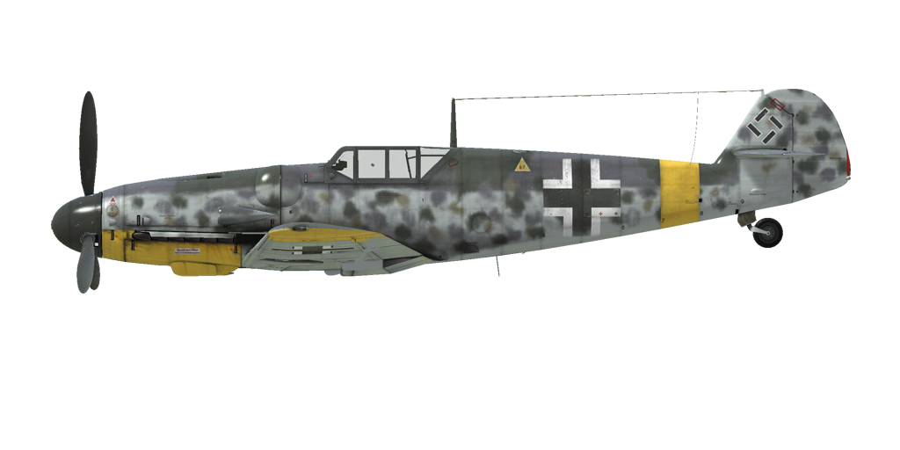

# Bf 109 G-6

## Описание

Приборная скорость сваливания в полётной конфигурации: 160..177 км/ч
Приборная скорость сваливания в посадочной конфигурации: 153..169 км/ч
Предельная скорость в пикировании: 850 км/ч
Разрушающая перегрузка: 10,5 единиц
Угол атаки сваливания, в полётной конфигурации: 19,8 °
Угол атаки сваливания, в посадочной конфигурации: 17 °

Максимальная истинная скорость у земли, режим двигателя - чрезвычайный: 529 км/ч
Максимальная истинная скорость у земли, режим двигателя - боевой: 505 км/ч
Максимальная истинная скорость на высоте 2000 м, режим двигателя - боевой: 547 км/ч
Максимальная истинная скорость на высоте 7000 м, режим двигателя - боевой: 632 км/ч

Практический потолок: 11800 м
Скороподъёмность у земли: 20,1 м/с
Скороподъёмность на высоте 3000 м: 18,8 м/с
Скороподъёмность на высоте 6000 м: 15,2 м/с

Время виража предельного по тяге у земли: 21,5 с, на скорости 270 км/ч по прибору
Время виража предельного по тяге на высоте 3000 м: 28,0 с, на скорости 270 км/ч по прибору

Продолжительность полёта на высоте 3000 м: 2,2 ч, на скорости 350 км/ч по прибору

Скорость взлётная: 155..180 км/ч
Скорость на глиссаде: 195..205 км/ч
Скорость посадочная: 150..155 км/ч
Посадочный угол: 13,7 °

Примечание 1: данные указаны для условий международной стандартной атмосферы.
Примечание 2: диапазоны характеристик даны для допустимого диапазона масс самолета.
Примечание 3: максимальные скорости, скороподъемности и время виража даны для стандартной массы самолета.
Примечание 4: скороподъемность и время виража даны на боевом режиме работы двигателя.

Двигатель:
Модель: DB-605A
Максимальная мощность на чрезвычайном режиме у земли: 1480 л.с.
Максимальная мощность на чрезвычайном режиме на высоте 5600 м: 1360 л.с.
Максимальная мощность на боевом режиме у земли: 1310 л.с.
Максимальная мощность на боевом режиме на высоте 5800 м: 1250 л.с.

Режимы работы двигателя:
Номинальный (время неограничено): 2300 об/мин, 1,15 атмосфер
Боевой (до 30 минут): 2600 об/мин, 1,3 атмосфер
Чрезвычайный (до 1 минуты): 2800 об/мин, 1,42 атмосфер

Температура воды на выходе из двигателя номинальная: 100..102 °С
Температура воды на выходе из двигателя предельная: 115 °С
Температура масла на входе в двигатель номинальная: 70..80 °С
Температура масла на входе в двигатель предельная: 85 °С

Высота переключения нагнетателя: гидромуфта 

Масса пустого самолета: 2583 кг
Минимальная масса (без БК, 10%25 топлива): 2734 кг
Стандартная масса: 3100 кг
Максимальная взлётная масса: 3400 кг
Максимальный запас топлива: 304 кг / 400 л
Максимальная полезная нагрузка: 817 кг

Вооружение курсовое:
20мм пушка "MG 151/20", 200 снарядов, 700 выстр/мин, носовая
2 x 13мм пулемет "MG 131", 300 патронов, 900 выстр/мин, синхронизированный
2 x 20мм пушка "MG 151/20", 135 снарядов, 700 выстр/мин, крыльевая (модификация)
30мм пушка "MK 108", 65 снарядов, 650 выстр/мин, носовая (модификация)

Вооружение бомбовое:
До 4 x 55 кг осколочно-фугасных авиабомб "SC 50"
249 кг осколочно-фугасная авиабомба "SC 250"

Длина: 8,94 м
Размах крыла: 9,97 м
Площадь крыла: 16,1 кв.м

Начало участия в боевых действиях: февраль 1943

Особенности эксплуатации:
- Управление винтомоторной группой максимально автоматизировано: фактически для изменения тяги двигателя используется только РУД. Обороты винта, качество топливовоздушной смеси, передаточное число нагнетателя и температура масла и воды не требуют ручного регулирования в полёте.
- Кроме автоматического управления створками водорадиаторов имеется возможность при необходимости регулировать положение створок водорадиаторов вручную.
- Для уменьшения разворачивающего момента самолёта воздушным потоком от винта при рулении по земле следует переключаться в ручной режим управления шагом винта и устанавливать винт на минимальный шаг.
- На самолёте нет триммеров. Регулировка планера осуществляется на земле специальными регулировочными отгибными пластинами на рулях.
- Самолёт имеет управляемый вручную переставной стабилизатор. Его следует устанавливать на угол +1° перед взлётом и -4°...-5° перед посадкой. Также можно пользоваться им как триммером, уменьшая усилия на ручке управления в полёте. Перед глубоким пикированием на большой скорости стабилизатор следует устанавливать так, чтобы для удержания самолета в пикировании приходилось немного отдавать ручку управления "от себя".
- На самолёте установлены автоматические предкрылки. Они позволяют несколько увеличить критический угол атаки и сделать выход на режим сваливания более "мягким".
- Самолёт имеет ручной механический привод уборки и выпуска закрылков, поэтому перед посадкой выпуск закрылков следует осуществлять заблаговременно. Угол выпуска закрылков можно контролировать по меткам на левом закрылке. Закрылки можно выпустить на любой угол до 40°.
- Свободно-ориентируемое хвостовое колесо может быть застопорено в положении "по полёту" при помощи рычага в кабине лётчика. Колесо необходимо застопорить при продолжительном рулении по прямой, а также перед взлётом и посадкой.
- Самолёт имеет раздельное управление гидравлическими тормозами левого и правого колёс шасси. Торможение каждого колеса осуществляется нажатием на верхнюю часть соответствующей педали.
- Самолёт оснащён топливомером, который показывает общий остаток топлива. Также есть сигнальная лампа аварийного остатка топлива 80 литров.
- Конструкция самолёта не позволяет осуществлять полёт с открытым фонарём кабины. Фонарь необходимо закрывать перед взлётом. Также есть система аварийного сброса фонаря (двумя частями) для покидания лётчиком самолёта в полёте.
- Система управления бомбодержателем позволяет сбрасывать бомбы только по одной.
- Прицел имеет сдвижной светофильтр.

## Модификации


### Топливный бак (300 л)

Подвесной сбрасываемый топливный бак объёмом 300 литров
Масса пустого: 15 кг
Масса полного: 237 кг
Емкость: 300 л
Ориентировочная потеря скорости до сброса: 30 км/ч
Ориентировочная потеря скорости после сброса: 10 км/ч

### Бронированный прозрачный заголовник

Альтернативная защита пилота: заголовник из прозрачного бронепакета
Дополнительная масса: 10 кг
Ориентировочная потеря скорости: 0 км/ч

### 2 x 20-мм пушки MG 151/20

Подвесные гондолы с 20-мм пушками MG 151/20 с боезапасом по 135 снарядов на каждую
Дополнительная масса: 212 кг
Масса боекомплекта: 55 кг
Масса орудий: 157 кг
Ориентировочная потеря скорости: 12 км/ч

### 30-мм пушка MK 108

30-мм пушка MK 108 с боезапасом 65 снарядов
Дополнительная масса: 4 кг
Масса боекомплекта: 38 кг
Масса орудия: 58 кг
Ориентировочная потеря скорости: 0 км/ч

### Peilrahmen PR 16

Радиополукомпас для навигации по радиомаякам
Дополнительная масса: 10 кг
Ориентировочная потеря скорости: 0 км/ч

### Снятый бронезаголовник

Снятый бронированный заголовник пилота для улучшения обзора из кабины
Уменьшение массы: 8 кг
Ориентировочный выигрыш в скорости: 0 км/ч

### 1 x SC 250

249 кг осколочно-фугасная авиабомба SC 250
Дополнительная масса: 279 кг
Масса вооружения: 249 кг
Масса держателей: 30 кг
Ориентировочная потеря скорости до сброса: 31 км/ч
Ориентировочная потеря скорости после сброса: 10 км/ч

### 4 x SC 50

4 x 55 кг осколочно-фугасные авиабомбы SC 50
Дополнительная масса: 260 кг
Масса вооружения: 220 кг
Масса держателей: 40 кг
Ориентировочная потеря скорости до сброса: 51 км/ч
Ориентировочная потеря скорости после сброса: 11 км/ч