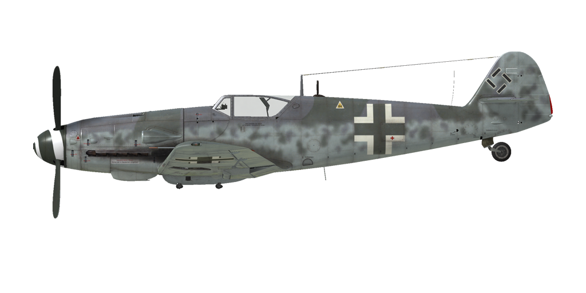

# Bf 109 G-6AS  
  
  
  
## Description  
  
Vitesse de décrochage indiquée en configuration de vol : 163..180 km/h  
Vitesse de décrochage indiquée en configuration de décollage/atterrissage : 151..163 km/h  
Vitesse limite de piqué : 850 km/h  
Facteur de charge maximum : 10,5 g  
Angle d\attaque de décrochage en configuration de vol : 19,7 °  
Angle d\attaque de décrochage indiquée en configuration d\atterrissage : 17,2 °  
  
DB-605AS:  
  
Vitesse sol au niveau de la mer, régime moteur - d\urgence : 523 km/h  
Vitesse sol maximale à 3500 m, régime moteur - d\urgence : 600 km/h  
Vitesse sol maximale à 9500 m, régime moteur - d\urgence : 670 km/h  
Vitesse sol au niveau de la mer, régime moteur - Combat : 505 km/h  
Vitesse sol maximale à 2900 m, régime moteur - Combat : 565 km/h  
Vitesse sol maximale à 9000 m, régime moteur - Combat : 650 km/h  
  
DB-605ASM:  
  
Vitesse sol au niveau de la mer, régime moteur - d\urgence : 570 km/h  
Vitesse sol maximale à 2000 m, régime moteur - d\urgence : 610 km/h  
Vitesse sol maximale à 8000 m, régime moteur - d\urgence : 690 km/h  
Vitesse sol au niveau de la mer, régime moteur - Combat : 505 km/h  
Vitesse sol maximale à 2900 m, régime moteur - Combat : 565 km/h  
Vitesse sol maximale à 9000 m, régime moteur - Combat : 650 km/h  
  
Plafond opérationnel : 12100 m  
Taux de montée au niveau de la mer : 17,3 m/s  
Taux de montée à 3000 m : 16,2 m/s  
Taux de montée à 6000 m : 12,1 m/s  
  
Virage à 360° au niveau de la mer en : 23,0 s, à 270 km/h vitesse indiquée (IAS).  
Virage à 360° à 3000 m : 28,5 s, à 270 km/h vitesse indiquée (IAS).  
  
Endurance à 3000 m : 2,3 h, à 350 km/h vitesse indiquée (IAS).  
  
Vitesse de décollage : 155..180 km/h  
Vitesse d\approche : 195..205 km/h  
Vitesse d\atterrissage : 150..155 km/h  
Angle d\atterrissage : 13,7 °  
  
Note 1 : les données sont indiquées à l\atmosphère standard international (ISA).  
Note 2 : les performances d\endurance sont données pour plusieurs masses possibles.  
Note 3 : la vitesse maximale, le taux de montée et le temps de virage sont donnés pour une masse standard.  
Note 4 : climb rates and turn times are given for Combat power.  
  
Moteur :  
Modèle : DB-605AS  
Puissance maximale au régime d\urgence au niveau de la mer : 1435 cv  
Puissance maximale au régime d\urgence à 8000 m : 1200 cv  
Puissance maximale au régime de combat au niveau de la mer : 1275 cv  
Puissance maximale au régime de combat à 7800 m : 1150 cv  
  
Performance du moteur :  
Continu (durée illimitée) : 2300 tr/min, 1,15 ata  
Combat (jusqu\à 30 minutes) : 2600 tr/min, 1,3 ata  
Urgence (jusqu\à 3 minutes) : 2800 tr/min, 1,42 ata  
  
Moteur :  
Modèle : DB-605ASM  
Puissance maximale au régime d\urgence au niveau de la mer : 1800 cv  
Puissance maximale au régime d\urgence à 6400 m : 1500 cv  
Puissance maximale au régime de combat au niveau de la mer : 1250 cv  
Puissance maximale au régime de combat à 7800 m : 1150 cv  
  
Performance du moteur :  
Continu (durée illimitée) : 2300 tr/min, 1,15 ata  
Combat (jusqu\à 30 minutes) : 2600 tr/min, 1,3 ata  
Urgence (jusqu\à 3 minute) : 2800 tr/min, 1,7 ata  
Urgence (jusqu\à 10 minute with MW-50) : 2800 tr/min, 1,7 ata (modification)  
  
Température de fonctionnement d\eau en sortie du moteur : 100..102 °C  
Température maximale d\eau en sortie du moteur : 115 °C  
Température de fonctionnement d\huile à l\admission du moteur : 75..80 °C  
Température maximale d\huile à l\admission du moteur : 85 °C  
  
Altitude de changement d\étage du compresseur : coupleur hydraulique  
  
Masse à vide : 2540 kg  
Masse minimale (sans munitions, 10% de carburant) : 2855 kg  
Masse standard : 3222 kg  
Masse maximale au décollage : 3585 kg  
Masse de carburant : 304 kg / 400 l  
Charge utile : 1045 kg  
  
Armement offensif :  
1 canon MG 151/20 de 20 mm, 200 coups, 700 coups par minute, dans le nez  
2 mitrailleuses MG 131 de 13 mm, 300 coups, 900 coups par minute, synchronisées  
2 canons MG 151/20 de 20 mm, 135 coups, 700 coups par minute, dans l\aile (modification)  
1 canon MK 108 de 30 mm, 65 coups, 650 coups par minute, dans le nez (modification)  
  
Bombes :  
1 bombe d\emploi général SC 250 de 249 kg  
  
Rockets:  
Two WGr.21 rockets in jettisonable launchers  
  
Longueur : 8,94 m  
Envergure : 9,92 m  
Surface alaire : 16,2 m²  
  
Premier engagement : spring 1944  
  
Caractéristiques  
- Cet avion utilise une gestion automatique des réglages moteur et, de ce fait, pour contrôler la vitesse, il suffit  d\agir sur la manette des gaz. En vol normal, il n\est pas nécessaire de procéder au réglage manuel du nombre de tours moteur, du mélange ou de la suralimentation.  
- MW-50 water-methanol mixture injection system that prevents the engine detonation in the emergency power mode (modification). It engages automatically when the throttle is set to maximum, there is enough mixture for 25-30 minutes. However, the engine can work up to 10 minutes at this mode, wait for another 10 minutes at the combat mode before engaging the emergency mode again. Attention: running the engine with the water-methanol mixture at altitudes higher than 8 km is forbidden! A pilot can check the system using the injection pressure indicator on the left: its normal pressure is 0.6...0.7 atm, stop using it if the pressure is lower than 0.4 atm and switch the engine to combat mode.  
- En plus du mode de controle automatique du radiateur, il y a  un mode manuel qui peut être utilisé lors de situation particulière.  
- Pour atténuer le cahotement pendant le roulage dû au brassage de l\hélice, la commande du pas de l\hélice doit être commutée en mode manuel et le pas doit être réduit au minimum.  
- L\avion n\a pas de trim en vol. L\avion est équipé de trim qui ne peut être réglées que par le personnel au sol, avant le vol.  
- L\avion possède un stabilisateur horizontal commandé manuellement. Il doit être réglé à + 1 ° avant le décollage et à -4 ° ...- 5 ° avant l\atterrissage. Il est aussi possible de trimer le manche pendant le vol. Dans un piqué accentué, le stabilistaeur doit être réglé de manière à pousser sur le manche pour maintenir l\angle de piqué.  
- L\appareil possède des becs d\aile automatiques. Ils se déploient lorsque le fort angle d\attaque augmente risquant de déclencher une perte de vitesse   
- L\appareil est équipé d\un système mécanique manuel permettant de rentrer les volets d\atterrissage, pour cette raison il est nécessaire de descendre les volets avant l\approche finale. Un indicateur sur l\aile gauche permet de mesurer la position des volets. Les volets peuvent être descendu à n\importe quel angle au delà de 40°.  
- L\avion est muni d\une roulette de queue verouillable manuelement. La roulette doit être verrouillée en roulant droit sur une longue distance, avant le décollage et l\atterrissage.  
- L\avion a des commandes de frein hydrauliques à gauche et à droite qui sont indépendantes. Pour freiner, poussez la partie supérieure de la pédale de direction.  
- L\avion a une jauge de carburant qui indique le plein de carburant restant. En outre, il dispose d\un témoin de carburant d\urgence (80 litres).  
- La forme de la verrière ne permet pas son ouverture en vol. La verrière doit être fermé avant de décoller pour éviter de l\endommager.La verrière a un système d\éjection d\urgence dans le cas où vous devriez évacuer l\avion en plain vol.  
- Le viseur a un filtre solaire coulissant.  
  
Basic data and recommended positions of the aircraft controls:  
1. Starting the engine:  
	- recommended position of the mixture control lever: auto mixture control  
	- recommended position of the oil/water radiator control handle: auto radiators control  
	- recommended position of the prop pitch control handle: auto prop pitch control  
	- recommended position of the throttle lever: 10%  
	- before taxiing, you must unlock the tailwheel  
  
2. Recommended mixture control lever positions for various flight modes: auto mixture control  
  
3. Recommended positions of the radiators control handle for various flight modes: auto radiators control  
  
4. Approximate fuel consumption at 2000 m altitude:  
	- Cruise engine mode: 5.3 l/min  
	- Combat engine mode: 8.2 l/min  
  
## Modifications  
### DB-605ASM engine  
  
DB-605ASM engine with C3 fuel and MW-50 System tank (empty)  
Additional mass: 21 kg  
Estimated speed increase at sea level: 43 km/h  
### MW-50 Mixture  
  
MW-50 water-methanol mixture injection increases engine endurance at emergency power modes  
Additional mass (mixture): 63 kg  
### 21 cm BR  
  
Two WGr.21 rockets in jettisonable launchers  
Masse supplémentaire : 258 kg  
Masse des munitions : 224 kg  
Masse des pylones : 34 kg  
Perte estimée de vitesse avant le lancement : 51 km/h  
Perte estimée de vitesse après le lancement : 11 km/h  
Perte estimée de vitesse après le largage : 2 km/h  
  
### 2 canons MG 151/20 de 20 mm en nacelles  
  
2 canons MG 151/20 de 20 mm montés dans des nacelles sous les ailes avec 135 obus chaque  
Masse supplémentaire : 212 kg  
Masse des munitions : 55 kg  
Masse des canons : 157 kg  
Perte estimée de vitesse : 13 km/h  
  
### Canon MK 108 de 30 mm  
  
Canon MK 108 de 30 mm monté dans le nez avec 65 obus  
Masse supplémentaire: 4 kg  
Masse des munitions : 38 kg  
Masse des canons : 58 kg  
Perte estimée de vitesse : 0 km/h  
### MW-50 System  
  
MW-50 water-methanol mixture injection system   
Additional mass: 84 kg  
Water-methanol mixture mass: 63 kg  
Estimated speed increase at sea level: 45 km/h  
  
### 1 bombe SC 250  
  
Bombe d’emploi général SC 250 de 249 kg  
Masse supplémentaire : 279 kg  
Masse des munitions : 249 kg  
Masse des pylones : 30 kg  
Perte estimée de vitesse avant le largage : 33 km/h  
Perte estimée de vitesse après le largage : 11 km/h  
