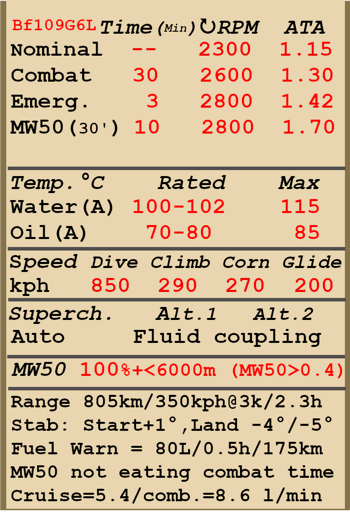

# Bf 109 G-6 Late  

  
  

## 描述  

飞行构型的失速指示空速：161~179 km/h  
起降构型的失速指示空速：153~170 km/h  
俯冲极速：850 km/h  
最大过载：10.5 G  
飞行构型失速迎角：19.8 °  
着陆构型失速迎角：17 °  
  
最大真空速，高度海平面，发动机模式——应急（使用MW-50时）: 573 km/h（改装）  
最大真空速，高度5000米，发动机模式——应急（使用MW-50时）: 661 km/h（改装）  
最大真空速，高度海平面，发动机模式——应急：528 km/h  
最大真空速，高度6600米，发动机模式——应急：631 km/h  
最大真空速，高度海平面，发动机模式——战斗：508 km/h  
最大真空速，高度2000米，发动机模式——战斗：547 km/h  
最大真空速，高度6600米，发动机模式——战斗：618 km/h  
  
实用升限：11800 m  
海平面爬升率：20.6 m/s  
3000m时爬升率：18.3 m/s  
6000m时爬升率：14.1 m/s  
  
海平面最大性能盘旋时间：21.7 s，指示空速 270 km/h。  
3000m时最大性能盘旋时间：27.4 s，指示空速 270 km/h。  
  
3000m（9843 feet）时续航时间：2.3h，指示空速 350 km/h。  
  
起飞速度：155~180 km/h  
进近速度：195~205 km/h  
着陆速度：150~155 km/h  
着陆迎角：13.7 °  
  
注1：所提供的数据适用于国际标准大气（ISA）。  
注2：飞行性能范围基于可能的飞机质量范围。  
注3：极速、爬升率和盘旋时间基于标准飞机质量。  
注4：爬升率和盘旋时间基于战斗动力。  
  
发动机：  
型号：DB-605A  
应急模式下的最大功率（使用MW-50时），高度海平面：1800 HP（改装）  
应急模式下的最大功率（使用MW-50时），高度4100米：1700 HP（改装）  
海平面应急模式下的最大功率：1480 HP  
应急模式下的最大功率，高度5600m：1360 HP  
战斗模式下的最大功率，高度海平面：1310 HP  
战斗模式下的最大功率，高度5800m：1250 HP  
  
发动机模式：  
标称（无时间限制）：2300 RPM，1.15 ATA  
战斗（不超过30min）：2600 RPM，1.3 ATA  
应急动力（不超过3min）：2800 RPM，1.42 ATA  
应急动力（使用MW-50时不超过10min）: 2800 RPM, 1.7 ata（改装）  
  
发动机液冷出水口额定水温：100~102 °C  
发动机液冷出水口最高水温：115 °C  
发动机滑油进油口额定油温：70~80 °C  
发动机滑油进油口最高油温：85 °C  
  
机械增压器换挡高度：液力偶合   
  
空重：2536 kg  
最小重量（无弹药、10%燃油）：2779 kg  
标准重量：3146 kg  
最大起飞重量：3538 kg  
燃油载荷：304 kg/400 L  
有效载荷：1002 kg  
  
前射武器：  
20mm机炮"MG 151/20"，200发，700发/分，机头安装  
2 x 13mm机枪"MG 131"，300发，900发/分，同步  
2 x 20mm机炮"MG 151/20"，135发，700发/分，机翼安装（改装）  
30mm机炮"MK 108"，65发，650发/分，机头安装（改装）  
  
炸弹：  
最多4 x 66 kg杀伤炸弹"SD 70"  
249kg 通用炸弹"SC 250"  
  
火箭弹：  
两枚位于可抛弃发射管里的WGr.21火箭弹  
  
长度：8.94 m  
翼展：9.97 m  
机翼面积：16.1 m²  
  
首次投入战斗：1944初  
  
操作特性：  
——飞机的发动机系统自动化程度较高，实际上，要控制速度只要使用油门杆即可。正常飞行中无需手动调整发动机的转速、混合比以及增压器的档位。  
——MW-50水-甲醇混合物喷射系统，可防止发动机在紧急动力下发生爆震(改装)。当油门设置为最大时，它会自动启动，混合物最多可使用25到30分钟。但是在此模式下发动机最多可使用10分钟，随后需要在战斗模式以下等待10分钟才可继续使用紧急模式。注意：禁止在没有水-甲醇混合物的情况下在6000米以上高度使用发动机紧急模式！飞行员可在左侧的喷射压力指示表检查系统：其正常工作压力为0.6至0.7atm，如果压力低于0.4atm，请停止使用喷射系统并将发动机降至战斗模式。  
——除了全自动模式，散热器风门还有一个特殊的手动应急模式，可用于特定情况。  
——为了减少由于螺旋桨洗流导致的滑跑摇摆，螺旋桨桨距应设置成手动模式并设置成最小。  
——飞机没有飞行操纵的配平。飞机装有可弯曲的配平片，可由地面人员在飞行前设置。  
——飞机有手动控制的水平安定面。起飞前应设为+1°，着陆前应设为-4°~-5°。它也可用于飞行时配平操纵杆。在大角度俯冲时应设定安定面，让飞行员必须向前推杆才能保持俯冲角。  
——飞机有自动缝翼。当大迎角继续增大时会自动展开，使失速前状态更柔和。  
——飞机有手动机械系统来收放着陆襟翼，因此有必要在最终进近前就放下着陆襟翼。左翼上的襟翼指示杆标记指示襟翼放下了多少。襟翼可以放下到不超过40°的任意角度。  
——飞机有手动尾轮锁。在起飞前和着陆后的长距离直线滑行时应锁尾轮。  
——飞机有独立的左右液压机轮刹车。要使用刹车，踩下方向舵脚蹬的上部。  
——飞机有油量表显示剩余的总油量。飞机还有一个应急油量警告灯（80 L）。  
——此座舱盖的设计使它不能在飞行过程中被打开。座舱盖应该在起飞前关闭，以防止被损坏。座舱盖配有紧急抛弃系统，用于跳伞。  
——炸弹挂架的控制系统只允许单颗投放。  
——射击瞄准具拥有一个滑动式的太阳滤光片。  
  
Basic data and recommended positions of the aircraft controls:  
1. Starting the engine:  
	- recommended position of the mixture control lever: auto mixture control  
	- recommended position of the oil/water radiator control handle: auto radiators control  
	- recommended position of the prop pitch control handle: auto prop pitch control  
	- recommended position of the throttle lever: 10%  
	- before taxiing, you must unlock the tailwheel  
  
2. Recommended mixture control lever positions for various flight modes: auto mixture control  
  
3. Recommended positions of the radiators control handle for various flight modes: auto radiators control  
  
4. Approximate fuel consumption at 2000 m altitude:  
	- Cruise engine mode: 5.4 l/min  
	- Combat engine mode: 8.6 l/min  

## 修改  
### 21cm火箭弹  

两枚位于可抛弃发射管里的WGr.21火箭弹  
增加质量：258 kg  
弹药质量：224 kg  
挂架质量：34 kg  
发射前预期速度损失：51 km/h  
发射后预期速度损失：11 km/h  
投弹后预期速度损失：2 km/h  

### 300-liter Drop Tank  

300-liter jettisonable fuel tank  
Empty mass: 15 kg  
Full mass: 237 kg  
Fuel capacity: 300 l  
Estimated speed loss before drop: 30 km/h  
Estimated speed loss after drop: 10 km/h  

### 厄拉改件  

厄拉·豪伯型座舱盖改件  
增加质量: 9 kg  
预期速度损失：0 km/h  

### 2 x 20mm MG 151/20机炮吊舱  

机翼吊舱MG 151/20 20mm机炮，每门备弹135发  
增加质量：212 kg  
弹药质量：55 kg  
枪炮质量：157 kg  
预期速度损失：13 km/h  

### 30mm MK 108机炮  

MK 108 30mm头部机炮，备弹65发  
增加质量：4 kg  
弹药质量：38 kg  
枪炮质量：58 kg  
预期速度损失：0 km/h  

### MW-50系统  

MW-50水-甲醇混合物喷射系统  
增加质量: 84 kg  
水-甲醇混合物质量: 63 kg  
预期海平面时速增加: 45 km/h  

### SC 250炸弹  

249kg 通用炸弹SC 250  
增加质量：279 kg  
弹药质量：249 kg  
挂架质量：30 kg  
投弹前预期速度损失：33 km/h  
投弹后预期速度损失：11 km/h  

### 4 x SD 70炸弹  

4 x 66 kg杀伤炸弹SD 70  
增加质量：304 kg  
弹药质量：264 kg  
挂架质量：40 kg  
投弹前预期速度损失：52 km/h  
投弹后预期速度损失：12 km/h  
