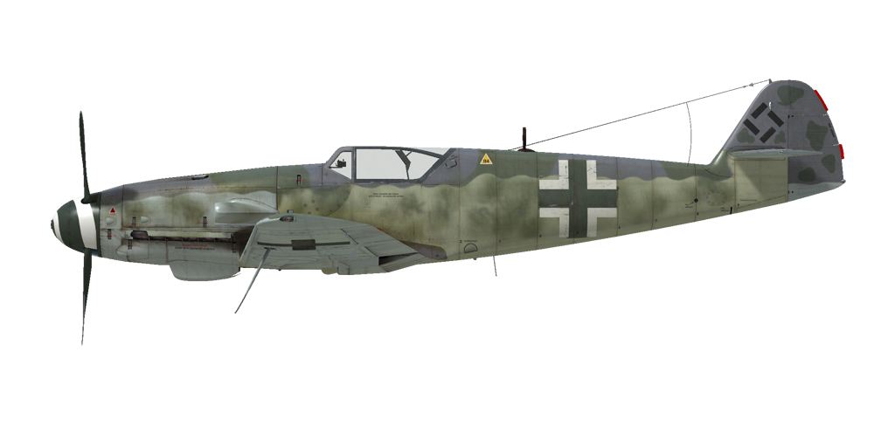

# Bf 109 K-4  

| Image | Notes  
|:---|:---  
|  |   

## 描述  

飞行构型的失速指示空速：167~190 km/h  
起降构型的失速指示空速：160~181 km/h  
俯冲极速：850 km/h  
最大过载：10.5 G  
飞行构型失速迎角：19.8 °  
着陆构型失速迎角：17 °  
  
DB-605DB发动机：  
  
最大真空速，高度海平面，发动机模式——应急：599 km/h  
最大真空速，高度7500m，发动机模式——应急：702 km/h  
最大真空速，高度海平面，发动机模式——战斗：543 km/h  
最大真空速，高度8000m，发动机模式——战斗：684 km/h  
  
实用升限：12300 m  
海平面爬升率：20.5 m/s  
3000m时爬升率：17.5 m/s  
6000m时爬升率：13.4 m/s  
  
海平面最大性能盘旋时间：24.0 s，指示空速 270 km/h。  
3000m时最大性能盘旋时间：32.2 s，指示空速 270 km/h。  
  
DB-605DC发动机：  
  
最大真空速，高度海平面，发动机模式——应急：614 km/h  
最大真空速，高度6200m，发动机模式——应急：713 km/h  
最大真空速，高度海平面，发动机模式——战斗：536 km/h  
最大真空速，高度8000m，发动机模式——战斗：684 km/h  
  
实用升限：12300 m  
海平面爬升率：19.7 m/s  
3000m时爬升率：17.4 m/s  
6000m时爬升率：13.3 m/s  
  
海平面最大性能盘旋时间：24.2 s，指示空速 270 km/h。  
3000m时最大性能盘旋时间：32.3 s，指示空速 270 km/h。  
  
3000m（9843 feet）时续航时间：2.15h，指示空速 350 km/h。  
  
起飞速度：160~190 km/h  
进近速度：200~215 km/h  
着陆速度：155~160 km/h  
着陆迎角：12.5 °  
  
注1：所提供的数据适用于国际标准大气（ISA）。  
注2：飞行性能范围基于可能的飞机质量范围。  
注3：极速、爬升率和盘旋时间基于标准飞机质量。  
注4：爬升率和盘旋时间基于战斗动力。  
  
发动机：  
型号：DB-605DB  
启用MW-50应急模式下的最大功率，高度海平面：1850 HP  
启用MW-50应急模式下的最大功率，高度6000m：1600 HP  
战斗模式下的最大功率，高度海平面：1430 HP  
战斗模式下的最大功率，高度6800m：1285 HP  
  
发动机模式：  
标称（无时间限制）：2400 RPM，1.35 ATA  
战斗（不超过30min）：2600 RPM，1.45 ATA  
应急动力（不超过10min）：2800 RPM，1.8 ATA  
  
发动机：  
型号：DB-605DC  
启用MW-50应急模式下的最大功率，高度海平面：2000 HP  
启用MW-50应急模式下的最大功率，高度4900m：1800 HP  
战斗模式下的最大功率，高度海平面：1370 HP  
战斗模式下的最大功率，高度6800m：1285 HP  
  
发动机模式：  
标称（无时间限制）：2400 RPM，1.35 ATA  
战斗（不超过30min）：2600 RPM，1.45 ATA  
应急动力（不超过10min）：2800 RPM，1.98 ATA  
  
发动机液冷出水口额定水温：100~102 °C  
发动机液冷出水口最高水温：115 °C  
发动机滑油进油口额定油温：70~80 °C  
发动机滑油进油口最高油温：95 °C  
  
机械增压器换挡高度：液力偶合   
  
空重：2754 kg  
最小重量（无弹药、10%燃油）：3006 kg  
标准重量：3361 kg  
最大起飞重量：3891 kg  
燃油载荷：304 kg/400 L  
有效载荷：1137 kg  
  
前射武器：  
30mm机炮"MK 108"，65发，650发/分，机头安装  
2 x 13mm机枪"MG 131"，300发，900发/分，同步  
2 x 20mm机炮"MG 151/20"，135发，700发/分，机翼安装（改装）  
  
炸弹：  
249kg 通用炸弹"SC 250"  
500kg 通用炸弹"SC 500"  
  
长度：8.94 m  
翼展：9.97 m  
机翼面积：16.1 m²  
  
首次投入战斗：1944年10月  
  
操作特性：  
——飞机的发动机系统自动化程度较高，实际上，要控制速度只要使用油门杆即可。正常飞行中无需手动调整发动机的转速、混合比以及增压器的档位。  
——飞机装有MW-50水醇混合喷注系统，防止发动机在应急动力模式时爆震。油门推到最大时它自动接通，混合燃料足够使用25-30min。然而发动机在这种模式下只能工作最多10min，再次进入应急模式前需在战斗模式里等待10min。注意：当发动机没有水醇混合物或高度大于6 km时，禁止以应急模式运行！飞行员可以通过喷注压力指示器来检查系统：正常压力是0.6~0.7大气压，如果压力低于0.4大气压，停止使用，把发动机切回战斗模式。  
——除了全自动模式，散热器风门还有一个特殊的手动应急模式，可用于特定情况。  
——为了减少由于螺旋桨洗流导致的滑跑摇摆，螺旋桨桨距应设置成手动模式并设置成最小。  
——飞机没有飞行操纵的配平。飞机装有可弯曲的配平片，可由地面人员在飞行前设置。  
——飞机有手动控制的水平安定面。起飞前应设为+1°，着陆前应设为-4°~-5°。它也可用于飞行时配平操纵杆。在大角度俯冲时应设定安定面，让飞行员必须向前推杆才能保持俯冲角。  
——飞机有自动缝翼。当大迎角继续增大时会自动展开，使失速前状态更柔和。  
——飞机有手动机械系统来收放着陆襟翼，因此有必要在最终进近前就放下着陆襟翼。左翼上的襟翼指示杆标记指示襟翼放下了多少。襟翼可以放下到不超过40°的任意角度。  
——飞机有手动尾轮锁。在起飞前和着陆后的长距离直线滑行时应锁尾轮。  
——飞机有独立的左右液压机轮刹车。要使用刹车，踩下方向舵脚蹬的上部。  
——飞机有油量表显示剩余的总油量。飞机还有一个应急油量警告灯（80 L）。  
——此座舱盖的设计使它不能在飞行过程中被打开。座舱盖应该在起飞前关闭，以防止被损坏。座舱盖配有紧急抛弃系统，用于跳伞。  
——射击瞄准具拥有一个滑动式的太阳滤光片。  
  
Basic data and recommended positions of the aircraft controls:  
1. Starting the engine:  
	- recommended position of the mixture control lever: auto mixture control  
	- recommended position of the oil/water radiator control handle: auto radiators control  
	- recommended position of the prop pitch control handle: auto prop pitch control  
	- recommended position of the throttle lever: 10%  
	- before taxiing, you must unlock the tailwheel  
  
2. Recommended mixture control lever positions for various flight modes: auto mixture control  
  
3. Recommended positions of the radiators control handle for various flight modes: auto radiators control  
  
4. Approximate fuel consumption at 2000 m altitude:  
	- Cruise engine mode: 6.6 l/min  
	- Combat engine mode: 11.1 l/min  

## 修改  
### DB 605 DC发动机  

DB 605 DC发动机  
增加质量：0 kg  
预期速度损失：0 km/h  

### 300-liter Drop Tank  

300-liter jettisonable fuel tank  
Empty mass: 15 kg  
Full mass: 237 kg  
Fuel capacity: 300 l  
Estimated speed loss before drop: 30 km/h  
Estimated speed loss after drop: 10 km/h  

### 2 x 20mm MG 151/20机炮吊舱  

机翼吊舱MG 151/20 20mm机炮，每门备弹135发  
增加质量：212 kg  
弹药质量：55 kg  
枪炮质量：157 kg  
预期速度损失：17 km/h  

### SC 250炸弹  

249kg 通用炸弹SC 250  
增加质量：279 kg  
弹药质量：249 kg  
挂架质量：30 kg  
投弹前预期速度损失：41 km/h  
投弹后预期速度损失：14 km/h  

### SC 500炸弹  

500kg 通用炸弹 SC 500  
增加质量：530 kg  
弹药质量：500 kg  
挂架质量：30 kg  
投弹前预期速度损失：45 km/h  
投弹后预期速度损失：13 km/h  
