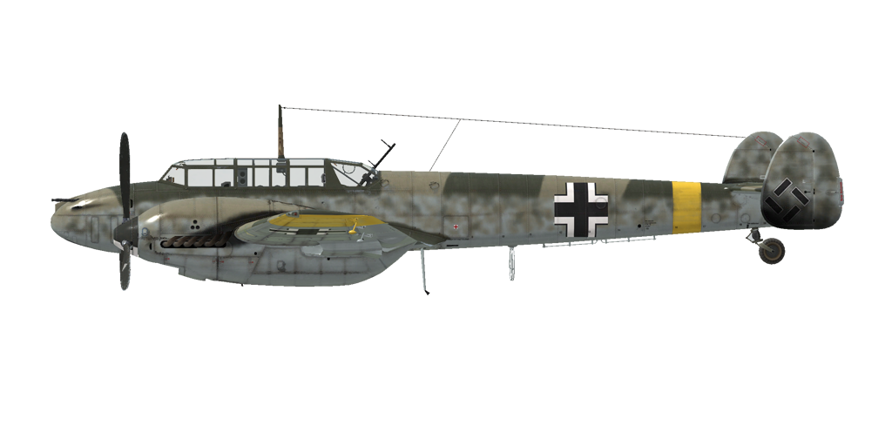

# Bf 110 E-2  

<table><tbody><tr><td style="text-align: center"></td><td style="text-align: center"></td></tr><tr><td style="text-align: center" colspan="2"></td></tr></tbody></table>  

Приборная скорость сваливания в полётной конфигурации: 148..182 км/ч  
Приборная скорость сваливания в посадочной конфигурации: 131..162 км/ч  
Предельная скорость в пикировании: 740 км/ч  
Разрушающая перегрузка: 11 единиц  
Угол атаки сваливания, в полётной конфигурации: 20,7 °  
Угол атаки сваливания, в посадочной конфигурации: 17,5 °  
  
Максимальная истинная скорость у земли, режим двигателя - чрезвычайный: 456 км/ч  
Максимальная истинная скорость на высоте 2000 м, режим двигателя - чрезвычайный: 494 км/ч  
Максимальная истинная скорость на высоте 5000 м, режим двигателя - чрезвычайный: 529 км/ч  
  
Практический потолок: 9500 м  
Скороподъёмность у земли: 10,3 м/с  
Скороподъёмность на высоте 3000 м: 9,6 м/с  
Скороподъёмность на высоте 6000 м: 6,1 м/с  
  
Время виража предельного по тяге у земли: 27,4 с, на скорости 270 км/ч по прибору  
Время виража предельного по тяге на высоте 3000 м: 35,4 с, на скорости 270 км/ч по прибору  
  
Продолжительность полёта на высоте 3000 м: 3,5 ч, на скорости 300 км/ч по прибору  
  
Скорость взлётная: 180..220 км/ч  
Скорость на глиссаде: 200..220 км/ч  
Скорость посадочная: 140..160 км/ч  
Посадочный угол: 10,6 °  
  
Примечание 1: данные указаны для условий международной стандартной атмосферы.  
Примечание 2: диапазоны характеристик даны для допустимого диапазона масс самолёта.  
Примечание 3: максимальные скорости, скороподъемности и время виража даны для стандартной массы самолёта.  
Примечание 4: скороподъемность дана на боевом режиме работы двигателя, время виража - на форсированном.  
  
Двигатель:  
Модель: DB-601A  
Максимальная мощность на форсированном режиме у земли: 1100 л.с.  
Максимальная мощность на чрезвычайном режиме у земли: 990 л.с.  
Максимальная мощность на чрезвычайном режиме на высоте 4500 м: 1020 л.с.  
Максимальная мощность на боевом режиме у земли: 910 л.с.  
Максимальная мощность на боевом режиме на высоте 5000 м: 960 л.с.  
  
Режимы работы двигателя:  
Номинальный (время неограничено): 2200 об/мин, 1,15 атмосфер  
Боевой (до 30 минут): 2300 об/мин, 1,23 атмосфер  
Чрезвычайный (до 5 минут): 2400 об/мин, 1,3 атмосфер  
Форсированный (до 1 минуты): 2400 об/мин, 1,4 атмосфер  
  
Температура воды на выходе из двигателя номинальная: 94 °С  
Температура воды на выходе из двигателя предельная: 100 °С  
Температура масла на входе в двигатель номинальная: 30..75 °С  
Температура масла на входе в двигатель предельная: 80 °С  
Температура масла на выходе из двигателя номинальная: 95 °С  
Температура масла на выходе из двигателя предельная: 105 °С  
  
Высота переключения нагнетателя: гидромуфта   
  
Масса пустого самолёта: 5175 кг  
Минимальная масса (без БК, 10% топлива): 5597 кг  
Стандартная масса: 6706 кг  
Максимальная взлётная масса: 8398 кг  
Максимальный запас топлива: 965 кг / 1270 л  
Максимальная полезная нагрузка: 3223 кг  
  
Вооружение курсовое:  
4 x 7,92мм пулемёт "MG 17", 1000 патронов, 1200 выстр/мин, носовой  
2 x 20мм пушка "MG FF", 180 снарядов, 540 выстр/мин, носовая  
  
Вооружение оборонительное:  
Заднее: 7,92мм пулемёт "MG 15", 825 патронов, 1000 выстр/мин  
  
Вооружение бомбовое:  
До 12 x 55 кг осколочно-фугасных авиабомб "SC 50"  
До 2 x 249 кг осколочно-фугасных авиабомб "SC 250"  
До 2 x 500 кг осколочно-фугасных авиабомб "SC 500"  
1090 кг осколочно-фугасная авиабомба "SC 1000"  
  
Длина: 12,1 м  
Размах крыла: 16,3 м  
Площадь крыла: 38,4 кв.м  
  
Начало участия в боевых действиях: октябрь 1940  
  
Особенности эксплуатации:  
- Управление винтомоторной группой максимально автоматизировано: фактически для изменения тяги двигателей используются только РУДы. Обороты винтов, качество топливовоздушной смеси и передаточное число нагнетателей не требуют ручного управления в полёте.  
- Водо- и маслорадиаторы имеют ручное управление створками. Управление радиаторами ступенчатое: створки водорадиаторов имеют 9 фиксированных положений, а створки маслорадиаторов имеют 5 фиксированных положений.  
- Самолёт оборудован указателем топлива, который может показывать остаток топлива в каждом из баков. Выбор бака для индикации по-умолчанию производится комбинацией клавишь (RShift+I).  
- Воздушные винты имеют режим флюгирования по потоку. Флюгирование винта применяется для уменьшения сопротивления от вращающегося винта в случае выхода двигателя из строя.  
- Для уменьшения разворачивающего момента самолёта воздушным потоком от винтов при рулении по земле следует использовать "разнотяг" двигателей. Левому двигателю рекомендуется давать тягу на 20% больше, чем правому. Также можно переключаться в ручной режим управления шагом винтов и устанавливать винты на минимальный шаг.  
- Самолёт оснащён триммерами руля направления и руля высоты.  
- На самолёте установлены автоматические предкрылки. Они позволяют несколько увеличить критический угол атаки и сделать выход на режим сваливания более "мягким".  
- Привод закрылков гидравлический. Закрылки можно выпустить на любой угол до 50°.  
- Самолёт имеет автоматически управляемый стабилизатор, угол установки которого зависит от угла выпуска закрылков.  
- Хвостовое колесо свободно ориентируемо, стопора не имеет. В связи с этим при движении по ВПП с большой скоростью на взлёте или посадке следует уверенно и аккуратно работать педалями, своевременно парируя стремление самолёта к развороту.  
- Самолёт имеет раздельное управление гидравлическими тормозами левого и правого колёс шасси. Торможение каждого колеса осуществляется нажатием на верхнюю часть соответствующей педали.  
- Самолёт оснащён топливомером, который показывает остаток топлива в одном из четырёх баков, в зависимости от положения переключателя. Также есть сигнальные лампы малого остатка топлива (50 литров) в баках.  
- Конструкция самолёта не позволяет осуществлять полёт с открытым фонарём кабины. Фонарь необходимо закрывать перед взлётом.  
- На самолёте установлен электросбрасыватель подвесного оружия, позволяющий выбирать точки подвески с которых будет произведён сброс (крыльевые, подфюзеляжная), а также количество бомб, которое будет сброшено с выбранной точки подвески (одна или все).  
- Пушки MG-FF имеют магазинное питание и перезаряжаются стрелком-радистом по команде лётчика.  
- Прицел имеет сдвижной светофильтр.  
  
Основные данные и рекомендуемые положения органов управления самолётом:  
1. Запуск двигателя:  
	- рекомендуемое положение рукояти управления смесью: автоматическое управление смесью  
	- рекомендуемое положение рукояти управления маслорадиатором: закрыт  
	- рекомендуемое положение рукояти управления водорадиатором: закрыт  
	- рекомендуемое положения рукояти управления шагом винта: автоматическое управление шагом  
	- рекомендуемое положение рычага управления двигателем: 15%  
  
2. Рекомендуемые положения рукояти смеси при различных режимах полёта: автоматическое управление смесью   
  
3.1 Рекомендуемые положения рукояти управления маслорадиатором при различных режимах полёта:  
	- взлёт: открыто на 50%  
	- набор высоты: открыто на 100%  
	- крейсерский полёт: открыто на 25% (зимой закрыть при необходимости)  
	- бой: открыто на 75%  
  
3.2 Рекомендуемые положения рукояти управления водорадиатором при различных режимах полёта:  
	- взлёт: открыто на 50%  
	- набор высоты: открыто на 100%  
	- крейсерский полёт: открыто на 25% (зимой закрыть при необходимости)  
	- бой: открыто на 75%  
  
4. Ориентировочный расход топлива на различных режимах работы на высоте 2000 м:  
	- крейсерский режим работы двигателя: 11,2 л/мин  
	- боевой режим работы двигателя: 13,8 л/мин  

## Модификации  
### Дополнительные бронеплиты  

Дополнительная защита: бронеплиты на двигателях и радиаторах  
Дополнительная масса: 245 кг  
Ориентировочная потеря скорости: 0 км/ч  
  
### Бронированное лобовое стекло и заголовник пилота  

Дополнительная защита пилота: накладка на лобовое стекло из прозрачного бронепакета  
Дополнительная масса: 32 кг  
Ориентировочная потеря скорости: 0 км/ч  

### Тяжелая авиабомба SC 1000  

1090 кг авиабомба SC 1000 на центральной внешней подвеске  
Дополнительная масса: 1140 кг  
Масса вооружения: 1090 кг  
Масса держателей: 50 кг  
Ориентировочная потеря скорости до сброса: 33 км/ч  
Ориентировочная потеря скорости после сброса: 5 км/ч  

### 2 x SC 500  

2 x 500 кг осколочно-фугасных авиабомбы SC 500  
Дополнительная масса: 1025 кг  
Масса вооружения: 1000 кг  
Масса держателей: 50 кг  
Ориентировочная потеря скорости до сброса: 35 км/ч  
Ориентировочная потеря скорости после сброса: 5 км/ч  

### 12 x SC 50  

12 x 55 кг осколочно-фугасных авиабомб SC 50  
Дополнительная масса: 820 кг  
Масса вооружения: 660 кг  
Масса держателей: 160 кг  
Ориентировочная потеря скорости до сброса: 80 км/ч  
Ориентировочная потеря скорости после сброса: 38 км/ч  
