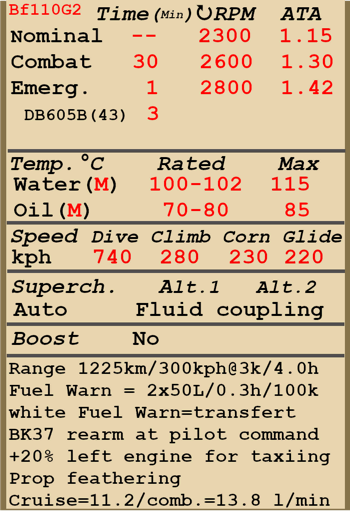

# Bf 110 G-2  

<table><tbody><tr><td style="text-align: center"></td><td style="text-align: center"></td></tr></tbody></table>  

Überziehgeschwindigkeit in Flugkonfiguration: 160..190 km/h  
Überziehgeschwindigkeit in Landekonfiguration: 141..168 km/h  
Höchstzulässige Geschwindigkeit im Sturzflug: 740 km/h  
Bruchlastvielfache: 11 G  
Kritischer Anstellwinkel in Flugkonfiguration: 20.3 °  
Kritischer Anstellwinkel in Landekonfiguration: 17.4 °  
  
Höchstgeschwindigkeit in Bodennähe, Kampfleistung: 489 km/h  
Höchstgeschwindigkeit in 2000 m Höhe, Kampfleistung: 533 km/h  
Höchstgeschwindigkeit in 6500 m Höhe, Kampfleistung: 581 km/h  
  
Dienstgipfelhöhe: 10800 m  
Steigleistung in Bodennähe: 15.6 m/s  
Steigleistung in 3000 m Höhe: 14.1 m/s  
Steigleistung in 6000 m Höhe: 10.7 m/s  
  
Maximale Wendegeschwindigkeit in Bodennähe: 23.5 s (270 km/h IAS).  
Maximale Wendegeschwindigkeit in 3000 m Höhe: 31.2 s (270 km/h IAS).  
  
Reichweite in 3000 m: 4.0 h, bei 300 km/h IAS.  
  
Startgeschwindigkeit: 190..230 km/h  
Anfluggeschwindigkeit: 210..230 km/h  
Landegeschwindigkeit: 150..170 km/h  
Sinkflugpfad: 10.7 °  
  
Anmerkung 1: Die Werte gelten für Normatmosphäre (ISA).  
Anmerkung 2: Flugleistungen varrieren je nach Abfluggewicht.  
Anmerkung 3: Höchstgeschwindigkeiten, Steigleistungen und Wendegeschwindigkeiten gelten für Standard-Fluggewicht.  
Anmerkung 4: Steigraten gelten für Kampfleistung, Wendegeschwindigkeiten gelten für Notleistung.  
  
Triebwerk:  
Baumuster: DB-605B  
Notleistung in Bodennähe: 1480 PS  
Notleistung in 5600 m Höhe: 1360 PS  
Kampfleistung in Bodennähe: 1310 PS  
Kampfleistung in 5800 m Höhe: 1250 PS  
  
Leistungsstufen:  
Nennleistung (unbegrenzt): 2300 U/min, 1.15 ata  
Kampfleistung (bis zu 30 Minuten): 2600 U/min, 1.3 ata  
Notleistung (bis zu 1 Minute): 2800 U/min, 1.42 ata  
Notleistung (1943 bis zu 3 Minuten): 2800 U/min, 1.42 ata  
  
Kühlstoffaustrittstemperatur (normal): 100..102 °C  
Kühlstoffaustrittstemperatur (höchstens): 115 °C  
Schmierstoffeintrittstemperatur (normal): 70..80 °C  
Schmierstoffeintrittstemperatur (höchstens): 85 °C  
  
Laderumschalthöhe: Stufenlose hydraulische Kupplung   
  
Leergewicht: 5905 kg  
Minimalgewicht (keine Munition, 10% Treibstoff): 6335 kg  
Normalgewicht: 7514 kg  
Höchstabfluggewicht: 8928 kg  
Kraftstoffmenge: 1003 kg / 1270 l  
Nutzlast: 3023 kg  
  
Starre Schusswaffenanlage:  
4 x 7.92 mm MG 17, 1000 Schuss, 1200 Schuss pro Minute, montiert in Flugzeugnase  
20mm MG 151/20, 400 Schuss, 700 Schuss pro Minute, montiert in Flugzeugnase, links  
20mm MG 151/20, 350 Schuss, 700 Schuss pro Minute, montiert in Flugzeugnase, rechts  
2 х 20mm MG 151/20, 200 Schuss, 700 Schuss pro Minute, montiert in Flugzeugnase (Rüstsatz)  
37mm BK3.7, 66 rounds, 160 rounds per minute, nose-mounted (Rüstsatz)  
  
Abwehrbewaffnung:  
Rückwärts: 2 x 7.92 mm MG 81, 750 Schuss, 1600 Schuss pro Minute  
  
Abwurfwaffen:  
Bis zu 12 x 55 kg Mehrzweck-Sprengbomben SC 50  
Bis zu 2 x 249 kg Mehrzweck-Sprengbomben SC 250  
Bis zu 2 x 500 kg Mehrzweck-Sprengbomben SC 500  
1090 kg Mehrzweck-Sprengbombe SC 1000  
  
Länge: 12.1 m  
Spannweite: 16.3 m  
Flügelfläche: 38.4 m²  
  
Erster Fronteinsatz: Herbst 1942  
  
Eigenschaften:  
- Das Flugzeug besitzt eine größtenteils automatische Motorsteuerung, grundsätzlich muss nur der Schubhebel für die Regelung der Geschwindigkeit bedient werden. Es ist normalerweise nicht erforderlich, die Drehzahl, das Gemisch oder den Schaltladergang manuell zu bedienen.  
- Die Verstellung der Wasserkühler- und Ölkühlerklappen erfolgt manuell. Die Ölkühlerklappe hat fünf feste Rastungen. Die Wasskühlerklappe hat neun feste Rastungen.  
- Das Flugzeug hat eine Anzeige, welche den Treibstoffstand des Tanks je nach Position des Treibstoffstandschalters anzeigt. In der Simulation wechselt der Schalter selbständig alle 10 Sekunden. Im Simulator ändert sich der Schalter durch Drücken von (Shift+I).  
- Die Propeller haben eine Segelflugstellung und sollten bei Beschädigung des Motors zur Reduzierung des Luftwiderstands in Segelflugstellung geschaltet werden.  
- Um ein durch den Propellerstrahl erzeugtes Schwingen während des Rollvorgangs zu reduzieren, ist es empfehlenswert mit dem linken Motor 20% mehr Schub zu geben. Außerdem sollte der Propeller-Anstellwinkel manuell auf die niedrigste Stellung reduziert werden.  
- Das Flugzeug verfügt nur über eine Höhen- und Seitenrudertrimmung.  
- Das Flugzeug hat automatische Vorflügel. Diese fahren bei einem hohen Anstellwinkel selbständig aus und sorgen für ein weicheres Flugverhalten kurz vor dem Strömungsabriss.  
- Die Landeklappen sind hydraulisch geregelt und können bis zu einem Winkel von 50° ausgefahren werden.  
- Das Flugzeug hat ein automatisch gesteuertes Höhenleitwerk. Ein automatisches Regelsystem verstellt den Winkel je nach Stellung der Landeklappen.  
- Das Flugzeug hat ein frei bewegliches und nicht verriegelbares Spornrad. Aus diesem Grund ist es erforderlich die Ruderpedale bei Start und Landung sicher und genau zu bedienen.  
- Das Flugzeug hat links und rechts unabhängig gesteuerte hydraulische Bremsen. Um die Bremsen zu betätigen, muss der obere Teil der Ruderpedale nach vorne gedrückt werden.  
- Das Flugzeug hat eine Anzeige, welche den Treibstoffstand von einem der vier Tanks je nach Position des Treibstoffstandschalters anzeigt. In der Simulation wechselt der Schalter selbständig alle 10 Sekunden. Außerdem hat das Flugzeug eine Reststandwarnleuchte (50 Liter) für jeden Tank.  
- Aufgrund der Bauart der Cockpithaube ist es nicht möglich, diese während des Fluges zu öffnen. Um eine Beschädigung zu vermeiden, sollte die Haube vor dem Start geschlossen werden.Die Cockpithaube kann für den Notausstieg abgeworfen werden.  
- Das Flugzeug ist mit einer automatischen Bombensteuerung ausgerüstet. Sie ermöglicht die Auswahl der Bombenhalterungen (zentraler Rumpf, linker und rechter Flügel) und der verschiedenen Salvengrößen (Einzelabwurf oder Abwurf aller Bomben) für den Abwurf.  
- Das Nachladen der BK-37 erfolgt durch den Bordschützen auf Kommando des Piloten nachgeladen.  
- Das Visier ist mit einen Sonnenfilter ausgestattet.  
  
Basic data and recommended positions of the aircraft controls:  
1. Starting the engine:  
	- recommended position of the mixture control lever: auto mixture control  
	- recommended position of the oil radiator control handle: close  
	- recommended position of the water radiator control handle: close  
	- recommended position of the prop pitch control handle: auto prop pitch control  
	- recommended position of the throttle lever: 15%  
  
2. Recommended mixture control lever positions for various flight modes: auto mixture control  
  
3.1 Recommended positions of the oil radiator control handle for various flight modes:  
	- takeoff: open 50%  
	- climb: open 100%  
	- cruise flight: open 25% (in winter conditions - close if necessary)  
	- combat: open 75%  
  
3.2 Recommended positions of the water radiator control handle for various flight modes:  
	- takeoff: open 50%  
	- climb: open 100%  
	- cruise flight: open 25% (in winter conditions - close if necessary)  
	- combat: open 75%  
  
4. Approximate fuel consumption at 2000 m altitude:  
	- Cruise engine mode: 11.2 l/min  
	- Combat engine mode: 13.8 l/min  

## Änderungen  

### 37mm 3.7cm BK Waffengondel  

37mm 3.7cm BK Waffengondel mit 66 Schuss (11 Magazine mit jeweils 6 Schuss)  
Zusätzliches Gewicht: 251 kg  
Gewicht der Munition: 95 kg  
Gewicht der Schusswaffen: 419 kg  
Geschwindigkeitsverlust: 54 km/h  
  
### DB605B (1943)  

Später DB605B (1943).  
  

### 2 x 20mm MG 151/20 Waffengondel  

2 MG 151/20 20mm Kanonen in einer Wanne am Unterrumpf mit jeweils 200 Schuss  
Zusätzliches Gewicht: 274 kg  
Gewicht der Munition: 84 kg  
Gewicht der Schusswaffen: 190 kg  
Geschwindigkeitsverlust: 40 km/h  
  

### Zurückgesetzte Kopfstütze  

Zurückgesetzte, gepanzerte Kopfstütze für verbesserte Übersichtlichkeit  
Weight savings: 8 kg  
Geschwindigkeitsverlust: 0 km/h  
  

### SC 1000 Schwere Bombe  

1090-kg-Splitterbombe SC 1000  
Zusätzliches Gewicht: 1140 kg  
Gewicht der Munition: 1090 kg  
Gewicht der Abwurfwaffenroste: 50 kg  
Geschwindigkeitsverlust vor Abwurf: 33 km/h  
Geschwindigkeitsverlust nach Abwurf: 5 km/h  
  

### 2 x Bomben, Typ SC 500  

2 x 500-kg-Splitterbomben SC 500  
Zusätzliches Gewicht: 1025 kg  
Gewicht der Munition: 1000 kg  
Gewicht der Abwurfwaffenroste: 50 kg  
Geschwindigkeitsverlust vor Abwurf: 35 km/h  
Geschwindigkeitsverlust nach Abwurf: 5 km/h  
  

### 12 x Bomben, Typ SC 50  

12 x 55-kg-Splitterbomben SC 50  
Zusätzliches Gewicht: 820 kg  
Gewicht der Munition: 660 kg  
Gewicht der Abwurfwaffenroste: 160 kg  
Geschwindigkeitsverlust vor Abwurf: 80 km/h  
Geschwindigkeitsverlust nach Abwurf: 38 km/h  
