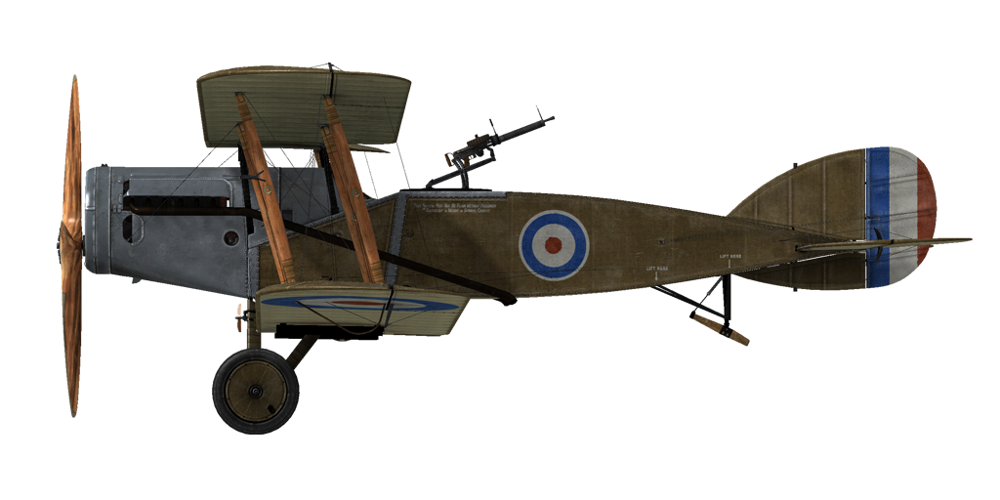

# Bristol F2B (F.III)  

| Image | Notes  
|:---|:---  
|  |   

## 描述  

布里斯托尔（Bristol）的设计开始于1916年3月，是为了取代B.E.双座机系列而产生的。它原先被设计为侦察机，但除此之外，新型飞机还必须能够执行侦察巡逻。 它配备了双联操纵装置、无线电、摄像设备，并配备了穿过整流罩射击的固定维克斯（Vickers）机枪，后部炮塔装有一或两把刘易斯（Lewis）机枪。   
  
布里斯托尔F.2A的第一架原型机于1916年9月试飞，并配备了劳斯莱斯（Rolls Royce）Mk.1发动机。 试飞成功后，飞机投入生产。第一支装备布里斯托尔抵达法国的战斗部队是第48中队，该中队于1917年3月8日抵达前线。   
  
第一次进攻巡逻于1917年4月5日进行，但对布里斯托尔来说却是一次灾难性的首次亮相。巡逻队由六架F.2A组成，由十字勋章获得者I.V.利菲-鲁滨逊上校（Captain I.V. Leefe-Robinson）领导。在杜埃（Douai）上空时，他们遭到曼弗雷德·冯·里希特霍芬（Manfred von Richthofen）率领的五架信天翁（Albatros） D.III的攻击，后者击落了两架布里斯托尔，取得了第三十五和第三十六次胜利。另外两架布里斯托尔，其中一架是利菲-鲁宾逊（Leefe-Robinson）亲自驾驶的，也被记录在里希特霍芬的战绩中。   
  
这次失败主要是由于第一批布里斯托尔飞行员使用的旧战术——因为他们用它来近距离编队飞行，而且只有防守战术。但是后来，随着飞行员获得了战斗经验，把布里斯托尔当做战斗机使用时，其被证明是一种出色的战斗机器。   
  
后来，布里斯托尔的机身做了一些改动，它还配备了新的“猎鹰二号（Falcon II）”和“猎鹰三号（Falcon III）”发动机，因此被重新命名为布里斯托尔F.2B，成为了一战中最好的，至少是最好的双座战斗机之一。   
由于缺少劳斯莱斯猎鹰发动机，因此其还安装了多种发动机，例如300 HP的希斯潘诺（Hispano)、Raf 4a、日光阿拉伯（Sunbeam Arab）和自由（Liberty）发动机。   
  
布里斯托尔速度快、爬升率高、坚固耐用、在俯冲中非常快，并且由有进攻性和经验丰富的飞行员驾驶，其很快就被敌人所畏惧。通常，如果数量不占优势，德国飞行员会选择避开布里斯托尔。   
驾驶驾驶F.2B型布里斯托尔最成功的王牌飞行员，来自第11中队的安德鲁·爱德华·麦基弗（Andrew Edward McKeever），他驾驶布里斯托尔击落了31架敌机。然而，他的战绩被战绩最高的观察员王牌查尔斯·乔治·加斯（Charles George Gass）超过，飞行时作为布里斯托尔机枪手，他击落了39架（！！！）！   
  
布里斯托尔在以战斗机著称的同时，也有能力成为优秀的对地攻击机。它可以在外部挂架上携带多达450 lb的炸弹。一些布里斯托尔还配备了凹透镜轰炸瞄准具。   
布里斯托尔战斗机是一种非常成功的飞机，在20世纪20年代一直被英国皇家空军中队使用。   
截至1918年底，布里斯托尔战斗机共生产了3101架。   
  
  
发动机：V-type 12缸劳斯莱斯猎鹰三号发动机  
功率：285 HP(2200 RPM)  
  
尺寸：  
高度：2970 mm  
长度：7874 mm  
翼展：11986 mm  
机翼面积：37.7 m²  
  
重量：  
空载重量：885 kg  
组员重量：160 kg  
燃油容量：170.5 L (127 kg)  
滑油容量：15.2 L (14 kg)  
不挂炸弹起飞：1262 kg  
带4 x 112 lb（203 kg）炸弹起飞：1465 kg   
带12 x 24 lb（131 kg）炸弹起飞：1393 kg   
  
速度（IAS），不挂炸弹：  
海平面——198 km/h  
1000——186 km/h  
2000——174 km/h  
3000——162 km/h  
4000——150 km/h  
5000——137 km/h  
6000——123 km/h  
  
爬升率，燃油装载，无炸弹：  
1000 m—— 2min 57s  
2000 m—— 6min 24s  
3000 m——10min 49s  
4000 m——16min 50s  
5000 m——26min 10s  
  
实用升限：5900 m  
理论升限：6900 m  
  
1000m高度的续航时间：  
标称动力（战斗）— 1h 50min  
最低消耗— 5h 10min  
  
武器:  
前射: 1 x 维克斯（Vickers）Mk.I 7.69mm，973发每弹鼓  
尾部上方位置：1 x 刘易斯（Lewis）7.69mm，7个弹鼓每个97发  
共计1652发 7.69mm子弹  
  
炸弹装载种类：  
12 x 24 lb (131 kg)  
8 x 24 lb + 2 x 112 lb(187 kg)  
4 x 112 lb (203 kg)  
2 x 112 lb (102 kg)  
共计203 kg  
  
参考  
1) Air Board Data Chart s，1917.  
2) Windsock Datafile Special Vol.1/Vol.2，by J.M. Bruce.  
3) Profile Publications The Bristol Fighter，Number 21.  
4) Bristol Fighter Pilot note s，1917.  
5) Rolls Royce engine chart s，1917.  
6) WWI Aeroplanes data，by J.M. Bruce.  
7) Bristol F2 Fighter Ace s，Osprey，AOF no.79.  
8) Various NACA reports.  
9) Various RFC trial reports on Bristol Fighter，1917-1918.  

## 修改  
### 阿尔迪斯（Alidas）瞄准具  

阿尔迪斯（Alidas）折射型直筒瞄准具  
增加质量：2 kg  

### 库珀（Cooper）/H.E.R.L. 炸弹  

最多12 x 11 kg（24 lb）通用炸弹  
增加质量：167 kg  
弹药质量：131 kg  
挂架质量：36 kg  
投弹前预期速度损失：7 km/h  
投弹后预期速度损失：3 km/h  
  
最多4 x 51 kg（112 lb）H.E.R.L. 通用炸弹  
增加质量：252 kg  
弹药质量：204 kg  
挂架质量：48 kg  
投弹前预期速度损失：8 km/h  
投弹后预期速度损失：4 km/h  
  
### 驾驶舱照明  

用于夜间飞行的驾驶舱照明灯  
增加质量：1 kg  
  
### 油量表  

指针式油量表（0-30 gal）  
增加质量：1 kg  
  
### 双翼上刘易斯（Lewis）机枪  

翼上加装可变位置的双刘易斯（Lewis）机枪。  
弹药：582发7.69mm弹药（6个弹鼓，每个97发）  
前方位置：0°  
上方位置：62°  
弹丸重量：11 g  
膛口速度：745 m/s  
射速：550 rpm  
枪炮重量：15 kg（无弹鼓）  
基座重量：8 kg  
弹药重量：24 kg  
总重：47 kg  
预期速度损失：4-14 km/h  

### 相机  

可拍摄航空照片的相机  
增加质量：10 kg  

### 无线电  

无线电发射机  
增加质量：10 kg  
  
### 双刘易斯（Lewis）机枪炮塔  

双刘易斯（Lewis）机枪的斯卡夫（Scarff）旋转炮塔  
弹药：776发7.69mm弹药（8个弹鼓，每个97发）  
弹丸重量：11 g  
膛口速度：745 m/s  
射速：550 rpm  
枪炮重量：15 kg（无弹鼓）  
基座重量：12 kg  
弹药重量：32 kg  
总重：59 kg  
预期速度损失：2 km/h  
