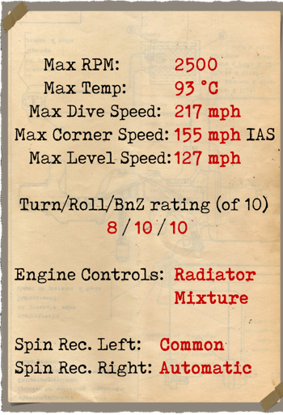
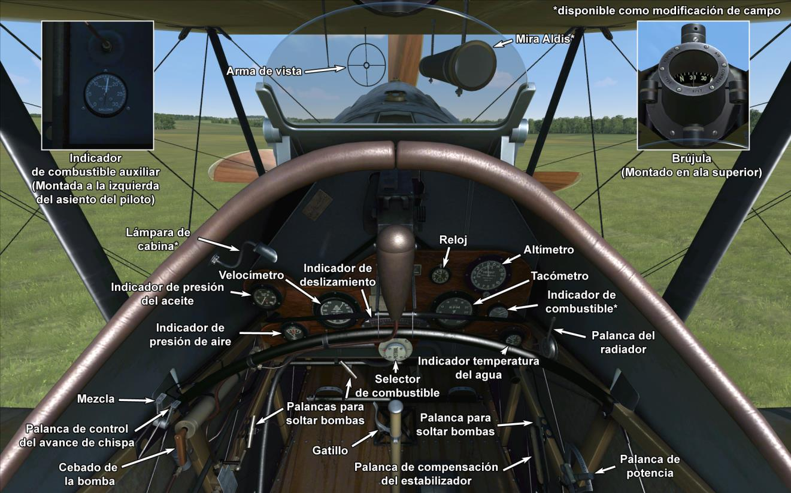

# Bristol F2B (F.III)  

<table><tbody><tr><td style="text-align: center"></td><td style="text-align: center"></td></tr><tr><td style="text-align: center" colspan="2"></td></tr></tbody></table>  

El diseño del Bristol se inició en marzo de 1916 con el propósito de reemplazar las series del biplaza B.E. Fue diseñado como avión de reconocimiento, pero también iba a tener que ser capaz de realizar patrullas de caza. Para tales fines fue suministrado con controles duales, radio inalámbrica y cámara, y armado con una ametralladora fija Vickers capaz de disparar a través de la cubierta del motor y un puesto de artillero trasero con una o dos ametralladoras Lewis.  
  
El primer prototipo del Bristol F.2A voló en septiembre de 1916, equipado con un motor Rolls Royce Mk.1. Después de completar con éxito sus pruebas, el modelo entró en producción. La primera unidad de combate en Francia que recibió F.2As fue el No. 48 Squadron, que comenzó a recibir el modelo el 8 de marzo de 1917.  
  
La primera patrulla ofensiva aconteció el 5 de abril de 1917, pero el debut resultó ser un desastre. La patrulla estaba formada por seis F.2A y liderada por el capitán Leefe-Robinson, C.V. El vuelo fue atacado sobre Douai por cinco Albatros D.III liderados por Manfred von Richthofen, que derribó dos de los Bristol para sumar su trigésimo quinta y trigésimo sexta victoria. Los pilotos de Richthofen dieron buena cuenta de otros dos Bristol, uno de ellos pilotado por el propio Leefe-Robinson.  
  
Este fracaso fue debido principalmente a las tácticas obsoletas utilizadas por los pilotos de los Bristol – volaban en formación cerrada y confiaban solamente en las maniobras defensivas. Sin embargo, cuando los pilotos ganaron experiencia en combate, el F.2 se reveló como una gran máquina de combate cuando se utilizaba como avión de caza.  
  
Algunos cambios realizados con posterioridad en la estructura del F.2 y sus nuevos motores Falcon II y Falcon III, provocaron una nueva designación como Bristol F.2B. Junto a la mejora en las tácticas empleadas, estas modificaciones convirtieron al F.2B en uno de los mejores –si no el mejor- cazas biplazas de la Primera Guerra Mundial. A causa de la escasez de motores Rolls Royce, se instalaron una amplia variedad de motores, como el Hispano-Suiza de 300 caballos, RAF 4A, Sunbeam Arab y Liberty.  
  
Rápido, con una buena tasa de ascenso, resistente, muy rápido en los picados y en manos de pilotos agresivos y experimentados, los F.2B pronto se convirtieron en el terror de sus oponentes. Los pilotos alemanes, por lo general, preferían evitar los Bristol si no tenían ventaja numérica.  
  
El As de mayor éxito que pilotó un F.2B, Andrew Edward McKeever del escuadrón No. 11, se anotó unas impresionantes 31 victorias volando Bristols. Sin embargo, su registro fue eclipsado por el mayor número de victorias de un observador en toda la guerra, 39, conseguidas por Charles George Gass mientras volaba como artillero de un Bristol.  
  
Excelente como caza, El F.2 fue también capaz de ser un buen avión de ataque a objetivos en tierra. Podía llevar hasta 450 lb de bombas en bastidores externos. Algunos de los Bristol estaban también equipados con visor de bombardeo con lentes divergentes.  
  
A finales de 1918, se habían fabricado un total de 3101 cazas Bristol contando todas sus variantes. Debido a su éxito en tiempos de guerra, continuaron su servicio con la RAF en la década de 1920.  
  
  
Motor:  
Rolls Royce Falcon III de 12 cilindros en V, 285 CV (2200 rpm)  
  
Dimensiones:  
Altura: 2970 mm  
Longitud: 7874 mm  
Envergadura alar: 11986 mm  
Superficie de ala: 37,7 m²  
  
Peso:  
Vacío: 885 kg  
Tripulación: 160 kg  
Capacidad de combustible: 170,5 l (127 kg)  
Capacidad de aceite: 15,2 l (14 kg)  
Al despegue sin bombas: 1262 kg  
Al despegue con 4 bombas de 112 lb (203 kg): 1465 kg  
Al despegue con 12 bombas de 24 lb (131 kg): 1393 kg  
  
Velocidad (IAS), sin bombas:  
Nivel del mar - 198 km/h  
1000 - 186 km/h  
2000 - 174 km/h  
3000 - 162 km/h  
4000 - 150 km/h  
5000 - 137 km/h  
6000 - 123 km/h  
  
Tasa de ascenso, depósito combustible lleno, sin bombas:  
1000 m -  2 min 57 s  
2000 m -  6 min 24 s  
3000 m - 10 min 49 s  
4000 m - 16 min 50 s  
5000 m - 26 min 10 s  
  
Techo de servicio: 5900 m  
Techo teórico: 6900 m  
  
Autonomía a 1000 m:  
Potencia nominal (combate) — 1 h 50 min  
Consumo mínimo — 5 h 10 min  
  
Armamento:  
Disparo frontal: 1 Vickers Mk.I de 7,69 mm, 973 balas  
Artillero de cola: 1 Lewis de 7,69 mm, 7 tambores con 97 balas cada uno  
Total de 1652 balas de 7,69 mm  
  
Variaciones en la carga de bombas:  
12 bombas de 24 lb (131 kg)  
8 bombas de 24 lb + 2 de 112 lb (187 kg)  
4 bombas de 112 lb (203 kg)  
2 bombas de 112 lb (102 kg)  
Peso máximo en bombas: 203 kg  
  
Referencias:  
1) Air Board Data Charts, 1917.  
2) Windsock Datafile Special Vol.1/Vol.2, por J.M. Bruce.  
3) Profile Publications The Bristol Fighter, número 21.  
4) Bristol Fighter Pilot notes, 1917.  
5) Rolls Royce engine charts, 1917.  
6) WWI Aeroplanes data, por J.M. Bruce.  
7) Bristol F2 Fighter Aces, Osprey, AOF no.79.  
8) Various NACA reports.  
9) Various RFC trial reports on Bristol Fighter, 1917-1918.  

## Modificaciones  
### Aldis  

Colimador reflectante Aldis  
Peso adicional: 2 kg  
  
### Bombas Cooper / H.E.R.L.  

Hasta 12 bombas de propósito general de 24 lb (11 kg) Cooper  
Peso adicional: 167 kg  
Peso de munición: 131 kg  
Peso de los soportes: 36 kg  
Pérdida de velocidad estimada antes de soltar: 7 km/h  
Pérdida de velocidad estimada tras soltar: 3 km/h  
  
Hasta 4 bombas de propósito general de 112 lb (51 kg) H.E.R.L.  
Peso adicional: 252 kg  
Peso de munición: 204 kg  
Peso de los soportes: 48 kg  
Pérdida de velocidad estimada antes de soltar: 8 km/h  
Pérdida de velocidad estimada tras soltar: 4 km/h  
  
### Luz de cabina  

Lámpara para iluminar la cabina en las salidas nocturnas  
Peso adicional: 1 kg  
  
### Indicador nivel de combustible  

Indicador analógico del nivel de combustible (0-30 Galones)  
Peso adicional: 1 kg  
  
### Doble Lewis sobre ala superior  

Dos ametralladoras Lewis sincronizadas adicionales de posición variable montadas sobre el ala superior.  
Munición: 582 balas de 7,69 mm (6 tambores con 97 balas cada uno)  
Posición hacia delante: 0  
Posición hacia arriba: 62º  
Peso del proyectil: 11 g  
Velocidad de salida: 745 m/s  
Tasa de disparo: 550 bpm  
Peso de las armas: 15 kg (sin cargador)  
Peso de los soportes: 8 kg  
Peso de la munición: 24 kg  
Peso total: 47 kg  
Pérdida de velocidad estimada: 4-14 km/h  
  
### Cámara de fotos  

Cámara para tomar fotografías aéreas  
Peso adicional: 10 kg  
  
### Radio  

Radiotransmisor  
Peso adicional: 10 kg  
  
### Doble Lewis en artillero  

Dos ametralladoras Lewis sincronizadas sobre anillo Scarff en la posición del artillero.  
Munición: 776 balas de 7,69 mm (8 tambores con 97 balas cada uno)  
Peso del proyectil: 11 g  
Velocidad de salida: 745 m/s  
Tasa de disparo: 550 bpm  
Peso de las armas: 15 kg (sin cargador)  
Peso de los soportes: 12 kg  
Peso de la munición: 32 kg  
Peso total: 59 kg  
Pérdida de velocidad estimada: 2 km/h  
