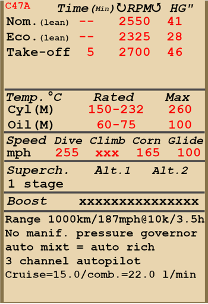

# C-47A  

<table><tbody><tr><td style="text-align: center"></td><td style="text-align: center"></td></tr></td></tr></tbody></table>  

Überziehgeschwindigkeit in Flugkonfiguration: 73...88 mph (118...142 km/h)  
Überziehgeschwindigkeit in Landekonfiguration: 67...77 mph (107...124 km/h)  
Höchstzulassige Geschwindigkeit im Sturzflug: 255 mph (410 km/h)  
Bruchlastvielfache: 5.0 G  
Kritischer Anstellwinkel in Flugkonfiguration: 13 °  
Kritischer Anstellwinkel in Landekonfiguration: 12.5 °  
  
Höchstgeschwindigkeit in Bodennähe, take-off: 365 km/h (227 mph)  
Höchstgeschwindigkeit in 2000 m (6562 Fuß) Höhe, take-off: 394 km/h (245 mph)  
  
Höchstgeschwindigkeit in Bodennähe, economical maximum: 288 km/h (179 mph)  
Höchstgeschwindigkeit in 5000 m (16404 Fuß) Höhe, economical maximum: 348 km/h (216 mph)  
  
Dienstgipfelhohe: 8000 m (26247 feet)  
Steigleistung in Bodennähe: 6,7 m/s (1319 fpm)  
Steigleistung in 3000 m Höhe: 6,2 m/s (1220 fpm)  
Steigleistung in 6000 m Höhe: 2,9 m/s (571 fpm)  
  
Maximale Wendegeschwindigkeit in Bodennähe: 22,0 s, bei 175 mph (282 km/h) IAS.  
Maximale Wendegeschwindigkeit in 3000 m (9843 Fuß) Höhe: 31,0 s, bei 165 mph (262 km/h) IAS.  
  
Reichweite in 3000 m: (9843 Fuß): 3,5 h, bei 300 km/h (187 mph) IAS.  
  
Startgeschwindigkeit: 75...85 mph (121..137 km/h)  
Anfluggeschwindigkeit: 95..105 mph (153..169 km/h)  
Landegeschwindigkeit: 70..80 mph (112..128 km/h)  
Sinkflugpfad: 11,5 °  
  
Anmerkung 1: Die Werte gelten für Normatmosphäre (ISA).  
Anmerkung 2: Flugleistungen varrieren je nach Abfluggewicht.  
Anmerkung 3: Höchstgeschwindigkeiten, Steigleistungen und Wendegeschwindigkeiten gelten für Standard-Fluggewicht.  
Anmerkung 4: Steigraten gelten für maximum continuous, Wendegeschwindigkeiten gelten für Take-off.  
  
Triebwerk:  
Baumuster: R-1830-92  
take-off mode in Bodennähe: 1170 PS  
maximum continuous mode in Bodennähe: 1030 PS  
economical maximum mode in Bodennähe: 590 PS  
  
take-off mode in 4800 m (1463 Fuß) Höhe: 1200 PS  
maximum continuous mode in 7000 m (2134 Fuß) Höhe: 1050 PS  
economical maximum mode in 15000 m (4572 Fuß) Höhe: 700 PS  
  
Leistungsstufen:  
take-off mode (bis zu 5 Minuten): 2700 U/min, 46,0 inch Hg, "Auto-rich"  
maximum continuous mode (unbegrenzt): 2550 min, 41 inch Hg, "Auto-lean"  
economical maximum mode (unbegrenzt): 2325 min, 28,0 inch Hg, "Auto-lean"  
  
Schmierstoffaustrittstemperatur (normal): 60..75 °C  
Schmierstoffaustrittstemperatur (höchstens): 100 °C  
Zylinderkopftemperatur (normal): 150..232 °C  
Zylinderkopftemperatur (höchstens): 260 °C  
  
Leergewicht: 8029 kg (17700 lb)  
Minimalgewicht (keine Munition, 10% Treibstoff): 8828 kg (19462 lb)  
Normalgewicht: 6503 kg (14337 lb)  
Höchstabfluggewicht: 13337 (29403 lb)  
Kraftstoffmenge: 2188 kg (4824 lb) / 3043 l (804 gal)  
Nutzlast: 5308 kg (11702 lb)  
  
Länge: 64,8 Fuß (19,75 m)  
Spannweite: 28,96 m (95 Fuß)  
Flügelfläche: 91,7 m² (987 Fuß²)  
  
Erster Fronteinsatz: Frühling 1942  
  
Eigenschaften:  
- Der Motor hat keine automatische Regelung des Ladedrucks. Deshalb ist der Ladedruck nicht nur von der Stellung des Schubhebels, sondern auch von der Drehzahl und der Flughöhe abhängig. Dies erfordert eine zusätzliche Kontrolle der Ladedruckanzeige, um einen Motorschaden zu verhindern.  
- Der Motor ist mit einer automatischen Gemischregelung ausgestattet, welche das optimale Gemisch beibehält, wenn sich der Hebel in der "Auto Rich" (66%) Position befindet. Für ein automatisch geregeltes abgemagertes Gemisch zur Reduzierung des Treibstoffverbrauchs, muss der Hebel auf die "Auto Lean" (33%) verstellt werden. Im Falle eines Ausfalls der automatischen Regelung sollte der Hebel auf "Emergency" (100%) verstellt werden. Um den Motor abzustellen sollte der Gemischhebel auf "Idle Cut Off" (0%) verstellt werden.  
- Der Motor besitzt eine automatische Drehzahlregelung, welche die Motordrehzahl je nach Hebelstellung festlegt. Der Regler verstellt automatisch den Anstellwinkel des Propellers um die erforderliche Drehzahl einzuhalten.  
- Ölkühlerklappen und Auslass-Kühlklappen werden manuell bedient.  
- Das Flugzeug verfügt über Höhen-, Seiten- und Querrudertrimmung.  
- Die Landeklappen sind hydraulisch geregelt und können bis zu einem Winkel von 50° ausgefahren werden.  
- Das Flugzeug hat links und rechts unabhängig gesteuerte hydraulische Bremsen. Um die Bremsen zu betätigen, muss der obere Teil der Ruderpedale nach vorne gedrückt werden.  
- Das Flugzeug ist mit einer Parkbremse ausgestattet.  
- Das Flugzeug ist mit oberen Positionslichtern ausgestattet, Erkennungs ausgestattet und Landescheinwerfern.   
- Der Motor hat einen Einesganglader.  
- Das Flugzeug hat eine Anzeige, welche den Treibstoffstand des Tanks je nach Position des Treibstoffstandschalters anzeigt. In der Simulation wechselt der Schalter selbständig alle 10 Sekunden. Im Simulator ändert sich der Schalter durch Drücken von (Shift+I).  
- Das Flugzeug hat eine manuelle Spornradverriegelung. Das Spornrad sollte bei längerem Geradeausrollen, sowie beim Abflug und bei der Landung verriegelt werden.  
- The aircraft is equipped with three-channel autopilot system (main switch RAlt + A). Pilot has the ability to trim course (RAlt + Left/Right), pitch (RAlt + Up/Down) and roll (RShift + Left/Right) stabilizing angles.  
- Die Frachttüren können nur am Boden geöffnet werden.  
- Die linke Passagiertüre muss vor dem Flug entfernt werden, um Fallschirmjäger und Frachtbehälter abwerfen zu können. Verwenden Sie die Taste für den Bombenabwurf (Standardtaste "B"), um sie abzuwerfen.  
  
Basic data and recommended positions of the aircraft controls:  
1. Starting the engine:  
	- recommended position of the mixture control lever: Emergency  
	- recommended position of the cowl flaps control handle: open  
	- recommended position of the radiator control handle: open  
	- recommended position of the prop pitch control handle: 0%  
	- recommended position of the throttle lever: 20%  
	- before taxiing, you must unlock the tailwheel  
	- before taxiing, the parking brake must be released  
  
2. Recommended mixture control lever positions for various flight modes: Auto Rich (auto mixture control) (Auto Lean if necessary to save fuel)  
  
3.1 Recommended positions of cowl flaps for various flight modes:  
	- takeoff: open 100%  
	- climb: open 100%  
	- cruise flight: open 40% (in winter conditions - close if necessary)  
	- combat: open 50%  
  
3.2 Recommended positions of the oil radiator control handle for various flight modes:  
	- takeoff: open 50%  
	- climb: open 100%  
	- cruise flight: open 20% (in winter conditions - close if necessary)  
	- combat: open 50%  
4. Approximate fuel consumption at 2000 m altitude:  
	- Cruise engine mode: 15.0 l/min  
	- Combat engine mode: 22.0 l/min  

## Änderungen  
### Luftfracht, 2315kg  

2315kg militärische Luftfracht  
Zusätzliches Gewicht: 2315 kg  
Geschwindigkeitsverlust: 2 mph (4 km/h)  
  
### 14 x A-5 Behälter  

Abwurfbehälter mit Fallschrim A-5  
Zusätzliches Gewicht: 1540 kg  
Gewicht der Munition: 1540 kg  
Gewicht der Abwurfwaffenroste: 0 kg  
Geschwindigkeitsverlust vor Abwurf: 5 mph (8 km/h)  
Geschwindigkeitsverlust nach Abwurf: 4 mph (6 km/h)  
  
### 6 x A-5 Behälter  

Abwurfbehälter mit Fallschrim A-5  
Zusätzliches Gewicht: 765 kg  
Gewicht der Munition: 660 kg  
Gewicht der Abwurfwaffenroste: 105 kg  
Geschwindigkeitsverlust vor Abwurf: 11 mph (18 km/h)  
Geschwindigkeitsverlust nach Abwurf: 9 mph (14 km/h)  
  
### Gleitpfadsystem  

Gleitpfadsystem für automatisierten Landeanflug  
Zusätzliches Gewicht: 15 kg  
Geschwindigkeitsverlust: 1 km/h  
  
### 16 Fallschirmjäger  

16 bewaffnete Fallschirmjäger  
Zusätzliches Gewicht: 1600 kg  
Geschwindigkeitsverlust vor Abwurf: 2 km/h  
Geschwindigkeitsverlust nach Abwurf: 0 km/h  
