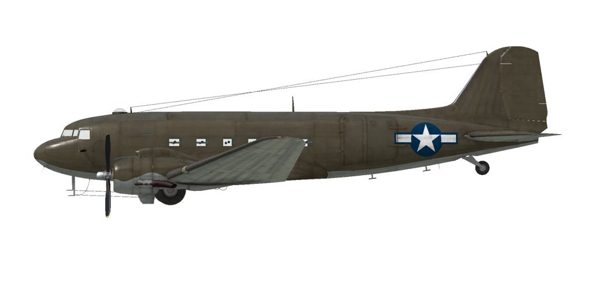

# C-47A  

  

## Descripción  

Velocidad indicada de pérdida en configuración de vuelo: 118..142 km/h (73..88 mph)  
Velocidad indicada de pérdida en configuración de despegue/aterrizaje: 107..124 km/h (67..77 mph)  
Velocidad de picado límite: 410 km/h (255 mph)  
Carga de rotura máxima (en fuerzas <i>g</i>): 5 <i>g</i>  
Ángulo de ataque crítico en configuración de vuelo: 13°  
Ángulo de ataque crítico en configuración de aterrizaje: 12,5°  
  
Velocidad respecto al suelo al nivel del mar, modo motor - Despegue: 365 km/h (227 mph)  
Velocidad máxima respecto al suelo a 2000 m (6562 ft), modo motor - Despegue: 394 km/h (245 mph)  
  
Velocidad respecto al suelo al nivel del mar, modo motor - Máximo ahorro: 288 km/h (179 mph)  
Velocidad máxima respecto al suelo a 5000 m (16404 ft), modo motor - Máximo ahorro: 348 km/h (216 mph)  
  
Techo de servicio: 8000 m (26247 ft)  
  
Tasa de ascenso al nivel del mar: 6,7 m/s (1319 ft/min)  
Tasa de ascenso a 3000 m (9843 ft): 6,2 m/s (1220 ft/min)  
Tasa de ascenso a 6000 m (19685 ft): 2,9 m/s (571 ff/min)  
  
Viraje de máximo rendimiento al nivel del mar: 22,0 s, a 282 km/h (175 mph) velocidad indicada (IAS).  
Viraje de máximo rendimiento a 3000 m (9843 ft): 31,0 s, a 262 km/h (165 mph) velocidad indicada (IAS).  
  
Autonomía de vuelo a 3000 m (9843 ft): 3,5 h, a 300 km/h (187 mph) velocidad indicada (IAS).  
  
Velocidad de despegue: 121..137 km/h (75..85 mph)  
Velocidad senda de planeo: 153..169 km/h (95..105 mph)  
Velocidad de aterrizaje: 112..128 km/h (70..80 mph)  
Ángulo de aterrizaje: 11,5°  
  
Nota 1: los datos están basados en la atmósfera estándar internacional (ISA).  
Nota 2: diferentes rendimientos de vuelo dados para los diferentes pesos posibles del avión.  
Nota 3: velocidades máximas, tasas de ascenso y tiempos de giro dados para el peso estándar del avión.  
Nota 4: tasas de ascenso están dadas para el modo motor - Máximo continuo; tiempos de giro para el modo Despegue.  
  
Motor:  
Modelo: R-1830-92  
Potencia máxima en modo Despegue al nivel del mar: 1170 CV  
Potencia máxima en modo Máximo continuo al nivel del mar: 1030 CV  
Potencia máxima en modo Máximo ahorro al nivel del mar: 590 CV  
  
Potencia máxima en modo Despegue a 1463 m (4800 ft): 1200 CV  
Potencia máxima en modo Máximo continuo a 2134 m (7000 ft): 1050 CV  
Potencia máxima en modo modo Máximo ahorro a 4572 m (15000 ft): 700 CV  
  
Modos de funcionamiento motor:  
Despegue (hasta 5 minutos): 2700 rpm, 46,0 inHg, «Auto-rich»  
Máximo continuo (sin límite de tiempo): 2550 rpm, 41 inHg, «Auto-lean»  
Máximo ahorro (sin límite de tiempo): 2325 rpm, 28,0 inHg, «Auto-lean»  
  
Temperatura nominal del aceite a la salida del motor: 60..75 °C  
Temperatura máxima del aceite a la salida del motor: 100 °C  
Temperatura nominal en la culata: 150..232 °C  
Temperatura máxima en la culata: 260 °C  
  
Peso vacío: 8029 kg (17700 lb)  
Peso mínimo (sin munición, 10% de combustible): 8828 kg (19462 lb)  
Peso estándar: 6503 kg (14337 lb)  
Peso máximo al despegue: 13337 kg (29403 lb)  
Carga de combustible: 2188 kg (4824 lb) / 3043 l (804 gal)  
Carga útil: 5308 kg (11702 lb)  
  
Longitud: 19,75 m (64,8 ft)  
Envergadura alar: 28,96 m (95 ft)  
Superficie de ala: 91,7 m² (987 ft²)  
  
Debut en combate: primavera de 1942  
  
Características operativas:  
- El motor no tiene regulador automático de la presión en el colector. Esta presión no depende solo de la posición de la palanca de potencia, sino también de las rpm y la altitud. Por ello, es necesario revisar a menudo la presión en el colector para no dañar el motor.  
- El motor está equipado con un sistema de control automático de la mezcla que la mantiene en su grado óptimo cuando la palanca de control de la mezcla está en la posición «Auto Rich» (66%). Para usar el empobrecimiento automático de la mezcla y reducir el consumo de combustible durante el vuelo es necesario fijar la palanca en la posición «Auto Lean» (33%). En caso de mal funcionamiento del control automático de la mezcla, la palanca debería situarse en la posición «Emergency» (100%). Para apagar el motor, la palanca debe situarse en la posición «Idle Cut Off» (0%).  
- El motor tiene un regulador automático de las rpm que las mantiene al valor correspondiente a la posición de la palanca de control del regulador. Este regulador controla automáticamente el paso de la hélice para mantener las rpm requeridas.  
- Las persianas de los radiadores de aceite y las persianas de salida del carenado del motor se controlan de forma manual.  
- El avión tiene compensadores para todos los controles de vuelo: cabeceo, alabeo y guiñada.  
- Los flaps tienen un accionador hidraúlico y pueden bajarse gradualmente hasta formar un ángulo de 50°.  
- El avión posee unos controles hidráulicos independientes para el frenado de la rueda izquierda y derecha. Para frenar cada una de ellas es necesario empujar la parte superior del pedal del control de timón correspondiente.  
- El avión está equipado con un sistema de freno de estacionamiento.  
- El avión está equipado con luces de aterrizaje, navegación y formación.  
- El motor tiene un compresor mecánico de una etapa.  
- El avión cuenta con un indicador de combustible que muestra la cantidad de combustible remanente en el depósitos dependiendo de la posición del selector. En la simulación el selector conmuta de posición entre depósitos presionando «Mayús_Dcha + I».  
- El avión cuenta con un control manual para bloquear la rueda de cola. Se debe bloquear la rueda cuando se vaya a rodar en línea recta durante un tramo largo y antes del despegue y aterrizaje.  
- El avión está equipado con un sistema de piloto automático de tres canales (interruptor principal «Alt_dcha + A»). El piloto tiene la capacidad de ajustar el rumbo (control guiñada con «Alt_Dcha + Flecha Izquierda/Derecha»), los ángulos del estabilizador (control cabeceo con «Alt_dcha + Flecha Arriba/Abajo») y los ángulos del inclinación (control cabeceo con «Mayús_Dcha + Flecha Izquierda/Derecha»).  
- La puertas de la zona de carga solo se pueden abrir en tierra.  
- La puerta izquierda de pasajeros debe ser retirada antes de iniciar el vuelo para permitir el salto de paracaidistas o el lanzamiento de contenedores de carga. Usa el botón de arrojar bombas («B» por defecto) para ordenar el salto o lanzamiento.  
  
Datos básicos y configuraciones recomendadas de los controles del avión:  
1. Arranque del motor:  
	- palanca de control de la mezcla: «Emergency»  
	- aletas/persianas del carenado: abiertas  
	- radiador de aceite: abierto  
	- palanca de control del paso de la hélice: 0%  
	- palanca de potencia: 20%  
	- antes de empezar a rodar, desbloquear rueda de cola  
	- antes de empezar a rodar, quitar el freno de estacionamiento  
  
2. Posición de la palanca de control de mezcla según momento de vuelo: «Auto Rich» («Auto Lean» si necesario ahorrar combustible)  
  
3.1 Posición de las aletas/persianas del carenado según momento de vuelo:  
	- despegue: abiertas 100%  
	- ascenso: abiertas 100%  
	- crucero: abiertas 40% (en condiciones invernales - cerrar si necesario)  
	- combate: abiertas 50%  
  
3.2 Posición del radiador de aceite según momento de vuelo:  
	- despegue: abierto 50%  
	- ascenso: abierto 100%  
	- crucero: abierto 20% (en condiciones invernales - cerrar si necesario)  
	- combate: abierto 50%  
  
4. Consumo aproximado de combustible a 2000 m de altitud:  
	- Modo motor - Crucero: 15,0 l/min  
	- Modo motor - Combate: 22,0 l/min  

## Modificaciones  
### 2315 kg de carga en cajas  

2315 kg de cargamento militar en cajas  
Peso adicional: 2315 kg  
Pérdida de velocidad estimada: 2 mph (4 km/h)  
  
### 14 contenedores lanzables A-5  

14 contenedores de transporte de 250 lb (110 kg) con paracaídas A-5  
Peso adicional: 1540 kg  
Peso de contenedores: 1540 kg  
Peso de los soportes: 0 kg  
Pérdida de velocidad estimada antes de soltar: 5 mph (8 km/h)  
Pérdida de velocidad estimada tras soltar: 4 mph (6 km/h)  
  
### 6 contenedores lanzables A-5  

6 contenedores de transporte de 250 lb (110 kg) con paracaídas A-5  
Peso adicional: 765 kg  
Peso de contenedores: 660 kg  
Peso de los soportes: 105 kg  
Pérdida de velocidad estimada antes de soltar: 11 mph (18 km/h)  
Pérdida de velocidad estimada tras soltar: 9 mph (14 km/h)  
  
### Sistema de aterrizaje instrumental  

Sistema localizador de la senda de planeo para una aproximación de aterrizaje instrumental  
Peso adicional: 15 kg  
Pérdida de velocidad estimada: 1 km/h  
  
### 16 paracaidistas  

16 paracaidistas armados  
Peso adicional: 1600 kg  
Pérdida de velocidad estimada antes de soltar: 2 km/h  
Pérdida de velocidad estimada tras soltar: 0 km/h  
