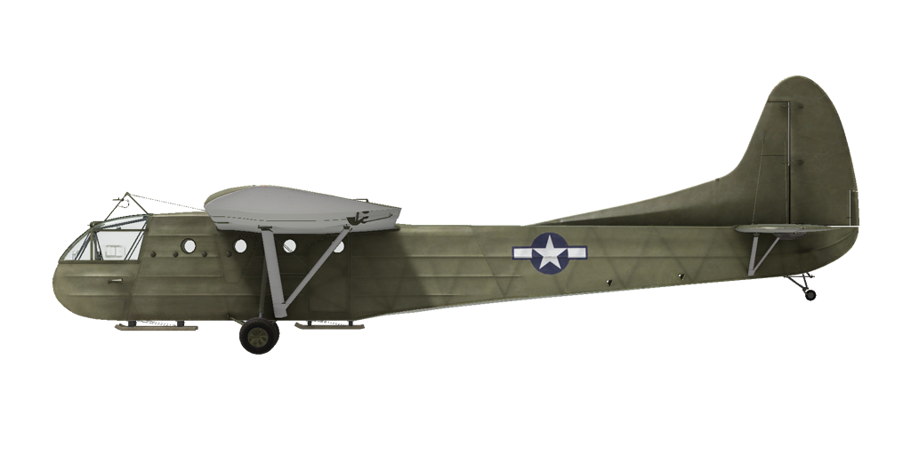

# CG-4A  
  
  
  
## 描述  
  
飞行构型的失速指示空速：65~86 km/h  
俯冲极速：241 km/h  
最大过载：3.5 G  
飞行构型失速迎角：16°  
  
起飞速度：86~113 km/h  
进近速度：98~128 km/h  
着陆速度：81~106 km/h  
着陆迎角：8.0°  
  
Optimal descent speed on glideslope: 2 m/s  
  
注1：所提供的数据适用于国际标准大气（ISA）。  
注2：飞行性能范围基于可能的飞机质量范围。  
  
空重：1769 kg  
最小重量：2383 kg  
标准重量：3402 kg  
最大起飞重量：4082 kg  
有效载荷：2313 kg  
  
长度：14.73 m  
翼展：25.2 m  
机翼面积：79.25 m²  
  
首次投入战斗：1943年7月  
  
操作特性：  
- The glider is equipped with a towing mechanism with a detachable cable. The cable could be released upon command from the glider pilot, or from the pilot of the towing aircraft (by default, LShift+D).  
- The airframe has interceptor spoilers with a manual mechanical drive, which, when released (by default, RAlt+B), reduce the lift of the wing and increase the drag, thereby shortening the glide path.  
- The front part of the glider is a crew cabin, which on the ground can be tilted upward for loading and unloading cargo or troops.  
- The aircraft has independent left and right pneumatic wheel brake controls. To apply either brake push the upper part of the rudder pedal.  
- The airplane tail wheel rotates freely and does not have a lock.  
- To provide shorter landing run drogue chute could be installed as modification. Maximum speed of drogue chute release (LAlt + D) is 225 km/h. After successfull landing and braking drogue chute should be jettisoned (LAlt + D).  
  
## 修改  
  
  
### 漏斗形减速伞  
  
安装减速伞以减少着陆滑行距离  
增加重量：32 kg  
预计速度降低：2 km/h  
  
### 1000 kg货物  
  
装载1000 kg军用物资  
增加质量：1000 kg  
  
  
  
### 13名伞兵  
  
搭载13名全副武装的伞兵  
增加质量：1415 kg  
  
  
### Willys MB  
  
Willys MB 1⁄4 ton 4x4 utility truck  
Additional mass: 1630 kg  