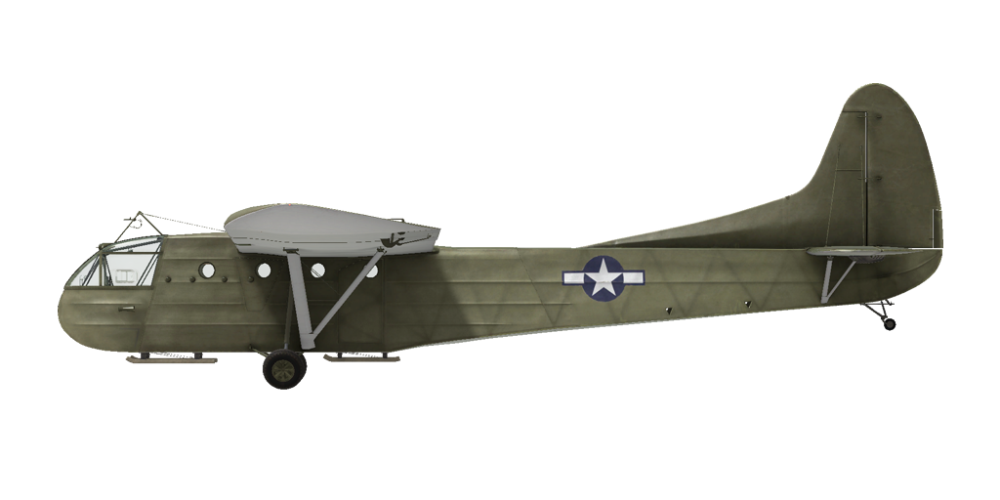
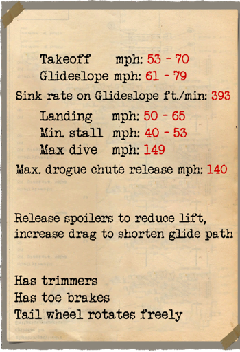

# CG-4A  

  
  

## Description  

Vitesse de décrochage indiquée en configuration de vol : 65..86 km/h  
Vitesse limite de piqué : 241 km/h  
Facteur de charge maximum : 3,5 g  
Angle d\attaque de décrochage en configuration de vol : 16 °  
  
Vitesse de décollage : 86..113 km/h  
Vitesse d\approche : 98..128 km/h  
Vitesse d\atterrissage : 81..106 km/h  
Angle d\atterrissage : 8 °  
  
Vitesse de descente optimale sur d\approche : 2 m/s  
  
Note 1 : les données sont indiquées à l\atmosphère standard international (ISA).  
Note 2 : les performances d\endurance sont données pour plusieurs masses possibles.  
  
Masse à vide : 1769 kg  
Masse minimale : 2383 kg  
Masse standard : 3402 kg  
Masse maximale au décollage : 4082 kg  
Charge utile : 2313 kg  
  
Longueur : 14,73 m  
Envergure : 25,2 m  
Surface alaire : 79,25 m²  
  
Premier engagement : Juillet 1943  
  
Caractéristiques  
- The glider is equipped with a towing mechanism with a detachable cable. The cable could be released upon command from the glider pilot, or from the pilot of the towing aircraft (by default, LShift+D).  
- The airframe has interceptor spoilers with a manual mechanical drive, which, when released (by default, RAlt+B), reduce the lift of the wing and increase the drag, thereby shortening the glide path.  
- The front part of the glider is a crew cabin, which on the ground can be tilted upward for loading and unloading cargo or troops.  
- The aircraft has independent left and right pneumatic wheel brake controls. To apply either brake push the upper part of the rudder pedal.  
- The airplane tailwheel rotates freely and does not have a lock.  
- To provide shorter landing run drogue chute could be installed as modification. Maximum speed of drogue chute release (LAlt + D) is 225 km/h. After successfull landing and braking drogue chute should be jettisoned (LAlt + D).  

## Modifications  
### Braking Parachute  

Installation of braking parachute for shortening the ground roll when landing  
Additional mass: 32 kg  
Estimated speed loss: 2 km/h  
  
### Cargaison, 1000 kg  

Cargaison militaire, 1000 kg  
Masse supplémentaire : 1000 kg  
  
### 13 troops  

13 troops armés  
Masse supplémentaire : 1415 kg  
  
### Willys MB  

Willys MB 1⁄4 ton 4x4 utility truck  
Additional mass: 1630 kg  
