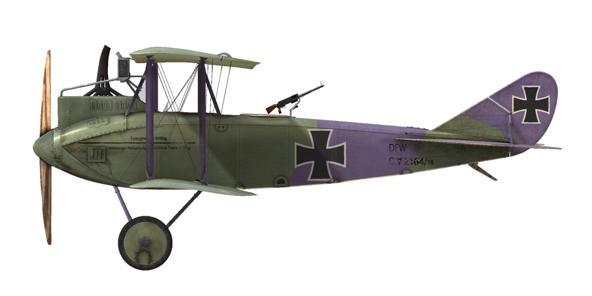

# DFW C.V  

  
  

## 描述  

The DFW C.V was a two-seater biplane plane designed and produced at the Deutsche Flugzeug Werke near Leipzig. In designing the aircraft, DFW\s designers aimed to create a light but durable airframe. Its structural features included a metal-covered strut in the tail section, a metal cowl protecting the engine, two hollow spars in the wings, and floating ribs. The radiator was mounted above the engine.  
  
The aircraft\s first flight occurred on July 11, 1916. After its official trials were completed, the aircraft was sent to the front line where it received perfect reviews. At this point, mass production commenced at other factories, including Aviatik, LVG, and Halberstadt. By the end of the war, 3955 planes of the type had been produced. The C.V became the most numerous German aircraft in its class in WWI.  
  
The DFW C.V entered service in October 1916, initially being sent to special Luftstreitkräfte regiments. Schutzstaffeln began receiving the aircraft in March 1917. The plane was mainly used for bomber escort, artillery spotting, recon, aerial photo reconnaissance and as a personal aircraft in fighter squadrons.  
  
Among its advantages, pilots noted the aircraft\s ease of controls and of landing, high climb speed, and good visibility for the observer/gunner. Some frontline reports mentioned equal manoeuvrability to that of the Bristol F.2B Fighter, easy field maintenance, and very good structural durability.  
  
  
发动机: inline 6 cyl. Benz Bz.IV  
功率: 230 hp  
  
尺寸:  
高度: 3140 mm  
长度: 7880 mm  
翼展: 13270 mm  
机翼面积: 41.52 m²  
  
重量:  
空载重量: 948.5 kg  
不挂炸弹起飞: 1330 kg  
燃油容量: 140 l  
滑油容量: 36 l  
  
速度（IAS），不挂炸弹：  
海平面——157 km/h  
1000——149 km/h  
2000——140 km/h  
3000——132 km/h  
4000——123 km/h  
5000——113 km/h  
  
爬升率，燃油装载，无炸弹：  
1000 m—— 4min 1 s   
2000 m—— 8min 44 s  
3000 m—— 15min 4 s  
4000 m—— 23min 55 s  
5000 m—— 39min 28 s  
  
实用升限：6000 m  
  
实用升限：2 h.  
  
武器:  
前射: 1 х LMG 08/15 Spandau 7.92mm，500发每弹鼓  
尾部上方位置：1 х LMG 14/17 Parabellum 7.92mm，3个弹鼓每个250发  
  
炸弹装载种类：  
4 x 12.5kg (50 kg)  
16 x 12.5kg (200 kg)  
1 x 50 kg + 12 x 12.5 kg (200 kg)  
3 x 50 kg + 4 x 12.5 kg (200 kg)  
共计200 kg  
  
参考  
1) Schlachtflieger by Rick Duiven, Dan-San Abbott.  
2) Windsock Datafile 53 DFW C.V by P.M. Grosz.  

## 修改  
### 阿尔迪斯（Aldis）瞄准具（战利品）  

阿尔迪斯（Aldis）折射型直筒瞄准具  
增加质量：2 kg  
  
### 20mm贝克（Becker）炮塔  

装有贝克（Becker）机炮的炮塔  
弹药：60发20mm弹药（4个弹匣，每个15发）  
弹药类型：HE/AP（高爆和穿甲弹）  
射速：300 rpm  
弹丸重量：120/130 g  
膛口速度：450/490 m/s  
枪炮重量：30 kg  
基座重量：10 kg  
弹药重量：25 kg  
总重：65 kg  
预期速度损失：6 km/h  

### P.u.W. 炸弹  

最多12 x 12.5 kg P.u.W. 通用炸弹  
增加质量：186 kg  
弹药质量：150 kg  
挂架质量：36 kg  
投弹前预期速度损失：4 km/h  
投弹后预期速度损失：2 km/h  
  
最多3 x 50 kg P.u.W. 通用炸弹  
增加质量：186 kg  
弹药质量：150 kg  
挂架质量：36 kg  
投弹前预期速度损失：4 km/h  
投弹后预期速度损失：2 km/h  

### 驾驶舱照明  

用于夜间飞行的驾驶舱照明灯  
增加质量：1 kg  
  
### 附加仪表  

A·施莱格 m尔奇(A.Schlegelmilch)发动机冷却液温度指示器(0-100℃)  
  
机械时钟  
  
增加质量：0.5 kg  

### 射击瞄准具  

带有前后准心的附加瞄准具  
增加质量：1 kg  

### 相机  

可拍摄航空照片的相机  
增加质量：10 kg  

### 无线电  

无线电发射机  
增加质量：10 kg  
  
### 双帕拉贝伦（Parabellum）机枪炮塔  

带有双帕拉贝伦（Parabellum）机枪的旋转炮塔。  
弹药：1500发7.92mm弹药（6个弹鼓，每个250发）  
弹丸重量：10 g  
膛口速度：825 m/s  
射速：700 rpm  
枪炮重量：19 kg（无弹鼓）  
基座重量：5 kg  
弹药重量：30 kg  
总重：54 kg  
预期速度损失：8 km/h  
