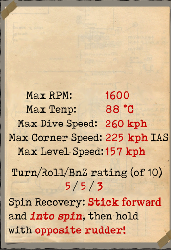
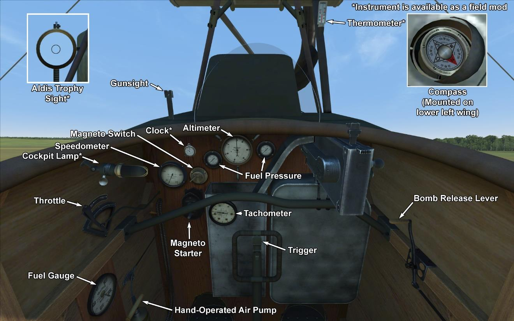

# DFW C.V  

<table><tbody><tr><td style="text-align: center"></td><td style="text-align: center"></td></tr><tr><td style="text-align: center" colspan="2"></td></tr></tbody></table>  

## Описание  

Самолёт был спроектирован и выпускался на заводах Deutsche Flugzeug Werke под Лейпцигом. Конструкторы поставили перед собой задачу создать достаточно лёгкий и в то же время прочный самолёт. Из особенностей конструкции можно отметить хвостовую балку, покрытую металлом, двигатель, защищённый металлическим обтекателем, два полых лонжерона в крыле и плавающие нервюры. Радиатор был размещён над двигателем.  
  
Первые упоминания о его полёте датируются 11 июля 1916 года. После проведения официальных испытаний самолёт отправили на фронт, где он получил прекрасные отзывы. С этого момента начался массовый выпуск на других авиационных заводах: Aviatik, LVG, Halberstadt. К концу войны было выпущено 3955 экземпляров - машина стала самой массовой в германской авиации в своём классе.  
  
DFW C.V начал поступать в специальные отряды Luftstreitkrafte в октябре 1916 года, а в марте 1917 года в Schutzstaffeln. Основными выполняемыми задачами были сопровождение бомбардировщиков, дневная бомбардировка, корректировка огня наземной артиллерии, разведка, аэрофотосъёмка наземных целей, персональный самолёт в истребительных эскадрильях.  
  
В числе его достоинств пилоты перечисляли лёгкость в управлении и простоту посадки, высокую скороподъёмность, а также хороший обзор для стрелка-наблюдателя. В ряде отчетов с фронта есть упоминания о равной маневренности с Bristol Fighter 2b, неприхотливости обслуживания в полевых условиях и прочности конструкции.  
  
  
Двигатель рядный 6-цилиндровый Benz Bz.IV 230 л.с.  
  
Размеры:  
Высота: 3140 мм  
Длина: 7880 мм  
Размах крыла: 13270 мм  
Площадь крыла: 41,52 кв.м  
  
Вес:  
Пустой: 948,5 кг   
Взлётный: 1330 кг  
Объём топливных баков: 140 л  
Объём маслобакa: 36 л      
  
Скорость (приборная), без бомб:  
на уровне моря - 157 км/ч  
1000 м - 149 км/ч  
2000 м - 140 км/ч  
3000 м - 132 км/ч  
4000 м - 123 км/ч  
5000 м - 113 км/ч  
  
Скороподъёмность, с полной заправкой, без бомб:  
1000 м - 4 мин. 1 сек.    
2000 м - 8 мин. 44 сек.   
3000 м - 15 мин. 4 сек.   
4000 м - 23 мин. 55 сек.  
5000 м - 39 мин. 28 сек.  
  
Практический потолок: 6000 м  
  
Продолжительность полёта: 2 ч.  
  
Вооружение:  
Курсовое: 1 х LMG 08/15 Spandau 7,92 мм, 500 патронов.  
Верхняя стрелковая позиция: 1 х LMG 14/17 Parabellum 7,92 мм, 3 ящика по 250 патронов каждый.  
  
Варианты бомбовых загрузок:  
4 x 12,5 кг (50 кг)  
16 x 12,5 кг (200 кг)  
1 x 50 кг + 12 x 12,5 кг (200 кг)  
3 x 50 кг + 4 x 12,5 кг (200 кг)  
Максимум: 208 кг.  
  
Использованные источники:  
1) Schlachtflieger by Rick Duiven, Dan-San Abbott.  
2) Windsock Datafile 53 DFW C.V by P.M. Grosz.  

## Модификации  
### Aldis (Трофейный)  

Коллиматорный прицел Aldis рефракторного типа  
Дополнительная масса: 2 кг  
  
### 20мм пушка Becker  

Турель с 20мм автоматической пушкой Becker  
Боезапас: 60 снарядов 20мм (4 магазина по 15 снарядов в каждом)  
Тип боеприпасов: ОФ/БР (бронебойные и осколочно-фугасные)  
Скорострельность: 300 выстр/мин  
Масса снаряда: 120/130 г  
Дульная скорость: 450/490 м/с  
Масса оружия: 30 кг  
Масса станины: 10 кг  
Масса боезапаса: 25 кг  
Общая масса: 65 кг  
Примерная потеря скорости: 6 км/ч  
  
### Авиабомбы P.u.W.  

До 12 осколочно-фугасных авиабомб 12.5 kg P.u.W.  
Дополнительная масса: 186 кг  
Масса вооружения: 150 кг  
Масса держателей: 36 кг  
Ориентировочная потеря скорости до сброса: 4 км/ч  
Ориентировочная потеря скорости после сброса: 2 км/ч  
  
До 3 осколочно-фугасных авиабомб 50 kg P.u.W.  
Дополнительная масса: 186 кг  
Масса вооружения: 150 кг  
Масса держателей: 36 кг  
Ориентировочная потеря скорости до сброса: 4 км/ч  
Ориентировочная потеря скорости после сброса: 2 км/ч  
  
### Освещение кабины  

Лампа ночного освещения кабины самолёта  
Дополнительная масса: 1 кг  
  
### Дополнительные приборы  

Указатель температуры охлаждающей жидкости двигателя A.Schlegelmilch (0-100 °C)  
  
Механические часы  
  
Дополнительная масса: 0.5 кг  
  
### Прицел  

Дополнительный прицел стандартной конструкции с мушкой и целиком  
Дополнительная масса: 1 кг  
  
### Фотокамера  

Фотоаппарат для аэрофотосъёмки   
Дополнительная масса: 10 кг  
  
### Радио  

Радиопередатчик  
Дополнительная масса: 10 кг  
  
### Турель с пулемётом Parabellum  

Кольцевая турель со спаренными пулемётами Parabellum  
Боезапас: 1500 патронов 7.92мм (6 магазинов по 250 патронов в каждом)  
Масса пули: 10 г  
Дульная скорость: 825 м/с  
Скорострельность: 700 выстр/мин  
Масса оружия: 19 кг (без магазинов)  
Масса станины: 5 кг  
Масса боезапаса: 30 кг  
Общая масса: 54 кг  
Примерная потеря скорости: 8 км/ч  
