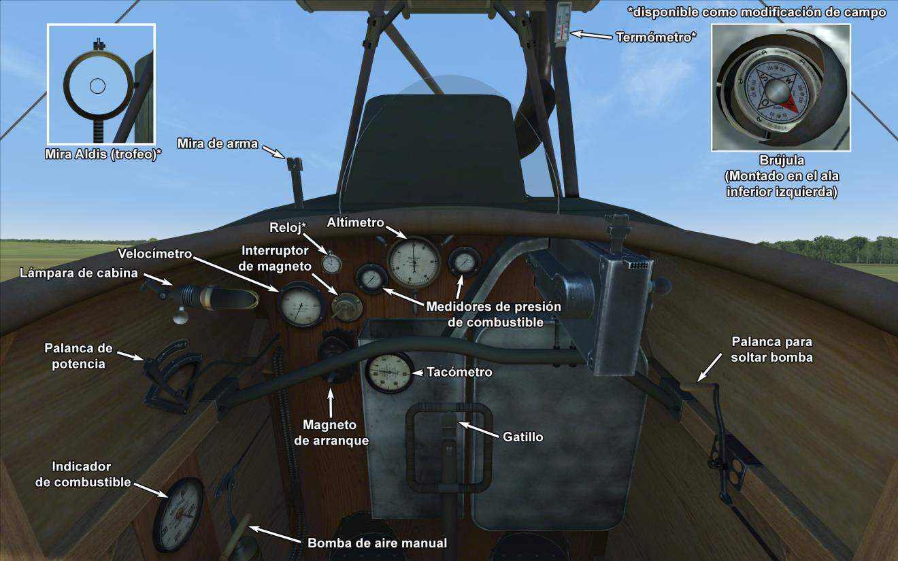

# DFW C.V  

<table><tbody><tr><td style="text-align: center"></td><td style="text-align: center"></tr><tr><td style="text-align: center" colspan="2"></td></tr></tbody></table>  

El DFW C.V fue un biplano biplaza diseñado y producido en la <i>Deutsche Flugzeug Werke</i> (DFW) cerca de Leipzig. Para diseñar el avión, los ingenieros se propusieron crear un avión ligero, pero con un fuselaje duradero. Sus características estructurales incluían un recubrimiento metálico para las riostras de la sección de cola, una cubierta metálica protegiendo el motor, dos travesaños huecos en las alas y nervios flotantes. El radiador estaba montado encima del motor.  
  
Su primer vuelo aconteció el 11 de julio de 1916. Después de las pruebas oficiales, el avión fue enviado al frente, donde recibió muy buenas opiniones. A partir de ese momento la aeronave fue producida masivamente en otras fábricas, incluyendo Aviatik, LVG y Halberstadt. Al final de guerra, se habían construido 3955 unidades. El C.V se convirtió en el avión alemán más numeroso en su clase durante la Primera Guerra Mundial.  
  
El DFW C.V entró en servicio en octubre de 1916, enviándose inicialmente a los regimientos especiales de la <i>Luftstreitkrafte</i>. Los <i>Schutzstaffeln</i> comenzaron a recibir los DFW C.V. en marzo de 1917. El avión fue principalmente utilizado para escolta de bombarderos, localización para la artillería, reconocimiento, foto reconocimiento y como avión personal en los escuadrones de caza.  
  
Entre sus ventajas, los pilotos destacaban la facilidad de control, especialmente al aterrizar, su alta tasa de ascenso y la buena visibilidad para el observador/artillero. Algunos informes del frente hablaban de una maniobrabilidad similar a la del caza Bristol F2B, un mantenimiento en campo sencillo y una durabilidad estructural muy buena.  
  
  
Motor:  
Benz Bz.IV de 6 cilindros en línea, 230 CV  
  
Dimensiones:  
Altura: 3140 mm  
Longitud: 7880 mm  
Envergadura alar: 13270 mm  
Superficie de ala: 41,52 m²  
  
Peso:  
Vacío: 948,5 kg   
Al despegue: 1330 kg  
Capacidad de combustible: 140 l  
Capacidad de aceite: 36 l      
  
Velocidad (IAS), sin bombas:  
Nivel del mar - 157 km/h  
1000 - 149 km/h  
2000 - 140 km/h  
3000 - 132 km/h  
4000 - 123 km/h  
5000 - 113 km/h  
  
Tasa de ascenso, depósito combustible lleno, sin bombas:  
1000 m - 4 min 1 s    
2000 m - 8 min 44 s  
3000 m - 15 min 4 s  
4000 m - 23 min 55 s  
5000 m - 39 min 28 s  
  
Techo de servicio: 6000 m  
  
Autonomía: 2 h  
  
Armamento:  
Disparo frontal: 1 LMG 08/15 Spandau de 7,92 mm, 500 balas  
Artillero de cola: 1 LMG 14/17 Parabellum de 7,92 mm, 3 cajas con 250 balas cada una  
  
Variaciones en la carga de bombas:  
4 bombas de 12,5 kg (50 kg)  
16 bombas de 12,5 kg (200 kg)  
1 bombas de 50 kg + 12 bombas de 12,5 kg (200 kg)  
3 bombas de 50 kg + 4 bombas de 12,5 kg (200 kg)  
Peso máximo en bombas: 200 kg  
  
Referencias:  
1) Schlachtflieger by Rick Duiven, Dan-San Abbott.  
2) Windsock Datafile 53 DFW C.V, por P.M. Grosz.  

## Modificaciones  
### Aldis (Trofeo)  

Colimador reflectante Aldis  
Peso adicional: 2 kg  
  
### Cañón Becker de 20 mm en artillero  

Cañón automático Becker de 20 mm montado sobre anillo en posición de artillero.  
Munición: 60 balas de 20 mm (4 cargadores con 15 balas cada uno)  
Tipo de munición: HE/AP (balas explosivas y perforantes)  
Peso del proyectil: 120/130 g  
Velocidad de salida: 450/490 m/s  
Tasa de disparo: 300 bpm  
Peso del arma: 30 kg (sin cargador)  
Peso del soporte: 10 kg  
Peso de la munición: 25 kg  
Peso total: 65 kg  
Pérdida de velocidad estimada: 6 km/h  
  
### Bombas P.u.W.  

Hasta 12 bombas de propósito general de 12,5 kg P.u.W (Prünfanstalt und der Werft Fliegertruppe)  
Peso adicional: 186 kg  
Peso de munición: 150 kg  
Peso de los soportes: 36 kg  
Pérdida de velocidad estimada antes de soltar: 4 km/h  
Pérdida de velocidad estimada tras soltar: 2 km/h  
  
Hasta 3 bombas de propósito general de 50 kg P.u.W (Prünfanstalt und der Werft Fliegertruppe)  
Peso adicional: 186 kg  
Peso de munición: 150 kg  
Peso de los soportes: 36 kg  
Pérdida de velocidad estimada antes de soltar: 4 km/h  
Pérdida de velocidad estimada tras soltar: 2 km/h  
  
### Luz de cabina  

Lámpara para iluminar la cabina en las salidas nocturnas  
Peso adicional: 1 kg  
  
### Instrumentación adicional  

Indicador de temperatura del refrigerante del motor de A.Schlegelmilch (0-100 °C)  
  
Reloj mecánico  
  
Peso adicional: 0,5 kg  
  
### Punto de mira  

Mira adicional con monturas de mira frontal y mira trasera  
Peso adicional: 1 kg  
  
### Cámara de fotos  

Cámara para tomar fotografías aéreas  
Peso adicional: 10 kg  
  
### Radio  

Radiotransmisor  
Peso adicional: 10 kg  
  
### Doble Parabellum en artillero  

Dos ametralladoras Parabellum sincronizadas sobre anillo en la posición del artillero.  
Munición: 1500 balas de 7,92 mm (6 tambores con 250 balas cada uno)  
Peso del proyectil: 10 g  
Velocidad de salida: 825 m/s  
Tasa de disparo: 700 bpm  
Peso de las armas: 19 kg (sin cargador)  
Peso de los soportes: 5 kg  
Peso de la munición: 30 kg  
Peso total: 54 kg  
Pérdida de velocidad estimada: 8 km/h  
