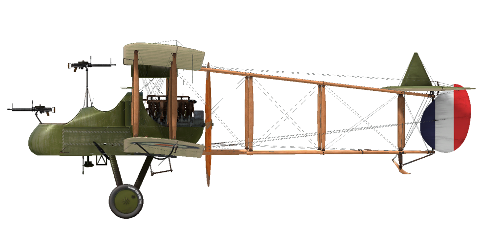

# F.E.2b

## 描述

The F.E.2 was a biplane with a pusher propeller and a sprung landing gear with a front support wheel to minimize the risk of overturning during a bad landing. The entire trailing edge of the upper center section was hinged along the rear spar and could be lowered to act as a flap-type air brake. The forward cockpit was occupied by the observer gunner, with the pilot sitting behind him at a higher level. The engine was almost completely cowled and drove a two-blade pusher propeller.

Interestingly, in February 1915, this type of plane was tested with a brake parachute. This was probably the first time in history that a braking parachute was used on an airplane. A newly designed air brake that had been used on the first F.E.2a was also tested, but the air brake was eventually abandoned.

During testing, the performance of the 100 hp Green engine was found to be unsatisfactory, mainly due to its poor power-to-weight ratio, and the machine was modified to be fitted with a new in-line six-cylinder water-cooled Beardmore engine rated at 120 hp. The center section of the upper wing was made in one piece and the air brake was removed. The aircraft with the new engine made its first flight in March 1915, but the first deliveries to the Royal Flying Corps did not begin until May. The first F.E.2b to go to France was flown to the No. 6 Squadron airfield at Abeele by Captain L.A. Strange on May 20, 1915. By September 25th the squadron had four F.E.2b\s in its strength.

Production of the F.E.2b was undertaken by a number of contractors, but it took some time before the machines were available in sufficient numbers; by the end of 1915, a total of thirty-two had been delivered. The first R.F.C. unit to go to France fully equipped with F.Es was No. 20, which arrived on January 23, 1916. No. 25 Squadron followed on 20 February, No. 23 on 16 March, and No. 22 on April 1st.

The F.E.2b was mainly used for the needs of the army: for reconnaissance and for the escort of other aircraft, and it proved to be very worthy in the battles against enemy aircraft. Often grouped with D.H.2 fighters, the F.E.2b fought back against the Fokker monoplanes that dominated the skies at the time. The success of its use in combat was due to the wide sector of fire of the machine guns in the nose of the plane. The plane was also occasionally used to attack ground targets on the front line and in actions on the enemy\s rear communications. In the second half of the war, the F.E.2b was widely used as a night bomber; for this purpose, the aircraft were painted black and equipped with night take-off and landing equipment.

The performance of the F.E.2b with the 120 hp Beardmore engine was not outstanding and from time to time attempts were made to improve its flight characteristics. At the end of March 1916, a new version of the Beardmore engine with an increased power of 160 hp appeared, and as it was essentially an improved version of the previous model, it could be fitted without the need for major design changes. Between 1915 and 1918, 1,939 F.E.2b aircraft were produced.

发动机： 6-cyl. inline Beardmore 160 hp

尺寸：
高度：3850 mm
长度：9830 mm
翼展：14320 mm
机翼面积：45.9 m²

重量：
空载重量：936 kg
组员重量：1380 kg
Fuel capacity: 249 l
Oil capacity: 27 l

速度（IAS），不挂炸弹：
海平面——147 km/h
1980——132 km/h
3048——122 km/h

爬升率，燃油装载，无炸弹：
 914 m —— 7 min 27 s
3048 m —— 39 min 44 s

实用升限： 3352 m

高度的续航时间：— 3h

武器：
Forward gunner: 1 x Lewis 7,69mm for forward, port and starboard positions firing, plus 1 x Lewis 7,69mm on telescopic mounting between the cockpits, 12 drums with 97 rounds.

炸弹装载种类：
12 x 20lb (109kg)
1 x 230lb + 8 x 20lb (177kg)
3 x 112lb (152,5kg)

共计177 kg

参考
1) Windsock Datafile 18 RAF FE 2b, by J.M. Bruce.
2) Windsock Datafile 147 RAF FE 2b at War, by Paul R Hare.
2) WWI Aeroplanes by J.M. Bruce.

## 修改

### 库珀（Cooper）/H.E.R.L. /H.E.R.F.C. 炸弹

最多12 x 11 kg（24 lb）通用炸弹
增加质量：167 kg
弹药质量：131 kg
挂架质量：36 kg
投弹前预期速度损失：7 km/h
投弹后预期速度损失：3 km/h

最多3 x 51 kg（112 lb）H.E.R.L. 通用炸弹
增加质量：177 kg
弹药质量：153 kg
挂架质量：24 kg
投弹前预期速度损失：8 km/h
投弹后预期速度损失：4 km/h

最多1 x 104 kg（230 lb）H.E.R.F.C. 通用炸弹
增加质量：120 kg
弹药质量：104 kg
挂架质量：16 kg
投弹前预期速度损失：5 km/h
投弹后预期速度损失：3 km/h

### 时钟

机械时钟
增加质量：1 kg

### 驾驶舱照明

用于夜间飞行的驾驶舱照明灯
增加质量：1 kg

### 油量表

指针式油量表
增加质量：1 kg

### 相机

可拍摄航空照片的相机
增加质量：10 kg

### 无线电

无线电发射机
增加质量：10 kg

### 双刘易斯（Lewis）机枪炮塔

双刘易斯（Lewis）机枪的斯卡夫（Scarff）旋转炮塔
弹药：776发7.69mm弹药（8个弹鼓，每个97发）
弹丸重量：11 g
膛口速度：745 m/s
射速：550 rpm
枪炮重量：15 kg（无弹鼓）
基座重量：12 kg
弹药重量：32 kg
总重：59 kg
预期速度损失：2 km/h
