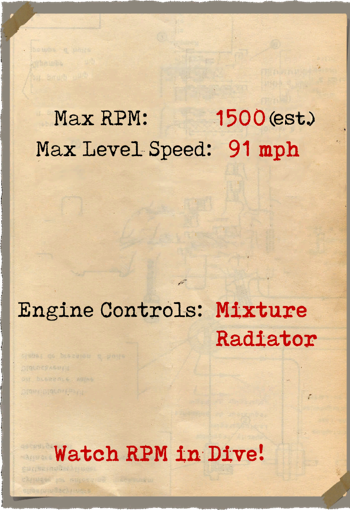
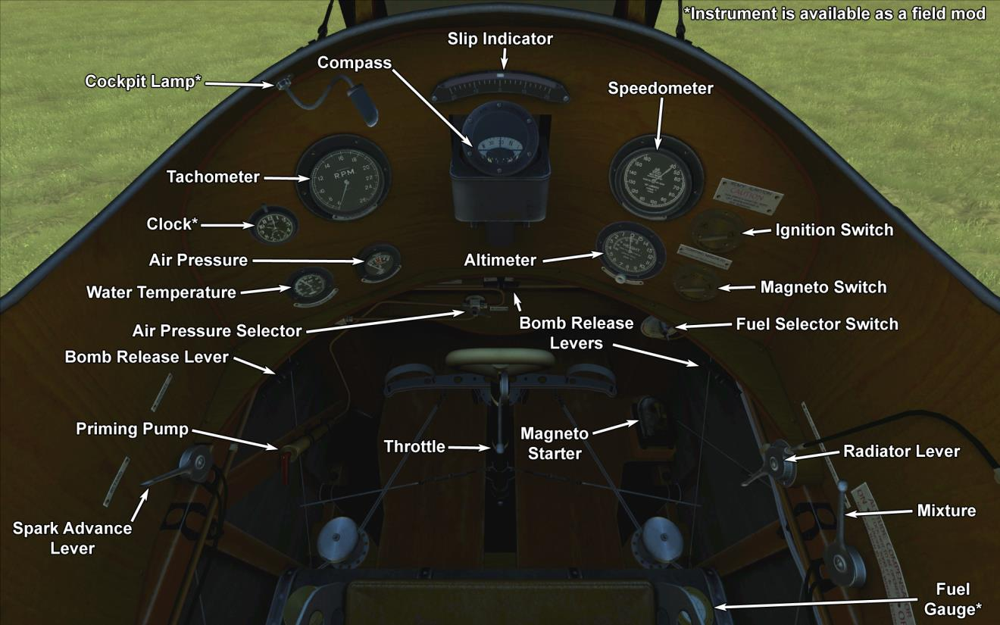

# F.E.2b  

<table><tbody><tr><td style="text-align: center"></td><td style="text-align: center"></tr><tr><td style="text-align: center" colspan="2"></td></tr></tbody></table>  

Конструктивно, F.E.2 был трёхстоечным бипланом с толкающим винтом и подрессоренным шасси с передним опорным колесом для предотвращения капотирования при жёсткой посадке. Внешние консоли крыльев были идентичны установленным на самолётах B.E.2c с профилем крыла R.A.F.6 и углом установки крыла 330. Вся задняя часть центральной секции верхнего крыла была выполнена в виде воздушного тормоза, действовавшего по принципу закрылка, полностью отклоняемого вниз. Стрелок-наблюдатель сидел в передней части гондолы, а за ним и чуть выше находился пилот. Хвостовые балки в плане сходились к килю треугольной формы.   
  
Интересно, что в феврале 1915 года на данном типе аэроплана проводились испытания тормозного парашюта - вероятно, это было первое в истории применение тормозного парашюта на самолёте. Также испытвали воздушный тормоз новой конструкции, но в итоге от применения воздушного тормоза отказались вовсе.  
  
Во время испытаний характеристики 100-сильного двигателя Green были признаны неудовлетворительными, в основном из-за недостаточной мощности, и машину модифицировали для установки на него нового рядного 6-ти циллиндрового двигателя водяного охлаждения Beardmore мощностью 120 л.с. Центральную часть верхнего крыла сделали цельной, убрав воздушный тормоз. Самолёт, оснащенный новым двигателем, совершил свой первый полёт в марте 1915 года, но первые поставки машин в боевые подразделения Королевского Военно-Воздушного Корпуса начались лишь в мае. Первый F.E.2b капитана Л.А. Стрейнджа перелетел на аэродром 6-й эскадрильи Абиль во Францию 20-го мая 1915 года. К 25-ому сентября в эскадрилье было четыре машины этого типа.  
  
Наращивание производства F.E.2b осуществлялось за счет контрактных производителей, но на это ушло немало времени и самолёт начал появляться на фронте в достаточных количествах не скоро: к концу 1915-ого года было построено всего 32 машины. Первая эскадрилья, полностью оснащенная самолётами нового типа, 20-я, прибыла во Францию 23-го января 1916 года. 20-ого февраля к ней присоединилась 25-я, 16 марта 23-я и 1-го апреля 22-я.  
  
В основном F.E.2b использовался для нужд армии - для разведки и сопровождения других аэропланов - и очень достойно показал себя в боях. Часто, объединяясь в группы вместе с истребителями D.H.2, F.E.2b давали отпор монопланам Фоккера, которые доминировали в воздухе в тот период времени. Успех боевого применения был обусловлен широким сектором обстрела носовых пулемётов. Также периодически аэроплан применяли для атаки наземных целей на линии фронта и в действиях на тыловых коммуникациях противника. Во второй половине войны F.E.2b широко использовался в роли ночного бомбардировщика: для этого их красили в чёрный цвет, а так же оснащали оборудованием для ночных взлётов и посадок.  
  
Характеристики самолёта со 120-ти сильным двигателем всё равно не до конца удовлетворяли потребностям и время от времени предпринимались попытки улучшения его лётных характеристик. В конце марта 1916 года промышленность начала производить новую версию двигателя Beardmore с увеличенной до 160 л.с. мощностью. Так как фактически это была улучшенная версия предыдущей модели, то его можно было устанавливать без необходимости внесения существенных изменений в конструкцию. В период с 1915 по 1918 год было выпущено 1939 самолётов F.E.2b.  
  
Двигатель: 6-ти цилиндровый рядный Beardmore 160 л.с.  
  
Размеры  
Высота: 3850 мм  
Длина: 9830 мм  
Размах крыла: 14320 мм  
Площадь крыла: 45,9 кв.м.  
  
Вес  
Пустой:  936 кг  
Взлётный: 1380 кг  
Объём топлива: 249 л  
Объём маслa: 27 л  
  
Скорость без бомбовой загрузки:  
у земли - 147 км/ч  
 1980 м - 132 км/ч  
 3048 м - 122 км/ч  
  
Скороподъемность:  
 914 m - 7 мин. 27 сек.  
3048 m - 39 мин. 44 сек.  
  
Практический потолок: 3352 м  
  
Продолжительность полёта: 3 ч.  
  
Вооружение:  
У переднего стрелка: 7,69мм пулемёт Льюис в передней, левой и правой позициях для стрельбы, 7,69мм пулемёт Льюис на телескопической стойке между кокпитами, 12 барабанов по 97 патронов для обоих пулемётов.  
  
Варианты бомбовых загрузок:  
12 x 20 lb (109кг)  
1 x 230 lb + 8 x 20 lb (177 кг)  
3 x 112 lb (152,5 кг)  
  
Всего 177 кг  
  
Использованные источники:  
1) Windsock Datafile 18 RAF FE 2b, by J.M. Bruce.  
2) Windsock Datafile 147 RAF FE 2b at War, by Paul R Hare.  
2) WWI Aeroplanes by J.M. Bruce.  

## Модификации  
### Бомбы Купера / H.E.R.L. / H.E.R.F.C.  

До 12 осколочно-фугасных 24-фунтовых авиабомб Купера (11 кг)  
Дополнительная масса: 167 кг  
Масса вооружения: 131 кг  
Масса держателей: 36 кг  
Ориентировочная потеря скорости до сброса: 7 км/ч  
Ориентировочная потеря скорости после сброса: 3 км/ч  
  
До 3 осколочно-фугасных 112-фунтовых авиабомб H.E.R.L. (51 кг)  
Дополнительная масса: 177 кг  
Масса вооружения: 153 кг  
Масса держателей: 24 кг  
Ориентировочная потеря скорости до сброса: 8 км/ч  
Ориентировочная потеря скорости после сброса: 4 км/ч  
  
До 1 осколочно-фугасной 230-фунтовой авиабомбы H.E.R.F.C. (104 кг)  
Дополнительная масса: 120 кг  
Масса вооружения: 104 кг  
Масса держателей: 16 кг  
Ориентировочная потеря скорости до сброса: 5 км/ч  
Ориентировочная потеря скорости после сброса: 3 км/ч  
  
### Часы  

Механические часы  
Дополнительная масса: 1 кг  
  
### Освещение кабины  

Лампа ночного освещения кабины самолёта  
Дополнительная масса: 1 кг  
  
### Топливомер  

Стрелочный указатель уровня топлива  
Дополнительная масса: 1 кг  
  
### Фотокамера  

Фотоаппарат для аэрофотосъёмки   
Дополнительная масса: 10 кг  
  
### Радио  

Радиопередатчик  
Дополнительная масса: 10 кг  
  
### Турель с пулемётами Lewis  

Кольцевая турель со спаренными пулемётами Lewis  
Боезапас: 776 патронов 7,69 мм (8 магазинов по 97 патронов в каждом)  
Масса пули: 11 г  
Дульная скорость: 745 м/с  
Скорострельность: 550 выстр/мин  
Масса оружия: 15 кг (без магазинов)  
Масса станины: 12 кг  
Масса боезапаса: 32 кг  
Общая масса: 59 кг  
Примерная потеря скорости: 2 км/ч  
