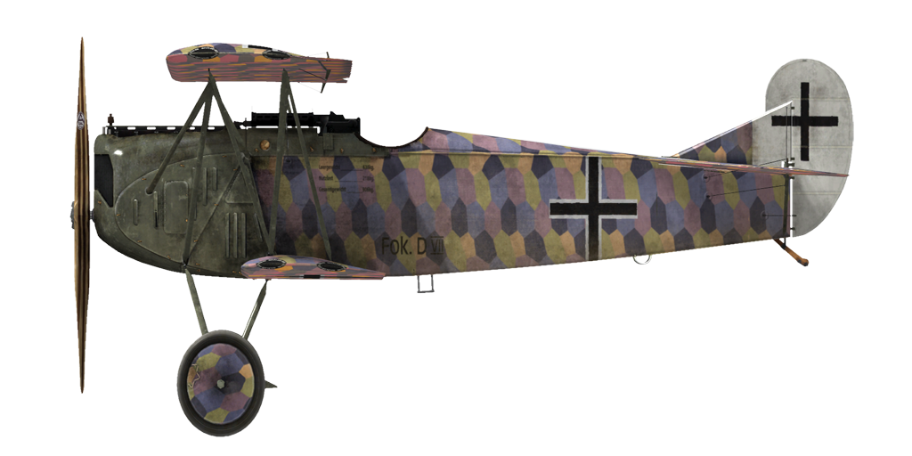

# Fokker D.VII

## Description

L\avion a été conçu dans le département de design d\Anthony Fokker. Le chef designer a reçu pour missiion de créer un chasseur rapide, capable de battre le Spad-XIII français et le S.E.5a britannique. Quelques caractéristiques de productuin: structure de la cellule en métal, aile épaisse sectionnée, absence de câbles d\arrimage.

Du 21 janvier au 12 février 1918, à la compétion de chasseurs de Adlershof, l\avion s\est avéré être le plus rapide, le plus durable et avec le meilleur taux de montée. Manfred von Richthofen, un amis proche d\Anthony Fokker, a également pris le prototype pour ses essais en vol et à relevé certains défauts mineurs, particulièrement l\instabilité dans certaines plongées longues, qui a été amélioré plus tard.Le succès de la conception des avions a conduit à ce qu\elle soit produite sur un certain nombre d\usines: Fokker Flugzeug-Werke, Albatros Werke, Ostdeutsche Albatros Werke. Le Fokker D.VII est devenu l\un des meilleurs, si ce n\est en fin de compte le meilleur chasseur de la fin de la guerre. Il y a eu 2029 avions fabriqués et envoyés au front avant la fin de l\année 1918.

En avril 1918, il atteint des terrains d\aviation du front de l\escadron bavarois. Le Fokler D.VII a été utilisé pour l\escorte de bombardiers, engagé sur des combats contre des chasseurs et des ballons ennemis, rarement pour des attaques sur des colonnes emmemies et des reconnaissances. Au cours du service, il était clair que l\eau du radiateur ne refroidissait pas suffisamment le moteur. Après la modification du moteur, du capot moteur et d\augmenter la circulation de l\air au travers des cylindres, ce problème a été résolu.

Les pilotes ont noté une bonne vitesse de montée, une excellente visibilité dans le cockpit, une stabilité dans les manoeuvres, une bonne tenue à faible vitesse. “L\avion est comme suspendu à son hélice!” — s\exclamait un pilote excité.Tout cela a contribué à la réalisation des opérations offensives et défensives. Jusqu\à la fin de la guerre les escadrons allemands équipés de cet appareil ont été les principaux adversaires de l\aviation alliée. 

Moteur 6 cyl. inline Mercedes D.IIIa 180 hp

Tailles
Hauteur: 2950 mm
Longueur: 6950 mm
Envergure: 8700 mm
Surface d\aile: 20,4 sq.m

Poids
Poids à vide: 700 kg
Poids au décollage: 909 kg
Capacité des réservoirs carburant : 91 l
Capacité du réservoir d\huile : 11 l

Vitesse maximale (IAS)
au Sol — 194 km/h
1000 m — 184 km/h
2000 m — 172 km/h
3000 m — 160 km/h
4000 m — 146 km/h
5000 m — 130 km/h

Tauc de montée
1000 m —  3 min. 02 sec.
2000 m —  6 min. 31 sec.
3000 m — 10 min. 54 sec.
4000 m — 16 min. 50 sec.
5000 m — 26 min. 21 sec.

Plafond opérationnel 5700 m

Autonomie à 1000m:
puissance nominale (en combat) - 1 h. 25 min.
consommation minimale (en croisière) - 2 h. 50 min.

Armes
Armes fixées: 2 х LMG 08/15 Spandau 7,92mm, 500 cartouches par baril.

References
1) Fokker DVII No2009/18. Type C.1 captured and tested by French.
2) Essais de cellule de lavion Fokker Type D.VII.
3) Fokker D.VII Aces of World War I. Part1 and 2 and 3 by Norman Franks and Greg VanWyngarden.
4) Fokker D.VII in action. By D. Edgar Brannon Aircraft Number 166.
5) Profile publications. The Fokker D.VII Number 25.

## Modifications


### Haut Altimètre

D.R.P Altimètre (0-8000 m)


### Compteur de balles

 Compteur digital Wilhelm Morell pour 2 mitrailleuses
Masse supplémentaire : 1 kg


### Lumière de cockpit

Lumière à ampoule pour les sorties de nuit
Masse supplémentaire : 1 kg


### Viseur

Viseur additionnel avec guidon de mire avant-arrière
Masse supplémentaire : 1 kg


### Collimateur de jour

Collimateur à réfraction Oigee (gradateur de jour installé)
Masse supplémentaire : 2 kg


### Collimateur de nuit

Collimateur à réfraction Oigee (gradateur de jour désinstallé)
Masse supplémentaire : 2 kg


### Anémomètre

Wilhelm Morell Anémomètre (45-250 km/h)
Masse supplémentaire : 1 kg


### Thermometre

Indicateur de température de liquide de refroidissement A.Schlegelmilch (0-100 °C)
Masse supplémentaire : 1 kg
