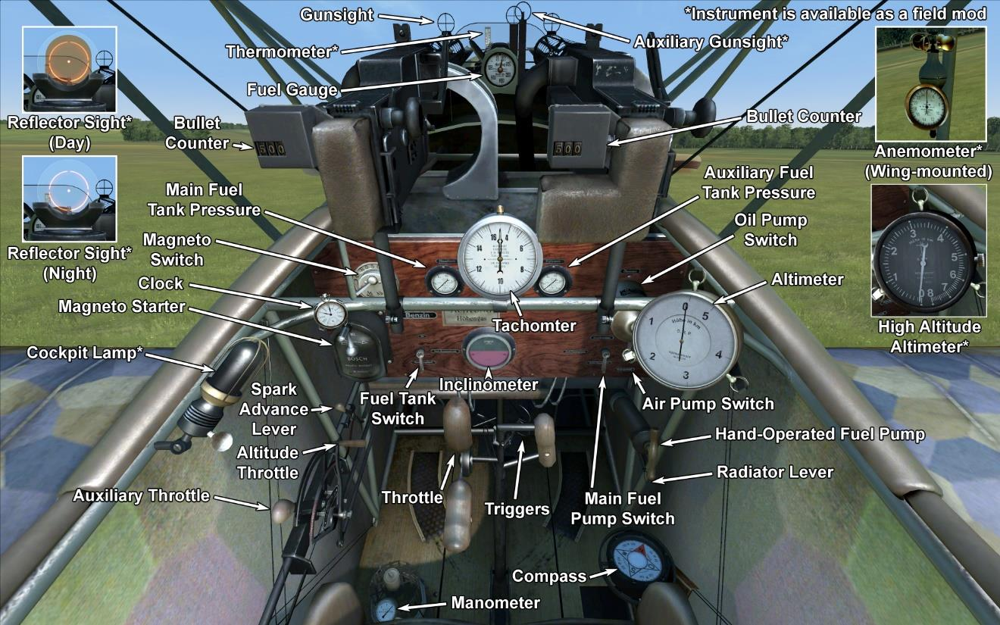

# Fokker D.VIIF  

<table><tbody><tr><td style="text-align: center"></td><td style="text-align: center"></td></tr><tr><td style="text-align: center" colspan="2"></td></tr></tbody></table>  

## Description  

L\avion a été conçu dans le département de design d\Anthony Fokker. Le chef designer a reçu pour missiion de créer un chasseur rapide, capable de battre le Spad-XIII français et le S.E.5a britannique. Quelques caractéristiques de productuin: structure de la cellule en métal, aile épaisse sectionnée, absence de câbles d\arrimage.  
  
Du 21 janvier au 12 février 1918, à la compétion de chasseurs de Adlershof, l\avion s\est avéré être le plus rapide, le plus durable et avec le meilleur taux de montée. Manfred von Richthofen, un amis proche d\Anthony Fokker, a également pris le prototype pour ses essais en vol et à relevé certains défauts mineurs, particulièrement l\instabilité dans certaines plongées longues, qui a été amélioré plus tard.Le succès de la conception des avions a conduit à ce qu\elle soit produite sur un certain nombre d\usines: Fokker Flugzeug-Werke, Albatros Werke, Ostdeutsche Albatros Werke. Le Fokker D.VII est devenu l\un des meilleurs, si ce n\est en fin de compte le meilleur chasseur de la fin de la guerre. Il y a eu 2029 avions fabriqués et envoyés au front avant la fin de l\année 1918.  
  
En avril 1918, il atteint des terrains d\aviation du front de l\escadron bavarois. Le Fokler D.VII a été utilisé pour l\escorte de bombardiers, engagé sur des combats contre des chasseurs et des ballons ennemis, rarement pour des attaques sur des colonnes emmemies et des reconnaissances. Au cours du service, il était clair que l\eau du radiateur ne refroidissait pas suffisamment le moteur. Après la modification du moteur, du capot moteur et d\augmenter la circulation de l\air au travers des cylindres, ce problème a été résolu.  
  
Les pilotes ont noté une bonne vitesse de montée, une excellente visibilité dans le cockpit, une stabilité dans les manoeuvres, une bonne tenue à faible vitesse. “L\avion est comme suspendu à son hélice!” — s\exclamait un pilote excité.Tout cela a contribué à la réalisation des opérations offensives et défensives. Jusqu\à la fin de la guerre les escadrons allemands équipés de cet appareil ont été les principaux adversaires de l\aviation alliée.  
  
Les Fokker D.VII étaient pour la plupart équipés de moteurs Mercedes D.IIIa bien que certains aient été équipés d\un nouveau moteur BMW avec la désignation D.VIIF. Ce nouveau moteur BMW à fort taux de compression avec système de contrôle pour les hautes altitudes donnait au D.VIIF de bien meilleures performances. Le taux de montée était deux fois supérieur aux versions équipées de moteurs Mercedes et à pleine puissance donnait 250 chevaux au niveau du sol sur une courte durée et 230 sur de plus longues périodes. Son nouveau carburateur lui donnait aussi de bien meilleures performances à haute altitude. Le problème venait de la capacité de BMW à fournir ce moteur et seulement 1/4 des D.VII en furent équipés. Le D.VIIF fut envoyé dans les meilleurs escadrons afin que les plus grands pilotes Allemands puissent surcrlasser les nouveaux appareils Alliés dans presque tous les domaines.  
  
This BMW IIIa engine had a special control lever - "Höhengashebel" - which was used to gain more power at higher altitudes. Engaging it at lower altitudes could lead to engine malfunction (detonation).  
  
  
Moteur 6 cyl. inline BMW IIIa 232 hp  
  
Tailles  
Hauteur: 2950 mm  
Longueur: 6950 mm  
Envergure: 8700 mm  
Surface d\aile: 20,4 sq.m  
  
Poids  
Poids à vide: 669,5 kg  
Poids au décollage: 904 kg  
Capacité des réservoirs carburant: 95 l  
Capacité du réservoir d\huile: 20,7 l  
  
Vitesse maximale (IAS)  
au Sol — 197 km/h  
1000 m — 192 km/h  
2000 m — 184 km/h  
3000 m — 181 km/h  
4000 m — 176 km/h  
5000 m — 165 km/h  
6000 m — 153 km/h  
7000 m — 140 km/h  
8000 m — 126 km/h  
9000 m — 106 km/h  
  
Tauc de montée  
1000 m —  2 min. 18 sec.  
2000 m —  4 min. 40 sec.  
3000 m —  7 min. 11 sec.  
4000 m —  9 min. 47 sec.  
5000 m — 12 min. 42 sec.  
6000 m — 16 min. 23 sec.  
7000 m — 21 min. 19 sec.  
8000 m — 28 min. 59 sec.  
  
Plafond opérationnel ~9000 m  
  
Autonomie à 1000 m:  
puissance nominale (en combat) - 1 h. 50 min.  
consommation minimale (en croisière) - 5 h. 30 min.  
  
Armes  
Armes fixées: 2 х LMG 08/15 Spandau 7,92mm, 500 cartouches par baril.  
  
References  
1) Fokker DVII No2009/18. Type C.1 captured and tested by French.  
2) Essais de cellule de lavion Fokker Type D.VII.  
3) Fokker D.VII Aces of World War I. Part1, 2 and 3 by Norman Franks and Greg VanWyngarden.  
4) Fokker D.VII in action. By D. Edgar Brannon Aircraft Number 166.  
5) Windsock Datafile Special - Fokker D.VII Anthology 1 & 2. Albatros Productions LTD., 1997.  
6) Profile publications. The Fokker D.VII Number 25.  
7) FLIGHT Magazine - A Fokker Biplane of recent type. 1918.  
8) Technical description and operation manual for Bavarian engine type BMW IIIa 185hp. Bayerische Motoren Werke A.-G., München 1918.  
9) NACA REPORT No.135. Performance of B.M.W. 185-horsepower airplane engine. By S.W.Sparrow. Bureau of Standards. 1919.  
10) Report on the 230 H.P.Bayern Aero Engine. Air Ministry, Directorate of Research. May, 1919.  

## Modifications  
### Haut Altimètre  

D.R.P Altimètre (0-8000 m)  
Masse supplémentaire : 1 kg  
  
### Lumière de cockpit  

Lumière à ampoule pour les sorties de nuit  
Masse supplémentaire : 1 kg  
  
### Viseur  

Viseur additionnel avec guidon de mire avant-arrière  
Masse supplémentaire : 1 kg  
  
### Collimateur de jour  

Collimateur à réfraction Oigee (gradateur de jour installé)  
Masse supplémentaire : 2 kg  
  
### Collimateur de nuit  

Collimateur à réfraction Oigee (gradateur de jour désinstallé)  
Masse supplémentaire : 2 kg  
  
### Anémomètre  

Wilhelm Morell Anémomètre (45-250 km/h)  
Masse supplémentaire : 1 kg  
  
### Thermometre  

Indicateur de température de liquide de refroidissement A.Schlegelmilch (0-100 °C)  
Masse supplémentaire : 1 kg  
