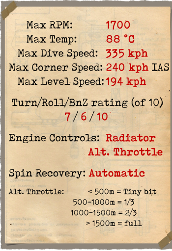

# Fokker D.VIIF  

  
  

## Beschreibung  

Das Flugzeug wurde von Fokker hergestellt. Der Chefkonstrukteur Reinhold Platz wurde mit der Aufgabe betreut, ein schnelles Kampfflugzeug zu entwerfen, das in der Lage war, ein konkurrenzfähiges Flugzeug gegenüber der französischen SPAD XIII und die britischen S.E.5a zu sein. Einige bemerkenswerte Daten: Stabiler Stahlrohrrahmen, mit Stoff bespannte Flügel aus Holz, Das gesamte Leitwerk war aus Stahlrohren aufgebaut und stoffbespannt.  
  
Von 21. Januar bis zum 12. Februar 1918 fanden in Berlin-Adlershof Kampfflugwettbewerbe statt. Ziel war es das schnellste, zuverlässigste Flugzueg mit der höchsten Steigrate zu finden. Manfred von Richthofen, ein guter Freund von Anthony Fokker, testete dort seinen Prototyp und bemerkte sogleich einige kleinere Unstimmigkeiten bei seinem Flugzeug, insbesondere Stabilitätsprobleme bei Sturzflügen, welche jedoch später behoben wurden. Da Fokker die gewünschte Anzahl in der vorgegebenen Zeit nicht liefern konnte, wurden Lizenzbauten bei weiteren Flugzeugwerke vereinbart. Es produzieren: Fokker Flugzeug—Werke, Albatros Werke, Ostdeutsche Albatros Werke. Die Fokker D.VII wurde eines der besten Flugzeuge, wenn nicht das ultimative Kampflugzeug bis zum Ende des 1. Weltkriegs. 2.029 Stück wurden bis zum Jahr 1918 gebaut und an die Front geschickt.  
  
Im April 1918 kamen erste Maschinen an die Westfront und bewährten sich hervorragend. Mit der Fokker D.VII wurden Bomber escortiert, aber vorrangig zum Luftkampf und gegen feindliche Aufklärungsballons eingesetzt. Nur selten gab es Aufträge für Angriffe auf Konvois oder Aufklärungsflüge über der Front. Schon frühzeitig beim Fronteinsatz wurde klar, dass die Wasserkühlung das Triebwerk nicht ausreichend war. Durch einige Modifikationen am Kühler, an der Triebwerksverkleidung und dem Anheben der Luftzufuhr zu den Zylindern wurde das Problem aber gelöst.  
  
Piloten sprachen von guter Steiggeschwindigkeit, einer exzellente Cockpitsicht, Stabilität während der Manöver und gute Eigenschaften während eines Langsamfluges. "Das Flugzeug fliegt, als hänge es an seinem Propeller!" war ein Spruch der Piloten. Alle diese Eigenschaften der D.VII waren große Hilfen in offensiven und defensiven Operationen. Bis hin zum Ende des Kriegs wurden deutsche Jagdgeschwader mit diesem Typ ausgestattet.  
  
Der Fokker D.VII war im Allgemeinen mit dem Mercedes D.IIIa-Motor ausgestattet, aber auch ein neuer BMW-Motortyp mit der Bezeichnung D.VIIF wurde eingebaut. Dieser neue hochverdichtete BMW Motor mit Höhenregelung brachte dem D.VII eine deutlich bessere Leistung. Die Steigrate war fast doppelt so hoch wie bei der mit Mercedes ausgestatteten Version, und bei Höchstgeschwindigkeit konnte der Motor kurzzeitig fast 250 PS am Boden erzeugen. Mit einer Nennleistung von 230 PS und einem neu entwickelten Vergaser verbesserte dieses Triebwerk die Leistung des Flugzeugs in großer Höhe erheblich und brachte die Leistung des Flugzeugs auf ein neues Niveau. Allerdings gab es einen anhaltenden Mangel an BMW-Motoren, so dass nur jedes dritte oder vierte Flugzeug mit einem solchen Antrieb ausgestattet war.  
  
Dieser BMW IIIa-Motor hatte einen speziellen Gashebel - den "Höhengashebel" -, mit dem in größeren Höhen mehr Leistung gewonnen werden konnte. Das Einrasten in niedrigeren Höhen kann zu einer Fehlfunktion des Motors (Detonation) führen.  
  
Die D.VIIF wurde hauptsächlich an die besten und bewährtesten Frontliniengeschwader geliefert. So konnten die besten deutschen Piloten nun die neuesten alliierten Flugzeugtypen in einem Flugzeug übertreffen, das denjenigen der Alliierten in fast allen wichtigen Aspekten überlegen ist.  
  
  
Triebwerk  
6 Zyl. flüssigkeitsgekühlter Reihenmotor Mercedes D.IIIa 180 PS  
  
Abmessung  
Höhe: 2950 mm  
Länge: 6950 mm  
Spannweite: 8700 mm  
Flügelfläche: 20,4 qm  
  
Gewicht  
Leergewicht: 669,5 kg  
Startgewicht: 904 kg  
Treibstoffkapazität: 95 l  
Ölkapazität: 20,7 l  
  
Max Geschwindigkeit (IAS)  
Meeresspiegel – 197 km/h  
1000 m – 192 km/h  
2000 m – 184 km/h  
3000 m – 181 km/h  
4000 m – 176 km/h  
5000 m – 165 km/h  
6000 m — 153 km/h  
7000 m — 140 km/h  
8000 m — 126 km/h  
9000 m — 106 km/h  
  
Steigrate  
1000 m –  2 Min. 18 Sek.  
2000 m –  4 Min. 40 Sek.  
3000 m –  7 Min. 11 Sek.  
4000 m –  9 Min. 47 Sek.  
5000 m – 12 Min. 42 Sek.  
6000 m – 16 Min. 23 Sek.  
7000 m – 21 Min. 19 Sek.  
8000 m – 28 Min. 59 Sek.  
  
Dienstgipfelhöhe ~9000 m  
  
Reichweite(Std.,Min.) bei 1000 m  
Nennleistung (im Kampf)        — 1 Std. 50 Min.  
Minimaler Verbrauch (Rundflug) — 5 Std. 30 Min.  
  
Bewaffnung  
Starre Bewaffnung nach vorne: 2 х LMG 08/15 Spandau 7,92mm, 2x 500 Schuss in Gurten.  
  
Referenzen  
1) Fokker DVII No2009/18. Type C.1 captured and tested by FrencStd.  
2) Essais de cellule de lavion Fokker Type D.VII.  
3) Fokker D.VII Aces of World War I. Part1 and 2 and 3 by Norman Franks and Greg VanWyngarden.  
4) Fokker D.VII in action. By D. Edgar Brannon Aircraft Number 166.  
5) Profile publications. The Fokker D.VII Number 25.  

## Änderungen  
### Kompensierter Höhenmesser,  

D.R.P kompensierter Höhenmesser (0-8000 m)  
Zusätzliches Gewicht: 1 kg  
  
### Instrumentenlicht  

Glühlampe zum Beleuchten des Instrumentenbrettes bei Nachteinsätzen  
Zusätzliches Gewicht: 1 kg  
  
### Visier  

Zusätzliches Visier mit Kimme und Kreuz  
Zusätzliches Gewicht: 1 kg  
  
### Kollimator Tag  

Oigee Reflexvisier (mit getönter Scheibe)  
Zusätzliches Gewicht: 2 kg  
  
### Kollimator Nacht  

Oigee Reflexvisier (ohne getönte Scheibe)  
Zusätzliches Gewicht: 2 kg  
  
### Anemometer  

Wilhelm Morell Anemometer (45-250 km/h)  
Zusätzliches Gewicht: 1 kg  
  
### Thermometer  

A.Schlegelmilch Kühlwasserthermometer (0-100 °C)  
Zusätzliches Gewicht: 1 kg  
