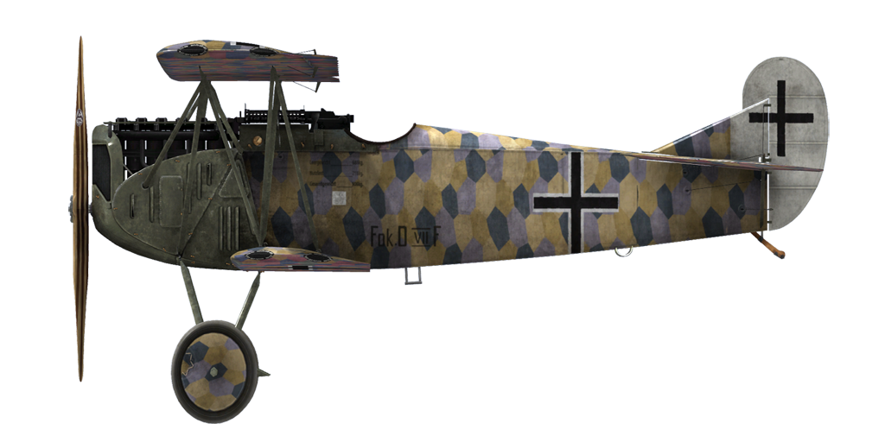

# Fokker D.VIIF  
  
  
  
## Описание  
  
Самолёт спроектирован в конструкторском бюро Энтони Фоккера. Перед конструктором стояла задача создать скоростной истребитель, который мог бы составить конкуренцию французскому Spad—XIII и английскому S.E.5a. Из особенностей конструкции можно упомянуть: металлический каркас фюзеляжа, крыло с толстым профилем и  отсутствие расчалок.  
  
С 21 января по 12 февраля 1918 года в Адлерсхофе проходили истребительные соревнования, в ходе которых самолёт показал лучшие показатели по скорости, скороподъемности, прочностным характеристикам. Манфред фон Рихтгофен, близкий друг Энтони Фоккера, также смог совершить пробный вылет на прототипе этого самолёта и отметить ряд его мелких недостатков, в частности, нестабильность при долгом пикировании, что впоследствии было устранено. Успешность конструкции самолёта привела к тому, что самолёт стал выпускаться на нескольких заводах: Fokker Flugzeug—Werke, Albatros Werke, Ostdeutsche Albatros Werke. Fokker D.VII cтал одним из лучших — если не лучшим — истребителем конца войны. К концу 1918 года было выпущено и поставлено на фронт 2029 экземпляров.  
  
В апреле 1918 года он поступил на передовые аэродромы баварских эскадрилий. Fokker D.VII применялся для прикрытия бомбардировочной авиации, истребления самолётов и аэростатов противника, изредка для ударов по колоннам врага в прифронтовой полосе и для разведки. В ходе эксплуатации выяснилось, что водяной радиатор недостаточно хорошо охлаждает двигатель. Изменив панель радиатора, форму капота двигателя и увеличив обдув цилиндров двигателя, удалось решить и эту проблему.  
  
Пилоты отмечали хорошую скороподъемность, прекрасный обзор из кабины, устойчивость в вираже, хорошую управляемость на малых скоростях. "Самолёт буквально висит на винте!" — в восхищении говорили пилоты. Все это помогало проводить бои как наступательного, так и оборонительного типа. До самого конца войны эскадрильи немцев, вооруженные этим типом самолёта, были основными оппонентами самолётов союзников.  
  
В основном Fokker D.VII оснащались двигателями Mercedes D.IIIa, но так же на самолёт устанавливался новый двигатель BMW, при этом модель самолёта обозначалась как D.VIIF. Повышенная степень сжатия и дополнительный высотный дроссель нового двигателя дали самолёту значительные улучшения летных характеристик. В сравнении с вариантом, оснащенным двигателем Mercedes, скороподъемность улучшилась почти вдвое, а при полностью открытом дросселе двигатель мог выдавать почти 250 лошадиных сил у земли на короткий период времени. Номинальная мощность в 230 лошадиных сил в связке с новым высотным карбюратором подняли тактико-технические характеристики самолёта на новый, более высокий уровень боевых возможностей. Однако проблемы с поставкой новых двигателей от производителя и их постоянный дефицит ограничили их использование: такой двигатель устанавливался только на каждый третий-четвертый самолёт. Новый D.VIIF в первую очередь поставлялся в элитные фронтовые эскадрильи опытным лётчикам-ветеранам, доказавшим свое мастерство в боях. Новая модификация позволила германским асам иметь преимущества над новыми самолётами союзников практически по всем параметрам.  
  
  
Рядный двигатель 6-цилиндровый BMW IIIa 232 л.с. имел специальный рычаг - "высотный газ" - который использовался для получения дополнительной мощности на больших высотах. Включение "высотного газа" на малых высотах могло привести к сбоям в работе двигателя.  
  
Размеры  
Высота: 2950 мм  
Длина: 6950 мм  
Размах крыла: 8700 мм  
Площадь крыла: 20,4 кв.м.  
  
Вес  
Пустой: 669,5 кг  
Взлётный: 904 кг  
Объем топлива: 95 л  
Объем масла: 20,7 л  
  
Максимальная скорость (приборная)  
у земли – 197 км/ч  
1000 м – 192 км/ч  
2000 м – 184 км/ч  
3000 м – 181 км/ч  
4000 м – 176 км/ч  
5000 м – 165 км/ч  
6000 м – 153 км/ч  
7000 м – 140 км/ч  
8000 м – 126 км/ч  
9000 м – 106 км/ч  
  
Скороподъемность  
1000 м –  2 мин. 18 сек.  
2000 м –  4 мин. 40 сек.  
3000 м –  7 мин. 11 сек.  
4000 м –  9 мин. 47 сек.  
5000 м – 12 мин. 42 сек.  
6000 м – 16 мин. 23 сек.  
7000 м – 21 мин. 19 сек.  
8000 м – 28 мин. 59 сек.  
  
Практический потолок ~9000 м  
  
Продолжительность полёта (ч.,мин.) на 1000 м  
номинальная мощность (боевой режим) — 1 ч. 50 мин.  
минимальный расход (крейсерский режим) — 5 ч. 30 мин.  
  
Вооружение  
Курсовое: 2 х LMG 08/15 Spandau 7,92mm, по 500 патронов на ствол.  
  
Использованные источники  
1) Fokker DVII No2009/18. Type C.1 captured and tested by French.  
2) Essais de cellule de lavion Fokker Type D.VII.  
3) Fokker D.VII Aces of World War I. Part1, 2 and 3 by Norman Franks and Greg VanWyngarden.  
4) Fokker D.VII in action. By D. Edgar Brannon Aircraft Number 166.  
5) Windsock Datafile Special - Fokker D.VII Anthology 1 & 2. Albatros Productions LTD., 1997.  
6) Profile publications. The Fokker D.VII Number 25.  
7) FLIGHT Magazine - A Fokker Biplane of recent type. 1918.  
8) Technical description and operation manual for Bavarian engine type BMW IIIa 185hp. Bayerische Motoren Werke A.-G., München 1918.  
9) NACA REPORT No.135. Performance of B.M.W. 185-horsepower airplane engine. By S.W.Sparrow. Bureau of Standards. 1919.  
10) Report on the 230 H.P.Bayern Aero Engine. Air Ministry, Directorate of Research. May, 1919.  
  
## Модификации  
### Высотомер  
  
Высотомер больших высот D.R.P (0-8000 м)  
Дополнительная масса: 1 кг  
  
### Освещение кабины  
  
Лампа ночного освещения кабины самолёта  
Дополнительная масса: 1 кг  
  
### Прицел  
  
Дополнительный прицел стандартной конструкции с мушкой и целиком  
Дополнительная масса: 1 кг  
  
### Коллиматор дневной  
  
Коллиматорный прицел Oigee рефлекторного типа (с установленным затемняющим фильтром)  
Дополнительная масса: 2 кг  
  
### Коллиматор ночной  
  
Коллиматорный прицел Oigee рефлекторного типа (со снятым затемняющим фильтром)  
Дополнительная масса: 2 кг  
  
### Анемометр  
  
Анемометр Wilhelm Morell (45-250 км/ч)  
Дополнительная масса: 1 кг  
  
### Термометр  
  
Указатель температуры охлаждающей жидкости двигателя A.Schlegelmilch (0-100 °C)  
Дополнительная масса: 1 кг  
