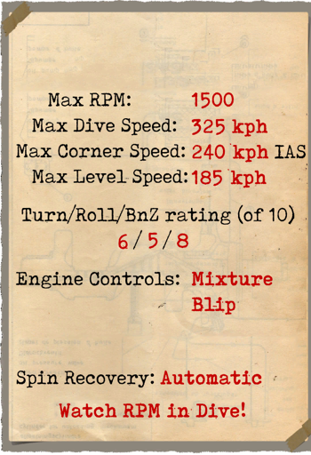
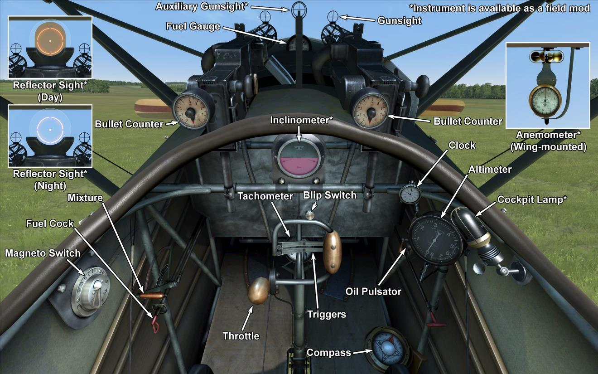

# Fokker D.VIII  

<table><tbody><tr><td style="text-align: center"></td><td style="text-align: center"></td></tr><tr><td style="text-align: center" colspan="2"></td></tr></tbody></table>  

## 描述  

This aircraft was specifically designed by the Fokker company for the Second Fighter Competition convened between May 27 and June 21, 1918 at Adlershof, the German aircraft test centre. Constructed as a monoplane fighter, it was mainly based on previous designs by Reinhold Platz. Its design was based on a tube-welded fuselage and wings covered with plywood throughout their span. The wing, which had a thick profile, was situated level with the pilot’s line of sight, which reduced upward visibility. During the Second Fighter Competition, the E.V showed good performance and offered good all-round visibility. It also has a good climb rate and good manoeuvrability, with some test pilots even preferring it to the Fokker D.VIIF. Thereafter, a contract was placed to produce 400 planes for the army, which were all powered by the Oberursel UR II.  
  
The aircraft were produced at the Fokker-Flugzeugwerke, with 285 aircraft having been produced by war\s end. On 7th August 1918, the aircraft went into frontline service with Jasta 6 and Jasta 19, but unfortunately on the 16th and then again, on the 19th, E.V pilots were killed following catastrophic wing failures. All E.Vs were temporarily grounded for a crash investigation; this investigation ended in October. Wing failures were found to be due to poor production quality and poor-quality materials used during wing construction. With the aircraft\s wings built to the original quality specification and with its new wing having increased strength and quality, it earned its new designation – the Fokker D.VIII. Visually there was no difference between the E.V and the D.VIII, and some earlier produced E.Vs were re-designated as D.VIIIs after the wings were replaced.  
  
Pilots\ impressions about the aircraft were as follows: its climb performance and all-round cockpit view was excellent, and it was both easy to fly and responsive to the controls. Some pilots preferred it to the Fokker D.VII as it was more manoeuvrable. It had a tendency to drop the right wing on landing and to ground loop in the same direction. It also got its nickname - the "Flying Razor" - from its characteristic monoplane construction. After the Fokker E.V/D.VIII entered service on the Western Front, official records show a victory by Emil Rolf on August 17th, while other service details say little more about the aircraft.  
  
  
发动机：Oberursel UR II  rotary 9 cyl. 110 hp  
  
尺寸  
高度：2820 mm  
长度：5865 mm  
翼展：8340 mm  
机翼面积：10.7 m²  
  
重量  
空载重量：360 kg  
最大起飞重量：562 kg  
燃油容量：69 L  
滑油容量：20 L  
  
最大空速(指示空速)  
海平面——185 km/h  
1000 m——177 km/h  
2000 m——167 km/h  
3000 m——158 km/h  
4000 m——148 km/h  
5000 m——136 km/h  
  
爬升率  
1000 m——2min 42s  
2000 m——5min 47s  
3000 m——9min 25s  
4000 m——14min 2s  
5000 m——20min 20s  
  
实用升限6500 m  
  
1000m高度的续航时间  
标称动力（战斗）- 1h 30min  
最低消耗（巡航）- 2h 20min  
  
武器  
前射：2 х LMG 08/15 史宾道（Spandau） 7.92mm，500发每弹鼓.  
  
参考  
1) Fokker Fighters of World War One. By Alex Imrie, Vintage Warbirds 06.  
2) Fokker D.VIII. By P. M. Grosz, Windsock DataFile 25.  
3) The Fokker D.VIII. Profile publications number  67.  
4) Fokker Aircraft of World War One. By D. Paul Leaman.  
5) German Aircraft of the First World War. By P.Gray, O.Thetford.  
6) File D 52.1/Fokker/55 McCOOK FIELD REPORT, SERIAL No. 1669.  

## 修改  
### 测斜仪  

D.R.G.M液体测斜仪（地面指示坡度，飞行中指示侧滑）  
增加质量：1 kg  

### 驾驶舱照明  

用于夜间飞行的驾驶舱照明灯  
增加质量：1 kg  

### 射击瞄准具  

带有前后准心的附加瞄准具  
增加质量：1 kg  

### 瞄准具（昼）  

奥吉（Oigee）反射型准直瞄准具（安装了昼间灯）  
增加质量：2 kg  

### 瞄准具（夜）  

奥吉（Oigee）反射型准直瞄准具（移除了昼间灯）  
增加质量：2 kg  

### 风速仪  

威廉·莫雷尔(Wilhelm Morell)风速仪(45-250 km/h)  
增加质量：1 kg  
