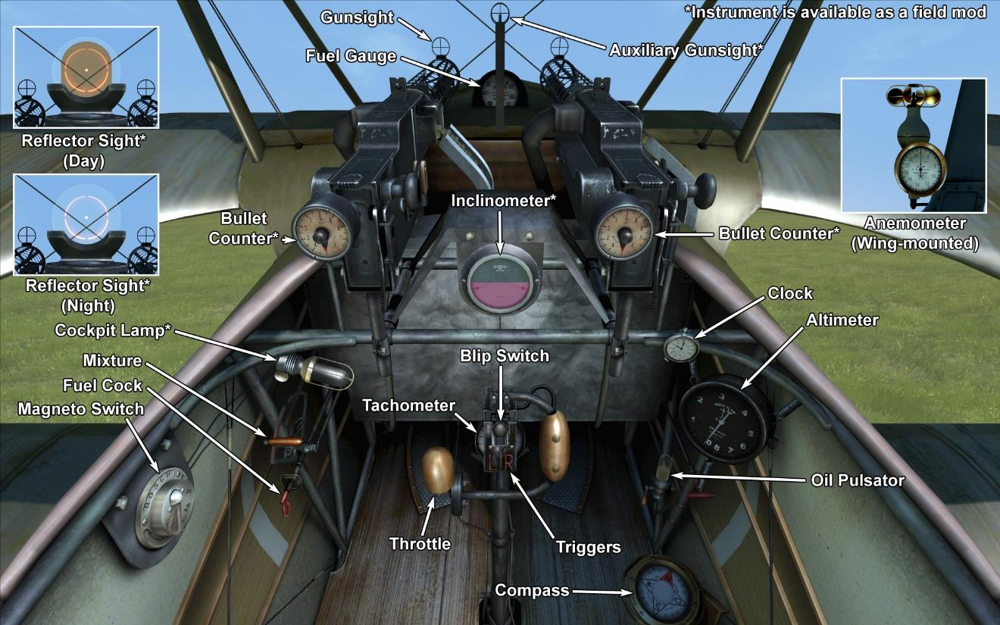

# Fokker Dr.I  

<table><tbody><tr><td style="text-align: center"></td><td style="text-align: center"></td></tr><tr><td style="text-align: center" colspan="2"></td></tr></tbody></table>  

## 描述  

1917年春天，安东尼·福克（Anthony Fokker）在访问第11中队期间检查了被俘英国战斗机，索普维斯（Sopwith）三翼机的建造结构。曼弗雷德·冯·里希特霍芬（Manfred von Richthofen）向福克讲述了他与这架新飞机格斗的细节。正是由于他丰富的经验，红男爵才设法避免了失败。   
F.I（Dr.I当时的名字）三翼机的原型机已于1917年8月准备就绪。其结构的一些显著细节如下：钢管机身框架，以及用于安定面和垂直尾翼的金属框架；没有支撑桁架；以及副翼的位置在上翼。这架飞机比英国的索普维斯三翼机更紧凑和坚固。一共有320架Dr.I三翼机被制造出来。   
1917年9月23日，沃纳·沃斯（Werner Voss）驾驶一架实验型飞机时击落了两架英国战斗机。此后不久，他遭到皇家飞行队的六架SE5的攻击。在这场戏剧性和历史性的战斗中，所有英国飞机都受损，其中两架飞机被迫退出战斗。只是因为寡不敌众，王牌沃斯最终才不幸丧生。   
到1917年10月，第一批量产福克Dr.I飞机已经交付给战斗机中队。   
福克（Fokker）Dr.I三翼机是出色的战斗机，但很少用于掩护双座侦察机。   
Dr.I的飞行员报告说其爬升率和机动性极佳，驾驶舱的视野也很好。飞行员报告说，“你只需要轻轻一碰就可以把飞机转过来！”由于具有这些特点，三翼机的飞行员可以决定是脱离敌人的攻击还是攻击敌机。它甚至可以与格斗之王，英国的索普维斯骆驼（Sopwith Camel）交战，甚至有很大胜算。   
英国皇家飞行队飞行员特别担心福克Dr.I和信天翁（Albatros）D.Va组成战斗编队一起飞行的情况。福克会开始格斗，信天翁的飞行员将击落试图并脱离战斗的敌机。   
到1918年春天，这架飞机已经过时了。只有最出色的德国王牌能够熟练驾驶飞机并向敌人开火，继续在战斗中驾驶三翼机。    
  
  
发动机：旋转九缸上乌瑟尔（Oberursel） UR II 110 HP  
  
尺寸  
高度：2950 mm  
长度：5770 mm  
翼展：7190 mm  
机翼面积：18.66 m².  
  
重量  
空载重量：388 kg  
最大起飞重量：571 kg  
燃油容量：72 L  
滑油容量：20 L  
  
最大空速(指示空速)  
海平面——169 km/h  
1000 m——161 km/h  
2000 m——153 km/h  
3000 m——144 km/h  
4000 m——136 km/h  
5000 m——127 km/h  
6000 m——118 km/h  
7000 m——108 km/h  
8000 m——94 km/h  
  
爬升率  
1000 m——3min 15s  
2000 m——6min 38s  
3000 m——10min 35s  
4000 m——15min 20s  
5000 m——21min 17s  
6000 m——29min 09s  
7000 m——40min 55s  
8000 m——64min 33s  
  
实用升限7900 m  
  
1000m高度的续航时间（时，分）  
标称动力（战斗）— 1h 40min  
最低消耗（巡航）— 2h 30min  
  
武器  
前射：2 x LMG 08/15 史宾道（Spandau） 7.92mm，500发每弹鼓  
  
参考  
1) Fokker Aircraft of WW I，by Paul Leaman，The Crowood Press.  
2) Fokker Dr.I，Windsock Datafile Special，Albatros Publications.  
3) Fokker Triplane，Windsock Datafiles 5.  
3) Fokker Dr1，website www.fokkerdr1.com.  
4) Archive "Fokker—Team—Schorndorf"，www.collectors—edition.com.  
5) Fokker Dr.I Aces of World War I，by Norman Franks and Greg VanWyngarden.  
6) Fokker Dr.I in action，by H J Nowarra，Aircraft Number 68.  
7) The Fokker Dr.I，Profile publication s，Number 55.  
8) The Fokker Triplane，Magazine "FLIGHT" 14 March 1918.  

## 修改  
### 弹药计数器  

2挺机枪的威廉·莫雷尔（Wilhelm Morell）针式刻度弹药计数器  
增加质量：1 kg  

### 测斜仪  

D.R.G.M液体测斜仪（地面指示坡度，飞行中指示侧滑）  
增加质量：1 kg  

### 驾驶舱照明  

用于夜间飞行的驾驶舱照明灯  
增加质量：1 kg  

### 射击瞄准具  

带有前后准心的附加瞄准具  
增加质量：1 kg  

### 瞄准具（昼）  

奥吉（Oigee）反射型准直瞄准具（安装了昼间灯）  
增加质量：2 kg  

### 瞄准具（夜）  

奥吉（Oigee）反射型准直瞄准具（移除了昼间灯）  
增加质量：2 kg  
