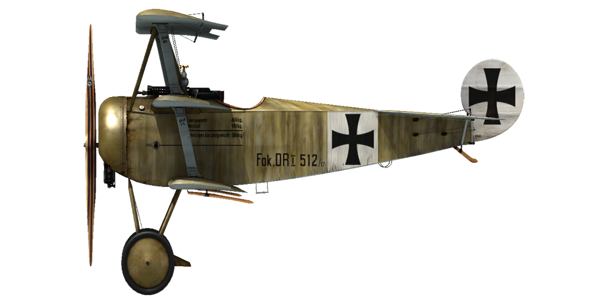

# Fokker Dr.I

## Description

Au printemps 1917 lors d\une visite au Jasta 11, Anthony Fokker observa la construction d\un chasseur anglais qui avait été capturé, le Sopwith Triplane. Manfred von Richthofen décrivit les détails de son combat avec ce nouvel avion au fabricant. C\était seulement en raison de sa grande expérience que le Baron Rouge réussi à éviter la défaite.
Le prototype du triplan F.I fut réalisé en août 1917. Quelques détails remarquables de sa construction étaient : un cadre de fuselage tubulaire en acier, tout comme des cadres en métal pour le stabilisateur et et la dérive; une absence de croisillons; et pour cet appareil les ailerons étaient situés sur l\aile haute. L\avion était plus compact et robuste que le triplan Sopwith britannique. Au total, 320 triplans Dr.I furent construits.
Le 23 septembre 1917, Werner Foss abbatit deux chasseurs britanniques alors qu\il pilotait une version expérimentale du triplan. Peu après il fut attaqué par six SE5s du Royal Flying Corps. Dans ce combat dramatique et historique, tous les appareils britanniques furent endommagés, parmi lesquels deux quittèrent la bataille. Ce fut uniquement car il était en sous—nombre que l\\As allemand perdit la vie.
En octobre 1917 les premiers lots de Fokker Dr.I furent livrés aux escadrons de chasse.
Le triplan Fokker Dr.I était un chasseur superbe, et était rarement utilisé pour protéger les biplaces de reconnaissances.
Les pilotes du triplan faisaient état d\un excellent taux de montée et d\une bonne vue depuis le cockpit. "Vous n\avez besoin que d\un geste léger pour faire virevolter cet avion!". Grâce à cette particularité le pilote du triplan peut décider d\échapper à une attaque ennemie ou au contraire d\engager un avion ennemi, il combat à sa manière.
Les pilotes du RFC appréhendaient particulièrement les situations dans lesquelles le Fokker Dr.I et les Albatros D.Va volaient ensemble en formation de combat. Les Fokker débutaient le combat et les pilotes d\Albatros abattaient les avions ennemis qui tentaient de se désengager et de quitter la bataille.
Durant le printemps 1918 l\avion devint obsolète. Seuls les As allemands les plus remarquables continuèrent à voler sur ce triplan au combat, pilotant remarquablement l\avion et faisant preuve d\une abileté de tireur d\élite face à leurs ennemis.

Moteur Oberursel UR II  rotary 9 cyl. Moteur 110 h.p.

Tailles
Hauteur: 2950 mm
Longueur: 5770 mm
Envergure: 7190 mm
Surface d\aile: 18,66 sq.m.

Poids
Poids à vide weight: 388 kg
Poids au décollage weight: 571 kg
Capacité des réservoirs carburant: 72 l
Capacité du réservoir d\huile: 20 l

Vitesse maximale (IAS)
au Sol — 169 km/h
1000 m — 161 km/h
2000 m — 153 km/h
3000 m — 144 km/h
4000 m — 136 km/h
5000 m — 127 km/h
6000 m — 118 km/h
7000 m — 108 km/h
8000 m — 94 km/h

Tauc de montée
1000 m — 3 min. 15 sec.
2000 m — 6 min. 38 sec.
3000 m — 10 min. 35 sec.
4000 m — 15 min. 20 sec.
5000 m — 21 min. 17 sec.
6000 m — 29 min. 09 sec.
7000 m — 40 min. 55 sec.
8000 m — 64 min. 33 sec.

Plafond opérationnel 7900 m

Autonomie (h.,min.) à 1000m
puissance nominale (en combat) — 1 h. 40 min.
consommation minimale (en croisière) — 2 h. 30 min

Armes fixées: 2xLMG 08/15 Spandau 7.92mm, 500 cartouches par baril

References
1) Fokker Aircraft of WW I, by Paul Leaman, The Crowood Press.
2) Fokker Dr.I, Windsock Datafile Special, Albatros Publications.
3) Fokker Triplane, Windsock Datafiles 5.
3) Fokker Dr1, website www.fokkerdr1.com.
4) Archive "Fokker—Team—Schorndorf", www.collectors—edition.com.
5) Fokker Dr.I Aces of World War I, by Norman Franks and Greg VanWyngarden.
6) Fokker Dr.I in action, by H J Nowarra, Aircraft Number 68.
7) The Fokker Dr.I, Profile publications, Number 55.
8) The Fokker Triplane, Magazine "FLIGHT" 14 March 1918.

## Modifications


### Compteur de balles

Compteur à aiguille Wilhelm Morell pour 2 mitrailleuses
Masse supplémentaire : 1 kg


### Inclinometre

Inclinometre à liquide D.R.G.M (indique inclinaison au sol et glissade sur aile en vol)
Masse supplémentaire : 1 kg


### Lumière de cockpit

Lumière à ampoule pour les sorties de nuit
Masse supplémentaire : 1 kg


### Viseur

Viseur additionnel avec guidon de mire avant-arrière
Masse supplémentaire : 1 kg


### Collimateur de jour

, Collimateur à réfraction Oigee (gradateur de jour installé)
Masse supplémentaire : 2 kg


### Collimateur de nuit

Collimateur à réfraction Oigee (gradateur de jour désinstallé)
Masse supplémentaire : 2 kg
