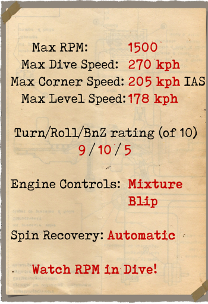

# Fokker Dr.I  

  
  

## Beschreibung  

Während eines Besuchs bei der Jasta 11 im Frühling 1917, schaute sich Anthony Fokker die Konstruktion eines erbeuteten englischen Kampfflugzeugs an, der Sopwith Triplane. Manfred von Richthofen erzählte Fokker von den Luftschlachten gegen diese Flugzeuge. Nur Dank seiner hervorragenden Fähigkeiten entkam der Rote Baron diesem Flugzeug. Der Prototyp der Fokker Dr. I wurde im August 1917 vorgestellt. Einige bemerkenswerte Konstruktionsdetails waren: Ein Stahlrohrrahmen, sowie Stahlrahmen für die Stabilisatoren und das Höhenruder. Das Querruder befand sich an der oberen Tragfläche. Diese Flugzeug war kompakter und robuster als die British Sopwith Triplane. Insgesamt wurden 320 Fokker Dr.I gebaut.  
Am 23. September 1917 gelang es Werner Voss zwei englische Flugzeuge mit dieser experimentellen Version abzuschießen. Kurz darauf wurde er von sechs S.E.5a des Royal Flying Corps verfolgt. In diesem historischen und dramatischen Luftkampf wurde jedes beteiligte englisches Flugzeug beschädigt, zwei Flugzeuge mussten sich aus dem Kampf sogar zurückziehen. Dennoch verlor Werner Voss in diesem Lufkampf aufgrund der Übermacht sein Leben.  
Zum Oktober 1917 wurde die erste Lieferung der Fokker Dr.I an die Staffeln abgegeben.  
Die Fokker Dr.I Triplane war ein exzellentes Kampfflugzeug und wurde deshalb nur selten als Begleitflugzeug eingesetzt.  
Piloten dieses Typs lobten eine hervorragende Steigrate und eine exzellente Cockpitsicht. "Es bedarf nur einer leichten Berührung, um das Flugzeug zu manövrierern!". Nicht zuletzt wegen dieser Bedienbarkeit konnte man bis zum letzten Augenblick mit seiner strategischen Entscheidung warten, um dann einen Gegner zu attackieren. Unter RFC waren die Fokker Dr.I und Albatros D.Va Kampfformationen gefürchtet. Die Fokker starteten den Angriff und die Albatros-Piloten nahmen sich die Fliehenden vor. Zum Frühling 1918 watr das Flugzeug jedoch überholt. Nur die besten deutschen Fliegerasse flogen weiter diesen Flugzeugtyp.  
  
  
Triebwerk Oberursel UR II  luftgekühlter  9 Zyl. Rotationsmotor 110 PS  
  
Abmessung  
Höhe: 2950 mm  
Länge: 5770 mm  
Spannweite: 7190 mm  
Flügelfläche: 18,66 qm  
  
Gewicht  
Leergewicht: 388 kg  
Startgewicht: 571 kg  
Treibstoffkapazität: 72 l  
Ölkapazität: 20 l  
  
Max. Geschwindigkeit (IAS)  
Meeresspiegel — 169 km/h  
1000 m — 161 km/h  
2000 m — 153 km/h  
3000 m — 144 km/h  
4000 m — 136 km/h  
5000 m — 127 km/h  
6000 m — 118 km/h  
7000 m — 108 km/h  
8000 m — 94 km/h  
  
Steigrate  
1000 m — 3 Min. 15 Sek.  
2000 m — 6 Min. 38 Sek.  
3000 m — 10 Min. 35 Sek.  
4000 m — 15 Min. 20 Sek.  
5000 m — 21 Min. 17 Sek.  
6000 m — 29 Min. 09 Sek.  
7000 m — 40 Min. 55 Sek.  
8000 m — 64 Min. 33 Sek.  
  
Dienstgipfelhöhe 7900 m  
  
Reichweite(Std.,Min.) bei 1000 m  
Nennleistung (im Kampf)        — 1 Std. 40 Min.  
Minimaler Verbrauch (Rundflug) — 2 Std. 30 min  
  
Bewaffnung  
Starre Bewaffnung nach vorne: 2x LMG 08/15 Spandau 7.92mm, 2 Gurte mit je 500 Schuss.  
  
Referenzen  
1) Fokker Aircraft of WW I, by Paul Leaman, The Crowood Press.  
2) Fokker Dr.I, Windsock Datafile Special, Albatros Publications.  
3) Fokker Triplane, Windsock Datafiles 5.  
3) Fokker Dr1, website www.fokkerdr1.com.  
4) Archive "Fokker—Team—Schorndorf", www.collectors—edition.com.  
5) Fokker Dr.I Aces of World War I, by Norman Franks and Greg VanWyngarden.  
6) Fokker Dr.I in action, by H J Nowarra, Aircraft Number 68.  
7) The Fokker Dr.I, Profile publications, Number 55.  
8) The Fokker Triplane, Magazine "FLIGHT" 14 March 1918.  

## Änderungen  
### Schusszähler  

Wilhelm Morell Schusszähler mit Nadelanzeige für 2 Maschinengewehre  
Zusätzliches Gewicht: 1 kg  
  
### Querneigungsmesser  

D.R.G.M Flüssigkeitsquerneigungsmesser (zeigt am Boden Querneigung und im Flug Schieben an)  
Zusätzliches Gewicht: 1 kg  
  
### Instrumentenlicht  

Glühlampe zum Beleuchten des Instrumentenbrettes bei Nachteinsätzen  
Zusätzliches Gewicht: 1 kg  
  
### Visier  

Zusätzliches Visier mit Kimme und Kreuz  
Zusätzliches Gewicht: 1 kg  
  
### Kollimator Tag  

Oigee Reflexvisier (mit getönter Scheibe)  
Zusätzliches Gewicht: 2 kg  
  
### Kollimator Nacht  

Oigee Reflexvisier (ohne getönte Scheibe)  
Zusätzliches Gewicht: 2 kg  
