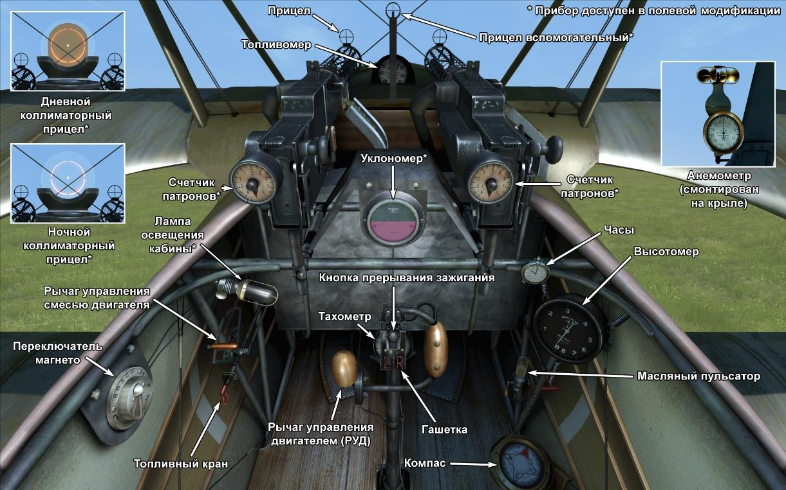

# Fokker Dr.I  

<table><tbody><tr><td style="text-align: center"></td><td style="text-align: center"></td></tr><tr><td style="text-align: center" colspan="2"></td></tr></tbody></table>  

## Описание  

Весной 1917 года во время посещения Jasta 11, Энтони Фоккер ознакомился с конструкцией трофейного английского истребителя Sopwith Triplane.   
Манфред фон Рихтгофен подробно рассказал о воздушном бое с этим новым английским истребителем. Лишь благодаря своему опыту ему удалось избежать поражения.   
К августу 1917 года в Шверине был готов опытный экземпляр триплана F.I. Из особенностей конструкции получившегося самолёта можно упомянуть: металлический каркас фюзеляжа,   
стабилизатора и киля, отсутствие расчалок, размещение элеронов на верхнем крыле. Самолёт получился более прочным и компактным по сравнению с английским Sopwith Triplane.   
Всего было выпущено около 320 экземпляров.  
23 сентября 1917 совершая боевой вылет на опытной версии самолёта, Вернер Фосс сбивает два английских истребителя, после чего подвергается атаке шести S.E.5.   
В этом историческом бою каждый из самолётов англичан получил повреждения, а два вышли из боя. Только численное превосходство оппонентов оборвало жизнь немецкого аса.   
К октябрю 1917 года первые партии Fokker Dr.I начинают прибывать в боевые эскадрильи. Fokker Dr.I применялся для истребления самолётов противника, редко для прикрытия двухместных разведчиков.   
Пилоты отмечали великолепную скороподъемность, прекрасный обзор из кабины. «Самолёт разворачивается буквально на пятачке!» — в восхищении говорили пилоты.   
Благодаря этому, самолёт мог уйти из—под атаки или же встретить в лоб самолёт противника.   
Особенно английские пилоты опасались ситуаций, когда в боевом строю летели одновременно и Fokker Dr.I и Albatros D.Va.   
Первые увлекали противника в «собачью свалку», а вторые сбивали выходящих из боя истребителей противника.    
К весне 1918 года самолёт морально устарел. Лишь выдающие немецкие асы  продолжали совершать боевые вылеты, в совершенстве   
владея техникой пилотирования и стреляя с завидной меткостью из любых ракурсов и положений.   
  
  
Двигатель:  
Oberursel UR II  ротативный 9—цилиндровый, мощность 110 л.с.  
  
Размеры  
Высота: 2950 мм  
Длина: 5770 мм  
Размах крыла: 7190 мм  
Площадь крыла: 18,66 кв.м.  
  
Вес  
Пустой: 388 кг  
Взлётный: 571 кг  
Объем топлива: 72 л  
Объем масла: 20 л  
  
Максимальная скорость (приборная)  
у земли — 169 км/ч  
1000 м — 161 км/ч  
2000 м — 153 км/ч  
3000 м — 144 км/ч  
4000 м — 136 км/ч  
5000 м — 127 км/ч  
6000 м — 118 км/ч  
7000 м — 108 км/ч  
8000 м —  94 км/ч  
  
Скороподъёмность  
1000 м — 3 мин. 15 сек.  
2000 м — 6 мин. 38 сек.  
3000 м — 10 мин. 35 сек.  
4000 м — 15 мин. 20 сек.  
5000 м — 21 мин. 17 сек.  
6000 м — 29 мин. 09 сек.  
7000 м — 40 мин. 55 сек.  
8000 м — 64 мин. 33 сек.  
  
Практический потолок 7900 м  
  
Продолжительность полёта на 1000 м  
номинальная мощность (боевой режим) — 1 ч. 40 мин.  
минимальный расход (крейсерский режим) — 2 ч. 30 мин.  
  
Вооружение  
  
Курсовое: 2xLMG 08/15 Spandau 7.92mm, по 500 патронов на ствол  
  
Использованные источники:  
1) Fokker Aircraft of WW I, by Paul Leaman, The Crowood Press.  
2) Fokker Dr.I, Windsock Datafile Special, Albatros Publications.  
3) Fokker Triplane, Windsock Datafiles 5.  
3) Fokker Dr1, website www.fokkerdr1.com.  
4) Archive "Fokker—Team—Schorndorf", www.collectors—edition.com.  
5) Fokker Dr.I Aces of World War I, by Norman Franks and Greg VanWyngarden.  
6) Fokker Dr.I in action, by H J Nowarra, Aircraft Number 68.  
7) The Fokker Dr.I, Profile publications, Number 55.  
8) The Fokker Triplane, Magazine "FLIGHT" 14 March 1918.  

## Модификации  
### Счётчики патронов  

Счётчики патронов стрелочные Wilhelm Morell для двух пулемётов  
Дополнительная масса: 1 кг  
  
### Указатель наклона  

Жидкостный указатель наклона D.R.G.M (отображает крен на земле и скольжение в полёте)  
Дополнительная масса: 1 кг  
  
### Освещение кабины  

Лампа ночного освещения кабины самолёта  
Дополнительная масса: 1 кг  
  
### Прицел  

Дополнительный прицел стандартной конструкции с мушкой и целиком  
Дополнительная масса: 1 кг  
  
### Коллиматор дневной  

Коллиматорный прицел Oigee рефлекторного типа (с установленным затемняющим фильтром)  
Дополнительная масса: 2 кг  
  
### Коллиматор ночной  

Коллиматорный прицел Oigee рефлекторного типа (со снятым затемняющим фильтром)  
Дополнительная масса: 2 кг  
