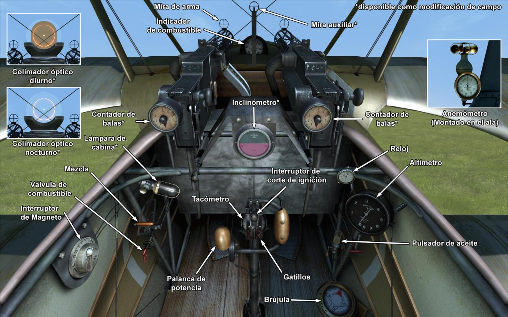

# Fokker Dr.I  

<table><tbody><tr><td style="text-align: center"></td><td style="text-align: center"></tr><tr><td style="text-align: center" colspan="2"></td></tr></tbody></table>  

En la primavera de 1917, durante una visita al Jasta 11, Anthony Fokker inspeccionó la construcción de un avión británico capturado, el Sopwith Triplane. Manfred von Richthofen explicó los detalles de su pelea con este nuevo aeroplano al constructor. Concluyeron que el Barón Rojo salió invicto solo gracias su gran experiencia en combate.  
  
El prototipo del triplano F.I (el nombre por entonces del Dr.I) estuvo listo en agosto de 1917. Los detalles más reseñables de este avión fueron: estructura del fuselaje en tubos de acero así como láminas metálicas para la cola y estabilizadores; ausencia de cables de refuerzo; y la ubicación de los alerones en el ala superior. El avión era más compacto y robusto que el Sopwith Triplane británico. En total, 320 Dr.I fueron construidos.  
  
El 23 de septiembre de 1917, Werner Voss derribó dos cazas británicos mientras probaba una versión experimental del avión. Poco después fue atacado por seis SE5 del Royal flying Corps. En el transcurso de este dramático e histórico vuelo, cada uno de los aviones británicos fue dañado, lo que obligó a dos de ellos a retirarse de la batalla. Finalmente, debido a su mayoría en número, el As alemán perdió la vida.  
  
Para octubre de 1917 la primera producción de Fokker Dr.I estaba ya siendo entregada a los escuadrones. Era un magnífico caza, pero en raras ocasiones se utilizó para proteger aviones biplazas de reconocimiento. Los pilotos del Dr.I destacaron su tasa de ascenso, maniobrabilidad y buena visión desde la cabina. Los pilotos comentaban, «¡Solo hace falta un ligero toque para girar el avión!». Gracias a estas características el piloto podía decidir si atacar a un enemigo o simplemente esquivarlo y partir. Podía enfrentarse en igualdad de condiciones al rey del combate cerrado, el Sopwith Camel británico, con posibilidades de conseguir la victoria.  
  
Los pilotos del RFC estaban especialmente preocupados ante situaciones en las que los Fokker Dr.I y los Albatros D.Va estuvieran volando juntos en formación de combate. Los Fokker iniciarían un combate cerrado y los Albatros derribarían a todos los aviones enemigos que intentasen retirarse del combate.  
  
En la primavera de 1918 el avión quedó obsoleto. Solo los Ases alemanes más destacados continuaron volando el triplano en combate, acabando con sus enemigos, gracias a un magistral pilotaje y una puntería certera.  
  
  
Motor:  
Oberursel UR II rotatorio de 9 cil., 110 CV  
  
Dimensiones:  
Altura: 2950 mm  
Longitud: 5770 mm  
Envergadura alar: 7190 mm  
Superficie de ala: 18,66 m²  
  
Peso:  
Vacío: 388 kg  
Al despegue: 571 kg  
Capacidad de combustible: 72 l  
Capacidad de aceite: 20 l  
  
Velocidad máxima (IAS):  
Nivel del mar — 169 km/h  
1000 m — 161 km/h  
2000 m — 153 km/h  
3000 m — 144 km/h  
4000 m — 136 km/h  
5000 m — 127 km/h  
6000 m — 118 km/h  
7000 m — 108 km/h  
8000 m — 94 km/h  
  
Tasa de ascenso:  
1000 m —  3 min 15 s  
2000 m —  6 min 38 s  
3000 m — 10 min 35 s  
4000 m — 15 min 20 s  
5000 m — 21 min 17 s  
6000 m — 29 min 09 s  
7000 m — 40 min 55 s  
8000 m — 64 min 33 s  
  
Techo de servicio: 7900 m  
  
Autonomía a 1000 m:  
Potencia nominal (combate) - 1 h 40 min  
Consumo mínimo (crucero) - 2 h 30 min  
  
Armamento:  
Disparo frontal: 2 LMG 08/15 Spandau de 7,92 mm, 500 balas por arma  
  
Referencias:  
1) Fokker Aircraft of WW I, por Paul Leaman, The Crowood Press.  
2) Fokker Dr.I, Windsock Datafile Special, Albatros Publications.  
3) Fokker Triplane, Windsock Datafiles 5.  
4) Fokker Dr1, página web www.fokkerdr1.com.  
5) Archive «Fokker-Team-Schorndorf», www.collectors-edition.com.  
6) Fokker Dr.I Aces of World War I, por Norman Franks y Greg VanWyngarden.  
7) Fokker Dr.I in action, por H J Nowarra, Aircraft Number 68.  
8) The Fokker Dr.I, Profile publications, número 55.  
9) The Fokker Triplane, Magazine «FLIGHT» 14 de marzo de 1918.  

## Modificaciones  
### Contador de Balas  

Contador de balas dial de Wilhelm Morell para 2 ametralladoras  
Peso adicional: 1 kg  
  
### Inclinómetro  

Inclinómetro Líquido D.R.G.M (indica inclinación en tierra y deslizamiento lateral en vuelo)  
Peso adicional: 1 kg  
  
### Luz de cabina  

Lámpara para iluminar la cabina en las salidas nocturnas  
Peso adicional: 1 kg  
  
### Punto de mira  

Mira adicional con monturas de mira frontal y mira trasera  
Peso adicional: 1 kg  
  
### Colimador diurno  

Colimador reflectante Oigee (con filtro solar instalado)  
Peso adicional: 2 kg  
  
### Colimador nocturno  

Colimador reflectante Oigee (sin filtro solar instalado)  
Peso adicional: 2 kg  
