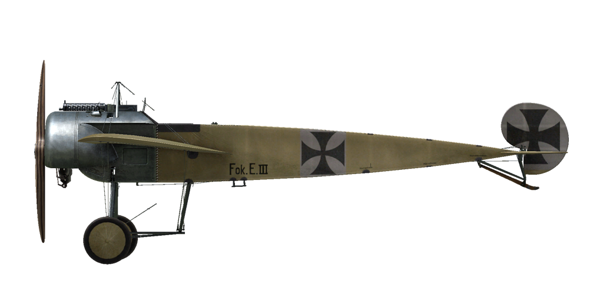
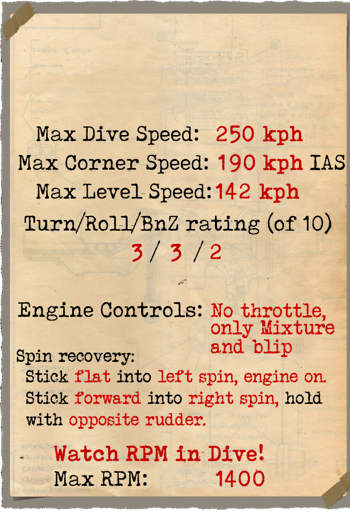
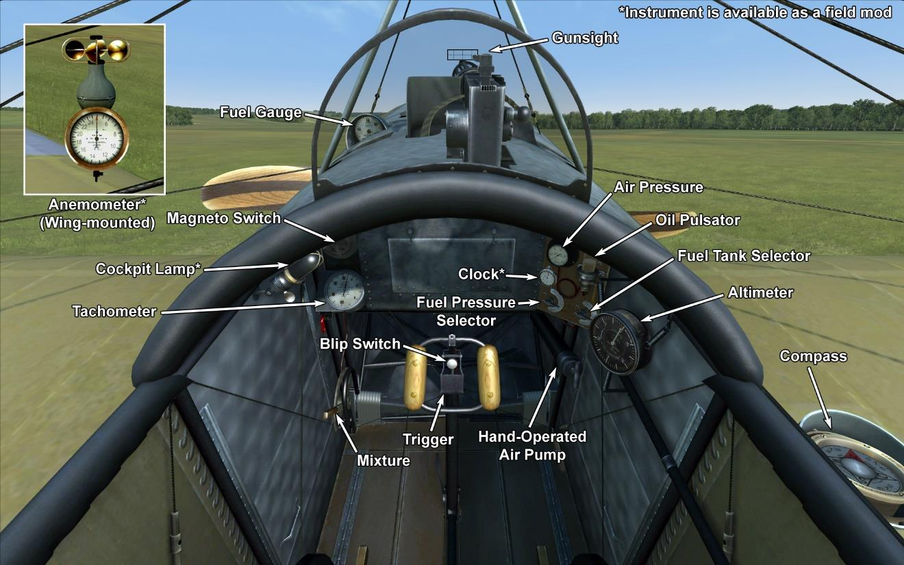

# Fokker E.III  

<table><tbody><tr><td style="text-align: center"></td><td style="text-align: center"></td></tr><tr><td style="text-align: center" colspan="2"></td></tr></tbody></table>  

## Description  

The Fokker E.III Eindecker was a single-seat monoplane fighter designed by Anthony Fokker at the beginning of 1915. Typical for all early aircraft, roll control was implemented by physically deforming the whole surface of the wings (\wing-warping\). Later on, the unreliable and ineffective wing-warping function was replaced by ailerons, or control surfaces.  
  
After the capture of Roland Garros’ Morane-Saulnier type L that was equipped with metal deflector wedges attached to the propeller blades, Anthony Fokker chose an alternative approach to this problem by creating a geared assembly connecting the shaft of the engine to the trigger of the machine gun. Bullets would only be fired once the propeller blade had cleared the front of the machine gun\s muzzle and during the gap left as each blade in turn moved around the spinner. Thanks to this invention, the Fokker E.III was equipped with synchronizer gearing, a revolutionary innovation that changed the face of air combat: it was now possible to fire a machine gun through a rotating propeller without damaging it. This device drastically improved the performance of the aircraft in its role as a fighter.  
  
Equipped with the new synchroniser gear, German aircraft ruled the skies until the beginning of 1916. This period was known as the \Fokker Scourge\, during which time Allied aviators regarded their poorly armed aircraft as \Fokker Fodder\. The first official Eindecker victory was achieved by Leutnant Wintgens on the 1st of July 1915 when he shot down a French Morane-Saulnier \parasol\ monoplane. The two most famous Eindecker pilots were Oswald Boelcke (19 of his 40 victories were achieved flying the Eindecker) and Max Immelmann (with 15 victories flying the Eindecker). The \Fokker Scourge\ and the total domination enjoyed by the Fokker Е.III ended at the beginning of 1916 with the introduction of the DH-2 and the Nieuport 11 into frontline service.  
  
In total, 270 Fokker E.III planes were built. Some aircraft were transferred to other countries, including the Ottoman Empire, Austria-Hungary, and Bulgaria.  
  
  
Engine  
Oberursel U.I rotary 9 cyl. 100 hp  
  
Dimensions  
Height: 2290 mm  
Length: 7160 mm  
Wing span: 10000 mm  
Wing surface: 15.99 sq.m.  
  
Weight  
Empty weight: 417 kg  
Takeoff weight: 641 kg  
Fuel capacity: 120 l  
Oil capacity: 25 l  
  
Maximum airspeed (IAS)  
sea level — 142 km/h  
1000 m — 133 km/h  
2000 m — 124 km/h  
3000 m — 113 km/h  
4000 m —  96 km/h  
  
Climb rate  
1000 m —  5 min. 57 sec.  
2000 m — 14 min. 26 sec.  
3000 m — 27 min. 33 sec.  
  
Service ceiling 4000 m  
  
Endurance at 1000m  
nominal power — 3 h. 0 min.  
  
Armament  
Forward firing: 1xLMG 08/15 Spandau 7.92mm, 500 rounds  
  
References  
1) Squadron/Signal Publications Nr. 158. Fokker Eindecker 2 in action  
2) The Fokker Monoplanes. Profile publications Number 38  
3) Fokker E.III. Windsock Datafile 15.  
4) Fokker E.III. RFC test, 100hp gnome engine, tested may 1916.  

## Modifications  
### Clock  

Mechanical Clock  
Additional mass: 1 kg  

### Cockpit light  

Cockpit illumination lamp for night sorties  
Additional mass: 1 kg  

### Anemometer  

Wilhelm Morell Anemometer (45-250 km/h)  
Additional mass: 1 kg  
