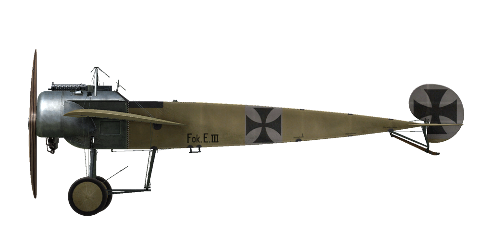

# Fokker E.III  

| Image | Notes  
|:---|:---  
|  |   

## Description  

Le Fokker E.III Eindecker est un chasseur monoplace créé par Anthony Fokker au début de l\année 1915. Le gauchissement est assuré par une déformation de l\aile entière comme pour de nombreux avions de cette période. Cette méthode sera abandonnée pour l\utilisation d\ailerons bien plus efficaces et fiables.  
  
Le Fokker E.III est équipé d\un mécanisme de tir synchronisé permettant de tirer au travers de l\hélice sans l\endommager. Cette innovation fut une véritable révolution dans le combat aérien permettant une augmentation importante de l\efficacité en combat. Le mécanisme de synchronisation fut inventé après la capture d\un Morane-Saulnier Type L équipé du système inventé par Roland Garros permettant de tirer à travers l\hélice. Les pales de l\hélice étaient équipées de plaques en métal défléchissant les balles lorsque celles-ci heurtaient l\hélice. Bien qu\il permettait de tirer au travers de l\hélice ce système dégradait l\efficacité aérodynamique des hélices aussi Anthony Fokker opta pour un système différent. Le mécanisme de tir est relié à l\arbre de transmission du moteur et le tir n\est possible que lorsqu\une des deux pales n\est pas dans l\axe des mitrailleuses.  
  
Avec ce système l\aviation allemande allait dominer les cieux jusque début 1916, une domination nommée par les aviateurs alliés "le Fléau Fokker", ceux-ci se nommant "Chair à Fokker" (en référence au terme "Chair à canon"). La première victoire sur E.III fut celle du Leutnant Wintgens le premier juillet 1915 sur un monoplan Morane-Saulnier "parasol". Les plus grands pilotes de Eindecker furent Oswald Boelcke (19 de ses 40 victoires furent obtenues sur E.III) et Max Immelmann (15 victoires). Le "Fléau fokker" prends fin au début de l\année 1916 lorsque DH-2 et Nieuport 11 apparaissent sur le front.  
  
  
Moteur  
Oberursel U.I rotary 9 cyl. 100 hp  
  
Tailles  
Hauteur: 2290 mm  
Longueur: 7160 mm  
Envergure: 10000 mm  
Surface d\aile: 15,99 sq.m.  
  
Poids  
Poids à vide weight: 417 kg  
Poids au décollage weight: 641 kg  
Capacité des réservoirs carburant: 120 l  
Capacité du réservoir d\huile: 25 l  
  
Vitesse maximale (IAS)  
au Sol — 142 km/h  
1000 m — 133 km/h  
2000 m — 124 km/h  
3000 m — 113 km/h  
4000 m —  96 km/h  
  
Tauc de montée  
1000 m —  5 min. 57 sec.  
2000 m — 14 min. 26 sec.  
3000 m — 27 min. 33 sec.  
  
Plafond opérationnel 4000 m  
  
Autonomie à 1000 m:  
puissance nominale — 3 h. 0 min.  
  
Armes  
Armes fixées: 1xLMG 08/15 Spandau 7.92mm, 500 cartouches  
  
References  
1) Squadron/Signal Publications Nr. 158. Fokker Eindecker 2 in action  
2) The Fokker Monoplanes. Profile publications Number 38  
3) Fokker E.III. Windsock Datafile 15.  
4) Fokker E.III. RFC test, 100hp gnome engine, tested may 1916.  

## Modifications  
### Montre de bord  

Montre mécanique  
Masse supplémentaire : 1 kg  
  
### Lumière de cockpit  

Lumière à ampoule pour les sorties de nuit  
Masse supplémentaire : 1 kg  
  
### Anémomètre  

Wilhelm Morell Anémomètre (45-250 km/h)  
Masse supplémentaire : 1 kg  
